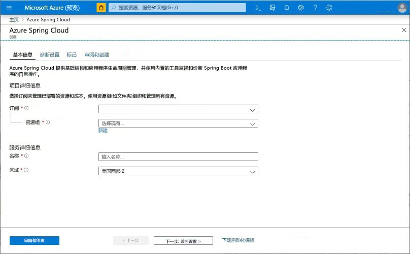
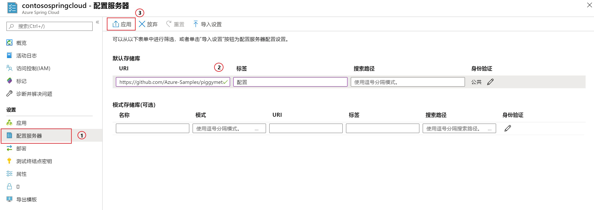

# <a name="quickstart-launch-an-azure-spring-cloud-app-using-the-maven-plug-in"></a>快速入门：使用 Maven 插件启动 Azure Spring Cloud 应用

使用 Azure Spring Cloud Maven 插件，可以轻松地创建和更新 Azure Spring Cloud 应用程序。 通过预先定义配置，可以将应用程序部署到现有的 Azure Spring Cloud 服务。 在本文中，我们使用名为 PiggyMetrics 的示例应用程序演示此功能。

本快速入门介绍如何执行以下操作：

> [!div class="checklist"]
> * 预配服务实例
> * 为实例设置配置服务器
> * 在本地克隆和构建微服务应用程序
> * 部署每个微服务
> * 为应用程序分配公共终结点

>[!Note]
> Azure Spring Cloud 目前以公共预览版的形式提供。 使用公共预览版产品/服务，客户可以在产品/服务正式发布之前体验新功能。  公共预览功能和服务并非供生产使用。  有关预览期间支持的详细信息，请参阅[常见问题解答](https://azure.microsoft.com/support/faq/)或提交[支持请求](https://docs.microsoft.com/azure/azure-supportability/how-to-create-azure-support-request)。


>[!TIP]
> Azure Cloud Shell 是免费的交互式 shell，可以使用它运行本文中的命令。 它预装有常用的 Azure 工具，其中包括最新版的 Git、Java 开发工具包 (JDK)、Maven 和 Azure CLI。 如果已登录到 Azure 订阅，请启动 [Azure Cloud Shell](https://shell.azure.com)。 有关详细信息，请参阅 [Azure Cloud Shell 概述](../cloud-shell/overview.md)。

完成本快速入门教程需要：

1. [安装 Git](https://git-scm.com/)。
2. [安装 JDK 8](https://docs.microsoft.com/java/azure/jdk/?view=azure-java-stable)。
3. [安装 Maven 3.0 或更高版本](https://maven.apache.org/download.cgi)。
4. [安装 Azure CLI 2.0.67 或更高版本](https://docs.microsoft.com/cli/azure/install-azure-cli?view=azure-cli-latest)。
5. [注册免费的 Azure 订阅](https://azure.microsoft.com/free/)。

## <a name="install-the-azure-cli-extension"></a>安装 Azure CLI 扩展

使用以下命令安装用于 Azure CLI 的 Azure Spring Cloud 扩展：

```Azure CLI
az extension add --name spring-cloud
```

## <a name="provision-a-service-instance-on-the-azure-portal"></a>在 Azure 门户中预配服务实例

1. 在 Web 浏览器中，打开[此指向 Azure 门户中 Azure Spring Cloud 的链接](https://ms.portal.azure.com/#create/Microsoft.AppPlatform)，并登录到自己的帐户。

1. 请为示例应用程序提供“项目详细信息”，如下所示  ：

    1. 选择将与应用程序关联的“订阅”  。
    1. 为应用程序选择或创建资源组。 建议创建新资源组。  以下示例显示了名为 `myspringservice` 的新资源组。
    1. 请为新的 Azure Spring Cloud 服务提供一个名称。  该名称必须为 4 到 32 个字符，只能包含小写字母、数字及连字符。 服务名称的第一个字符必须是字母，最后一个字符必须是字母或数字。  以下示例中的服务名为 `contosospringcloud`。
    1. 从提供的选项中为应用程序选择一个位置。  在本示例中，我们选择 `East US`。
    1. 选择“查看 + 创建”，查看新服务的摘要  。  如果一切正常，请选择“创建”  。

    > [!div class="mx-imgBorder"]
    > 

部署服务大约需要 5 分钟的时间。 部署服务后，选择“转到资源”，随即显示服务实例的“概览”页   。

## <a name="set-up-your-configuration-server"></a>设置配置服务器

1. 在服务的“概览”页上，选择“配置服务器”。  
1. 在“默认存储库”部分，将“URI”设置为 **https://github.com/Azure-Samples/piggymetrics** ，将“标签”设置为“config”，然后选择“应用”以保存更改。     

    > [!div class="mx-imgBorder"]
    > 

## <a name="clone-and-build-the-sample-application-repository"></a>克隆并构建示例应用程序存储库

1. 启动 [Azure Cloud Shell](https://shell.azure.com)。

1. 通过运行以下命令，克隆 Git 存储库：

    ```azurecli
    git clone https://github.com/Azure-Samples/PiggyMetrics
    ```
  
1. 通过运行以下命令更改目录并生成项目：

    ```azurecli
    cd piggymetrics
    mvn clean package -DskipTests
    ```

## <a name="generate-configurations-and-deploy-to-the-azure-spring-cloud"></a>生成配置并将其部署到 Azure Spring Cloud

1. 通过在包含父 POM 的 PiggyMetrics 的根文件夹中运行以下命令来生成配置：

    ```azurecli
    mvn com.microsoft.azure:azure-spring-cloud-maven-plugin:1.0.0:config
    ```

    a. 选择模块 `gateway`、`auth-service` 和 `account-service`。

    b. 选择订阅和 Azure Spring Cloud 服务群集。

    c. 在提供的项目的列表中，输入与 `gateway` 对应的数字，允许对其进行公共访问。
    
    d. 确认配置。

1. POM 现包含插件依赖项和配置。 通过使用以下命令部署应用：

   ```azurecli
   mvn azure-spring-cloud:deploy
   ```

1. 部署完成后，可以使用在上一命令的输出中提供的 URL 来访问 PiggyMetrics。

## <a name="next-steps"></a>后续步骤

在本快速入门中，我们部署了一个来自 Maven 存储库的 Spring Cloud 应用程序。 若要详细了解 Azure Spring Cloud，请继续学习相关教程，了解如何对应用进行部署准备。

> [!div class="nextstepaction"]
> [准备要部署的 Azure Spring Cloud 应用程序](spring-cloud-tutorial-prepare-app-deployment.md)
> [详细了解 Azure 的 Maven 插件](https://github.com/microsoft/azure-maven-plugin)
