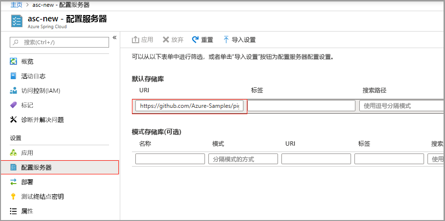

# <a name="quickstart-set-up-azure-spring-cloud-configuration-server"></a>快速入门：设置 Azure Spring Cloud Config Server

Azure Spring Cloud 配置服务器是分布式系统的集中式配置服务。 它使用当前支持本地存储、Git 和 Subversion 的可插入存储库层。 在此快速入门中，你将设置配置服务器以从 Git 存储库获取数据。

::: zone pivot="programming-language-csharp"

## <a name="prerequisites"></a>先决条件

* 完成此系列中前面的快速入门：[预配 Azure Spring Cloud 服务](spring-cloud-quickstart-provision-service-instance.md)。

## <a name="azure-spring-cloud-config-server-procedures"></a>Azure Spring Cloud Config Server 过程

通过运行以下命令，使用项目的 Git 存储库的位置设置配置服务器。 将 `<service instance name>` 替换为之前创建的服务的名称。 在前面的快速入门中设置的服务实例名称的默认值不适用于此命令。

```azurecli
az spring-cloud config-server git set -n <service instance name> --uri https://github.com/Azure-Samples/Azure-Spring-Cloud-Samples --search-paths steeltoe-sample/config
```

此命令指示配置服务器在示例应用存储库的 [steeltoe-sample/config](https://github.com/Azure-Samples/Azure-Spring-Cloud-Samples/tree/master/steeltoe-sample/config) 文件夹中查找配置数据。 由于将获取配置数据的应用名称为 `planet-weather-provider`，因此将使用的文件是 [planet-weather-provider.yml](https://github.com/Azure-Samples/Azure-Spring-Cloud-Samples/blob/master/steeltoe-sample/config/planet-weather-provider.yml)。

::: zone-end

::: zone pivot="programming-language-java"
Azure Spring Cloud Config Server 是分布式系统的集中式配置服务。 它使用当前支持本地存储、Git 和 Subversion 的可插入存储库层。  设置 Config Server，将微服务应用部署到 Azure Spring Cloud。

## <a name="prerequisites"></a>先决条件

* [安装 JDK 8](https://docs.microsoft.com/java/azure/jdk/?view=azure-java-stable&preserve-view=true)
* [注册 Azure 订阅](https://azure.microsoft.com/free/)
* （可选）[安装 Azure CLI 版本 2.0.67 或更高版本](https://docs.microsoft.com/cli/azure/install-azure-cli?view=azure-cli-latest&preserve-view=true)，并使用以下命令安装 Azure Spring Cloud 扩展：`az extension add --name spring-cloud`
* （可选）[安装 Azure Toolkit for IntelliJ](https://plugins.jetbrains.com/plugin/8053-azure-toolkit-for-intellij/) 并[登录](https://docs.microsoft.com/azure/developer/java/toolkit-for-intellij/create-hello-world-web-app#installation-and-sign-in)

## <a name="azure-spring-cloud-config-server-procedures"></a>Azure Spring Cloud Config Server 过程

#### <a name="portal"></a>[门户](#tab/Azure-portal)

以下过程使用 Azure 门户设置 Config Server，以部署 [Piggymetrics 示例](spring-cloud-quickstart-sample-app-introduction.md)。

1. 转到服务的“概览”页，选择“配置服务器”。 

2. 在“默认存储库”部分，将“URI”设置为“https://github.com/Azure-Samples/piggymetrics-config” 。

3. 选择“应用”以保存所做的更改。

    

#### <a name="cli"></a>[CLI](#tab/Azure-CLI)

以下过程使用 Azure CLI 设置 Config Server，以部署 [Piggymetrics 示例](spring-cloud-quickstart-sample-app-introduction.md)。

使用项目的 Git 存储库的位置设置 Config Server：

```azurecli
az spring-cloud config-server git set -n <service instance name> --uri https://github.com/Azure-Samples/piggymetrics-config
```

---
::: zone-end

## <a name="clean-up-resources"></a>清理资源

如果打算继续学习本系列的下一个快速入门，请跳过此步骤。

在这些快速入门中，你创建了 Azure 资源，如果这些资源保留在订阅中，将继续产生费用。 如果不打算继续学习下一个快速入门，并认为将来不需要这些资源，请使用门户或通过在 Cloud Shell 中运行以下命令删除资源组：

```azurecli
az group delete --name <your resource group name; for example: helloworld-1558400876966-rg> --yes
```

在前面的快速入门中，你还设置了默认资源组名称。 如果不打算继续学习下一个快速入门，请通过运行以下 CLI 命令清除该默认名称：

```azurecli
az configure --defaults group=
```

## <a name="next-steps"></a>后续步骤

> [!div class="nextstepaction"]
> [构建和部署应用](spring-cloud-quickstart-deploy-apps.md)
