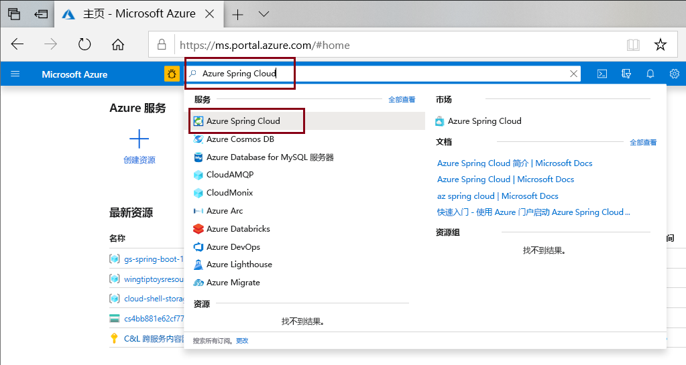
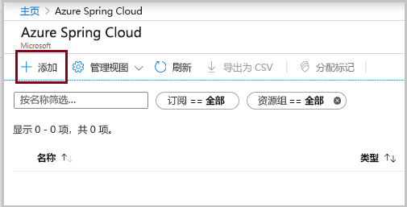
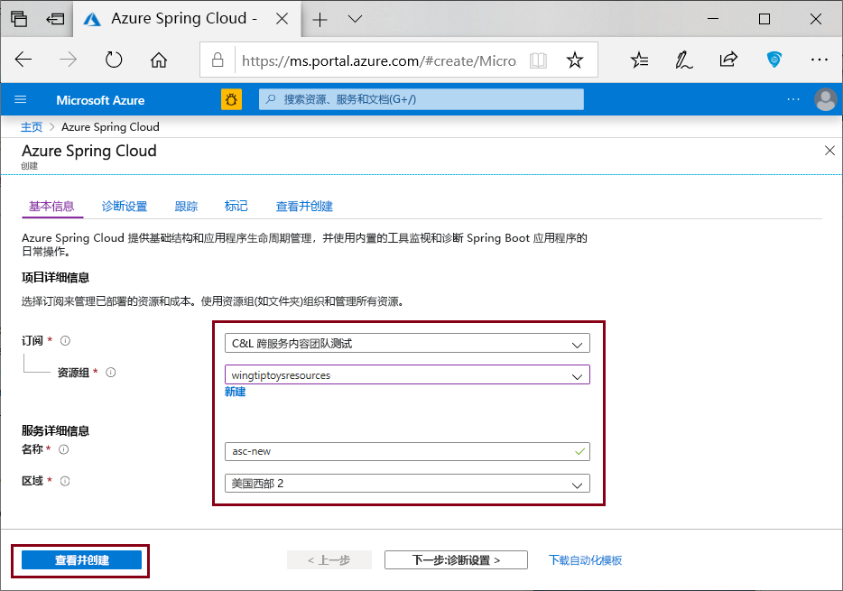

# <a name="quickstart-deploy-your-first-azure-spring-cloud-application"></a>快速入门：部署第一个 Azure Spring Cloud 应用程序

::: zone pivot="programming-language-csharp"
本快速入门介绍如何部署简单的 Azure Spring Cloud 微服务应用程序，以便在 Azure 上运行。

>[!NOTE]
> 针对 Azure Spring Cloud 的 Steeltoe 支持目前以公共预览版的形式提供。 使用公共预览版产品/服务，客户可以在产品/服务正式发布之前体验新功能。  公共预览功能和服务并非供生产使用。  有关预览期间支持的详细信息，请参阅[常见问题解答](https://azure.microsoft.com/support/faq/)或提交[支持请求](https://docs.microsoft.com/azure/azure-portal/supportability/how-to-create-azure-support-request)。

本快速入门介绍如何执行以下操作：

> [!div class="checklist"]
> * 生成基本 Steeltoe .NET Core 项目
> * 预配 Azure Spring Cloud 服务实例
> * 使用公共终结点生成并部署应用
> * 实时流式传输日志

本快速入门中使用的应用程序代码是使用 .NET Core Web API 项目模板生成的简单应用。 完成此示例后，你可以在线访问应用程序，并可通过 Azure 门户和 Azure CLI 对其进行管理。

## <a name="prerequisites"></a>先决条件

* 具有活动订阅的 Azure 帐户。 [免费创建帐户](https://azure.microsoft.com/free/?WT.mc_id=A261C142F)。
* [.NET Core 3.1 SDK](https://dotnet.microsoft.com/download/dotnet-core/3.1)。 Azure Spring Cloud 服务支持 .NET Core 3.1 及更高版本。
* [Azure CLI 2.0.67 或更高版本](https://docs.microsoft.com/cli/azure/install-azure-cli?view=azure-cli-latest&preserve-view=true)。
* [Git](https://git-scm.com/)。

## <a name="install-azure-cli-extension"></a>安装 Azure CLI 扩展

验证 Azure CLI 版本是否为 2.0.67 或更高版本：

```azurecli
az --version
```

使用以下命令安装用于 Azure CLI 的 Azure Spring Cloud 扩展：

```azurecli
az extension add --name spring-cloud
```

## <a name="log-in-to-azure"></a>登录 Azure

1. 登录 Azure CLI

    ```azurecli
    az login
    ```

1. 如果有多个订阅，请选择要用于本快速入门的订阅。

   ```azurecli
   az account list -o table
   ```

   ```azurecli
   az account set --subscription <Name or ID of a subscription from the last step>
   ```

## <a name="generate-a-steeltoe-net-core-project"></a>生成 Steeltoe .NET Core 项目

在 Visual Studio 中，使用 API 项目模板创建名为“hello-world”的 ASP.NET Core Web 应用程序。 请注意，会有一个自动生成的 WeatherForecastController，它将在稍后作为我们的测试终结点。

1. 为项目源代码创建文件夹，并生成项目。
 
   ```console
   mkdir source-code
   ```

   ```console
   cd source-code
   ```

   ```dotnetcli
   dotnet new webapi -n hello-world --framework netcoreapp3.1
   ```

1. 导航到项目目录中。

   ```console
   cd hello-world
   ```

1. 编辑 appSettings.json 文件以添加以下设置：

   ```json
   "spring": {
     "application": {
       "name": "hello-world"
     }
   },
   "eureka": {
     "client": {
       "shouldFetchRegistry": true,
       "shouldRegisterWithEureka": true
     }
   }
   ```

1. 同样，在 appsettings.json 中，将 `Microsoft` 类别的日志级别从 `Warning` 更改为 `Information`。 此更改可确保在稍后的步骤中查看流式传输日志时生成日志。

   appsettings.json 文件现在看起来类似于以下示例：

   ```json
   {
     "Logging": {
       "LogLevel": {
         "Default": "Information",
         "Microsoft": "Information",
         "Microsoft.Hosting.Lifetime": "Information"
       }
     },
     "AllowedHosts": "*",
     "spring": {
       "application": {
         "name": "hello-world"
       }
     },
     "eureka": {
       "client": {
         "shouldFetchRegistry": true,
         "shouldRegisterWithEureka": true
       }
     }
   }
   ```
   
1. 将依赖项和 `Zip` 任务添加到 .csproj 文件中：

   ```xml
   <ItemGroup>
     <PackageReference Include="Steeltoe.Discovery.ClientCore" Version="2.4.4" />
     <PackageReference Include="Microsoft.Azure.SpringCloud.Client" Version="1.0.0-preview.1" />
   </ItemGroup>
   <Target Name="Publish-Zip" AfterTargets="Publish">
       <ZipDirectory SourceDirectory="$(PublishDir)" DestinationFile="$(MSBuildProjectDirectory)/deploy.zip" Overwrite="true" />
   </Target>
   ```

   包适用于 Steeltoe 服务发现和 Azure Spring Cloud 客户端库。 `Zip` 任务用于部署到 Azure。 运行 `dotnet publish` 命令时，它会在 publish 文件夹中生成二进制文件，此任务会将 publish 文件夹压缩为上传到 Azure 的 .zip 文件中。

3. 在 Program.cs 文件中，添加 `using` 指令以及使用 Azure Spring Cloud 的代码：

   ```csharp
   using Microsoft.Azure.SpringCloud.Client;
   ```

   ```csharp
   public static IHostBuilder CreateHostBuilder(string[] args) =>
               Host.CreateDefaultBuilder(args)
                   .ConfigureWebHostDefaults(webBuilder =>
                   {
                       webBuilder.UseStartup<Startup>();
                   })
                   .UseAzureSpringCloudService();
   ```

4. 在 Startup.cs 文件中，添加 `using` 指令以及在 `ConfigureServices` 和 `Configure` 方法末尾使用 Steeltoe 服务发现的代码：

   ```csharp
   using Steeltoe.Discovery.Client;
   ```

   ```csharp
   public void ConfigureServices(IServiceCollection services)
   {
       // Template code not shown.

       services.AddDiscoveryClient(Configuration);
   }
   ```

   ```csharp
   public void Configure(IApplicationBuilder app, IWebHostEnvironment env)
   {
       // Template code not shown.

       app.UseDiscoveryClient();
   }
   ```

1. 生成项目以确保没有任何编译错误。

   ```dotnetcli
   dotnet build
   ```
 
## <a name="provision-a-service-instance"></a>预配服务实例

以下步骤使用 Azure 门户创建 Azure Spring Cloud 的实例。

1. 打开 [Azure 门户](https://ms.portal.azure.com/)。 

1. 在顶部搜索框中，搜索“Azure Spring Cloud”。

1. 从结果中选择“Azure Spring Cloud”。

   

1. 在 Azure Spring Cloud 页上，选择“+ 添加”。

   

1. 在 Azure Spring Cloud“创建”页中填写表单。  遵循以下指南：

   * 订阅：选择要在其中收取此资源费用的订阅。
   * 资源组：创建新的资源组。 此处输入的名称将在后面的步骤中用作 \<resource group name\>。
   * **服务详细信息/名称**：指定 \<service instance name\>。  该名称必须为 4 到 32 个字符，只能包含小写字母、数字及连字符。  服务名称的第一个字符必须是字母，最后一个字符必须是字母或数字。
   * **区域**：为服务实例选择区域。

   

6. 选择“查看并创建”。 

## <a name="build-and-deploy-the-app"></a>生成并部署应用

下面的过程会生成并部署之前创建的项目。

1. 请确保命令提示符仍在项目文件夹中。

1. 运行以下命令以生成项目，发布二进制文件，然后将二进制文件存储在项目文件夹内的 .zip 文件中。

   ```dotnetcorecli
   dotnet publish -c release -o ./publish
   ```

1. 在 Azure Spring Cloud 实例中创建一个分配有公共终结点的应用。 使用在 appsettings.json 中指定的相同应用程序名称“hello-world”。

   ```console
   az spring-cloud app create -n hello-world -s <service instance name> -g <resource group name> --is-public
   ```

1. 将 .zip 文件部署到该应用。

   ```azurecli
   az spring-cloud app deploy -n hello-world -s <service instance name> -g <resource group name> --runtime-version NetCore_31 --main-entry hello-world.dll --artifact-path ./deploy.zip
   ```

   `--main-entry` 选项可标识包含应用程序入口点的 .dll 文件。 服务上传 .zip 文件之后，它会提取所有文件和文件夹，并尝试执行通过 `--main-entry` 指定的 .dll 文件中的入口点。

   完成应用程序部署需要几分钟时间。 若要确认它是否已经部署，请在 Azure 门户中转到“应用”边栏选项卡。

## <a name="test-the-app"></a>测试应用程序

完成部署后，便可通过以下 URL 访问应用：

```http
https://<service instance name>-hello-world.azuremicroservices.io/weatherforecast
```

应用会返回类似于以下示例的 JSON 数据：

```json
[{"date":"2020-09-08T21:01:50.0198835+00:00","temperatureC":14,"temperatureF":57,"summary":"Bracing"},{"date":"2020-09-09T21:01:50.0200697+00:00","temperatureC":-14,"temperatureF":7,"summary":"Bracing"},{"date":"2020-09-10T21:01:50.0200715+00:00","temperatureC":27,"temperatureF":80,"summary":"Freezing"},{"date":"2020-09-11T21:01:50.0200717+00:00","temperatureC":18,"temperatureF":64,"summary":"Chilly"},{"date":"2020-09-12T21:01:50.0200719+00:00","temperatureC":16,"temperatureF":60,"summary":"Chilly"}]
```

## <a name="stream-logs-in-real-time"></a>实时流式传输日志

使用以下命令从应用获取实时日志。

```azurecli
az spring-cloud app logs -n hello-world -s <service instance name> -g <resource group name> --lines 100 -f
```

日志会显示在输出中：

```output
[Azure Spring Cloud] The following environment variables are loaded:
2020-09-08 20:58:42,432 INFO supervisord started with pid 1
2020-09-08 20:58:43,435 INFO spawned: 'event-gather_00' with pid 9
2020-09-08 20:58:43,436 INFO spawned: 'dotnet-app_00' with pid 10
2020-09-08 20:58:43 [Warning] No managed processes are running. Wait for 30 seconds...
2020-09-08 20:58:44,843 INFO success: event-gather_00 entered RUNNING state, process has stayed up for > than 1 seconds (startsecs)
2020-09-08 20:58:44,843 INFO success: dotnet-app_00 entered RUNNING state, process has stayed up for > than 1 seconds (startsecs)
←[40m←[32minfo←[39m←[22m←[49m: Steeltoe.Discovery.Eureka.DiscoveryClient[0]
      Starting HeartBeat
info: Microsoft.Hosting.Lifetime[0]
      Now listening on: http://[::]:1025
info: Microsoft.Hosting.Lifetime[0]
      Application started. Press Ctrl+C to shut down.
info: Microsoft.Hosting.Lifetime[0]
      Hosting environment: Production
info: Microsoft.Hosting.Lifetime[0]
      Content root path: /netcorepublish/6e4db42a-b160-4b83-a771-c91adec18c60
2020-09-08 21:00:13 [Information] [10] Start listening...
info: Microsoft.AspNetCore.Hosting.Diagnostics[1]
      Request starting HTTP/1.1 GET http://asc-svc-hello-world.azuremicroservices.io/weatherforecast
info: Microsoft.AspNetCore.Routing.EndpointMiddleware[0]
      Executing endpoint 'hello_world.Controllers.WeatherForecastController.Get (hello-world)'
info: Microsoft.AspNetCore.Mvc.Infrastructure.ControllerActionInvoker[3]
      Route matched with {action = "Get", controller = "WeatherForecast"}. Executing controller action with signature System.Collections.Generic.IEnumerable`1[hello_world.WeatherForecast] Get() on controller hello_world.Controllers.WeatherForecastController (hello-world).
info: Microsoft.AspNetCore.Mvc.Infrastructure.ObjectResultExecutor[1]
      Executing ObjectResult, writing value of type 'hello_world.WeatherForecast[]'.
info: Microsoft.AspNetCore.Mvc.Infrastructure.ControllerActionInvoker[2]
      Executed action hello_world.Controllers.WeatherForecastController.Get (hello-world) in 1.8902ms
info: Microsoft.AspNetCore.Routing.EndpointMiddleware[1]
      Executed endpoint 'hello_world.Controllers.WeatherForecastController.Get (hello-world)'
info: Microsoft.AspNetCore.Hosting.Diagnostics[2]
      Request finished in 4.2591ms 200 application/json; charset=utf-8
```

> [!TIP]
> 使用 `az spring-cloud app logs -h` 浏览更多参数和日志流功能。

如需查看高级日志分析功能，请访问 [Azure 门户](https://portal.azure.com/)菜单中的“日志”选项卡。 这里日志会延迟几分钟。
[  ](media/spring-cloud-quickstart-java/logs-analytics.png#lightbox)
::: zone-end

::: zone pivot="programming-language-java"
本快速入门介绍如何部署简单的 Azure Spring Cloud 微服务应用程序，以便在 Azure 上运行。 

本教程中使用的应用程序代码是使用 Spring Initializr 生成的简单应用。 完成此示例后，你可以在线访问应用程序，并可通过 Azure 门户对其进行管理。

本快速入门介绍如何：

> [!div class="checklist"]
> * 生成基本 Spring Cloud 项目
> * 预配服务实例
> * 使用公共终结点生成并部署应用
> * 实时流式传输日志

## <a name="prerequisites"></a>先决条件

完成本快速入门教程需要：

* [安装 JDK 8](https://docs.microsoft.com/java/azure/jdk/?view=azure-java-stable&preserve-view=true)
* [注册 Azure 订阅](https://azure.microsoft.com/free/)
* （可选）[安装 Azure CLI 版本 2.0.67 或更高版本](https://docs.microsoft.com/cli/azure/install-azure-cli?view=azure-cli-latest&preserve-view=true)，并使用以下命令安装 Azure Spring Cloud 扩展：`az extension add --name spring-cloud`
* （可选）[安装 Azure Toolkit for IntelliJ](https://plugins.jetbrains.com/plugin/8053-azure-toolkit-for-intellij/) 并[登录](https://docs.microsoft.com/azure/developer/java/toolkit-for-intellij/create-hello-world-web-app#installation-and-sign-in)

## <a name="generate-a-spring-cloud-project"></a>生成 Spring Cloud 项目

首先，使用 [Spring Initializr](https://start.spring.io/#!type=maven-project&language=java&platformVersion=2.3.3.RELEASE&packaging=jar&jvmVersion=1.8&groupId=com.example&artifactId=hellospring&name=hellospring&description=Demo%20project%20for%20Spring%20Boot&packageName=com.example.hellospring&dependencies=web,cloud-eureka,actuator,cloud-starter-sleuth,cloud-starter-zipkin) 生成一个包含推荐的 Azure Spring Cloud 依赖项的示例项目。 下图显示了为此示例项目设置的 Initializr。
```url
https://start.spring.io/#!type=maven-project&language=java&platformVersion=2.3.3.RELEASE&packaging=jar&jvmVersion=1.8&groupId=com.example&artifactId=hellospring&name=hellospring&description=Demo%20project%20for%20Spring%20Boot&packageName=com.example.hellospring&dependencies=web,cloud-eureka,actuator,cloud-starter-sleuth,cloud-starter-zipkin
```

  

1. 设置好所有依赖项后，单击“生成”。 下载包并将其解压缩，然后按照如下所示添加 `src/main/java/com/example/hellospring/HelloController.java`，以便为简单的 Web 应用程序创建 Web 控制器：

    ```java
    package com.example.hellospring;
    
    import org.springframework.web.bind.annotation.RestController;
    import org.springframework.web.bind.annotation.RequestMapping;
    
    @RestController
    public class HelloController {
    
        @RequestMapping("/")
        public String index() {
            return "Greetings from Azure Spring Cloud!";
        }
    
    }
    ```
## <a name="provision-an-instance-of-azure-spring-cloud"></a>预配 Azure Spring Cloud 的实例

以下步骤使用 Azure 门户创建 Azure Spring Cloud 的实例。

1. 在新选项卡中，打开 [Azure 门户](https://ms.portal.azure.com/)。 

2. 在顶部搜索框中，搜索“Azure Spring Cloud”。

3. 从结果中选择“Azure Spring Cloud”。

    

4. 在“Azure Spring Cloud”页上，单击“+ 添加”。

    

5. 在 Azure Spring Cloud“创建”页中填写表单。  遵循以下指南：
    - 订阅：选择要在其中收取此资源费用的订阅。
    - 资源组：最佳做法是为新资源创建新的资源组。 后面的步骤会将其用作 \<resource group name\>。
    - **服务详细信息/名称**：指定 \<service instance name\>。  该名称必须为 4 到 32 个字符，只能包含小写字母、数字及连字符。  服务名称的第一个字符必须是字母，最后一个字符必须是字母或数字。
    - 位置：为服务实例选择区域。

    

6. 单击“审阅并创建”。

## <a name="build-and-deploy-the-app"></a>生成并部署应用
    
#### <a name="cli"></a>[CLI](#tab/Azure-CLI)
以下步骤使用 Azure CLI 生成并部署应用程序。 在项目的根目录中，执行以下命令。

1. 使用 Maven 生成项目：

    ```console
    mvn clean package -DskipTests
    ```

1. （如果尚未安装）安装适用于 Azure CLI 的 Azure Spring Cloud 扩展：

    ```azurecli
    az extension add --name spring-cloud
    ```
    
1. 创建已分配公共终结点的应用：

    ```azurecli
    az spring-cloud app create -n hellospring -s <service instance name> -g <resource group name> --is-public
    ```

1. 为应用部署 Jar 文件：

    ```azurecli
    az spring-cloud app deploy -n hellospring -s <service instance name> -g <resource group name> --jar-path target\hellospring-0.0.1-SNAPSHOT.jar
    ```
    
1. 完成应用程序部署需要几分钟时间。 若要确认它是否已经部署，请在 Azure 门户中转到“应用”边栏选项卡。 你应该会看到应用程序的状态。

#### <a name="intellij"></a>[IntelliJ](#tab/IntelliJ)

以下步骤使用适用于 Azure Spring Cloud 的 IntelliJ 插件在 IntelliJ IDEA 中部署示例应用。  

### <a name="import-project"></a>导入项目

1. 打开 IntelliJ 的“欢迎”对话框，选择“导入项目”以打开导入向导 。
1. 选择 `hellospring` 文件夹。

    

### <a name="deploy-the-app"></a>部署应用
若要部署到 Azure，必须使用你的 Azure 帐户登录，然后选择你的订阅。  有关登录的详细信息，请参阅[安装和登录](https://docs.microsoft.com/azure/developer/java/toolkit-for-intellij/create-hello-world-web-app#installation-and-sign-in)。

1. 在 IntelliJ 项目资源管理器中右键单击你的项目，选择“Azure” -> “部署到 Azure Spring Cloud”。 

    [  ](media/spring-cloud-quickstart-java/intellij-deploy-azure-1.png#lightbox)

1. 在“名称”字段中接受应用的名称。 “名称”是指配置，不是应用名称。 用户通常不需更改它。
1. 在“项目”文本框中，选择 hellospring-0.0.1-SNAPSHOT.jar。
1. 在“订阅”文本框中，验证订阅。
1. 在“Spring Cloud”文本框中，选择你在[预配 Azure Spring Cloud 实例](https://docs.microsoft.com/azure/spring-cloud/spring-cloud-quickstart-provision-service-instance)中创建的 Azure Spring Cloud 实例。
1. 将“公共终结点”设置为“启用”。
1. 在“应用:”文本框中，选择“创建应用…” 。
1. 输入“hellospring”，然后单击“确定”。

    [  ](media/spring-cloud-quickstart-java/intellij-deploy-to-azure.png#lightbox)

1. 单击“部署 Azure Spring Cloud 应用”对话框底部的“运行”按钮，以开始部署 。 此插件会对 `hellospring` 应用运行命令 `mvn package`，然后部署由 `package` 命令生成的 jar。
---

完成部署后，就可以通过 `https://<service instance name>-hellospring.azuremicroservices.io/` 访问应用。

  [  ](media/spring-cloud-quickstart-java/access-app-browser.png#lightbox)

## <a name="streaming-logs-in-real-time"></a>实时流式处理日志

#### <a name="cli"></a>[CLI](#tab/Azure-CLI)

使用以下命令从应用获取实时日志。

```azurecli
az spring-cloud app logs -n hellospring -s <service instance name> -g <resource group name> --lines 100 -f

```
日志随即出现在结果中：

[  ](media/spring-cloud-quickstart-java/streaming-logs.png#lightbox)

>[!TIP]
> 使用 `az spring-cloud app logs -h` 浏览更多参数和日志流功能。

#### <a name="intellij"></a>[IntelliJ](#tab/IntelliJ)

1. 选择“Azure 资源管理器”，然后选择“Spring Cloud”。
1. 右键单击正在运行的应用。
1. 从下拉列表中选择“流式处理日志”。
1. 选择实例。

    [  ](media/spring-cloud-quickstart-java/intellij-get-streaming-logs.png)

1. 流式处理日志将显示在输出窗口中。

    [  ](media/spring-cloud-quickstart-java/intellij-streaming-logs-output.png)
---

如需查看高级日志分析功能，请访问 [Azure 门户](https://portal.azure.com/)菜单中的“日志”选项卡。 这里日志会延迟几分钟。

[  ](media/spring-cloud-quickstart-java/logs-analytics.png#lightbox)
::: zone-end

## <a name="clean-up-resources"></a>清理资源

在前面的步骤中，你创建了 Azure 资源，这些资源在订阅中保留期间会继续产生费用。 如果认为将来不需要这些资源，请通过门户删除资源组，或在 Azure CLI 中运行以下命令来这样做：

```azurecli
az group delete --name <your resource group name; for example: hellospring-1558400876966-rg> --yes
```

## <a name="next-steps"></a>后续步骤

在此快速入门中，读者学习了如何：

> [!div class="checklist"]
> * 生成基本 Azure Spring Cloud 项目
> * 预配服务实例
> * 使用公共终结点生成并部署应用
> * 实时流式传输日志

若要了解如何使用更多 Azure Spring 功能，请转到将示例应用程序部署到 Azure Spring Cloud 的快速入门系列：

> [!div class="nextstepaction"]
> [生成并运行微服务](spring-cloud-quickstart-sample-app-introduction.md)

GitHub 中提供了更多示例：[Azure Spring Cloud 示例](https://github.com/Azure-Samples/Azure-Spring-Cloud-Samples)。
