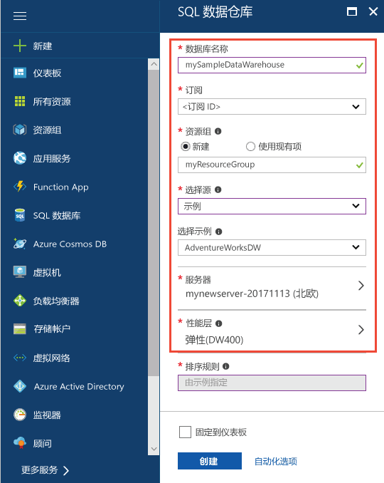
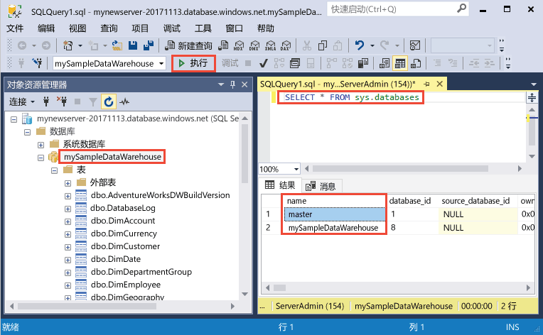
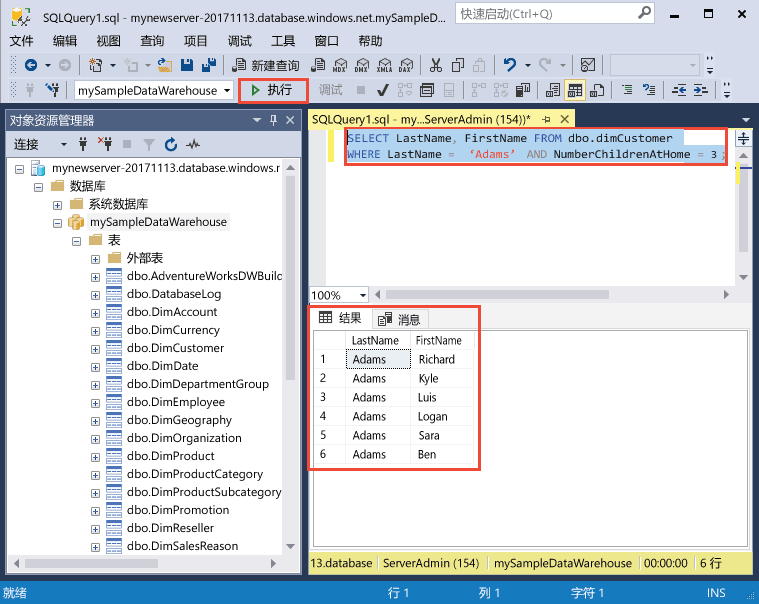

# <a name="quickstart-create-and-query-an-azure-sql-data-warehouse-in-the-azure-portal"></a>快速入门：在 Azure 门户中创建和查询 Azure SQL 数据仓库

使用 Azure 门户快速创建和查询 Azure SQL 数据仓库。

如果没有 Azure 订阅，请在开始之前创建一个[免费](https://azure.microsoft.com/free/)帐户。

> [!NOTE]
> 创建 SQL 数据仓库可能会导致新的计费服务。  有关详细信息，请参阅 [Azure SQL 数据仓库定价](https://azure.microsoft.com/pricing/details/sql-data-warehouse/)。
>
>

## <a name="before-you-begin"></a>开始之前

下载并安装最新版本的 [SQL Server Management Studio](/sql/ssms/download-sql-server-management-studio-ssms) (SSMS)。

## <a name="sign-in-to-the-azure-portal"></a>登录到 Azure 门户

登录到 [Azure 门户](https://portal.azure.com/)。

## <a name="create-a-data-warehouse"></a>创建数据仓库

创建 Azure SQL 数据仓库时，会使用一组定义好的[计算资源](memory-and-concurrency-limits.md)。 数据库在 [Azure 资源组](../azure-resource-manager/resource-group-overview.md)和 [Azure SQL 逻辑服务器](../sql-database/sql-database-logical-servers.md)中创建。 

按照这些步骤创建包含 AdventureWorksDW 示例数据的 SQL 数据仓库。 

1. 在 Azure 门户的左上角单击“创建资源”。

2. 从“新建”页中选择“数据库”，然后从“新建”页的“特色”下选择“SQL 数据仓库”。

    

3. 使用以下信息填写“SQL 数据仓库”表单：   

    | 设置 | 建议的值 | 说明 | 
    | ------- | --------------- | ----------- | 
    | **数据库名称** | mySampleDataWarehouse | 如需有效的数据库名称，请参阅 [Database Identifiers](/sql/relational-databases/databases/database-identifiers)（数据库标识符）。 请注意，数据仓库是一种数据库。| 
    | **订阅** | 你的订阅  | 有关订阅的详细信息，请参阅[订阅](https://account.windowsazure.com/Subscriptions)。 |
    | **资源组** | myResourceGroup | 如需有效的资源组名称，请参阅 [Naming rules and restrictions](https://docs.microsoft.com/azure/architecture/best-practices/naming-conventions)（命名规则和限制）。 |
    | **选择源** | 示例 | 指定加载一个示例数据库。 请注意，数据仓库是一种数据库。 |
    | 选择示例 | AdventureWorksDW | 指定加载 AdventureWorksDW 示例数据库。  |

    

4. 单击“服务器”，为新数据库创建并配置新服务器。 使用以下信息填写“新建服务器”窗体： 

    | 设置 | 建议的值 | 说明 | 
    | ------------ | ------------------ | ------------------------------------------------- | 
    | **服务器名称** | 任何全局唯一名称 | 如需有效的服务器名称，请参阅 [Naming rules and restrictions](https://docs.microsoft.com/azure/architecture/best-practices/naming-conventions)（命名规则和限制）。 | 
    | 服务器管理员登录名 | 任何有效的名称 | 如需有效的登录名，请参阅 [Database Identifiers](https://docs.microsoft.com/sql/relational-databases/databases/database-identifiers)（数据库标识符）。|
    | **密码** | 任何有效的密码 | 密码必须至少有八个字符，且必须包含以下类别中的三个类别的字符：大写字符、小写字符、数字以及非字母数字字符。 |
    | **位置** | 任何有效的位置 | 有关区域的信息，请参阅 [Azure 区域](https://azure.microsoft.com/regions/)。 |

    

5. 单击“选择”。

6. 单击“性能级别”以指定数据仓库的性能配置。

7. 对于本教程，请选择“第 2 代”。 滑块默认设置为“DW1000c”。  请尝试上下移动滑块，以查看其工作原理。 

    

8. 单击“应用”。

9. 填写 SQL 数据仓库表单后，即可单击“创建”进行数据库预配。 预配需要数分钟。 

    

10. 在工具栏上，单击“通知”可监视部署过程。
    
     

## <a name="create-a-server-level-firewall-rule"></a>创建服务器级防火墙规则

SQL 数据仓库服务在服务器级别创建一个防火墙，阻止外部应用程序和工具连接到服务器或服务器上的任何数据库。 要启用连接，可以添加防火墙规则，为特定 IP 地址启用连接。  按照以下步骤为客户端的 IP 地址创建[服务器级防火墙规则](../sql-database/sql-database-firewall-configure.md)。 

> [!NOTE]
> SQL 数据仓库通过端口 1433 进行通信。 如果尝试从企业网络内部进行连接，则该网络的防火墙可能不允许经端口 1433 的出站流量。 如果是这样，则无法连接到 Azure SQL 数据库服务器，除非 IT 部门打开了端口 1433。
>

1. 部署完成后，在左侧菜单中单击“SQL 数据仓库”，然后在“SQL 数据仓库”页上单击“mySampleDatabase”。 此时会打开数据库的概览页，其中显示了完全限定的服务器名称（例如 mynewserver-20180430.database.windows.net），并提供了其他配置的选项。 

2. 在后续的快速入门中，请复制此完全限定的服务器名称，将其用于连接到服务器及其数据库。 单击服务器名称，打开服务器设置。

    

3. 若要打开服务器设置， 
4. 请单击服务器名称。

    

5. 单击“显示防火墙设置”。 此时会打开 SQL 数据库服务器的“防火墙设置”页。 

    

4. 在工具栏上单击“添加客户端 IP”，将当前的 IP 地址添加到新的防火墙规则。 防火墙规则可以针对单个 IP 地址或一系列 IP 地址打开端口 1433。

5. 单击“保存”。 此时会针对当前的 IP 地址创建服务器级防火墙规则，在逻辑服务器上打开 端口 1433。

6. 单击“确定”，然后关闭“防火墙设置”页。

现在，可使用此 IP 地址连接到 SQL Server 及其数据仓库。 可从 SQL Server Management Studio 或另一种所选工具进行连接。 连接时，请使用之前创建的 ServerAdmin 帐户。  

> [!IMPORTANT]
> 默认情况下，所有 Azure 服务都允许通过 SQL 数据库防火墙进行访问。 单击此页上的“关闭”，然后单击“保存”，对所有 Azure 服务禁用防火墙。

## <a name="get-the-fully-qualified-server-name"></a>获取完全限定的服务器名称

请在 Azure 门户中获取 SQL Server 的完全限定的服务器名称。 稍后，在连接到服务器时，将使用该完全限定的名称。

1. 登录到 [Azure 门户](https://portal.azure.com/)。
2. 从左侧菜单中选择“SQL 数据仓库”，然后单击“SQL 数据仓库”页上的数据仓库。 
3. 在数据库的“Azure 门户”页的“概要”窗格中，找到并复制“服务器名称”。 在此示例中，完全限定名称为 mynewserver-20180430.database.windows.net。 

      

## <a name="connect-to-the-server-as-server-admin"></a>以服务器管理员的身份连接到服务器

本部分使用 [SQL Server Management Studio](/sql/ssms/download-sql-server-management-studio-ssms.md) (SSMS) 来建立与 Azure SQL Server 的连接。

1. 打开 SQL Server Management Studio。

2. 在“连接到服务器”对话框中，输入以下信息：

   | 设置       | 建议的值 | 说明 | 
   | ------------ | ------------------ | ------------------------------------------------- | 
   | 服务器类型 | 数据库引擎 | 此值是必需的 |
   | 服务器名称 | 完全限定的服务器名称 | 示例：mynewserver-20180430.database.windows.net。 |
   | 身份验证 | SQL Server 身份验证 | SQL 身份验证是本教程中配置的唯一身份验证类型。 |
   | 登录 | 服务器管理员帐户 | 这是在创建服务器时指定的帐户。 |
   | 密码 | 服务器管理员帐户的密码 | 这是在创建服务器时指定的密码。 |

    

4. 单击“连接”。 此时会在 SSMS 中打开“对象资源管理器”窗口。 

5. 在对象资源管理器中，展开“数据库”。 然后展开“mySampleDatabase”，查看新数据库中的对象。

     

## <a name="run-some-queries"></a>运行一些查询

SQL 数据仓库使用 T-SQL 作为查询语言。 打开一个查询窗口并运行一些 T-SQL 查询，请使用以下步骤：

1. 右键单击“mySampleDataWarehouse”，然后选择“新建查询”。  此时会打开一个新的查询窗口。
2. 在查询窗口中，输入以下命令以查看数据库列表。

    ```sql
    SELECT * FROM sys.databases
    ```

3. 单击“执行” 。  查询结果显示两个数据库：master 和 mySampleDataWarehouse。

    

4. 若要查看某些数据，请使用以下命令查看姓氏为 Adams 家中有三个孩子的客户数。 结果列出六个客户。 

    ```sql
    SELECT LastName, FirstName FROM dbo.dimCustomer
    WHERE LastName = 'Adams' AND NumberChildrenAtHome = 3;
    ```

    

## <a name="clean-up-resources"></a>清理资源

针对数据仓库资源用量和数据仓库存储的数据，将会收取你的费用。 这些计算和存储资源是分开计费的。 

- 如果想要将数据保留在存储中，可以在不使用数据仓库时暂停计算。 通过暂停计算，将仅收取数据存储费用。 只要准备好处理数据，便可以恢复计算。
- 如果不想支付将来的费用，则可以删除数据仓库。 

请按照下列步骤按需清理资源。

1. 登录到 [Azure 门户](https://portal.azure.com)，单击数据仓库。

    

1. 要暂停计算，请单击“暂停”按钮。 暂停数据仓库后，可看到“启动”按钮。  要恢复计算，请单击“启动”。

2. 要删除数据仓库，以便不再为计算或存储付费，请单击“删除”。

3. 要删除所创建的 SQL Server，请单击上图中的“mynewserver-20180430.database.windows.net”，然后单击“删除”。  请谨慎执行此删除操作，因为删除服务器的同时也会删除分配给该服务器的所有数据库。

4. 要删除资源组，请单击“myResourceGroup”，然后单击“删除资源组”。


## <a name="next-steps"></a>后续步骤
现已创建数据仓库、防火墙规则、已连接到数据仓库，并运行了几个查询。 若要了解有关 Azure SQL 数据仓库的详细信息，请继续有关加载数据的教程。
> [!div class="nextstepaction"]
>[将数据加载到 SQL 数据仓库](load-data-from-azure-blob-storage-using-polybase.md)
