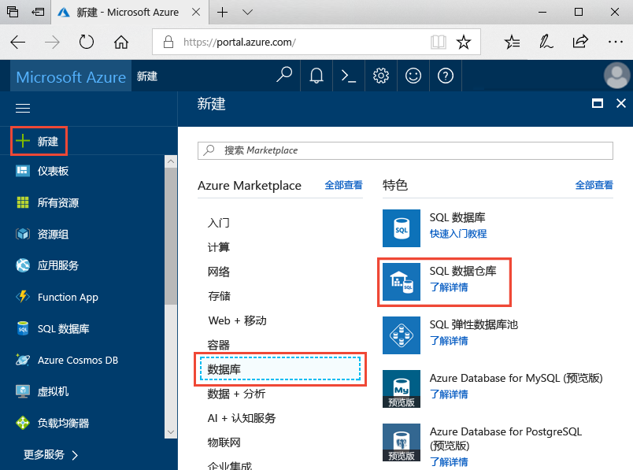
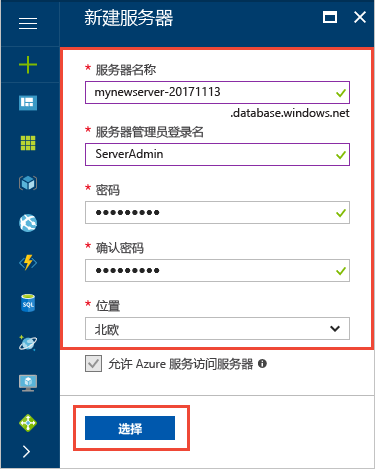
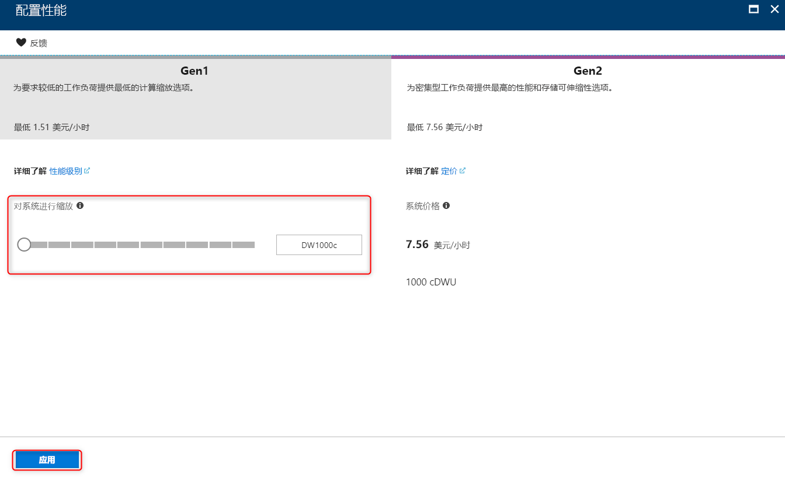
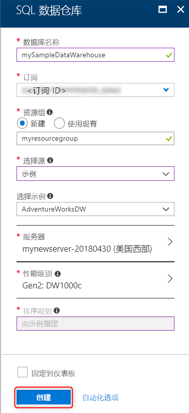
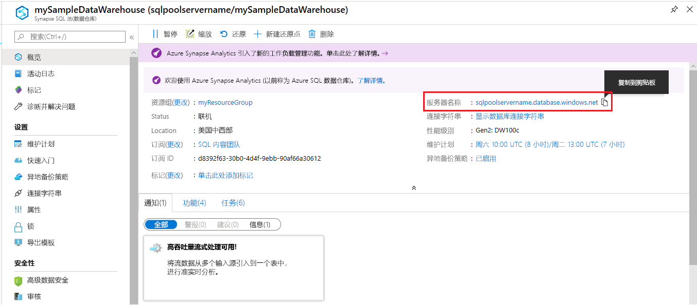
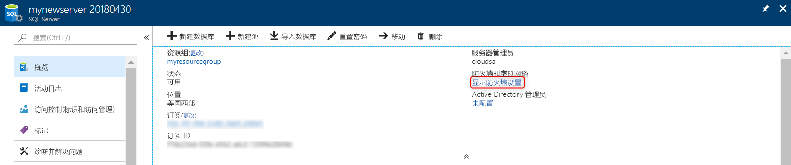
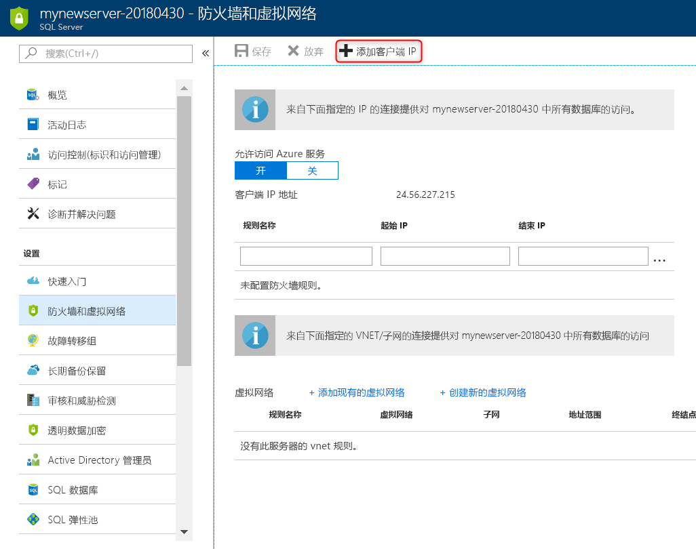

# <a name="tutorial-load-new-york-taxicab-data-to-azure-sql-data-warehouse"></a>教程：将纽约出租车数据加载到 Azure SQL 数据仓库

本教程使用 PolyBase 将纽约市出租车数据从公共 Azure Blob 加载到 Azure SQL 数据仓库。 本教程使用 [Azure 门户](https://portal.azure.com)和 [SQL Server Management Studio](/sql/ssms/download-sql-server-management-studio-ssms) (SSMS) 执行以下操作： 

> [!div class="checklist"]
> * 在 Azure 门户中创建数据仓库
> * 在 Azure 门户中设置服务器级防火墙规则
> * 使用 SSMS 连接到数据仓库
> * 创建专用于加载数据的用户
> * 在 Azure Blob 存储中为数据创建外部表
> * 使用 CTAS T-SQL 语句将数据加载到数据仓库
> * 查看正在加载的数据的进度
> * 创建新加载的数据的统计信息

如果还没有 Azure 订阅，可以在开始前[创建一个免费帐户](https://azure.microsoft.com/free/)。

## <a name="before-you-begin"></a>开始之前

开始本教程之前，请下载并安装最新版 [SQL Server Management Studio](/sql/ssms/download-sql-server-management-studio-ssms) (SSMS)。


## <a name="log-in-to-the-azure-portal"></a>登录到 Azure 门户

登录到 [Azure 门户](https://portal.azure.com/)。

## <a name="create-a-blank-sql-data-warehouse"></a>创建空白 SQL 数据仓库

创建 Azure SQL 数据仓库时，会使用定义好的一组[计算资源](memory-and-concurrency-limits.md)。 数据库在 [Azure 资源组](../azure-resource-manager/resource-group-overview.md)和 [Azure SQL 逻辑服务器](../sql-database/sql-database-features.md)中创建。 

按照以下步骤创建空白 SQL 数据仓库。 

1. 在 Azure 门户的左上角单击“创建资源”。

2. 从“新建”页中选择“数据库”，然后从“新建”页的“特色”下选择“SQL 数据仓库”。

    

3. 使用以下信息填写“SQL 数据仓库”表单：   

   | 设置 | 建议的值 | 说明 | 
   | ------- | --------------- | ----------- | 
   | **数据库名称** | mySampleDataWarehouse | 如需有效的数据库名称，请参阅 [Database Identifiers](/sql/relational-databases/databases/database-identifiers)（数据库标识符）。 | 
   | **订阅** | 你的订阅  | 有关订阅的详细信息，请参阅[订阅](https://account.windowsazure.com/Subscriptions)。 |
   | **资源组** | myResourceGroup | 如需有效的资源组名称，请参阅 [Naming rules and restrictions](https://docs.microsoft.com/azure/architecture/best-practices/naming-conventions)（命名规则和限制）。 |
   | **选择源** | 空白数据库 | 指定创建空白数据库。 请注意，数据仓库是一种数据库。|

    

4. 单击“服务器”，为新数据库创建并配置新服务器。 使用以下信息填写“新建服务器”窗体： 

    | 设置 | 建议的值 | 说明 | 
    | ------- | --------------- | ----------- |
    | **服务器名称** | 任何全局唯一名称 | 如需有效的服务器名称，请参阅 [Naming rules and restrictions](https://docs.microsoft.com/azure/architecture/best-practices/naming-conventions)（命名规则和限制）。 | 
    | 服务器管理员登录名 | 任何有效的名称 | 如需有效的登录名，请参阅 [Database Identifiers](https://docs.microsoft.com/sql/relational-databases/databases/database-identifiers)（数据库标识符）。|
    | **密码** | 任何有效的密码 | 密码必须至少有八个字符，且必须包含以下类别中的三个类别的字符：大写字符、小写字符、数字以及非字母数字字符。 |
    | **位置** | 任何有效的位置 | 有关区域的信息，请参阅 [Azure 区域](https://azure.microsoft.com/regions/)。 |

    

5. 单击“选择”。

6. 单击“性能级别”，指定数据仓库是 Gen1 还是 Gen2，以及数据仓库单位的数量。 

7. 针对本教程，请选择 SQL 数据仓库的“Gen1”。 默认情况下，滑块设置为“DW1000c”。  请尝试上下移动滑块，以查看其工作原理。 

    

8. 单击“应用”。
9. 在“SQL 数据仓库”页中，为空白数据库选择“排序规则”。 对于本教程，请使用默认值。 有关排序规则的详细信息，请参阅 [Collations](/sql/t-sql/statements/collations)（排序规则）

11. 完成 SQL 数据库表单后，即可单击“创建”对数据库进行预配。 预配需要数分钟。 

    

12. 在工具栏上，单击“通知”可监视部署过程。
    
     

## <a name="create-a-server-level-firewall-rule"></a>创建服务器级防火墙规则

SQL 数据仓库服务在服务器级别创建一个防火墙，阻止外部应用程序和工具连接到服务器或服务器上的任何数据库。 要启用连接，可以添加防火墙规则，为特定 IP 地址启用连接。  按照以下步骤为客户端的 IP 地址创建[服务器级防火墙规则](../sql-database/sql-database-firewall-configure.md)。 

> [!NOTE]
> SQL 数据仓库通过端口 1433 进行通信。 如果尝试从企业网络内部进行连接，则该网络的防火墙可能不允许经端口 1433 的出站流量。 如果是这样，则无法连接到 Azure SQL 数据库服务器，除非 IT 部门打开了端口 1433。
>

1. 部署完成后，在左侧菜单中单击“SQL 数据库”，然后在“SQL 数据库”页上单击“mySampleDatabase”。 此时会打开数据库的概览页，其中显示了完全限定的服务器名称（例如 mynewserver-20180430.database.windows.net），并提供了其他配置的选项。 

2. 在后续的快速入门中，请复制此完全限定的服务器名称，将其用于连接到服务器及其数据库。 然后单击服务器名称，打开服务器设置。

     

3. 单击服务器名称，打开服务器设置。

     

5. 单击“显示防火墙设置”。 此时会打开 SQL 数据库服务器的“防火墙设置”页。 

     

4. 在工具栏上单击“添加客户端 IP”，将当前的 IP 地址添加到新的防火墙规则。 防火墙规则可以针对单个 IP 地址或一系列 IP 地址打开端口 1433。

5. 单击“ **保存**”。 此时会针对当前的 IP 地址创建服务器级防火墙规则，在逻辑服务器上打开 端口 1433。

6. 单击“确定”，然后关闭“防火墙设置”页。

现在，可使用此 IP 地址连接到 SQL Server 及其数据仓库。 可从 SQL Server Management Studio 或另一种所选工具进行连接。 连接时，请使用之前创建的 ServerAdmin 帐户。  

> [!IMPORTANT]
> 默认情况下，所有 Azure 服务都允许通过 SQL 数据库防火墙进行访问。 单击此页上的“关闭”，然后单击“保存”，对所有 Azure 服务禁用防火墙。

## <a name="get-the-fully-qualified-server-name"></a>获取完全限定的服务器名称

请在 Azure 门户中获取 SQL Server 的完全限定的服务器名称。 稍后，在连接到服务器时，将使用该完全限定的名称。

1. 登录到 [Azure 门户](https://portal.azure.com/)。
2. 从左侧菜单中选择“SQL 数据仓库”，然后单击“SQL 数据仓库”页上的数据库。 
3. 在数据库的“Azure 门户”页的“概要”窗格中，找到并复制“服务器名称”。 在此示例中，完全限定名称为 mynewserver-20180430.database.windows.net。 

      

## <a name="connect-to-the-server-as-server-admin"></a>以服务器管理员的身份连接到服务器

本部分使用 [SQL Server Management Studio](/sql/ssms/download-sql-server-management-studio-ssms) (SSMS) 来建立与 Azure SQL Server 的连接。

1. 打开 SQL Server Management Studio。

2. 在“连接到服务器”对话框中，输入以下信息：

    | 设置      | 建议的值 | 说明 | 
    | ------------ | --------------- | ----------- | 
    | 服务器类型 | 数据库引擎 | 此值是必需的 |
    | 服务器名称 | 完全限定的服务器名称 | 该名称应类似于 mynewserver-20180430.database.windows.net。 |
    | 身份验证 | SQL Server 身份验证 | SQL 身份验证是本教程中配置的唯一身份验证类型。 |
    | 登录 | 服务器管理员帐户 | 这是在创建服务器时指定的帐户。 |
    | 密码 | 服务器管理员帐户的密码 | 这是在创建服务器时指定的密码。 |

    

4. 单击“连接”。 此时会在 SSMS 中打开“对象资源管理器”窗口。 

5. 在对象资源管理器中，展开“数据库”。 然后展开“系统数据库”和“master”，查看 master 数据库中的对象。  展开“mySampleDatabase”，查看新数据库中的对象。

     

## <a name="create-a-user-for-loading-data"></a>创建用于加载数据的用户

服务器管理员帐户用于执行管理操作，不适合对用户数据运行查询。 加载数据是一种内存密集型操作。 内存最大值是根据已设置的 SQL 数据仓库的代系、[数据仓库单位](what-is-a-data-warehouse-unit-dwu-cdwu.md)和[资源类](resource-classes-for-workload-management.md)定义的。 

最好创建专用于加载数据的登录名和用户。 然后，将加载用户添加到启用相应最大内存分配的[资源类](resource-classes-for-workload-management.md)。

由于当前是以服务器管理员的身份连接的，因此可以创建登录名和用户。 使用以下步骤创建名为 LoaderRC20 的登录名和用户。 然后将该用户分配到 staticrc20 资源类。 

1.  在 SSMS 中，右键单击“master”，然后在显示的下拉菜单中选择“新建查询”。 此时会打开一个新的查询窗口。

    

2. 在查询窗口中，输入以下 T-SQL 命令，创建一个名为 LoaderRC20 的登录名和用户，并将“a123STRONGpassword!”替换为自己的密码。 

    ```sql
    CREATE LOGIN LoaderRC20 WITH PASSWORD = 'a123STRONGpassword!';
    CREATE USER LoaderRC20 FOR LOGIN LoaderRC20;
    ```

3. 单击“执行” 。

4. 右键单击“mySampleDataWarehouse”，然后选择“新建查询”。 此时会打开一个新的查询窗口。  

    
 
5. 输入以下 T-SQL 命令，为 LoaderRC20 登录名创建名为 LoaderRC20 的数据库用户。 第二行为新用户授予对新数据仓库的 CONTROL 权限。  这些权限类似于使用户成为数据库所有者。 第三行将新用户添加为 staticrc20 [资源类](resource-classes-for-workload-management.md)的成员。

    ```sql
    CREATE USER LoaderRC20 FOR LOGIN LoaderRC20;
    GRANT CONTROL ON DATABASE::[mySampleDataWarehouse] to LoaderRC20;
    EXEC sp_addrolemember 'staticrc20', 'LoaderRC20';
    ```

6. 单击“执行” 。

## <a name="connect-to-the-server-as-the-loading-user"></a>以加载用户的身份连接到服务器

加载数据的第一步是以 LoaderRC20 的身份登录。  

1. 在对象资源管理器中，单击“连接”下拉菜单，然后选择“数据库引擎”。 此时会显示“连接到服务器”对话框。

    

2. 输入完全限定的服务器名称，并输入“LoaderRC20”作为登录名。  输入 LoaderRC20 的密码。

3. 单击“连接”。

4. 当连接准备就绪时，对象资源管理器中出现两个服务器连接。 一个是作为 ServerAdmin 连接，另一个是作为 MedRCLogin 连接。

    

## <a name="create-external-tables-for-the-sample-data"></a>为示例数据创建外部表

已准备好开始将数据加载到新的数据仓库。 本教程说明如何使用外部表从 Azure 存储 Blob 加载纽约市出租车数据。 今后要了解如何将数据移入 Azure Blob 存储，或者将数据直接从源载入 SQL 数据仓库，请参阅 [loading overview](sql-data-warehouse-overview-load.md)（有关加载的概述）。

运行以下 SQL 脚本，指定有关想要加载的数据的信息。 此信息包括数据所在的位置、数据内容的格式以及数据的表定义。 

1. 在前一节中，已经以 LoaderRC20 的身份登录数据仓库。 在 SSMS 中，右键单击 LoaderRC20 连接，然后选择“新建查询”。  此时会显示一个新的查询窗口。 

    

2. 比较查询窗口和之间的图像。  验证新的查询窗口以 LoaderRC20 的身份运行，并对 MySampleDataWarehouse 数据库执行查询。 使用此查询窗口执行所有加载步骤。

3. 创建 MySampleDataWarehouse 数据库的主密钥。 只需为每个数据库创建主密钥一次。 

    ```sql
    CREATE MASTER KEY;
    ```

4. 运行以下 [CREATE EXTERNAL DATA SOURCE](/sql/t-sql/statements/create-external-data-source-transact-sql) 语句，定义 Azure Blob 的位置。 这是外部出租车数据的位置。  要运行追加到查询窗口的命令，请突出显示要运行的命令，然后单击“执行”。

    ```sql
    CREATE EXTERNAL DATA SOURCE NYTPublic
    WITH
    (
        TYPE = Hadoop,
        LOCATION = 'wasbs://2013@nytaxiblob.blob.core.windows.net/'
    );
    ```

5. 运行以下 [CREATE EXTERNAL FILE FORMAT](/sql/t-sql/statements/create-external-file-format-transact-sql) T-SQL 语句，指定外部数据文件的格式设置特征和选项。 此语句指定外部数据存储为文本，且值由管道 ("|") 字符分隔。 使用 Gzip 压缩外部文件。 

    ```sql
    CREATE EXTERNAL FILE FORMAT uncompressedcsv
    WITH (
        FORMAT_TYPE = DELIMITEDTEXT,
        FORMAT_OPTIONS ( 
            FIELD_TERMINATOR = ',',
            STRING_DELIMITER = '',
            DATE_FORMAT = '',
            USE_TYPE_DEFAULT = False
        )
    );
    CREATE EXTERNAL FILE FORMAT compressedcsv
    WITH ( 
        FORMAT_TYPE = DELIMITEDTEXT,
        FORMAT_OPTIONS ( FIELD_TERMINATOR = '|',
            STRING_DELIMITER = '',
        DATE_FORMAT = '',
            USE_TYPE_DEFAULT = False
        ),
        DATA_COMPRESSION = 'org.apache.hadoop.io.compress.GzipCodec'
    );
    ```

6.  运行以下 [CREATE SCHEMA](/sql/t-sql/statements/create-schema-transact-sql) 语句，创建外部文件格式的架构。 该架构提供组织即将创建的外部表的方法。

    ```sql
    CREATE SCHEMA ext;
    ```

7. 创建外部表。 表定义存储在 SQL 数据仓库中，但表引用数据存储在 Azure Blob 存储中。 运行以下 T-SQL 命令以创建若干外部表，这些表都指向我们之前在外部数据源中定义的 Azure blob。

    ```sql
    CREATE EXTERNAL TABLE [ext].[Date] 
    (
        [DateID] int NOT NULL,
        [Date] datetime NULL,
        [DateBKey] char(10) COLLATE SQL_Latin1_General_CP1_CI_AS NULL,
        [DayOfMonth] varchar(2) COLLATE SQL_Latin1_General_CP1_CI_AS NULL,
        [DaySuffix] varchar(4) COLLATE SQL_Latin1_General_CP1_CI_AS NULL,
        [DayName] varchar(9) COLLATE SQL_Latin1_General_CP1_CI_AS NULL,
        [DayOfWeek] char(1) COLLATE SQL_Latin1_General_CP1_CI_AS NULL,
        [DayOfWeekInMonth] varchar(2) COLLATE SQL_Latin1_General_CP1_CI_AS NULL,
        [DayOfWeekInYear] varchar(2) COLLATE SQL_Latin1_General_CP1_CI_AS NULL,
        [DayOfQuarter] varchar(3) COLLATE SQL_Latin1_General_CP1_CI_AS NULL,
        [DayOfYear] varchar(3) COLLATE SQL_Latin1_General_CP1_CI_AS NULL,
        [WeekOfMonth] varchar(1) COLLATE SQL_Latin1_General_CP1_CI_AS NULL,
        [WeekOfQuarter] varchar(2) COLLATE SQL_Latin1_General_CP1_CI_AS NULL,
        [WeekOfYear] varchar(2) COLLATE SQL_Latin1_General_CP1_CI_AS NULL,
        [Month] varchar(2) COLLATE SQL_Latin1_General_CP1_CI_AS NULL,
        [MonthName] varchar(9) COLLATE SQL_Latin1_General_CP1_CI_AS NULL,
        [MonthOfQuarter] varchar(2) COLLATE SQL_Latin1_General_CP1_CI_AS NULL,
        [Quarter] char(1) COLLATE SQL_Latin1_General_CP1_CI_AS NULL,
        [QuarterName] varchar(9) COLLATE SQL_Latin1_General_CP1_CI_AS NULL,
        [Year] char(4) COLLATE SQL_Latin1_General_CP1_CI_AS NULL,
        [YearName] char(7) COLLATE SQL_Latin1_General_CP1_CI_AS NULL,
        [MonthYear] char(10) COLLATE SQL_Latin1_General_CP1_CI_AS NULL,
        [MMYYYY] char(6) COLLATE SQL_Latin1_General_CP1_CI_AS NULL,
        [FirstDayOfMonth] date NULL,
        [LastDayOfMonth] date NULL,
        [FirstDayOfQuarter] date NULL,
        [LastDayOfQuarter] date NULL,
        [FirstDayOfYear] date NULL,
        [LastDayOfYear] date NULL,
        [IsHolidayUSA] bit NULL,
        [IsWeekday] bit NULL,
        [HolidayUSA] varchar(50) COLLATE SQL_Latin1_General_CP1_CI_AS NULL
    )
    WITH
    (
        LOCATION = 'Date',
        DATA_SOURCE = NYTPublic,
        FILE_FORMAT = uncompressedcsv,
        REJECT_TYPE = value,
        REJECT_VALUE = 0
    ); 
    CREATE EXTERNAL TABLE [ext].[Geography]
    (
        [GeographyID] int NOT NULL,
        [ZipCodeBKey] varchar(10) COLLATE SQL_Latin1_General_CP1_CI_AS NOT NULL,
        [County] varchar(50) COLLATE SQL_Latin1_General_CP1_CI_AS NULL,
        [City] varchar(50) COLLATE SQL_Latin1_General_CP1_CI_AS NULL,
        [State] varchar(50) COLLATE SQL_Latin1_General_CP1_CI_AS NULL,
        [Country] varchar(50) COLLATE SQL_Latin1_General_CP1_CI_AS NULL,
        [ZipCode] varchar(50) COLLATE SQL_Latin1_General_CP1_CI_AS NULL
    )
    WITH
    (
        LOCATION = 'Geography',
        DATA_SOURCE = NYTPublic,
        FILE_FORMAT = uncompressedcsv,
        REJECT_TYPE = value,
        REJECT_VALUE = 0 
    );      
    CREATE EXTERNAL TABLE [ext].[HackneyLicense]
    (
        [HackneyLicenseID] int NOT NULL,
        [HackneyLicenseBKey] varchar(50) COLLATE SQL_Latin1_General_CP1_CI_AS NOT NULL,
        [HackneyLicenseCode] varchar(50) COLLATE SQL_Latin1_General_CP1_CI_AS NULL
    )
    WITH
    (
        LOCATION = 'HackneyLicense',
        DATA_SOURCE = NYTPublic,
        FILE_FORMAT = uncompressedcsv,
        REJECT_TYPE = value,
        REJECT_VALUE = 0
    );
    CREATE EXTERNAL TABLE [ext].[Medallion]
    (
        [MedallionID] int NOT NULL,
        [MedallionBKey] varchar(50) COLLATE SQL_Latin1_General_CP1_CI_AS NOT NULL,
        [MedallionCode] varchar(50) COLLATE SQL_Latin1_General_CP1_CI_AS NULL
    )
    WITH
    (
        LOCATION = 'Medallion',
        DATA_SOURCE = NYTPublic,
        FILE_FORMAT = uncompressedcsv,
        REJECT_TYPE = value,
        REJECT_VALUE = 0
    )
    ;  
    CREATE EXTERNAL TABLE [ext].[Time]
    (
        [TimeID] int NOT NULL,
        [TimeBKey] varchar(8) COLLATE SQL_Latin1_General_CP1_CI_AS NOT NULL,
        [HourNumber] tinyint NOT NULL,
        [MinuteNumber] tinyint NOT NULL,
        [SecondNumber] tinyint NOT NULL,
        [TimeInSecond] int NOT NULL,
        [HourlyBucket] varchar(15) COLLATE SQL_Latin1_General_CP1_CI_AS NOT NULL,
        [DayTimeBucketGroupKey] int NOT NULL,
        [DayTimeBucket] varchar(100) COLLATE SQL_Latin1_General_CP1_CI_AS NOT NULL
    )
    WITH
    (
        LOCATION = 'Time',
        DATA_SOURCE = NYTPublic,
        FILE_FORMAT = uncompressedcsv,
        REJECT_TYPE = value,
        REJECT_VALUE = 0
    );
    CREATE EXTERNAL TABLE [ext].[Trip]
    (
        [DateID] int NOT NULL,
        [MedallionID] int NOT NULL,
        [HackneyLicenseID] int NOT NULL,
        [PickupTimeID] int NOT NULL,
        [DropoffTimeID] int NOT NULL,
        [PickupGeographyID] int NULL,
        [DropoffGeographyID] int NULL,
        [PickupLatitude] float NULL,
        [PickupLongitude] float NULL,
        [PickupLatLong] varchar(50) COLLATE SQL_Latin1_General_CP1_CI_AS NULL,
        [DropoffLatitude] float NULL,
        [DropoffLongitude] float NULL,
        [DropoffLatLong] varchar(50) COLLATE SQL_Latin1_General_CP1_CI_AS NULL,
        [PassengerCount] int NULL,
        [TripDurationSeconds] int NULL,
        [TripDistanceMiles] float NULL,
        [PaymentType] varchar(50) COLLATE SQL_Latin1_General_CP1_CI_AS NULL,
        [FareAmount] money NULL,
        [SurchargeAmount] money NULL,
        [TaxAmount] money NULL,
        [TipAmount] money NULL,
        [TollsAmount] money NULL,
        [TotalAmount] money NULL
    )
    WITH
    (
        LOCATION = 'Trip2013',
        DATA_SOURCE = NYTPublic,
        FILE_FORMAT = compressedcsv,
        REJECT_TYPE = value,
        REJECT_VALUE = 0
    );
    CREATE EXTERNAL TABLE [ext].[Weather]
    (
        [DateID] int NOT NULL,
        [GeographyID] int NOT NULL,
        [PrecipitationInches] float NOT NULL,
        [AvgTemperatureFahrenheit] float NOT NULL
    )
    WITH
    (
        LOCATION = 'Weather',
        DATA_SOURCE = NYTPublic,
        FILE_FORMAT = uncompressedcsv,
        REJECT_TYPE = value,
        REJECT_VALUE = 0
    )
    ;
    ```

8. 在对象资源管理器中，展开“mySampleDataWarehouse”，查看刚刚创建的外部表列表。

    

## <a name="load-the-data-into-your-data-warehouse"></a>将数据加载到数据仓库

本部分使用刚才定义的外部表将示例数据从 Azure 存储 Blob 加载到 SQL 数据仓库。  

> [!NOTE]
> 本教程直接将数据加载到最终表。 在生产环境中，通常使用 CREATE TABLE AS SELECT 将数据加载到临时表。 数据在临时表中时，可以执行任何必要的转换。 要将临时表中的数据追加到生产表，可以使用 INSERT...SELECT 语句。 有关详细信息，请参阅[将数据插入到生产表](guidance-for-loading-data.md#inserting-data-into-a-production-table)。
> 

下面的脚本使用 [CREATE TABLE AS SELECT (CTAS)](/sql/t-sql/statements/create-table-as-select-azure-sql-data-warehouse) T-SQL 语句将数据从 Azure 存储 Blob 加载到数据仓库中的新表。 CTAS 基于 select 语句的结果创建新表。 新表包含与 select 语句结果相同的列和数据类型。 当 select 语句从外部表进行选择时，SQL 数据仓库将数据导入数据仓库中的关系表。 

1. 运行以下脚本，将数据加载到数据仓库中的新表。

    ```sql
    CREATE TABLE [dbo].[Date]
    WITH
    ( 
        DISTRIBUTION = ROUND_ROBIN,
        CLUSTERED COLUMNSTORE INDEX
    )
    AS SELECT * FROM [ext].[Date]
    OPTION (LABEL = 'CTAS : Load [dbo].[Date]')
    ;
    CREATE TABLE [dbo].[Geography]
    WITH
    ( 
        DISTRIBUTION = ROUND_ROBIN,
        CLUSTERED COLUMNSTORE INDEX
    )
    AS
    SELECT * FROM [ext].[Geography]
    OPTION (LABEL = 'CTAS : Load [dbo].[Geography]')
    ;
    CREATE TABLE [dbo].[HackneyLicense]
    WITH
    ( 
        DISTRIBUTION = ROUND_ROBIN,
        CLUSTERED COLUMNSTORE INDEX
    )
    AS SELECT * FROM [ext].[HackneyLicense]
    OPTION (LABEL = 'CTAS : Load [dbo].[HackneyLicense]')
    ;
    CREATE TABLE [dbo].[Medallion]
    WITH
    (
        DISTRIBUTION = ROUND_ROBIN,
        CLUSTERED COLUMNSTORE INDEX
    )
    AS SELECT * FROM [ext].[Medallion]
    OPTION (LABEL = 'CTAS : Load [dbo].[Medallion]')
    ;
    CREATE TABLE [dbo].[Time]
    WITH
    (
        DISTRIBUTION = ROUND_ROBIN,
        CLUSTERED COLUMNSTORE INDEX
    )
    AS SELECT * FROM [ext].[Time]
    OPTION (LABEL = 'CTAS : Load [dbo].[Time]')
    ;
    CREATE TABLE [dbo].[Weather]
    WITH
    ( 
        DISTRIBUTION = ROUND_ROBIN,
        CLUSTERED COLUMNSTORE INDEX
    )
    AS SELECT * FROM [ext].[Weather]
    OPTION (LABEL = 'CTAS : Load [dbo].[Weather]')
    ;
    CREATE TABLE [dbo].[Trip]
    WITH
    (
        DISTRIBUTION = ROUND_ROBIN,
        CLUSTERED COLUMNSTORE INDEX
    )
    AS SELECT * FROM [ext].[Trip]
    OPTION (LABEL = 'CTAS : Load [dbo].[Trip]')
    ;
    ```

2. 在加载数据的同时查看数据。 假设要加载几个 GB 的数据，并将其压缩成高性能群集列存储索引。 运行以下使用动态管理视图 (DMV) 的查询以显示负载的状态。 开始查询后，在 SQL 数据仓库执行繁重任务的同时，可享用咖啡和小吃。

    ```sql
    SELECT
        r.command,
        s.request_id,
        r.status,
        count(distinct input_name) as nbr_files,
        sum(s.bytes_processed)/1024/1024/1024 as gb_processed
    FROM 
        sys.dm_pdw_exec_requests r
        INNER JOIN sys.dm_pdw_dms_external_work s
        ON r.request_id = s.request_id
    WHERE
        r.[label] = 'CTAS : Load [dbo].[Date]' OR
        r.[label] = 'CTAS : Load [dbo].[Geography]' OR
        r.[label] = 'CTAS : Load [dbo].[HackneyLicense]' OR
        r.[label] = 'CTAS : Load [dbo].[Medallion]' OR
        r.[label] = 'CTAS : Load [dbo].[Time]' OR
        r.[label] = 'CTAS : Load [dbo].[Weather]' OR
        r.[label] = 'CTAS : Load [dbo].[Trip]'
    GROUP BY
        r.command,
        s.request_id,
        r.status
    ORDER BY
        nbr_files desc, 
        gb_processed desc;
    ```

3. 查看所有系统查询。

    ```sql
    SELECT * FROM sys.dm_pdw_exec_requests;
    ```

4. 结果让人欣慰，数据已顺利载入数据仓库。

    

## <a name="create-statistics-on-newly-loaded-data"></a>创建新加载的数据的统计信息

SQL 数据仓库不会自动创建或自动更新统计信息。 因此，若要实现较高的查询性能，必须在首次加载后基于每个表的每个列创建统计信息。 此外，在对数据做出重大更改后，必须更新统计信息。

运行以下命令，创建针对可能用于联接的列的统计信息。

    ```sql
    CREATE STATISTICS [dbo.Date DateID stats] ON dbo.Date (DateID);
    CREATE STATISTICS [dbo.Trip DateID stats] ON dbo.Trip (DateID);
    ```

## <a name="clean-up-resources"></a>清理资源

需要为加载到数据仓库中的计算资源和数据付费。 这些需要单独计费。 

- 如果想要将数据保留在存储中，可以在不使用数据仓库时暂停计算。 暂停计算后，仅需为数据存储付费，并且随时都可在准备处理数据时恢复计算。
- 如果不想支付将来的费用，则可以删除数据仓库。 

请按照下列步骤按需清理资源。

1. 登录 [Azure 门户](https://portal.azure.com)，单击数据仓库。

    

2. 要暂停计算，请单击“暂停”按钮。 暂停数据仓库后，可看到“启动”按钮。  要恢复计算，请单击“启动”。

3. 要删除数据仓库，以便不再为计算或存储付费，请单击“删除”。

4. 要删除创建的 SQL Server，请单击上图中的“mynewserver-20180430.database.windows.net”，然后单击“删除”。  请审慎执行此操作，因为删除服务器会删除分配给该服务器的所有数据库。

5. 要删除资源组，请单击“myResourceGroup”，然后单击“删除资源组”。

## <a name="next-steps"></a>后续步骤 
在本教程中，已学习了如何创建数据仓库以及用于加载数据的用户。 创建了外部表以定义 Azure 存储 Blob 中存储的数据的结构，然后使用 PolyBase CREATE TABLE AS SELECT 语句将数据加载到数据仓库。 

完成了以下操作：
> [!div class="checklist"]
> * 在 Azure 门户中创建数据仓库
> * 在 Azure 门户中设置服务器级防火墙规则
> * 使用 SSMS 连接到数据仓库
> * 创建了专用于加载数据的用户
> * 在 Azure 存储 Blob 中为数据创建了外部表
> * 使用 CTAS T-SQL 语句将数据加载到数据仓库
> * 查看了正在加载的数据的进度
> * 创建了新加载的数据的统计信息

转到迁移概述，了解如何将现有数据库迁移到 SQL 数据仓库。

> [!div class="nextstepaction"]
>[了解如何将现有数据库迁移到 SQL 数据仓库](sql-data-warehouse-overview-migrate.md)
