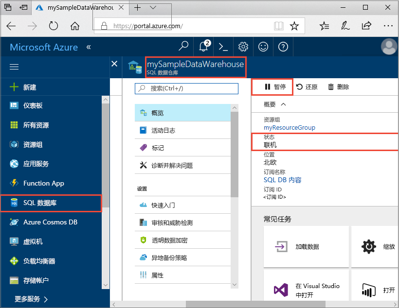
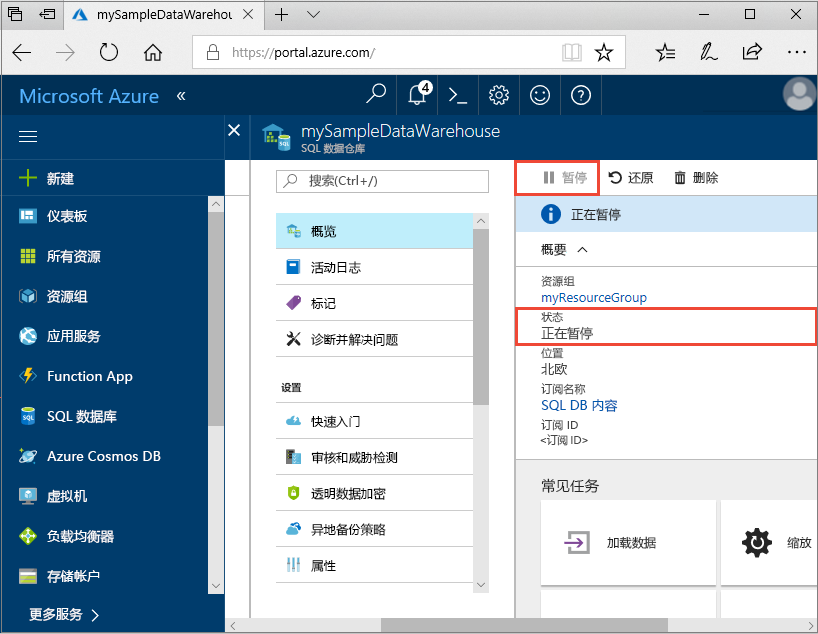
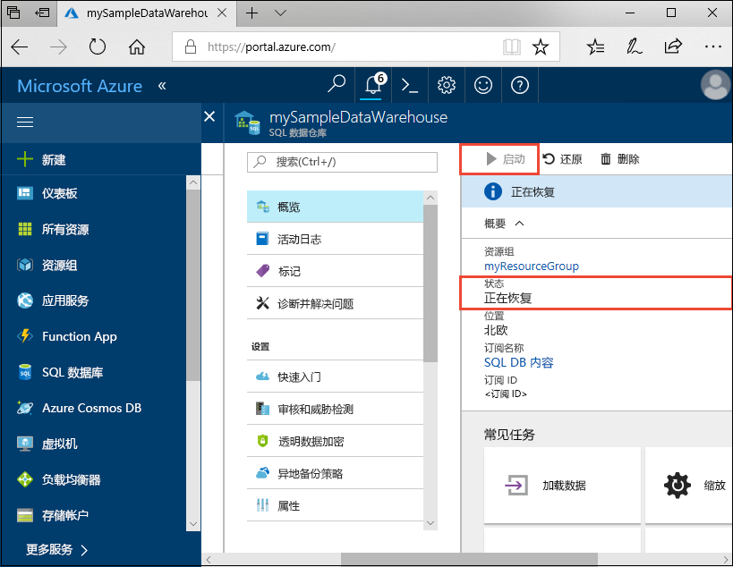

# 快速入门：在 Azure 门户中暂停和恢复 Azure SQL 数据仓库的计算
使用 Azure 门户暂停 Azure SQL 数据仓库中的计算来节约成本。 在准备好使用数据仓库时[还原计算](sql-data-warehouse-manage-compute-overview.md)。

如果你还没有 Azure 订阅，可以在开始前创建一个[免费](https://azure.microsoft.com/free/)帐户。

## 登录到 Azure 门户

登录到 [Azure 门户](https://portal.azure.com/)。

## 开始之前

使用[创建并连接 - 门户](create-data-warehouse-portal.md)创建名为“mySampleDataWarehouse”的数据仓库。 

## 暂停计算
为了节省成本，可以按需暂停和恢复计算资源。 例如，如果晚上和周末不使用数据库，那么可以在这些时间暂停数据库的使用，然后在白天时恢复使用。 数据库暂停时，不对计算资源进行收费。 但是，仍将向你收取存储费用。 

执行以下步骤，暂停 SQL 数据仓库。

1. 在 Azure 门户的左侧页面中，单击“SQL 数据库”。
2. 从“SQL 数据库”页中选择“mySampleDataWarehouse”。 此操作将打开数据仓库。 
3. 在“mySampleDataWarehouse”页中，可看到“状态”显示为“联机”。

    

4. 要暂停数据仓库，请单击“暂停”按钮。 
5. 此时将出现询问是否恢复的确认提问。 单击 **“是”**。
6. 等待几分钟后，“状态”将更改为“正在暂停”。

    

7. 完成暂停操作后，状态显示“已暂停”，选项按钮为“启动”。
8. 现在，数据仓库的计算资源处于脱机状态。 在恢复服务之前无需为计算付费。

    

## 恢复计算
执行以下步骤，恢复 SQL 数据仓库。

1. 在 Azure 门户的左侧页面中，单击“SQL 数据库”。
2. 从“SQL 数据库”页中选择“mySampleDataWarehouse”。 此操作将打开数据仓库。 
3. 在“mySampleDataWarehouse”页中，可看到“状态”显示为“已暂停”。

    

4. 要恢复数据仓库，请单击“启动”。 
5. 此时将出现询问是否启动的确认提问。 单击 **“是”**。
6. 可看到“状态”显示为“正在恢复”。

    

7. 数据仓库恢复联机时，其状态将显示为“联机”，且选项按钮为“暂停”。
8. 此时数据仓库的计算资源处于联机状态，可使用该服务。 收取已恢复计算费用。

    

## 清理资源

根据数据仓库单位和数据仓库中存储的数据计费。 这些计算和存储资源是分开计费的。 

- 要将数据保存在存储中，请暂停计算。
- 如果不想支付将来的费用，则可以删除数据仓库。 

请按照下列步骤按需清理资源。

1. 登录到 [Azure 门户](https://portal.azure.com)，单击数据仓库。

    

1. 要暂停计算，请单击“暂停”按钮。 暂停数据仓库后，可看到“启动”按钮。  要恢复计算，请单击“启动”。

2. 要删除数据仓库，以便不再为计算或存储付费，请单击“删除”。

3. 要删除创建的 SQL Server，请单击“mynewserver-20171113.database.windows.net”，然后单击“删除”。  请谨慎执行此删除操作，因为删除服务器的同时也会删除分配给该服务器的所有数据库。

4. 要删除资源组，请单击“myResourceGroup”，然后单击“删除资源组”。

## 后续步骤
现在已暂停并恢复了数据仓库的计算。 若要了解有关 Azure SQL 数据仓库的详细信息，请继续有关加载数据的教程。

> [!div class="nextstepaction"]
>[将数据加载到 SQL 数据仓库](load-data-from-azure-blob-storage-using-polybase.md)
