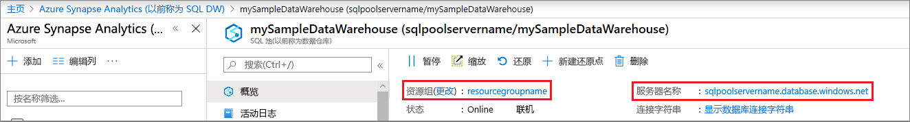
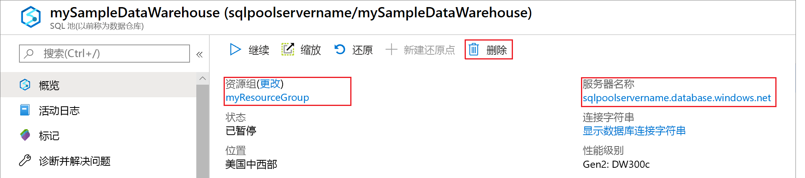

# <a name="quickstart-pause-and-resume-compute-in-azure-sql-data-warehouse-with-powershell"></a>快速入门：使用 PowerShell 暂停和恢复 Azure SQL 数据仓库中的计算
使用 PowerShell 暂停 Azure SQL 数据仓库中的计算来节约成本。 在准备好使用数据仓库时[还原计算](sql-data-warehouse-manage-compute-overview.md)。

如果你还没有 Azure 订阅，可以在开始前创建一个[免费](https://azure.microsoft.com/free/)帐户。

本教程需要 Azure PowerShell 模块版本 5.1.1 或更高版本。 运行 ` Get-Module -ListAvailable AzureRM` 查找当前版本。 如果需要进行安装或升级，请参阅[安装 Azure PowerShell 模块](/powershell/azure/install-azurerm-ps.md)。

## <a name="before-you-begin"></a>开始之前

本快速入门教程假定已有可暂停和恢复的 SQL 数据仓库。 如果需要创建一个 SQL 数据仓库，可使用[创建并连接 - 门户](create-data-warehouse-portal.md)创建名为“mySampleDataWarehouse”的数据仓库。

## <a name="log-in-to-azure"></a>登录 Azure

使用 [Connect-AzureRmAccount](/powershell/module/azurerm.profile/connect-azurermaccount) 命令登录到 Azure 订阅，并按照屏幕上的说明进行操作。

```powershell
Connect-AzureRmAccount
```

若要查看正在使用的订阅，请运行 [Get-AzureRmSubscription](/powershell/module/azurerm.profile/get-azurermsubscription)。

```powershell
Get-AzureRmSubscription
```

如果需要使用与默认订阅不同的订阅，请运行 [Select-AzureRmSubscription](/powershell/module/azurerm.profile/select-azurermsubscription)。

```powershell
Select-AzureRmSubscription -SubscriptionName "MySubscription"
```

## <a name="look-up-data-warehouse-information"></a>查找数据仓库信息

查找计划暂停和恢复的数据仓库的数据库名称、服务器名称和资源组。

按照以下步骤查找数据仓库的位置信息。

1. 登录到 [Azure 门户](https://portal.azure.com/)。
2. 在 Azure 门户的左侧页面中，单击“SQL 数据库”。
3. 从“SQL 数据库”页中选择“mySampleDataWarehouse”。 此操作打开数据仓库。

    

4. 记下将用作数据库名称的数据仓库名称。 同时记下服务器名称和资源组。 你
5.  执行暂停和恢复命令时会用到。
6. 如果服务器是 foo.database.windows.net，请在 PowerShell cmdlet 中仅使用第一部分作为服务器名称。 在上图中，完整的服务器名称为 newserver-20171113.database.windows.net。 删除后缀并使用 newserver-20171113 作为 PowerShell cmdlet 中的服务器名称。

## <a name="pause-compute"></a>暂停计算
为了节省成本，可以按需暂停和恢复计算资源。 例如，如果晚上和周末不使用数据库，那么可以在这些时间暂停数据库的使用，然后在白天时恢复使用。 数据库暂停时，不对计算资源进行收费。 但是，仍将收取存储费用。

若要暂停数据库，请使用 [Suspend-AzureRmSqlDatabase](/powershell/module/azurerm.sql/suspend-azurermsqldatabase.md) cmdlet。 以下示例暂停 newserver-20171113 服务器上托管的 mySampleDataWarehouse 数据仓库。 该服务器位于名为 myResourceGroup 的 Azure 资源组中。


```Powershell
Suspend-AzureRmSqlDatabase –ResourceGroupName "myResourceGroup" `
–ServerName "newserver-20171113" –DatabaseName "mySampleDataWarehouse"
```

一种变异，下一个示例将数据库检索到 $database 对象中。 然后，它通过管道将该对象传递给 [Suspend-AzureRmSqlDatabase](/powershell/module/azurerm.sql/suspend-azurermsqldatabase)。 结果存储在对象 resultDatabase 中。 最后一个命令显示结果。

```Powershell
$database = Get-AzureRmSqlDatabase –ResourceGroupName "myResourceGroup" `
–ServerName "newserver-20171113" –DatabaseName "mySampleDataWarehouse"
$resultDatabase = $database | Suspend-AzureRmSqlDatabase
$resultDatabase
```


## <a name="resume-compute"></a>恢复计算
若要启动数据库，请使用 [Resume-AzureRmSqlDatabase](/powershell/module/azurerm.sql/resume-azurermsqldatabase) cmdlet。 以下示例启动 newserver-20171113 服务器上托管的 mySampleDataWarehouse 数据库。 该服务器位于名为 myResourceGroup 的 Azure 资源组中。

```Powershell
Resume-AzureRmSqlDatabase –ResourceGroupName "myResourceGroup" `
–ServerName "newserver-20171113" -DatabaseName "mySampleDataWarehouse"
```

一种变异，下一个示例将数据库检索到 $database 对象中。 然后，它通过管道将对象传递给 [Resume-AzureRmSqlDatabase](/powershell/module/azurerm.sql/resume-azurermsqldatabase.md)，并将结果存储在 $resultDatabase 中。 最后一个命令显示结果。

```Powershell
$database = Get-AzureRmSqlDatabase –ResourceGroupName "ResourceGroup1" `
–ServerName "Server01" –DatabaseName "Database02"
$resultDatabase = $database | Resume-AzureRmSqlDatabase
$resultDatabase
```

## <a name="clean-up-resources"></a>清理资源

针对数据仓库资源用量和数据仓库存储的数据，将会收取你的费用。 这些计算和存储资源是分开计费的。

- 要将数据保存在存储中，请暂停计算。
- 如果不想支付将来的费用，则可以删除数据仓库。

请按照下列步骤按需清理资源。

1. 登录到 [Azure 门户](https://portal.azure.com)，单击数据仓库。

    

1. 要暂停计算，请单击“暂停”按钮。 暂停数据仓库后，可看到“启动”按钮。  要恢复计算，请单击“启动”。

2. 要删除数据仓库，以便不再为计算或存储付费，请单击“删除”。

3. 要删除创建的 SQL Server，请单击“mynewserver-20171113.database.windows.net”，然后单击“删除”。  请谨慎执行此删除操作，因为删除服务器的同时也会删除分配给该服务器的所有数据库。

4. 要删除资源组，请单击“myResourceGroup”，然后单击“删除资源组”。


## <a name="next-steps"></a>后续步骤
现在已暂停并恢复了数据仓库的计算。 若要了解有关 Azure SQL 数据仓库的详细信息，请继续有关加载数据的教程。

> [!div class="nextstepaction"]
>[将数据加载到 SQL 数据仓库](load-data-from-azure-blob-storage-using-polybase.md)
