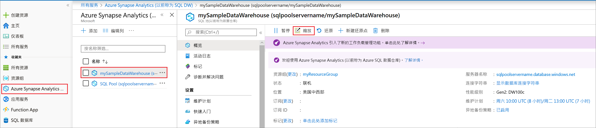

# 快速入门：使用 Azure 门户在 Azure SQL 数据仓库中缩放计算资源

使用 Azure 门户在 Azure SQL 数据仓库中缩放计算资源。 [横向扩展计算](sql-data-warehouse-manage-compute-overview.md)以提高性能或按比例缩减计算以节约成本。 

如果你还没有 Azure 订阅，可以在开始前创建一个[免费](https://azure.microsoft.com/free/)帐户。

## 登录到 Azure 门户

登录到 [Azure 门户](https://portal.azure.com/)。

## 开始之前

可以缩放现有的数据仓库，或使用[创建并连接 - 门户](create-data-warehouse-portal.md)创建名为“mySampleDataWarehouse”的数据仓库。  本快速入门教程缩放 **mySampleDataWarehouse**。

## 缩放计算

在 SQL 数据仓库中，可以通过调整数据仓库单位来增加或减少计算资源。 [创建和 Connect - 门户](create-data-warehouse-portal.md)创建 **mySampleDataWarehouse** 并初始化 400 DWU。 以下步骤调整为 DWU **mySampleDataWarehouse**。

更改数据仓库单位：

1. 在 Azure 门户的左侧页面中，单击“SQL 数据仓库”。
2. 从“SQL 数据仓库”页中选择“mySampleDataWarehouse”。 此操作打开数据仓库。
3. 单击“缩放”。

    

2. 在“缩放”窗格中，向左或向右移动滑块，以更改 DWU 设置。

    

3. 单击“保存”。 此时会显示确认消息。 单击“是”以确认或“否”以取消。

    

## 后续步骤
现在已暂停并恢复了数据仓库的计算。 若要了解有关 Azure SQL 数据仓库的详细信息，请继续有关加载数据的教程。

> [!div class="nextstepaction"]
>[将数据加载到 SQL 数据仓库](load-data-from-azure-blob-storage-using-polybase.md)
