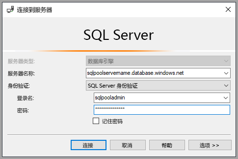
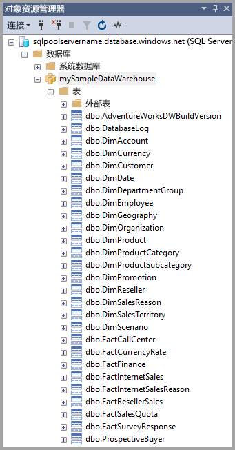

# <a name="quickstart-scale-compute-in-azure-synapse-analytics-using-t-sql"></a>快速入门：使用 T-SQL 缩放 Azure Synapse Analytics 中的计算

使用 T-SQL 和 SQL Server Management Studio (SSMS) 缩放 Azure Synapse Analytics（以前称为 SQL DW）中的计算。 [横向扩展计算](sql-data-warehouse-manage-compute-overview.md)以提高性能或按比例缩减计算以节约成本。 

如果没有 Azure 订阅，请在开始之前创建一个[免费](https://azure.microsoft.com/free/)帐户。

## <a name="before-you-begin"></a>开始之前

下载并安装最新版本的 [SQL Server Management Studio](/sql/ssms/download-sql-server-management-studio-ssms) (SSMS)。
 
## <a name="create-a-data-warehouse"></a>创建数据仓库

使用[创建并连接 - 门户](create-data-warehouse-portal.md)创建名为“mySampleDataWarehouse”的数据仓库  。 完成此快速入门，以确保获得防火墙规则并可以从 SQL Server Management Studio 中连接到数据仓库。

## <a name="connect-to-the-server-as-server-admin"></a>以服务器管理员的身份连接到服务器

本部分使用 [SQL Server Management Studio](/sql/ssms/download-sql-server-management-studio-ssms) (SSMS) 来建立与 Azure SQL Server 的连接。

1. 打开 SQL Server Management Studio。

2. 在“连接到服务器”对话框中，输入以下信息： 

   | 设置       | 建议的值 | 说明 | 
   | ------------ | ------------------ | ------------------------------------------------- | 
   | 服务器类型 | 数据库引擎 | 此值是必需的 |
   | 服务器名称 | 完全限定的服务器名称 | 这里有一个示例：**mySampleDataWarehouseservername.database.windows.net**。 |
   | 身份验证 | SQL Server 身份验证 | SQL 身份验证是本教程中配置的唯一身份验证类型。 |
   | 登录 | 服务器管理员帐户 | 在创建服务器时指定的帐户。 |
   | 密码 | 服务器管理员帐户的密码 | 创建服务器时指定的密码。 |

    

3. 单击“连接”  。 对象资源管理器窗口在 SSMS 中打开。

4. 在“对象资源管理器”中，展开“数据库”  。 然后展开“mySampleDataWarehouse”  ，查看新数据库中的对象。

    

## <a name="view-service-objective"></a>查看服务目标
服务目标设置包含的数据仓库的数据仓库单位数。 

若要查看数据仓库当前数据仓库单位：

1. 在与 **mySampleDataWarehouseservername.database.windows.net** 的连接下，展开“系统数据库”  。
2. 右键单击“master”，并单击“新建查询”。   “新建查询”窗口随即打开。
3. 运行以下查询，从 sys.database_service_objectives 动态管理视图中选择。 

    ```sql
    SELECT
        db.name [Database]
    ,   ds.edition [Edition]
    ,   ds.service_objective [Service Objective]
    FROM
        sys.database_service_objectives ds
    JOIN
        sys.databases db ON ds.database_id = db.database_id
    WHERE 
        db.name = 'mySampleDataWarehouse'
    ```

4. 以下结果显示 **mySampleDataWarehouse** 具有一个 DW400 的服务目标。 

    

## <a name="scale-compute"></a>缩放计算
在 Azure Synapse 中，可以通过调整数据仓库单位来增加或减少计算资源。 [创建和 Connect - 门户](create-data-warehouse-portal.md)创建 **mySampleDataWarehouse** 并初始化 400 DWU。 以下步骤调整为 DWU **mySampleDataWarehouse**。

更改数据仓库单位：

1. 右键单击“master”，并单击“新建查询”。  
2. 使用 [ALTER DATABASE](/sql/t-sql/statements/alter-database-azure-sql-database) T-SQL 语句修改的服务目标。 运行以下查询以将服务目标更改为 DW300。 

    ```Sql
    ALTER DATABASE mySampleDataWarehouse
    MODIFY (SERVICE_OBJECTIVE = 'DW300c');
    ```

## <a name="monitor-scale-change-request"></a>监视规模更改请求
若要查看以前的更改请求的进度，可以使用 `WAITFORDELAY` T-SQL 语法来轮询 sys.dm_operation_status 动态管理视图 (DMV)。

若要轮询服务对象更改状态，请执行以下操作：

1. 右键单击“master”，并单击“新建查询”。  
2. 运行以下查询来轮询 sys.dm_operation_status DMV。

    ```sql
    WHILE 
    (
        SELECT TOP 1 state_desc
        FROM sys.dm_operation_status
        WHERE 
            1=1
            AND resource_type_desc = 'Database'
            AND major_resource_id = 'mySampleDataWarehouse'
            AND operation = 'ALTER DATABASE'
        ORDER BY
            start_time DESC
    ) = 'IN_PROGRESS'
    BEGIN
        RAISERROR('Scale operation in progress',0,0) WITH NOWAIT;
        WAITFOR DELAY '00:00:05';
    END
    PRINT 'Complete';
    ```
3. 生成的输出显示了状态轮询的日志。

    

## <a name="check-data-warehouse-state"></a>检查数据仓库状态

数据仓库暂停时，无法使用 T-SQL 连接到数据仓库。 若要查看数据仓库的当前状态，可使用 PowerShell cmdlet。 有关示例，请参阅[检查数据仓库状态 - PowerShell](quickstart-scale-compute-powershell.md#check-data-warehouse-state)。 

## <a name="check-operation-status"></a>检查操作状态

若要返回有关 Azure Synapse 上各种管理操作的信息，请针对 [sys.dm_operation_status](/sql/relational-databases/system-dynamic-management-views/sys-dm-operation-status-azure-sql-database) DMV 运行以下查询。 例如，它返回操作和操作状态，后者为 IN_PROGRESS 或 COMPLETED。

```sql
SELECT *
FROM
    sys.dm_operation_status
WHERE
    resource_type_desc = 'Database'
AND 
    major_resource_id = 'mySampleDataWarehouse'
```


## <a name="next-steps"></a>后续步骤
你现在已了解如何缩放数据仓库的计算。 若要详细了解 Azure Synapse，请继续阅读有关加载数据的教程。

> [!div class="nextstepaction"]
>[将数据加载到 Azure Synapse Analytics 中](load-data-from-azure-blob-storage-using-polybase.md)
