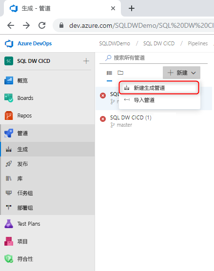
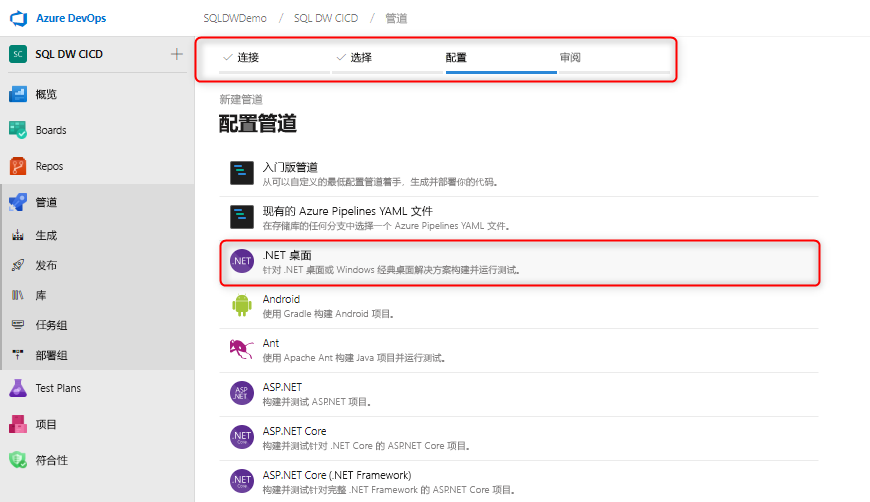
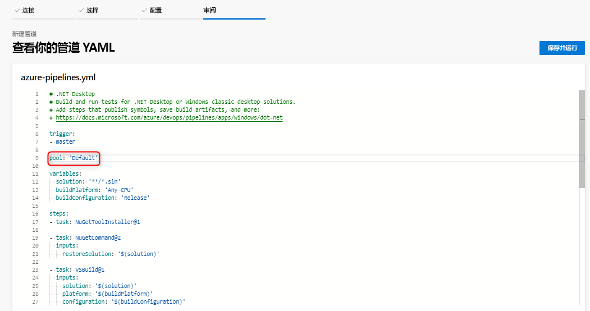
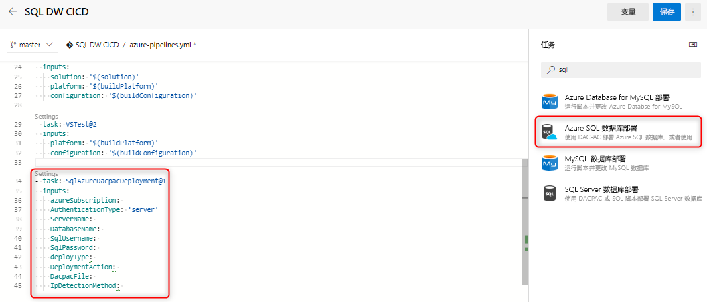
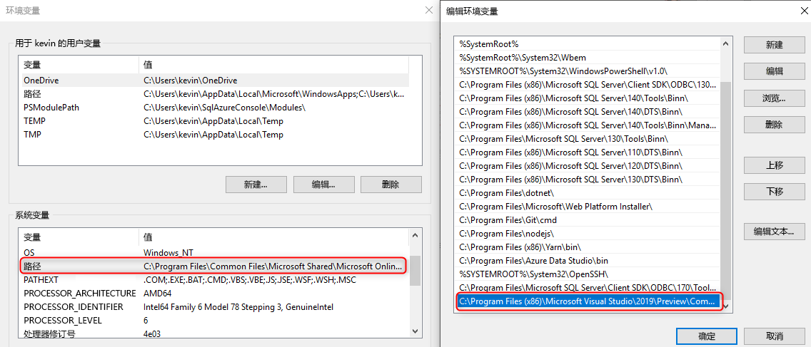

# 适用于 Azure SQL 数据仓库的持续集成和部署

本简易教程概述如何将 SQL Server Data Tools (SSDT) 数据库项目集成到 Azure DevOps，并利用 Azure Pipelines 来设置持续集成和部署。 本教程是有关使用 SQL 数据仓库构建持续集成和部署管道的第二个步骤。 

## 开始之前

- 阅读[源代码管理集成教程](https://docs.microsoft.com/azure/sql-data-warehouse/sql-data-warehouse-source-control-integration)

- 创建一个[自托管代理](https://docs.microsoft.com/azure/devops/pipelines/agents/agents?view=azure-devops#install)，其中包含针对 SQL 数据仓库（预览版）安装的 SSDT 预览版软件（16.3 预览版 2 和更高版本）

- 设置并连接到 Azure DevOps

  > [!NOTE]
  > SSDT 目前为预览版，在其中需要利用自托管代理。 在接下来的几个月，Microsoft 托管代理将会更新。

## 使用 Visual Studio 生成实现持续集成

1. 导航到 Azure Pipelines 并创建新的生成管道

      

2. 选择源代码存储库 (Azure Repos Git)，然后选择 .NET Desktop 应用模板

       

3. 编辑 YAML 文件，以使用适当的代理池。 YAML 文件应如下所示：

      

现已创建一个简单的环境，在其中，只要签入到源代码管理存储库主分支，就会自动触发数据库项目的成功 Visual Studio 生成。 通过在本地数据库项目中做出更改并将该项更改签入到主分支，来验证自动化是否能够自始至终正常运行。

## 使用 Azure SQL 数据库部署任务实现持续部署

1. 使用 [Azure SQL 数据库部署任务](https://docs.microsoft.com/azure/devops/pipelines/tasks/deploy/sql-azure-dacpac-deployment?view=azure-devops)添加一个新任务，并填写必填字段以连接到目标数据仓库。 当此任务运行时，上一生成过程生成的 DACPAC 将部署到目标数据仓库。

      

2. 使用自托管代理时，请确保将环境变量设置为对 SQL 数据仓库使用正确的 SqlPackage.exe。 路径应如下所示：

      

   C:\Program Files (x86)\Microsoft Visual Studio\2019\Preview\Common7\IDE\Extensions\Microsoft\SQLDB\DAC\150  

   运行并验证管道。 可以在本地进行更改，然后将更改签入到应生成自动生成和部署项目的源代码管理。

## 后续步骤

- 探索 [Azure SQL 数据仓库体系结构](/azure/sql-data-warehouse/massively-parallel-processing-mpp-architecture)
- 快速[创建 SQL 数据仓库][create a SQL Data Warehouse]
- [加载示例数据][load sample data]
- 浏览[视频](/azure/sql-data-warehouse/sql-data-warehouse-videos)

<!--Image references-->

[1]: ./media/sql-data-warehouse-overview-what-is/dwarchitecture.png

<!--Article references-->
[Create a support ticket]: ./sql-data-warehouse-get-started-create-support-ticket.md
[load sample data]: ./sql-data-warehouse-load-sample-databases.md
[create a SQL Data Warehouse]: ./sql-data-warehouse-get-started-provision.md
[Migration documentation]: ./sql-data-warehouse-overview-migrate.md
[SQL Data Warehouse solution partners]: ./sql-data-warehouse-partner-business-intelligence.md
[Integrated tools overview]: ./sql-data-warehouse-overview-integrate.md
[Backup and restore overview]: ./sql-data-warehouse-restore-database-overview.md
[Azure glossary]: ../azure-glossary-cloud-terminology.md

<!--MSDN references-->

<!--Other Web references-->
[Blogs]: https://azure.microsoft.com/blog/tag/azure-sql-data-warehouse/
[Customer Advisory Team blogs]: https://blogs.msdn.microsoft.com/sqlcat/tag/sql-dw/
[Feature requests]: https://feedback.azure.com/forums/307516-sql-data-warehouse
[MSDN forum]: https://social.msdn.microsoft.com/Forums/azure/home?forum=AzureSQLDataWarehouse
[Stack Overflow forum]: https://stackoverflow.com/questions/tagged/azure-sqldw
[Twitter]: https://twitter.com/hashtag/SQLDW
[Videos]: https://azure.microsoft.com/documentation/videos/index/?services=sql-data-warehouse
[SLA for SQL Data Warehouse]: https://azure.microsoft.com/support/legal/sla/sql-data-warehouse/v1_0/
[Volume Licensing]: https://www.microsoftvolumelicensing.com/DocumentSearch.aspx?Mode=3&DocumentTypeId=37
[Service Level Agreements]: https://azure.microsoft.com/support/legal/sla/
