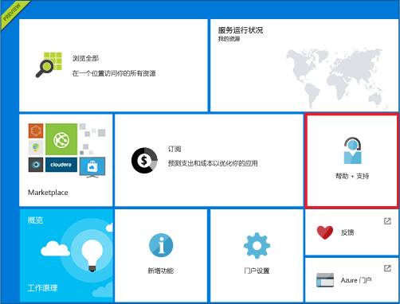
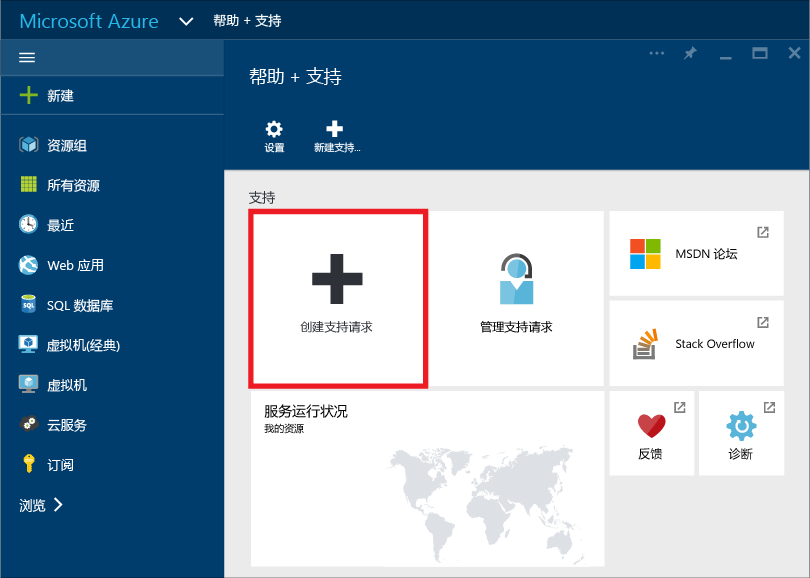
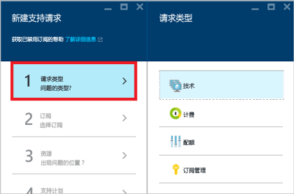
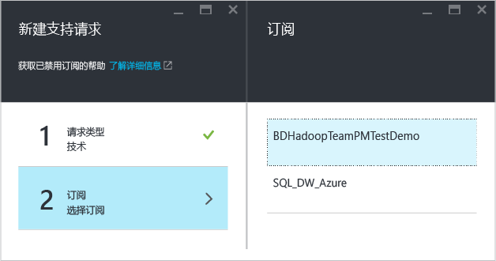
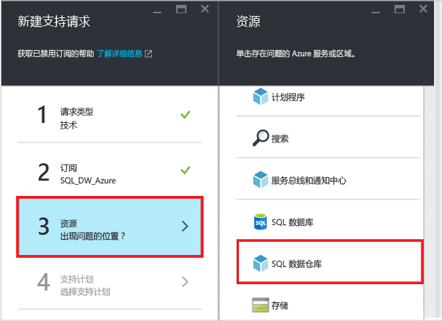
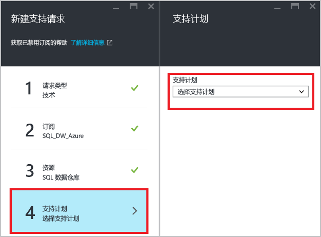
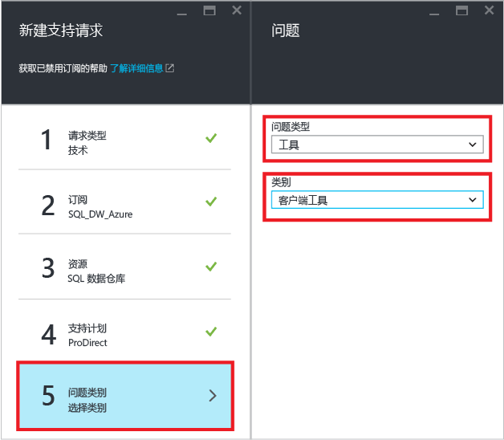
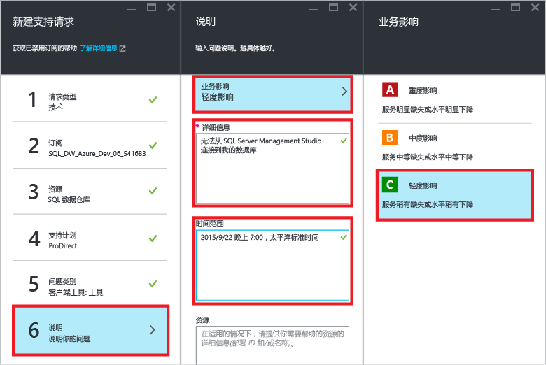
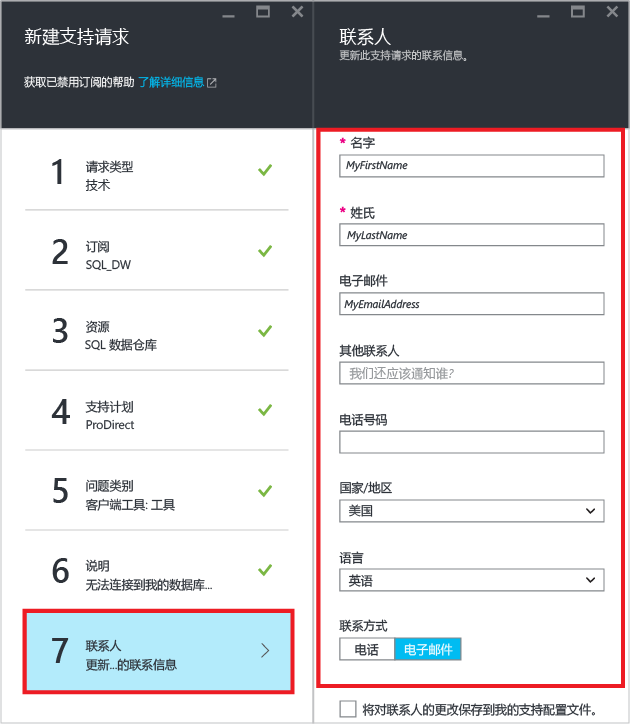

<properties
   pageTitle="如何创建 SQL 数据仓库的支持票证 | Microsoft Azure"
   description="如何在 SQL 数据仓库中创建支持票证。"
   services="sql-data-warehouse"
   documentationCenter="NA"
   authors="sonyam"
   manager="barbkess"
   editor=""/>

<tags
   ms.service="sql-data-warehouse"
   ms.devlang="NA"
   ms.topic="get-started-article"
   ms.tgt_pltfrm="NA"
   ms.workload="data-services"
   ms.date="09/01/2016"
   ms.author="sonyama;barbkess"/>

# 如何创建 SQL 数据仓库的支持票证
 
如果你在 SQL 数据仓库方面遇到任何问题，请创建支持票证，以便我们的工程团队可提供帮助。

## 创建支持票证

1. 打开 [Azure 门户][]。

2. 在“主页”屏幕上，单击“帮助 + 支持”磁贴。

    

3. 在“帮助 + 支持”边栏选项卡上，单击“创建支持请求”。

    
    
    <a name="request-quota-change">

4. 选择“请求类型”。

      

    
    >[AZURE.NOTE]  默认情况下，每个 SQL server (例如 myserver.database.windows.net) 具有 45,000 的 **DTU 配额**。此配额仅仅只是安全限制。可以通过创建支持票证并选择“配额”作为请求类型来增加配额。若要计算 DTU 需求，请将所需的 [DWU][] 总数乘以 7.5。例如，如果想要在一个 SQL Server 上托管两个 DW6000，应请求 90,000 的 DTU 配额。您可以在门户中的 SQL server 边栏选项卡中查看您当前的 DTU 消耗量。已暂停和未暂停的数据库都计入 DTU 配额。

5. 选择发生了您要报告其问题的数据库所在的**订阅**。

    

6. 选择“SQL 数据仓库”作为资源。

    

7. 选择您的 [Azure 支持计划][]。

    - **计费、配额和订阅管理**支持可用于所有支持级别。
    - **故障维修服务**支持通过[开发人员支持][]、[标准支持][]、[专业直接支持][]或[顶级支持][]提供。故障维修服务问题是客户在使用 Azure 时遇到的确定是由 Microsoft 引起的问题。
    - 我们在[专业直接][]和[顶级][]支持级别提供**开发人员辅导**与**咨询服务**。
    
    如果你购买了顶级支持计划，则还可以在 [Microsoft Premier 在线门户][]中报告 SQL 数据仓库的相关问题。若要深入了解各种支持计划（包括范围、响应时间、定价等），请参阅 [Azure 支持计划][Azure support plan]。有关 Azure 支持的常见问题，请参阅 [Azure 支持常见问题][]。

    

8. 选择“问题类型”和“类别”。

    

9. 描述问题并选择业务影响级别。

      

10. 系统会在此支持票证中预先填充你的**联系信息**。请根据需要更新这些信息。

    

11. 单击“创建”提交支持请求。

## 监视支持票证

在你提交支持请求后，Azure 支持团队将与你取得联系。若要查看你的请求状态和详细信息，请在仪表板上单击“管理支持请求”。

## 其他资源

此外，可在 [Stack Overflow][] 或 [Azure SQL 数据仓库 MSDN 论坛][]上与 SQL 数据仓库社区互动。

<!--Image references-->
 

<!--Article references--> 
[DWU]: ./sql-data-warehouse-overview-what-is.md#data-warehouse-units

<!--MSDN references--> 

<!--Other web references--> 
[Azure 门户]: https://portal.azure.com/
[Azure support plan]: https://azure.microsoft.com/support/plans/?WT.mc_id=Support_Plan_510979/
[Azure 支持计划]: https://azure.microsoft.com/support/plans/?WT.mc_id=Support_Plan_510979/
[开发人员支持]: https://azure.microsoft.com/support/plans/developer/
[标准支持]: https://azure.microsoft.com/support/plans/standard/
[专业直接]: https://azure.microsoft.com/support/plans/prodirect/
[专业直接支持]: https://azure.microsoft.com/support/plans/prodirect/
[顶级]: https://azure.microsoft.com/support/plans/premier/
[顶级支持]: https://azure.microsoft.com/support/plans/premier/
[Azure 支持常见问题]: https://azure.microsoft.com/support/faq/
[Microsoft Premier 在线门户]: https://premier.microsoft.com/
[Stack Overflow]: https://stackoverflow.com/questions/tagged/azure-sqldw/
[Azure SQL 数据仓库 MSDN 论坛]: https://social.msdn.microsoft.com/Forums/home?forum=AzureSQLDataWarehouse/

<!---HONumber=AcomDC_0921_2016-->