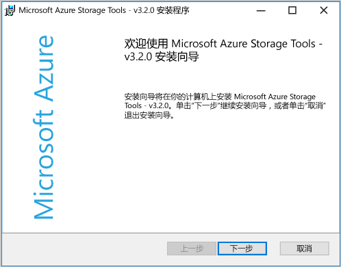
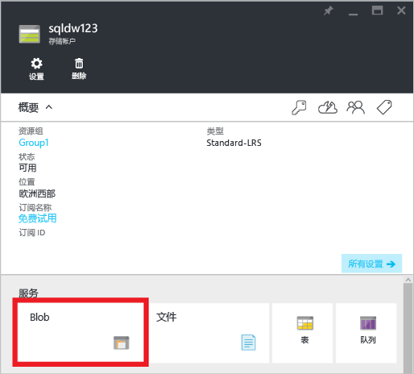
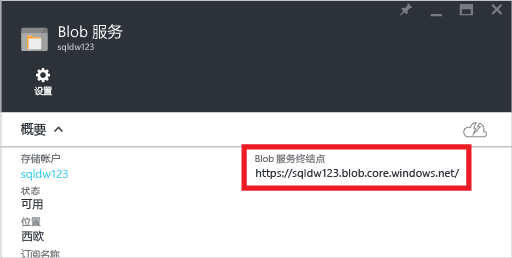
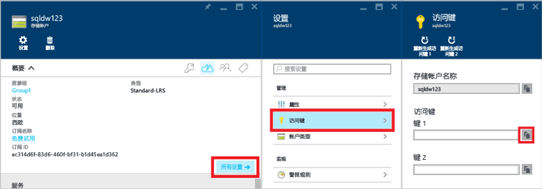
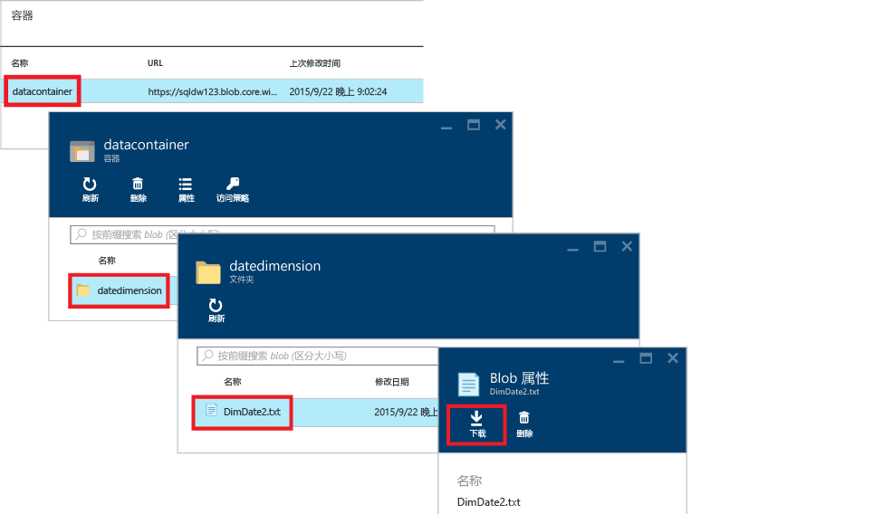
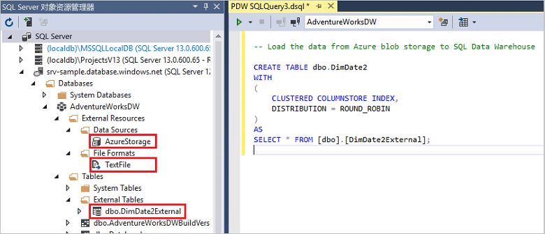

# <a name="load-data-with-polybase-in-sql-data-warehouse"></a>在 SQL 数据仓库中使用 PolyBase 加载数据
> [!div class="op_single_selector"]
> * [Redgate](sql-data-warehouse-load-with-redgate.md)  
> * [Data Factory](sql-data-warehouse-get-started-load-with-azure-data-factory.md)  
> * [PolyBase](sql-data-warehouse-get-started-load-with-polybase.md)  
> * [BCP](sql-data-warehouse-load-with-bcp.md)
> 
> 

本教程说明如何使用 AzCopy 和 PolyBase 将数据载入 SQL 数据仓库。 完成后，将了解如何：

* 使用 AzCopy 将数据复制到 Azure Blob 存储
* 创建数据库对象以定义数据
* 运行 T-SQL 查询以加载数据

> [!VIDEO https://channel9.msdn.com/Blogs/Azure/Loading-data-with-PolyBase-in-Azure-SQL-Data-Warehouse/player]
> 
> 

## <a name="prerequisites"></a>先决条件
要逐步完成本教程中，需要：

* 一个 SQL 数据仓库数据库。
* 一个标准本地冗余存储 (Standard-LRS)、标准异地冗余存储 (Standard-GRS) 或标准读取访问权限异地冗余存储 (Standard-RAGRS) 类型的 Azure 存储帐户。
* AzCopy 命令行实用程序。 下载并安装 Microsoft Azure 存储工具随附的 [最新版本的 AzCopy][latest version of AzCopy]。
  
    

## <a name="step-1-add-sample-data-to-azure-blob-storage"></a>步骤 1：将示例数据添加到 Azure Blob 存储
为了加载数据，我们需要将一些示例数据放入 Azure Blob 存储。 在此步骤中，我们会将示例数据填入 Azure 存储 Blob。 稍后我们会使用 PolyBase 将这些示例数据载入 SQL 数据仓库数据库。

### <a name="a-prepare-a-sample-text-file"></a>A. 准备一个示例文本文件
若要准备示例文本文件，请执行以下操作：

1. 打开记事本并将以下数据行复制到一个新文件。 将此文件保存到本地临时目录，路径为 %temp%\DimDate2.txt。

```
20150301,1,3
20150501,2,4
20151001,4,2
20150201,1,3
20151201,4,2
20150801,3,1
20150601,2,4
20151101,4,2
20150401,2,4
20150701,3,1
20150901,3,1
20150101,1,3
```

### <a name="b-find-your-blob-service-endpoint"></a>B. 查找 Blob 服务终结点
要查找 Blob 服务终结点，请执行以下操作：

1. 在 Azure 门户中，选择“浏览” > “存储帐户”。
2. 单击要使用的存储帐户。
3. 在“存储帐户”边栏选项卡中，单击“Blob”
   
    
4. 保存 Blob 服务终结点供稍后使用。
   
    

### <a name="c-find-your-azure-storage-key"></a>C. 查找 Azure 存储密钥
要查找 Azure 存储密钥，请执行以下操作：

1. 在 Azure 门户中，选择“浏览” > “存储帐户”。
2. 单击要使用的存储帐户。
3. 选择“所有设置” > “访问密钥”。
4. 单击复制框，将访问密钥之一复制到剪贴板。
   
    

### <a name="d-copy-the-sample-file-to-azure-blob-storage"></a>D. 将示例文件复制到 Azure Blob 存储
要将数据复制到 Azure Blob 存储，请执行以下操作：

1. 打开命令提示符，然后将目录切换到 AzCopy 安装目录。 此命令可你将切换到 64 位 Windows 客户端上的默认安装目录。
   
    ```
    cd /d "%ProgramFiles(x86)%\Microsoft SDKs\Azure\AzCopy"
    ```
2. 运行以下命令以上传该文件。 指定 <blob service endpoint URL> 的 BLOB 服务终结点 URL，以及 <azure_storage_account_key> 的 Azure 存储帐户密钥。
   
    ```
    .\AzCopy.exe /Source:C:\Temp\ /Dest:<blob service endpoint URL> /datacontainer/datedimension/ /DestKey:<azure_storage_account_key> /Pattern:DimDate2.txt
    ```

另请参阅 [AzCopy 命令行实用工具入门][Getting Started with the AzCopy Command-Line Utility]。

### <a name="e-explore-your-blob-storage-container"></a>E. 浏览 Blob 存储容器
若要查看已上传到 Blob 存储的文件，请执行以下操作：

1. 返回 Blob 服务边栏选项卡。
2. 在“容器”下，双击“datacontainer”。
3. 要浏览数据的路径，请单击文件夹 **datedimension**，然后将看到已上传的文件 **DimDate2.txt**。
4. 若要查看属性，请单击“DimDate2.txt”。
5. 请注意，在 Blob 属性边栏选项卡中，可以下载或删除该文件。
   
    

## <a name="step-2-create-an-external-table-for-the-sample-data"></a>步骤 2：为示例数据创建外部表
在本部分，我们将创建一个用于定义示例数据的外部表。

PolyBase 使用外部表来访问 Azure Blob 存储中的数据。 由于数据不是存储在 SQL 数据仓库中，PolyBase 将使用数据库范围的凭据来处理对外部数据的身份验证。

本步骤中的示例使用这些 Transact-SQL 语句来创建外部表。

* [Create Master Key (Transact-SQL)][Create Master Key (Transact-SQL)]：加密数据库范围凭据的机密。
* [Create Database Scoped Credential (Transact-SQL)][Create Database Scoped Credential (Transact-SQL)]：指定 Azure 存储帐户的身份验证信息。
* [Create External Data Source (Transact-SQL)][Create External Data Source (Transact-SQL)]：指定 Azure Blob 存储的位置。
* [Create External File Format (Transact-SQL)][Create External File Format (Transact-SQL)]：指定数据的格式。
* [Create External Table (Transact-SQL)][Create External Table (Transact-SQL)]：指定表定义和数据的位置。

请针对 SQL 数据仓库数据库运行此查询。 它会在 dbo 架构中创建指向 Azure Blob 存储中 DimDate2.txt 示例数据的、名为 DimDate2External 的外部表。

```sql
-- A: Create a master key.
-- Only necessary if one does not already exist.
-- Required to encrypt the credential secret in the next step.

CREATE MASTER KEY;


-- B: Create a database scoped credential
-- IDENTITY: Provide any string, it is not used for authentication to Azure storage.
-- SECRET: Provide your Azure storage account key.


CREATE DATABASE SCOPED CREDENTIAL AzureStorageCredential
WITH
    IDENTITY = 'user',
    SECRET = '<azure_storage_account_key>'
;


-- C: Create an external data source
-- TYPE: HADOOP - PolyBase uses Hadoop APIs to access data in Azure blob storage.
-- LOCATION: Provide Azure storage account name and blob container name.
-- CREDENTIAL: Provide the credential created in the previous step.

CREATE EXTERNAL DATA SOURCE AzureStorage
WITH (
    TYPE = HADOOP,
    LOCATION = 'wasbs://<blob_container_name>@<azure_storage_account_name>.blob.core.windows.net',
    CREDENTIAL = AzureStorageCredential
);


-- D: Create an external file format
-- FORMAT_TYPE: Type of file format in Azure storage (supported: DELIMITEDTEXT, RCFILE, ORC, PARQUET).
-- FORMAT_OPTIONS: Specify field terminator, string delimiter, date format etc. for delimited text files.
-- Specify DATA_COMPRESSION method if data is compressed.

CREATE EXTERNAL FILE FORMAT TextFile
WITH (
    FORMAT_TYPE = DelimitedText,
    FORMAT_OPTIONS (FIELD_TERMINATOR = ',')
);


-- E: Create the external table
-- Specify column names and data types. This needs to match the data in the sample file.
-- LOCATION: Specify path to file or directory that contains the data (relative to the blob container).
-- To point to all files under the blob container, use LOCATION='.'

CREATE EXTERNAL TABLE dbo.DimDate2External (
    DateId INT NOT NULL,
    CalendarQuarter TINYINT NOT NULL,
    FiscalQuarter TINYINT NOT NULL
)
WITH (
    LOCATION='/datedimension/',
    DATA_SOURCE=AzureStorage,
    FILE_FORMAT=TextFile
);


-- Run a query on the external table

SELECT count(*) FROM dbo.DimDate2External;

```


在 Visual Studio 的 SQL Server 对象资源管理器中，可以看到外部文件格式、外部数据源和 DimDate2External 表。



## <a name="step-3-load-data-into-sql-data-warehouse"></a>步骤 3：将数据载入 SQL 数据仓库
创建外部表后，可以将数据载入新表，或将其插入到现有表。

* 要将数据载入新表，请运行 [CREATE TABLE AS SELECT (Transact-SQL)][CREATE TABLE AS SELECT (Transact-SQL)] 语句。 新表将包含查询中指定的列。 列的数据类型将与外部表定义中的数据类型匹配。
* 要将数据载入现有表，请使用 [INSERT...SELECT (Transact-SQL)][INSERT...SELECT (Transact-SQL)] 语句。

```sql
-- Load the data from Azure blob storage to SQL Data Warehouse

CREATE TABLE dbo.DimDate2
WITH
(   
    CLUSTERED COLUMNSTORE INDEX,
    DISTRIBUTION = ROUND_ROBIN
)
AS
SELECT * FROM [dbo].[DimDate2External];
```

## <a name="step-4-create-statistics-on-your-newly-loaded-data"></a>步骤 4：基于新加载的数据创建统计信息
SQL 数据仓库不会自动创建或自动更新统计信息。 因此，若要实现较高的查询性能，必须在首次加载后基于每个表的每个列创建统计信息。 此外，在对数据做出重大更改后，必须更新统计信息。

本示例将基于新的 DimDate2 表创建单列统计信息。

```sql
CREATE STATISTICS [DateId] on [DimDate2] ([DateId]);
CREATE STATISTICS [CalendarQuarter] on [DimDate2] ([CalendarQuarter]);
CREATE STATISTICS [FiscalQuarter] on [DimDate2] ([FiscalQuarter]);
```

若要了解详细信息，请参阅 [统计信息][Statistics]。  

## <a name="next-steps"></a>后续步骤
有关在开发使用 PolyBase 的解决方案时应了解的其他信息，请参阅 [PolyBase 指南][PolyBase guide]。

<!--Image references-->


<!--Article references-->
[PolyBase in SQL Data Warehouse Tutorial]: ./sql-data-warehouse-get-started-load-with-polybase.md
[Load data with bcp]: ./sql-data-warehouse-load-with-bcp.md
[Statistics]: ./sql-data-warehouse-tables-statistics.md
[PolyBase guide]: ./sql-data-warehouse-load-polybase-guide.md
[Getting Started with the AzCopy Command-Line Utility]:../storage/common/storage-use-azcopy.md
[latest version of AzCopy]:../storage/common/storage-use-azcopy.md

<!--External references-->
[supported source/sink]: https://msdn.microsoft.com/library/dn894007.aspx
[copy activity]: https://msdn.microsoft.com/library/dn835035.aspx
[SQL Server destination adapter]: https://msdn.microsoft.com/library/ms141095.aspx
[SSIS]: https://msdn.microsoft.com/library/ms141026.aspx


[CREATE EXTERNAL DATA SOURCE (Transact-SQL)]:https://msdn.microsoft.com/library/dn935022.aspx
[CREATE EXTERNAL FILE FORMAT (Transact-SQL)]:https://msdn.microsoft.com/library/dn935026.aspx
[CREATE EXTERNAL TABLE (Transact-SQL)]:https://msdn.microsoft.com/library/dn935021.aspx

[DROP EXTERNAL DATA SOURCE (Transact-SQL)]:https://msdn.microsoft.com/library/mt146367.aspx
[DROP EXTERNAL FILE FORMAT (Transact-SQL)]:https://msdn.microsoft.com/library/mt146379.aspx
[DROP EXTERNAL TABLE (Transact-SQL)]:https://msdn.microsoft.com/library/mt130698.aspx

[CREATE TABLE AS SELECT (Transact-SQL)]:https://msdn.microsoft.com/library/mt204041.aspx
[INSERT...SELECT (Transact-SQL)]:https://msdn.microsoft.com/library/ms174335.aspx
[CREATE MASTER KEY (Transact-SQL)]:https://msdn.microsoft.com/library/ms174382.aspx
[CREATE CREDENTIAL (Transact-SQL)]:https://msdn.microsoft.com/library/ms189522.aspx
[CREATE DATABASE SCOPED CREDENTIAL (Transact-SQL)]:https://msdn.microsoft.com/library/mt270260.aspx
[DROP CREDENTIAL (Transact-SQL)]:https://msdn.microsoft.com/library/ms189450.aspx
