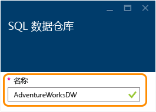
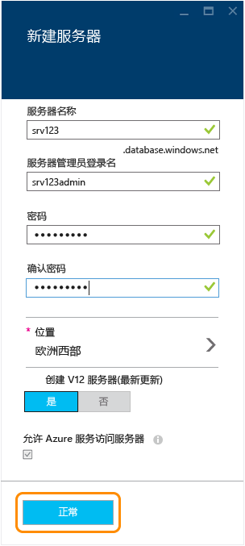
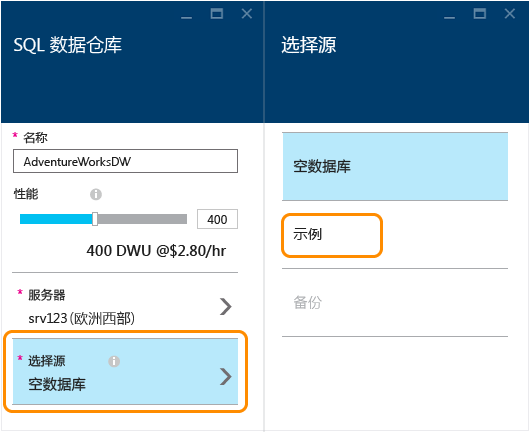
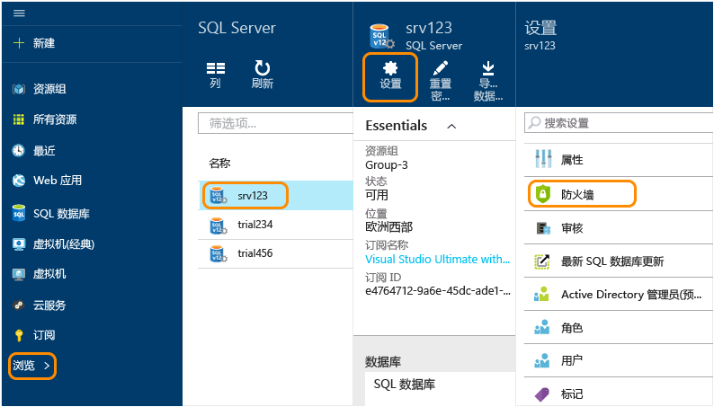
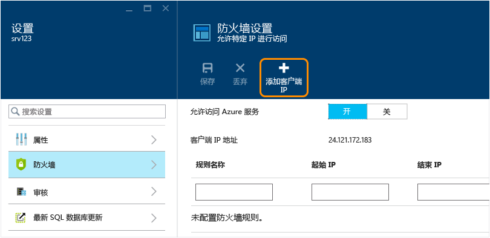
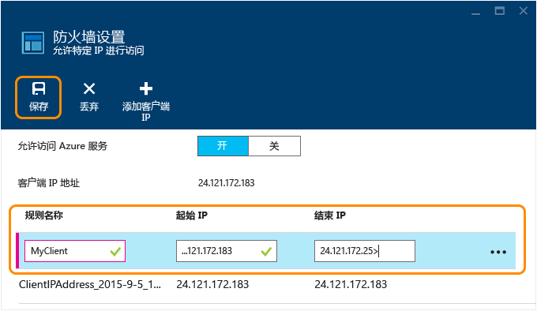

<properties
   pageTitle="在 Azure 门户中创建 SQL 数据仓库数据库 | Azure"
   description="了解如何在 Azure 门户中创建 Azure SQL 数据仓库"
   services="sql-data-warehouse"
   documentationCenter="NA"
   authors="barbkess"
   manager="jhubbard"
   editor=""
   tags="azure-sql-data-warehouse"/>

<tags
   ms.service="sql-data-warehouse"
   ms.date="03/03/2016"
   wacn.date=""/>

# 创建 SQL 数据仓库

> [AZURE.SELECTOR]
- [Azure 门户](sql-data-warehouse-get-started-provision.md)
- [TSQL](sql-data-warehouse-get-started-create-database-tsql.md)
- [PowerShell](sql-data-warehouse-get-started-provision-powershell.md)

本教程演示如何使用 Azure 门户在短短几分钟内创建 Azure SQL 数据仓库数据库。

在本教程中你将：

- 创建用于托管数据库的服务器。
- 创建包含 AdventureWorksDW 示例数据库的数据库。

如果你尝试将现有数据库迁移到 SQL 数据仓库，请参阅[迁移概述](/documentation/articles/sql-data-warehouse-overview-migrate)或使用[迁移实用工具](/documentation/articles/sql-data-warehouse-migrate-migration-utility)。

若要将数据加载到 SQL 数据仓库中，请参阅[加载概述](./sql-data-warehouse-overview-load.md)。

[AZURE.INCLUDE [free-trial-note](../../includes/free-trial-note.md)]

## 步骤 1：登录并开始操作

1. 登录到 [Azure 门户](https://portal.azure.cn)。

2. 单击“新建”>“数据 + 存储”>“SQL 数据仓库”。

    

1. 在“SQL 数据仓库”边栏选项卡中输入数据库名称。在本示例中，我们将数据库命名为 AdventureWorksDW。

    

## 步骤 2：配置并创建服务器

在 SQL 数据库和 SQL 数据仓库中，每个数据库将分配到一个服务器，每个服务器将分配到一个地理位置。该服务器称为逻辑 SQL 服务器。

> [AZURE.NOTE] 逻辑 SQL 服务器：
  >
  > + 提供了在同一地理位置内配置多个数据库的一致方法。
  > + 不是像在本地服务器上那样的物理硬件。它是服务软件的一部分。这就是为什么我们称之为逻辑服务器。
  > + 可以承载多个数据库，而不会影响它们的性能。
  > + 在其名称中使用小写的 s。SQL 服务器 (SQL **s**erver) 是 Azure 逻辑服务器，而 SQL **S**erver 则是 Microsoft 的本地数据库产品。

1. 单击“服务器”>“创建新服务器”。该服务器不收取费用。如果你已有想要使用的 V12 逻辑 SQL 服务器，请选择现有的服务器，然后转到下一步骤。

    

3. 填入**新服务器**信息。

	- **服务器名称**。输入逻辑服务器的名称。这对于各个地理位置而言都是唯一的。
	- **服务器管理员名称**。输入服务器管理员帐户的用户名。
	- **密码**。输入服务器管理员密码。
	- **位置**。选择服务器的地理位置。若要减少数据传输时间，最好将服务器的地理位置定位为靠近此数据库将要访问的其他数据资源。
	- **创建 V12 服务器**。“是”为 SQL 数据仓库的唯一选项。
	- **允许 Azure 服务访问服务器**。对于 SQL 数据仓库始终会选中此选项。

    >[AZURE.NOTE] 请务必将服务器名称、服务器管理员名称和密码存储在某个位置。以后需要使用此信息登录服务器。

1. 单击“确定”以存储逻辑 SQL 服务器配置设置并返回“SQL 数据仓库”边栏选项卡。

    

## 步骤 3：配置并创建数据库

既然你已选择逻辑 SQL 服务器，现已准备好完成数据库的创建。

2. 在“SQL 数据仓库”边栏选项卡中填写剩余的字段。

    

    - **性能**：我们建议从 400 DWU 开始。创建数据库时或者之后，可以往左或往右移动滑块来调整数据库的性能级别。

        > [AZURE.NOTE] SQL 数据仓库以数据仓库单位 (DWU) 度量性能。增加 DWU 时，SQL 数据仓库将为数据库操作增加可用的计算资源。当你运行工作负荷时，可以看到 DWU 与工作负荷性能的关系。
        >
        > 在数据库创建后，可以快速轻松地更改性能级别。例如，如果当前未使用数据库，往左移动滑块可降低成本。或者在需要更多资源时提高性能。如果你不想要产生费用，可以暂停数据库。这就是 SQL 数据仓库的缩放能力。

    - **选择源**。单击“选择源”>“示例”。由于此时只有一个可用的示例数据库，因此当你选择“示例”时，Azure 将在“选择示例”选项中自动填充 AdventureWorksDW。

        

    - **资源组**。可以保留默认值。资源组是一种容器；主要为了帮助管理 Azure 资源集合。了解有关[资源组](../azure-portal/resource-group-portal.md)的详细信息。

    - **订阅**。选择要为此数据库付费的订阅。

1. 单击“创建”以创建 SQL 数据仓库数据库。

1. 等待几分钟，数据库将准备就绪。完成后，将返回到 [Azure 门户](https://portal.azure.com)。可以看到，你的 SQL 数据仓库数据库已添加到仪表板中。

    

## 步骤 4：为客户端 IP 配置服务器防火墙访问权限

若要从当前 IP 地址连接到服务器，请将你的客户端 IP 地址添加到防火墙规则。此步骤说明如何执行该操作。

1. 单击“浏览”>“SQL Server”> 选择你的服务器 >“设置”>“防火墙”。

    

4. 单击“添加客户端 IP”，让 Azure 为客户端 IP 地址创建规则。单击“保存”。

	

1. 使用 IP 地址范围创建防火墙规则。可以现在或稍后执行此操作。

	>[AZURE.IMPORTANT] 你的 IP 地址可能会不定时地更改，你可能需要创建新的防火墙规则，才能访问数据库。为了确保一致的访问，我们建议添加 IP 地址范围。有关详细信息，请参阅[如何配置防火墙设置](../sql-database/sql-database-configure-firewall-settings.md)。

    若要创建规则，请输入名称和 IP 地址范围，然后单击“保存”。

    

配置防火墙后，你可以从桌面连接到刚刚创建的 Azure SQL 数据仓库数据库。

## 后续步骤

为 SQL 数据仓库创建示例数据库后，你便可以[连接](./sql-data-warehouse-get-started-connect.md)到该数据库。

<!---HONumber=Mooncake_0418_2016-->