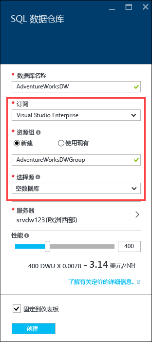
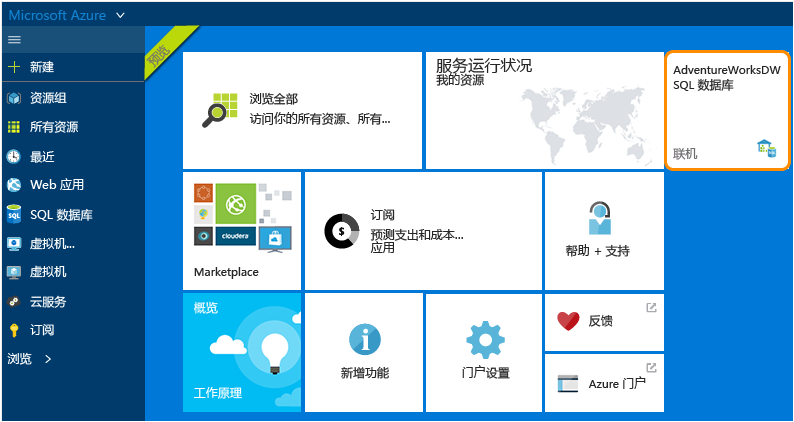

# 创建 Azure SQL 数据仓库
> [!div class="op_single_selector"]
> * [Azure 门户](sql-data-warehouse-get-started-provision.md)
> * [TSQL](sql-data-warehouse-get-started-create-database-tsql.md)
> * [PowerShell](sql-data-warehouse-get-started-provision-powershell.md)
>
>

本教程使用 Azure 门户来创建 SQL 数据仓库包含 AdventureWorksDW 示例数据库。

## 先决条件
若要开始，你需要：

* **Azure 帐户**： 访问[Azure 免费试用版][ Azure Free Trial]或[MSDN Azure 信用额度][ MSDN Azure Credits]创建帐户。
* **Azure SQL server**： 请参阅[使用 Azure 门户创建 Azure SQL 数据库][ Create an Azure SQL database in the Azure portal]有关详细信息。

> [!NOTE]
> 创建 SQL 数据仓库可能会导致新的计费服务。  请参阅[SQL 数据仓库定价][ SQL Data Warehouse pricing]有关详细信息。
>
>

## 创建 SQL 数据仓库
1. 登录到 [Azure 门户](https://portal.azure.com)。
2. 单击**+ 新** > **数据库** > **SQL 数据仓库**。

    
3. 在**SQL 数据仓库**边栏选项卡中，填写信息需要然后按创建以创建。

    

   * **服务器**： 我们建议你先选择你的服务器。  
   * **数据库名称**： 用于引用 SQL 数据仓库的名称。  它必须是唯一的服务器。
   * **性能**： 我们建议从 400 开始[Dwu][DWU]。 可以将滑块移到左侧或右侧以调整的性能数据仓库，或者在创建后进行扩展或缩减。  若要了解有关 Dwu 的详细信息，请参阅我们的文档上[缩放](sql-data-warehouse-manage-compute-overview.md)或我们[定价页][SQL Data Warehouse pricing]。
   * **订阅**： 选择[订阅]，此 SQL 数据仓库将开单。
   * **资源组**:[资源组][ Resource group]是旨在帮助你管理的 Azure 资源的集合的容器。 详细了解[资源组](../azure-resource-manager/resource-group-overview.md)。
   * **选择源**： 单击**选择源** > **示例**。 Azure 将自动填充**选择示例**adventureworksdw 的选项。

   > [!NOTE]
   > SQL 数据仓库的默认排序规则是 SQL_Latin1_General_CP1_CI_AS。 如果需要不同的排序规则，则[T-SQL] [ T-SQL]可以用于创建具有不同的排序规则的数据库。
   >
   >

1. 单击**创建**创建 SQL 数据仓库。
2. 请稍等几分钟。 准备您的数据仓库时，你应会返回到[Azure 门户](https://portal.azure.com)。 您可以在你的仪表板，列出在你的 SQL 数据库，或你用来创建它的资源组中找到 SQL 数据仓库。

    

[!INCLUDE [SQL Database create server](../../includes/sql-database-create-new-server-firewall-portal.md)]

## 后续步骤
既然你已经创建 SQL 数据仓库，你就到[连接](sql-data-warehouse-connect-overview.md)并开始查询。

若要将数据载入 SQL 数据仓库，请参阅[加载概述](sql-data-warehouse-overview-load.md)。

如果你正在尝试将现有数据库迁移到 SQL 数据仓库，请参阅[迁移概述](sql-data-warehouse-overview-migrate.md)或使用[迁移实用工具](sql-data-warehouse-migrate-migration-utility.md)。

此外可以使用 TRANSACT-SQL 配置防火墙规则。 有关详细信息，请参阅[sp_set_firewall_rule] [ sp_set_firewall_rule]和[sp_set_database_firewall_rule][sp_set_database_firewall_rule]。

它也是一个好主意一下[最佳实践][Best practices]。

<!--Article references-->
[Create an Azure SQL database in the Azure portal]: ../sql-database/sql-database-get-started.md
[Create an Azure SQL database with PowerShell]: ../sql-database/sql-database-create-and-configure-database-powershell
[resource groups]: ../azure-resource-manager/resource-group-template-deploy-portal.md
[Best practices]: sql-data-warehouse-best-practices.md
[DWU]: sql-data-warehouse-overview-what-is.md
[订阅]: ../azure-glossary-cloud-terminology.md#subscription
[resource group]: ../azure-glossary-cloud-terminology.md#resource-group
[T-SQL]: ./sql-data-warehouse-get-started-create-database-tsql.md

<!--MSDN references-->
[sp_set_firewall_rule]: https://msdn.microsoft.com/library/dn270017.aspx
[sp_set_database_firewall_rule]: https://msdn.microsoft.com/library/dn270010.aspx

<!--Other Web references-->
[SQL Data Warehouse pricing]: https://azure.microsoft.com/pricing/details/sql-data-warehouse/
[Azure Free Trial]: https://azure.microsoft.com/pricing/free-trial/?WT.mc_id=A261C142F
[MSDN Azure Credits]: https://azure.microsoft.com/pricing/member-offers/msdn-benefits-details/?WT.mc_id=A261C142F
