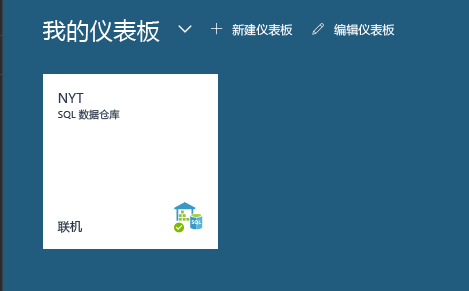
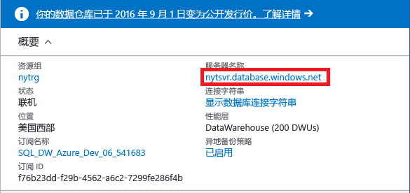
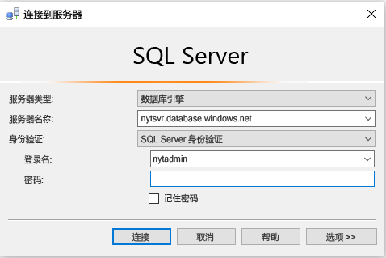
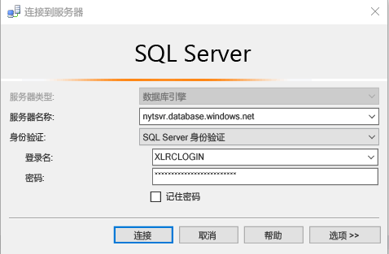
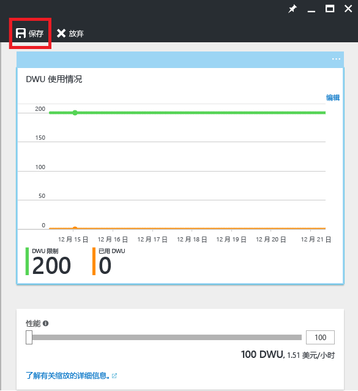

# <a name="get-started-with-sql-data-warehouse"></a>SQL 数据仓库入门

本教程介绍如何预配 Azure SQL 数据仓库并在其中载入数据， 此外，包含有关缩放、暂停和优化的基础知识。 完成本教程后，读者便可以查询和浏览数据仓库。

**估计完成时间：**如果满足先决条件，完成这篇包含示例代码的端到端教程大约需要 30 分钟时间。 

## <a name="prerequisites"></a>先决条件

本教程假设读者熟悉 SQL 数据仓库的基本概念。 如需相关的介绍，请参阅[什么是 SQL 数据仓库？](sql-data-warehouse-overview-what-is.md) 

### <a name="sign-up-for-microsoft-azure"></a>注册 Microsoft Azure
如果没有 Microsoft Azure 帐户，需要注册一个帐户才能使用此服务。 如果已有帐户，则可以跳过此步骤。 

1. 导航到帐户页 [https://azure.microsoft.com/account/](https://azure.microsoft.com/account/)
2. 创建免费 Azure 帐户，或购买一个帐户。
3. 遵照说明操作

### <a name="install-appropriate-sql-client-drivers-and-tools"></a>安装相应的 SQL 客户端驱动程序和工具

大多数 SQL 客户端工具可以使用 JDBC、ODBC 或 ADO.NET 连接到 SQL 数据仓库。 由于 SQL 数据仓库支持大量的 T-SQL 功能，某些客户端应用程序无法与 SQL 数据仓库完全兼容。

如果运行的是 Windows 操作系统，我们建议使用 [Visual Studio] 或 [SQL Server Management Studio]。

[!INCLUDE [Create a new logical server](../../includes/sql-data-warehouse-create-logical-server.md)] 

[!INCLUDE [SQL Database create server](../../includes/sql-database-create-new-server-firewall-portal.md)]

## <a name="create-a-sql-data-warehouse"></a>创建 SQL 数据仓库

SQL 数据仓库是旨在执行大规模并行处理的一种特殊类型的数据库。 该数据库分布在多个节点上，可并行处理查询。 SQL 数据仓库有一个控制节点，该节点协调所有节点的活动。 节点本身使用 SQL 数据库来管理数据。  

> [!NOTE]
> 创建 SQL 数据仓库可能会导致新的计费服务。  有关详细信息，请参阅 [Azure SQL 数据仓库定价](https://azure.microsoft.com/pricing/details/sql-data-warehouse/)。
>

### <a name="create-a-data-warehouse"></a>创建数据仓库

1. 登录到 [Azure 门户](https://portal.azure.com)。
2. 单击“新建” > “数据库” > “SQL 数据仓库”。

     

3. 填写部署详细信息

    **数据库名称**：填写所需的任何名称。 如果有多个数据仓库，我们建议在名称中包含区域、环境等详细信息，例如 *mydw-westus-1-test*。

    **订阅**：Azure 订阅

    **资源组**：创建资源组，或使用现有的资源组。
    > [!NOTE]
    > 资源组可用于资源管理，例如，指定访问控制和模板化部署的范围。 在[此处](https://docs.microsoft.com/azure/azure-resource-manager/resource-group-overview#resource-groups)阅读有关 Azure 资源组的详细信息。

    **源**：空白数据库

    **服务器**：选择在[先决条件]部分中创建的服务器。

    **排序规则**：保留默认的排序规则 SQL_Latin1_General_CP1_CI_AS。

    **选择性能**：建议从标准的 400DWU 着手。

4. 选择“固定到仪表板”

5. 请稍候片刻，等待数据仓库部署完成！ 在正常情况下，完成此过程需要几分钟时间。 当数据仓库可供使用时，门户会发出通知。 

## <a name="connect-to-sql-data-warehouse"></a>连接到 SQL 数据仓库

本教程使用 SQL Server Management Studio (SSMS) 连接到数据仓库。 可以通过以下受支持的连接器连接到 SQL 数据仓库：ADO.NET、JDBC、ODBC 和 PHP。 请记住，如果使用 Microsoft 不支持的工具，功能可能会受到限制。


### <a name="get-connection-information"></a>获取连接信息

若要连接到数据仓库，需要通过在[先决条件]部分中创建的逻辑 SQL 服务器进行连接。

1. 从仪表板中选择数据仓库，或者在资源中搜索。

    

2. 查找逻辑 SQL 服务器的完整名称。

    

3. 打开 SSMS，使用对象资源管理器通过在[先决条件]部分中创建的服务器管理员凭据连接到此服务器

    

如果一切正常，应会立即连接到逻辑 SQL 服务器。 由于是以服务器管理员身份登录的，因此可以连接到该服务器托管的任何数据库，包括 master 数据库。 

只有一个服务器管理员帐户，该帐户拥有任何用户的大部分权限。 请妥善保护管理员密码，不要让组织中太多的人知道。 

还可以创建 Azure Active Directory 管理员帐户。 本文未提供相关的详细信息。 如果想要详细了解如何使用 Azure Active Directory 身份验证，请参阅 [Azure AD 身份验证](https://docs.microsoft.com/azure/sql-database/sql-database-aad-authentication)。

接下来，我们探讨如何创建其他登录名和用户。


## <a name="create-a-database-user"></a>创建数据库用户

本步骤将创建一个用于访问数据仓库的用户帐户。 此外，说明如何让用户使用大量的内存和 CPU 资源运行查询。

### <a name="notes-about-resource-classes-for-allocating-resources-to-queries"></a>有关用于向查询分配资源的资源类的说明

- 为了保持数据的安全，请不要使用服务器管理员帐户针对生产数据库运行查询。 该帐户拥有任何用户的大部分权限，使用它针对用户数据执行操作会使数据面临风险。 此外，由于服务器管理员帐户的作用就是执行管理操作，因此它在运行操作时只会占用少量分配的内存和 CPU 资源。 

- SQL 数据仓库使用预定义的数据库角色（称为资源类）将不同的内存量、CPU 资源量和并发槽数量分配给用户。 每个用户可以属于一个小型、中型、大型或超大型资源类。 用户的资源类决定了该用户在运行查询与加载操作时可以使用的资源。

- 为了优化数据压缩，用户可能需要使用大量或特大量的资源分配来加载数据。 在[此处](./sql-data-warehouse-develop-concurrency.md#resource-classes)阅读有关资源类的详细信息：

### <a name="create-an-account-that-can-control-a-database"></a>创建可控制数据库的帐户

由于当前是以服务器管理员的身份登录的，因此有权创建登录名和用户。

1. 使用 SSMS 或其他查询客户端，针对 **master** 打开一个新查询。

    

    

2. 在查询窗口中，运行以下 T-SQL 命令，创建一个名为 MedRCLogin 的登录名和一个名为 LoadingUser 的用户。 此登录名可连接到逻辑 SQL 服务器。

    ```sql
    CREATE LOGIN MedRCLogin WITH PASSWORD = 'a123reallySTRONGpassword!';
    CREATE USER LoadingUser FOR LOGIN MedRCLogin;
    ```

3. 现在，请查询 *SQL 数据仓库数据库*，基于创建的登录名创建一个数据库用户，用于访问该数据库以及对它执行操作。

    ```sql
    CREATE USER LoadingUser FOR LOGIN MedRCLogin;
    ```

4. 向数据库用户授予对名为 NYT 的数据库的控制权限。 

    ```sql
    GRANT CONTROL ON DATABASE::[NYT] to LoadingUser;
    ```
    > [!NOTE]
    > 如果数据库名称包含连字符，请务必将名称括在方括号中！ 
    >

### <a name="give-the-user-medium-resource-allocations"></a>为用户提供中等大小的资源分配

1. 运行以下 T-SQL 命令，使该用户成为中等大小资源类（名为 mediumrc）的成员。 

    ```sql
    EXEC sp_addrolemember 'mediumrc', 'LoadingUser';
    ```
    > [!NOTE]
    > 单击[此处](sql-data-warehouse-develop-concurrency.md#resource-classes)详细了解并发和资源类！ 
    >

2. 使用新凭据连接到逻辑服务器

    


## <a name="load-data-from-azure-blob-storage"></a>从 Azure Blob 存储加载数据

现在，可将数据载入数据仓库。 本步骤说明如何从公共 Azure 存储 Blob 加载纽约市出租车数据。 

- 将数据载入 SQL 数据仓库的常用方法之一是先将数据移入 Azure Blob 存储，然后将数据载入数据仓库。 为方便读者理解加载方法，我们事先在一个公共 Azure 存储 Blob 中托管了纽约市出租车数据。 

- 今后要了解如何将数据移入 Azure Blob 存储，或者将数据直接从源载入 SQL 数据仓库，请参阅 [loading overview](sql-data-warehouse-overview-load.md)（有关加载的概述）。


### <a name="define-external-data"></a>定义外部数据

1. 创建主密钥。 只需为每个数据库创建主密钥一次。 

    ```sql
    CREATE MASTER KEY;
    ```

2. 定义包含出租车数据的 Azure Blob 的位置。  

    ```sql
    CREATE EXTERNAL DATA SOURCE NYTPublic
    WITH
    (
        TYPE = Hadoop,
        LOCATION = 'wasbs://2013@nytpublic.blob.core.windows.net/'
    );
    ```

3. 定义外部文件格式

    ```CREATE EXTERNAL FILE FORMAT``` 命令用于指定包含外部数据的文件的格式。 这些文件包含由一个或多个字符（称为分隔符）分隔的文本。 为便于演示，出租车数据已分别存储为未压缩的数据，以及 gzip 压缩数据。

    运行以下 T-SQL 命令定义两种不同的格式：未压缩格式和压缩格式。

    ```sql
    CREATE EXTERNAL FILE FORMAT uncompressedcsv
    WITH (
        FORMAT_TYPE = DELIMITEDTEXT,
        FORMAT_OPTIONS ( 
            FIELD_TERMINATOR = ',',
            STRING_DELIMITER = '',
            DATE_FORMAT = '',
            USE_TYPE_DEFAULT = False
        )
    );

    CREATE EXTERNAL FILE FORMAT compressedcsv
    WITH ( 
        FORMAT_TYPE = DELIMITEDTEXT,
        FORMAT_OPTIONS ( FIELD_TERMINATOR = '|',
            STRING_DELIMITER = '',
        DATE_FORMAT = '',
            USE_TYPE_DEFAULT = False
        ),
        DATA_COMPRESSION = 'org.apache.hadoop.io.compress.GzipCodec'
    );
    ```

4.  为外部文件格式创建架构。 

    ```sql
    CREATE SCHEMA ext;
    ```
5. 创建外部表。 这些表引用 Azure Blob 存储中存储的数据。 运行以下 T-SQL 命令以创建若干外部表，这些表都指向我们之前在外部数据源中定义的 Azure blob。

```sql
    CREATE EXTERNAL TABLE [ext].[Date] 
    (
        [DateID] int NOT NULL,
        [Date] datetime NULL,
        [DateBKey] char(10) COLLATE SQL_Latin1_General_CP1_CI_AS NULL,
        [DayOfMonth] varchar(2) COLLATE SQL_Latin1_General_CP1_CI_AS NULL,
        [DaySuffix] varchar(4) COLLATE SQL_Latin1_General_CP1_CI_AS NULL,
        [DayName] varchar(9) COLLATE SQL_Latin1_General_CP1_CI_AS NULL,
        [DayOfWeek] char(1) COLLATE SQL_Latin1_General_CP1_CI_AS NULL,
        [DayOfWeekInMonth] varchar(2) COLLATE SQL_Latin1_General_CP1_CI_AS NULL,
        [DayOfWeekInYear] varchar(2) COLLATE SQL_Latin1_General_CP1_CI_AS NULL,
        [DayOfQuarter] varchar(3) COLLATE SQL_Latin1_General_CP1_CI_AS NULL,
        [DayOfYear] varchar(3) COLLATE SQL_Latin1_General_CP1_CI_AS NULL,
        [WeekOfMonth] varchar(1) COLLATE SQL_Latin1_General_CP1_CI_AS NULL,
        [WeekOfQuarter] varchar(2) COLLATE SQL_Latin1_General_CP1_CI_AS NULL,
        [WeekOfYear] varchar(2) COLLATE SQL_Latin1_General_CP1_CI_AS NULL,
        [Month] varchar(2) COLLATE SQL_Latin1_General_CP1_CI_AS NULL,
        [MonthName] varchar(9) COLLATE SQL_Latin1_General_CP1_CI_AS NULL,
        [MonthOfQuarter] varchar(2) COLLATE SQL_Latin1_General_CP1_CI_AS NULL,
        [Quarter] char(1) COLLATE SQL_Latin1_General_CP1_CI_AS NULL,
        [QuarterName] varchar(9) COLLATE SQL_Latin1_General_CP1_CI_AS NULL,
        [Year] char(4) COLLATE SQL_Latin1_General_CP1_CI_AS NULL,
        [YearName] char(7) COLLATE SQL_Latin1_General_CP1_CI_AS NULL,
        [MonthYear] char(10) COLLATE SQL_Latin1_General_CP1_CI_AS NULL,
        [MMYYYY] char(6) COLLATE SQL_Latin1_General_CP1_CI_AS NULL,
        [FirstDayOfMonth] date NULL,
        [LastDayOfMonth] date NULL,
        [FirstDayOfQuarter] date NULL,
        [LastDayOfQuarter] date NULL,
        [FirstDayOfYear] date NULL,
        [LastDayOfYear] date NULL,
        [IsHolidayUSA] bit NULL,
        [IsWeekday] bit NULL,
        [HolidayUSA] varchar(50) COLLATE SQL_Latin1_General_CP1_CI_AS NULL
    )
    WITH
    (
        LOCATION = 'Date',
        DATA_SOURCE = NYTPublic,
        FILE_FORMAT = uncompressedcsv,
        REJECT_TYPE = value,
        REJECT_VALUE = 0
    );
    
    CREATE EXTERNAL TABLE [ext].[Geography]
    (
        [GeographyID] int NOT NULL,
        [ZipCodeBKey] varchar(10) COLLATE SQL_Latin1_General_CP1_CI_AS NOT NULL,
        [County] varchar(50) COLLATE SQL_Latin1_General_CP1_CI_AS NULL,
        [City] varchar(50) COLLATE SQL_Latin1_General_CP1_CI_AS NULL,
        [State] varchar(50) COLLATE SQL_Latin1_General_CP1_CI_AS NULL,
        [Country] varchar(50) COLLATE SQL_Latin1_General_CP1_CI_AS NULL,
        [ZipCode] varchar(50) COLLATE SQL_Latin1_General_CP1_CI_AS NULL
    )
    WITH
    (
        LOCATION = 'Geography',
        DATA_SOURCE = NYTPublic,
        FILE_FORMAT = uncompressedcsv,
        REJECT_TYPE = value,
        REJECT_VALUE = 0 
    );
        
    
    CREATE EXTERNAL TABLE [ext].[HackneyLicense]
    (
        [HackneyLicenseID] int NOT NULL,
        [HackneyLicenseBKey] varchar(50) COLLATE SQL_Latin1_General_CP1_CI_AS NOT NULL,
        [HackneyLicenseCode] varchar(50) COLLATE SQL_Latin1_General_CP1_CI_AS NULL
    )
    WITH
    (
        LOCATION = 'HackneyLicense',
        DATA_SOURCE = NYTPublic,
        FILE_FORMAT = uncompressedcsv,
        REJECT_TYPE = value,
        REJECT_VALUE = 0
    )
    ;
        
    
    CREATE EXTERNAL TABLE [ext].[Medallion]
    (
        [MedallionID] int NOT NULL,
        [MedallionBKey] varchar(50) COLLATE SQL_Latin1_General_CP1_CI_AS NOT NULL,
        [MedallionCode] varchar(50) COLLATE SQL_Latin1_General_CP1_CI_AS NULL
    )
    WITH
    (
        LOCATION = 'Medallion',
        DATA_SOURCE = NYTPublic,
        FILE_FORMAT = uncompressedcsv,
        REJECT_TYPE = value,
        REJECT_VALUE = 0
    )
    ;
        
    CREATE EXTERNAL TABLE [ext].[Time]
    (
        [TimeID] int NOT NULL,
        [TimeBKey] varchar(8) COLLATE SQL_Latin1_General_CP1_CI_AS NOT NULL,
        [HourNumber] tinyint NOT NULL,
        [MinuteNumber] tinyint NOT NULL,
        [SecondNumber] tinyint NOT NULL,
        [TimeInSecond] int NOT NULL,
        [HourlyBucket] varchar(15) COLLATE SQL_Latin1_General_CP1_CI_AS NOT NULL,
        [DayTimeBucketGroupKey] int NOT NULL,
        [DayTimeBucket] varchar(100) COLLATE SQL_Latin1_General_CP1_CI_AS NOT NULL
    )
    WITH
    (
        LOCATION = 'Time',
        DATA_SOURCE = NYTPublic,
        FILE_FORMAT = uncompressedcsv,
        REJECT_TYPE = value,
        REJECT_VALUE = 0
    )
    ;
    
    
    CREATE EXTERNAL TABLE [ext].[Trip]
    (
        [DateID] int NOT NULL,
        [MedallionID] int NOT NULL,
        [HackneyLicenseID] int NOT NULL,
        [PickupTimeID] int NOT NULL,
        [DropoffTimeID] int NOT NULL,
        [PickupGeographyID] int NULL,
        [DropoffGeographyID] int NULL,
        [PickupLatitude] float NULL,
        [PickupLongitude] float NULL,
        [PickupLatLong] varchar(50) COLLATE SQL_Latin1_General_CP1_CI_AS NULL,
        [DropoffLatitude] float NULL,
        [DropoffLongitude] float NULL,
        [DropoffLatLong] varchar(50) COLLATE SQL_Latin1_General_CP1_CI_AS NULL,
        [PassengerCount] int NULL,
        [TripDurationSeconds] int NULL,
        [TripDistanceMiles] float NULL,
        [PaymentType] varchar(50) COLLATE SQL_Latin1_General_CP1_CI_AS NULL,
        [FareAmount] money NULL,
        [SurchargeAmount] money NULL,
        [TaxAmount] money NULL,
        [TipAmount] money NULL,
        [TollsAmount] money NULL,
        [TotalAmount] money NULL
    )
    WITH
    (
        LOCATION = 'Trip2013',
        DATA_SOURCE = NYTPublic,
        FILE_FORMAT = compressedcsv,
        REJECT_TYPE = value,
        REJECT_VALUE = 0
    )
    ;
    
    CREATE EXTERNAL TABLE [ext].[Weather]
    (
        [DateID] int NOT NULL,
        [GeographyID] int NOT NULL,
        [PrecipitationInches] float NOT NULL,
        [AvgTemperatureFahrenheit] float NOT NULL
    )
    WITH
    (
        LOCATION = 'Weather2013',
        DATA_SOURCE = NYTPublic,
        FILE_FORMAT = uncompressedcsv,
        REJECT_TYPE = value,
        REJECT_VALUE = 0
    )
    ;
```

### <a name="import-the-data-from-azure-blob-storage"></a>从 Azure Blob 存储导入数据。

SQL 数据仓库支持名为 CREATE TABLE AS SELECT (CTAS) 的关键语句。 此语句基于 select 语句的结果创建新表。 新表包含与 select 语句结果相同的列和数据类型。  这是将数据从 Azure Blob 存储导入到 SQL 数据仓库的简洁方法。

1. 运行此脚本导入数据。

    ```sql
    CREATE TABLE [dbo].[Date]
    WITH
    ( 
        DISTRIBUTION = ROUND_ROBIN,
        CLUSTERED COLUMNSTORE INDEX
    )
    AS SELECT * FROM [ext].[Date]
    OPTION (LABEL = 'CTAS : Load [dbo].[Date]')
    ;
    
    CREATE TABLE [dbo].[Geography]
    WITH
    ( 
        DISTRIBUTION = ROUND_ROBIN,
        CLUSTERED COLUMNSTORE INDEX
    )
    AS
    SELECT * FROM [ext].[Geography]
    OPTION (LABEL = 'CTAS : Load [dbo].[Geography]')
    ;
    
    CREATE TABLE [dbo].[HackneyLicense]
    WITH
    ( 
        DISTRIBUTION = ROUND_ROBIN,
        CLUSTERED COLUMNSTORE INDEX
    )
    AS SELECT * FROM [ext].[HackneyLicense]
    OPTION (LABEL = 'CTAS : Load [dbo].[HackneyLicense]')
    ;
    
    CREATE TABLE [dbo].[Medallion]
    WITH
    (
        DISTRIBUTION = ROUND_ROBIN,
        CLUSTERED COLUMNSTORE INDEX
    )
    AS SELECT * FROM [ext].[Medallion]
    OPTION (LABEL = 'CTAS : Load [dbo].[Medallion]')
    ;
    
    CREATE TABLE [dbo].[Time]
    WITH
    (
        DISTRIBUTION = ROUND_ROBIN,
        CLUSTERED COLUMNSTORE INDEX
    )
    AS SELECT * FROM [ext].[Time]
    OPTION (LABEL = 'CTAS : Load [dbo].[Time]')
    ;
    
    CREATE TABLE [dbo].[Weather]
    WITH
    ( 
        DISTRIBUTION = ROUND_ROBIN,
        CLUSTERED COLUMNSTORE INDEX
    )
    AS SELECT * FROM [ext].[Weather]
    OPTION (LABEL = 'CTAS : Load [dbo].[Weather]')
    ;
    
    CREATE TABLE [dbo].[Trip]
    WITH
    (
        DISTRIBUTION = ROUND_ROBIN,
        CLUSTERED COLUMNSTORE INDEX
    )
    AS SELECT * FROM [ext].[Trip]
    OPTION (LABEL = 'CTAS : Load [dbo].[Trip]')
    ;
    ```

2. 在加载数据的同时查看数据。

   假设要加载几个 GB 的数据，并将其压缩成高性能群集列存储索引。 运行以下使用动态管理视图 (DMV) 的查询以显示负载的状态。 开始查询后，在 SQL 数据仓库执行繁重任务的同时，可享用咖啡和小吃。
    
    ```sql
    SELECT
        r.command,
        s.request_id,
        r.status,
        count(distinct input_name) as nbr_files,
        sum(s.bytes_processed)/1024/1024/1024 as gb_processed
    FROM 
        sys.dm_pdw_exec_requests r
        INNER JOIN sys.dm_pdw_dms_external_work s
        ON r.request_id = s.request_id
    WHERE
        r.[label] = 'CTAS : Load [dbo].[Date]' OR
        r.[label] = 'CTAS : Load [dbo].[Geography]' OR
        r.[label] = 'CTAS : Load [dbo].[HackneyLicense]' OR
        r.[label] = 'CTAS : Load [dbo].[Medallion]' OR
        r.[label] = 'CTAS : Load [dbo].[Time]' OR
        r.[label] = 'CTAS : Load [dbo].[Weather]' OR
        r.[label] = 'CTAS : Load [dbo].[Trip]'
    GROUP BY
        r.command,
        s.request_id,
        r.status
    ORDER BY
        nbr_files desc, 
        gb_processed desc;
    ```

3. 查看所有系统查询。

    ```sql
    SELECT * FROM sys.dm_pdw_exec_requests;
    ```

4. 结果让人欣慰，数据已顺利载入 Azure SQL 数据仓库。

    


## <a name="improve-query-performance"></a>提高查询性能

有多种方法可以提高查询性能并实现 SQL 数据仓库旨在提供的高速性能。  

### <a name="see-the-effect-of-scaling-on-query-performance"></a>了解缩放对查询性能的影响 

提高查询性能的一种方法是通过更改数据仓库的 DWU 服务级别来缩放资源。 服务级别越高，成本越高，但可以随时往回缩减或暂停资源。 

在此步骤中，将比较两种不同 DWU 设置的性能。

首先，让我们缩减到 100 个 DWU，以便可以了解单独一个计算节点的表现如何。

1. 转到门户，选择 SQL 数据仓库。

2. 在“SQL 数据仓库”边栏选项卡中选择“缩放”。 

    

3. 将性能条缩减到 100 个 DWU，然后单击“保存”。

    

4. 等到缩放操作完成。

    > [!NOTE]
    > 更改规模时，查询无法运行。 缩放会**终止**当前运行的查询。 操作完成后，可重启这些查询。
    >
    
5. 选择所有列中的前 100 万个条目，针对行程数据执行扫描操作。 如果希望很快就能获得结果，请选择更少的行。 记下运行此操作所花费的时间。

    ```sql
    SELECT TOP(1000000) * FROM dbo.[Trip]
    ```
6. 将数据仓库缩减到 400 个 DWU。 请记住，每增加 100 个 DWU，就会向 Azure SQL 数据仓库添加一个计算节点。

7. 再次运行查询！ 应会看到明显的差异。 

    > [!NOTE]
    > 由于查询返回大量数据，运行 SSMS 的计算机带宽可用性可能出现性能瓶颈。 这可能导致你看不到任何性能改进！

> [!NOTE]
> SQL 数据仓库使用大规模并行处理。 在数百万行上扫描或执行分析功能的查询可体验到 Azure SQL 数据仓库的真正强大之处。
>

### <a name="see-the-effect-of-statistics-on-query-performance"></a>了解统计信息对查询性能的影响

1. 运行可将“日期”表与“行程”表相联接的查询

    ```sql
    SELECT TOP (1000000) 
        dt.[DayOfWeek],
        tr.[MedallionID],
        tr.[HackneyLicenseID],
        tr.[PickupTimeID],
        tr.[DropoffTimeID],
        tr.[PickupGeographyID],
        tr.[DropoffGeographyID],
        tr.[PickupLatitude],
        tr.[PickupLongitude],
        tr.[PickupLatLong],
        tr.[DropoffLatitude],
        tr.[DropoffLongitude],
        tr.[DropoffLatLong],
        tr.[PassengerCount],
        tr.[TripDurationSeconds],
        tr.[TripDistanceMiles],
        tr.[PaymentType],
        tr.[FareAmount],
        tr.[SurchargeAmount],
        tr.[TaxAmount],
        tr.[TipAmount],
        tr.[TollsAmount],
        tr.[TotalAmount]
    FROM [dbo].[Trip] as tr
        JOIN dbo.[Date] as dt
        ON  tr.DateID = dt.DateID
    ```

    此查询需要一段时间，因为 SQL 数据仓库必须先对数据进行随机排列，才能执行联接。 如果联接旨在以与分布数据相同的方式联接数据，则它们不必随机排列数据。 这是一个更深入的主题。 

2. 统计信息会有所帮助。 
3. 运行此语句以在联接列上创建统计信息。

    ```sql
    CREATE STATISTICS [dbo.Date DateID stats] ON dbo.Date (DateID);
    CREATE STATISTICS [dbo.Trip DateID stats] ON dbo.Trip (DateID);
    ```

    > [!NOTE]
    > SQL 数据仓库不会自动管理统计信息。 统计信息对于查询性能非常重要，我们强烈建议创建并更新统计信息。
    > 
    > **基于涉及联接的列、WHERE 子句中使用的列以及 GROUP BY 中的列创建信息统计可以获得最大的效益。**
    >

3. 再次根据“先决条件”中的步骤运行查询，并观察性能是否出现任何差异。 尽管查询性能的差异不像扩展实例那样明显，但仍可注意到速度有所提升。 

## <a name="next-steps"></a>后续步骤

现在，可以查询和浏览数据。 请查看我们的最佳实践或提示。

在完成一天的浏览工作后，请务必暂停实例！ 在生产环境中，根据业务需要暂停和缩放实例可以大幅节省成本。


## <a name="useful-readings"></a>有用的资料

[并发性和工作负荷管理][]

[Azure SQL 数据仓库最佳实践][]

[查询监视][]

[有关构建大规模关系数据仓库的前 10 条最佳实践][]

[将数据迁移到 Azure SQL 数据仓库][]

[并发性和工作负荷管理]: sql-data-warehouse-develop-concurrency.md#changing-user-resource-class-example
[Azure SQL 数据仓库最佳实践]: sql-data-warehouse-best-practices.md#hash-distribute-large-tables
[查询监视]: sql-data-warehouse-manage-monitor.md
[有关构建大规模关系数据仓库的前 10 条最佳实践]: https://blogs.msdn.microsoft.com/sqlcat/2013/09/16/top-10-best-practices-for-building-a-large-scale-relational-data-warehouse/
[将数据迁移到 Azure SQL 数据仓库]: https://blogs.msdn.microsoft.com/sqlcat/2016/08/18/migrating-data-to-azure-sql-data-warehouse-in-practice/


[!INCLUDE [Additional Resources](../../includes/sql-data-warehouse-article-footer.md)]

<!-- Internal Links -->
[先决条件]: sql-data-warehouse-get-started-tutorial.md#prerequisites

<!--Other Web references-->
[Visual Studio]: https://www.visualstudio.com/
[SQL Server Management Studio]: https://msdn.microsoft.com/en-us/library/mt238290.aspx

