# Azure SQL 数据仓库的源代码管理集成

本教程概述了如何将 SQL Server Data tools (SSDT) 数据库项目与源代码管理集成。  源代码管理集成是使用 SQL 数据仓库构建持续集成和部署管道的第一步。 

## 开始之前

- 注册一个 [Azure DevOps 组织](https://azure.microsoft.com/services/devops/)
- 完成[创建和连接](https://docs.microsoft.com/azure/sql-data-warehouse/create-data-warehouse-portal)教程
-  [安装 Visual Studio 2019](https://visualstudio.microsoft.com/vs/older-downloads/) 

## 设置并连接到 Azure DevOps

1. 在 Azure DevOps 组织中，创建一个通过 Azure Repo 存储库托管 SSDT 数据库项目的项目

   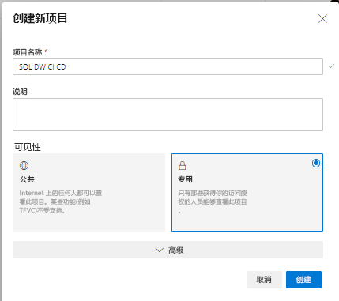

2. 打开 Visual Studio 并通过选择“管理连接”连接到步骤 1 中的 Azure DevOps 组织和项目

   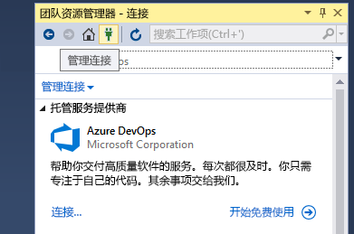

   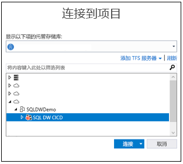

3. 将项目中的 Azure Repo 存储库克隆到本地计算机

   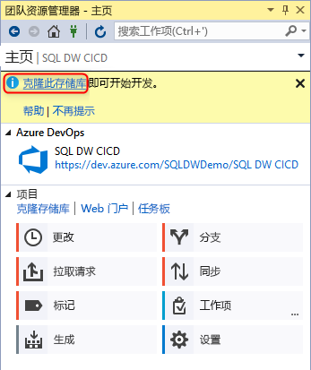

## 创建并连接项目

1. 在 Visual Studio 中，使用**本地克隆存储库**中的目录和本地 Git 存储库创建新的 SQL Server 数据库项目

   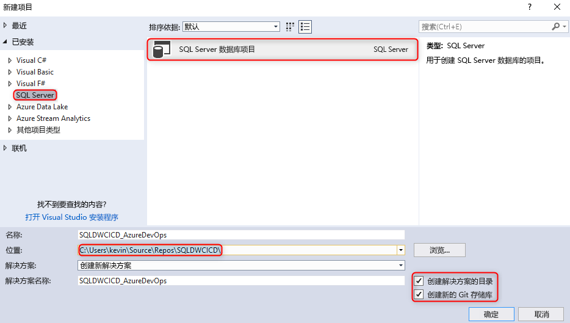  

2. 右键单击空的 sqlproject 并将数据仓库导入数据库项目

   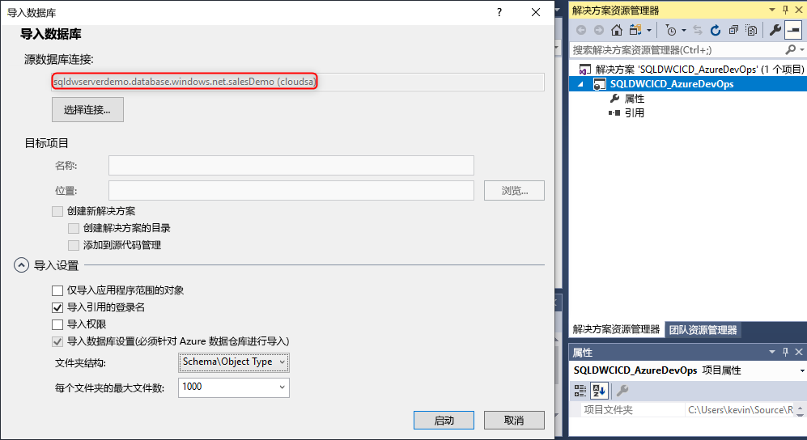  

3. 在 Visual Studio 的团队资源管理器中，将所有更改提交到本地 Git 存储库 

   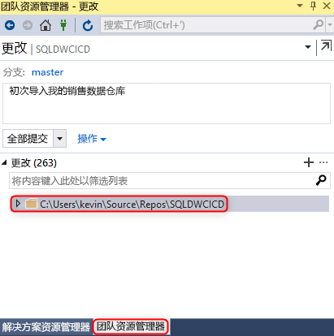  

4. 既然已在克隆的存储库中本地提交了更改，请将更改同步并推送到 Azure DevOps 项目中的 Azure Repo 存储库。

   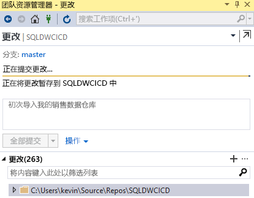

   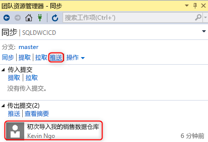  

## 验证

1. 通过从 Visual Studio SQL Server Data Tools (SSDT) 更新数据库项目中的表列，验证是否已将更改推送到 Azure Repo

   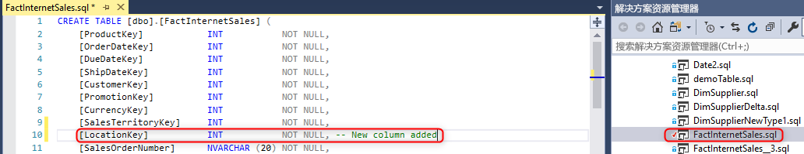

2. 提交更改并将更改从本地存储库推送到 Azure Repo

   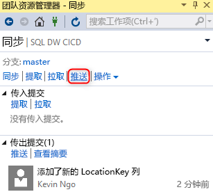

3. 验证是否已将更改推送到 Azure Repo 存储库

   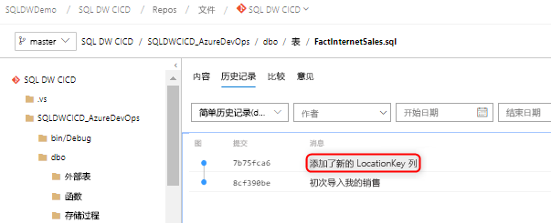

4. （**可选**）使用“架构比较”并使用 SSDT 更新对目标数据仓库的更改，以确保 Azure Repo 存储库和本地存储库中的对象定义反映数据仓库

## 后续步骤

- [针对 Azure SQL 数据仓库进行开发](sql-data-warehouse-overview-develop.md)

<!--Image references-->

<!--Article references-->

<!--MSDN references-->

<!--Other Web references-->

