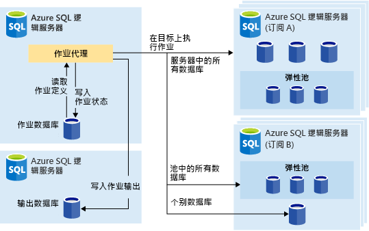
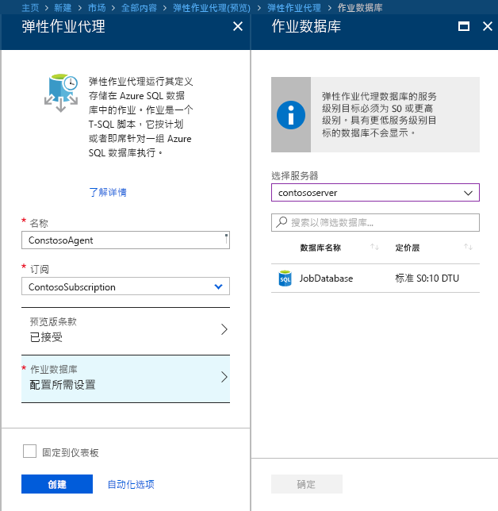
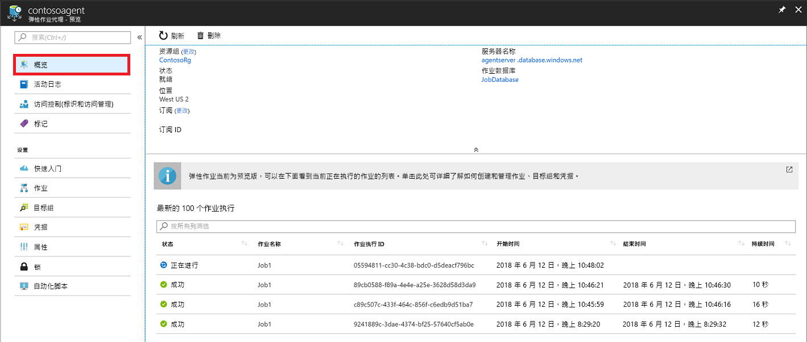
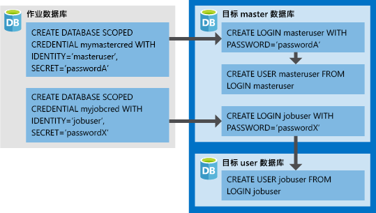

# <a name="manage-groups-of-databases-with-elastic-database-jobs"></a>通过弹性数据库作业管理数据库组

使用**弹性数据库作业**，可以按计划或按需跨大量数据库并行运行一个或多个 T-SQL 脚本。

**针对数据库的任意组合运行作业**：可以是一个或多个单独的数据库，可以是一个服务器上的所有数据库，可以是一个弹性池中的所有数据库，也可以是分片映射，而且还可以灵活地包括或排除任何特定的数据库。 **作业可以跨多个服务器、多个池来运行，甚至可以针对不同订阅中的数据库来运行。** 服务器和池会在运行时进行动态枚举，因此作业会针对执行时目标组中存在的所有数据库来运行。

下图显示了一个跨不同类型的目标组执行作业的作业代理：




## <a name="why-use-elastic-jobs"></a>为什么使用弹性作业？

### <a name="manage-many-databases"></a>管理多个数据库

- 对管理任务进行计划，使之每个工作日运行一次、几小时运行一次，等等。
- 部署架构更改、凭据管理、性能数据收集或租户（客户）遥测数据收集。 更新引用数据（所有数据库的公用信息）。
- 重建索引以提升查询性能。 配置作业，以便定期（例如，在非高峰时段）对一系列数据库执行作业。
- 持续将一组数据库中的查询结果收集到中央表中。 性能查询可以持续执行，并可配置为触发执行其他任务。

### <a name="collect-data-for-reporting"></a>收集要报告的数据

- 将 Azure SQL 数据库集合中的数据聚合到单个目标表中。
- 对大量的数据库执行长时间运行的数据处理查询，例如，收集客户遥测数据。 结果将收集到单个目标表以供进一步分析。

### <a name="reduce-overhead"></a>减少开销

- 通常，必须单独连接到每个数据库才能运行 Transact-SQL 语句或执行其他管理任务。 作业可处理登录到目标组中每个数据库的任务。 此外，可定义、维护及保存要在一组 Azure SQL 数据库中执行的 Transact-SQL 脚本。

### <a name="accounting"></a>计帐

- 作业记录每个数据库的执行状态。 失败时也会自动重试。

### <a name="flexibility"></a>灵活性

- 定义 Azure SQL 数据库的自定义组，并定义作业运行计划。


## <a name="elastic-job-components"></a>弹性作业组件

|组件  | 说明（表下提供其他详细信息） |
|---------|---------|
|[**弹性作业代理**](#elastic-job-agent) |  为了运行和管理作业而创建的 Azure 资源。   |
|[**作业数据库**](#job-database)    |    作业代理用来存储作业相关数据、作业定义等内容的 Azure SQL 数据库。      |
|[**目标组**](#target-group)      |  一组服务器、池、数据库和分片映射，可对其运行作业。       |
|[**作业**](#job)  |  作业是由一个或多个[作业步骤](#job-step)组成的工作单元。 作业步骤指定要运行的 T-SQL 脚本，以及执行脚本所需的其他详细信息。  |


### <a name="elastic-job-agent"></a>弹性作业代理

弹性作业代理是用于创建、运行和管理作业的 Azure 资源。 弹性作业代理是在门户（也支持 [PowerShell](elastic-jobs-powershell.md) 和 REST）中创建的 Azure 资源。 

创建**弹性作业代理**需要现有的 SQL 数据库。 代理将此现有的数据库配置为[作业数据库](#job-database)。

弹性作业代理免费。 作业数据库的费率与任何 SQL 数据库一样。

### <a name="job-database"></a>作业数据库

作业数据库用于定义作业以及跟踪作业执行操作的状态和历史记录。 作业数据库也用于存储代理元数据、日志、结果、作业定义，并且还包含许多有用的存储过程，以及其他数据库对象，可以通过 T-SQL 创建、运行和管理作业。

就目前的预览版来说，需要使用现有的 Azure SQL 数据库（S0 或更高级别）来创建弹性作业代理。

作业数据库不一定需要是新的，但应该干净且为空，其服务层应该为 S0 或更高级别。 作业数据库的服务层建议使用 S1 或更高版本，但在实际应用中取决于作业的性能需求：作业步骤数，以及作业的运行次数和频率。 例如，对于每小时只运行数个作业的作业代理，也许 S0 数据库就够用了，但每分钟运行一个作业在性能上可能不够佳，因此使用更高的服务层可能会更好。


#### <a name="job-database-permissions"></a>作业数据库权限

在创建作业代理期间，会在作业数据库中创建一个架构、多个表和一个名为 *jobs_reader* 的角色。 此角色使用以下权限创建，旨在为管理员提供进行作业监视所需的更细致访问控制：


|角色名称  |“作业”架构权限  |“jobs_internal”架构权限  |
|---------|---------|---------|
|**jobs_reader**     |    SELECT     |    无     |

> [!IMPORTANT]
> 在以数据库管理员身份授予作业数据库的访问权限之前，请考虑清楚安全隐患。 有权创建或编辑作业的恶意用户可能会创建或编辑一个作业，以便使用存储的凭据连接到受其控制的数据库，从而确定凭据的密码。


### <a name="target-group"></a>目标组

目标组定义可以在其上执行作业步骤的数据库集。 目标组可以包含任意数目和任意组合的以下项：

- **Azure SQL Server** - 如果指定一个服务器，则在执行作业时存在于该服务器中的所有数据库都会成为组的一部分。 必须提供 master 数据库凭据，然后才能在执行作业之前枚举和更新组。
- **弹性池** - 如果指定一个弹性池，则在执行作业时位于该弹性池中的所有数据库都会成为组的一部分。 就服务器来说，必须提供 master 数据库凭据，然后才能在执行作业之前更新组。
- **单个数据库** - 指定一个或多个将要成为组的一部分的单独数据库。
- **分片映射** - 一个分片映射的数据库。

> [!TIP]
> 在执行作业时，动态枚举会重新评估包含服务器或池的目标组中的数据库集。 动态枚举确保**在执行作业时，作业可以跨服务器或池中存在的所有数据库运行**。 在池或服务器成员身份更改频繁的情况下，在运行时重新评估数据库列表特别有用。


可以将池和单个数据库指定为包括在组中或从组中排除。 这样就可以使用任意数据库组合来创建目标组。 例如，可以向目标组添加一个服务器，但将弹性池中的特定数据库排除出去（也可以排除整个池）。

目标组可以包括多个区域的多个订阅中的数据库。 请注意，跨区域执行的延迟高于同一区域内的执行。


### <a name="job"></a>作业

作业是按计划执行的或只执行一次的工作单元。 作业包含一个或多个作业步骤。

#### <a name="job-step"></a>作业步骤

每个作业步骤都会指定一个要执行的 T-SQL 脚本、一个或多个要对其运行 T-SQL 脚本的目标组，以及作业代理连接到目标数据库所需的凭据。 每个作业步骤都有可自定义的超时和重试策略，并且可以选择性地指定输出参数。

#### <a name="job-output"></a>作业输出

针对每个目标数据库执行的作业步骤的结果会详细记录，而脚本输出则可捕获到指定的表中。 可以指定一个数据库，用于保存从作业返回的任何数据。

#### <a name="job-history"></a>作业历史记录

作业执行历史记录存储在作业数据库中。 系统清除作业会清除时间超过 45 天的执行历史记录。 若要删除时间不到 45 天的历史记录，请调用作业数据库中的 **sp_purge_history** 存储过程。

## <a name="workflow-to-create-configure-and-manage-jobs"></a>用于创建、配置和管理作业的工作流

### <a name="create-and-configure-the-agent"></a>创建并配置代理

1. 创建或标识空的 S0 或更高级别的 SQL 数据库。 该数据库将在弹性作业代理创建期间用作作业数据库。
2. 通过[门户](https://portal.azure.com/#create/Microsoft.SQLElasticJobAgent)或 [PowerShell](elastic-jobs-powershell.md#create-the-elastic-job-agent) 创建弹性作业代理。

   

### <a name="create-run-and-manage-jobs"></a>创建、运行和管理作业

1. 使用 [PowerShell](elastic-jobs-powershell.md#create-job-credentials-so-that-jobs-can-execute-scripts-on-its-targets) 或 [T-SQL](elastic-jobs-tsql.md#create-a-credential-for-job-execution) 在作业数据库中创建执行作业所需的凭据。
2. 使用 [PowerShell](elastic-jobs-powershell.md#define-the-target-databases-you-want-to-run-the-job-against) 或 [T-SQL](elastic-jobs-tsql.md#create-a-target-group-servers) 定义目标组（需对其运行作业的数据库）。
3. 在作业将运行的每个数据库中创建作业代理凭据[（向组中的每个数据库添加用户（或角色））](https://docs.microsoft.com/azure/sql-database/sql-database-control-access)。 有关示例，请参阅 [PowerShell 教程](elastic-jobs-powershell.md#create-job-credentials-so-that-jobs-can-execute-scripts-on-its-targets)。
4. 使用 [PowerShell](elastic-jobs-powershell.md#create-a-job) 或 [T-SQL](elastic-jobs-tsql.md#deploy-new-schema-to-many-databases) 创建作业。
5. 使用 [PowerShell](elastic-jobs-powershell.md#create-a-job-step) 或 [T-SQL](elastic-jobs-tsql.md#deploy-new-schema-to-many-databases) 添加作业步骤。
6. 使用 [PowerShell](elastic-jobs-powershell.md#run-the-job) 或 [T-SQL](elastic-jobs-tsql.md#begin-ad-hoc-execution-of-a-job) 运行作业。
7. 使用门户、[PowerShell](elastic-jobs-powershell.md#monitor-status-of-job-executions) 或 [T-SQL](elastic-jobs-tsql.md#monitor-job-execution-status) 监视作业执行状态。

   

## <a name="credentials-for-running-jobs"></a>运行作业所需的凭据

作业在执行时使用[数据库范围的凭据](/sql/t-sql/statements/create-database-scoped-credential-transact-sql)连接到目标组指定的数据库。 如果目标组包含服务器或池，则可使用这些数据库范围的凭据连接到 master 数据库，以便枚举可用的数据库。

设置运行作业所需的适当凭据可能不太容易，因此请注意以下要点：

- 必须在作业数据库中创建数据库范围的凭据。
- **所有目标数据库必须有一个具有[足够权限](https://docs.microsoft.com/sql/relational-databases/security/permissions-database-engine)的登录名，否则作业无法成功完成**（下图中的 jobuser）。
- 凭据应该可以跨作业反复使用，而凭据密码经过加密后，无法供只能通过只读方式访问作业对象的用户访问。

下图旨在帮助用户了解和设置适当的作业凭据。 **记住在作业需运行的每个数据库（所有目标用户数据库）中创建该用户**。



## <a name="security-best-practices"></a>安全最佳实践

使用弹性作业时的一些最佳做法注意事项：

- 将 API 的使用限制为受信任的个人。
- 凭据应该具有执行作业步骤所需的最低权限。 如需其他信息，请参阅 [SQL Server 中的授权和权限](https://docs.microsoft.com/dotnet/framework/data/adonet/sql/authorization-and-permissions-in-sql-server)。
- 使用服务器和/或池目标组成员时，强烈建议创建另外一个凭据，该凭据有权在 master 数据库上查看/列出数据库，用于在作业执行之前展开服务器和/或池的数据库列表。


## <a name="agent-performance-capacity-and-limitations"></a>代理性能、容量和限制

弹性作业在等待长时间运行的作业完成时使用极少的计算资源。

根据目标数据库组的大小和作业所需执行时间（并发辅助角色数）的不同，代理需要的计算量和作业数据库性能也会有所不同（目标数和作业数越多，所需计算量越大）。

目前，预览版的限制是 100 个并发作业。

### <a name="prevent-jobs-from-reducing-target-database-performance"></a>防止作业降低目标数据库性能

若要确保针对 SQL 弹性池中的数据库运行作业时资源不会超负荷，可以对作业进行配置，限制可以在同一时间对其运行作业的数据库数。

##  <a name="differences-between-elastic-jobs-and-sql-server-agent"></a>弹性作业和 SQL Server 代理之间的差异

值得注意的是，SQL Server 代理（可以在本地使用以及作为 SQL 数据库托管实例的一部分使用）和 Azure SQL 数据库弹性作业代理（现在适用于 SQL 数据库和 SQL 数据仓库）之间存在一些差异。


|  |弹性作业  |SQL Server 代理 |
|---------|---------|---------|
|范围     |  作业代理所在 Azure 云中任意数目的 Azure SQL 数据库和/或数据仓库。 目标可以位于不同的逻辑服务器、订阅和/或区域中。 <br><br>目标组可以包含单个数据库或数据仓库，也可以包含某个服务器、池或分片映射中的所有数据库（在作业运行时动态枚举）。 | SQL 代理所在 SQL Server 实例中的任一数据库。 |
|支持的 API 和工具     |  门户、PowerShell、T-SQL、Azure 资源管理器      |   T-SQL、SQL Server Management Studio (SSMS)     |


## <a name="best-practices-for-creating-jobs"></a>创建作业的最佳做法

### <a name="idempotent-scripts"></a>幂等脚本
作业的 T-SQL 脚本必须[幂等](https://en.wikipedia.org/wiki/Idempotence)。 “幂等”是指如果脚本成功，则再次运行时，会出现相同的结果。 脚本可能由于暂时性网络问题而失败。 在此情况下，作业会自动重试运行脚本，达到默认的次数才停止。 即使幂等脚本已成功运行两次（或更多次），也仍会返回相同的结果。

一个简单的策略是在创建对象之前测试其是否存在。


```sql
IF NOT EXIST (some_object)
    -- Create the object
    -- If it exists, drop the object before recreating it.
```

同样地，脚本必须以逻辑方式测试并反驳它所找到的任何条件，才能成功执行。


## <a name="next-steps"></a>后续步骤

- [使用 PowerShell 创建和管理弹性作业](elastic-jobs-powershell.md)
- [使用 Transact-SQL (T-SQL) 创建和管理弹性作业](elastic-jobs-tsql.md)