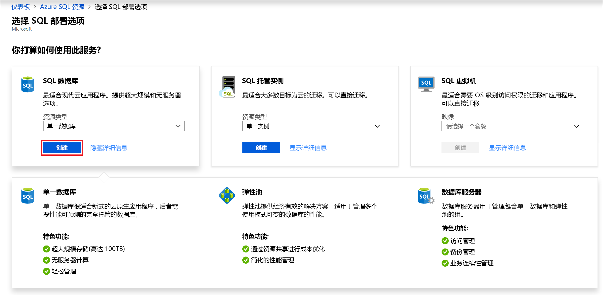
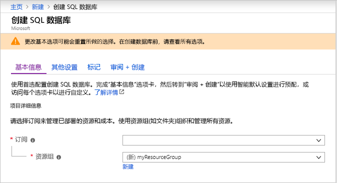
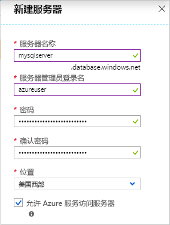
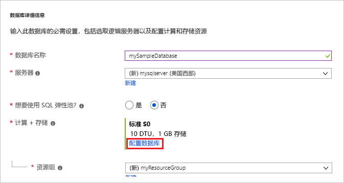
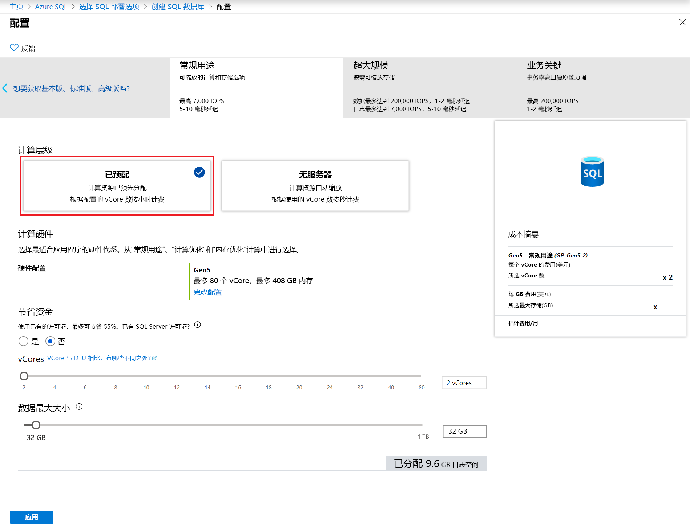
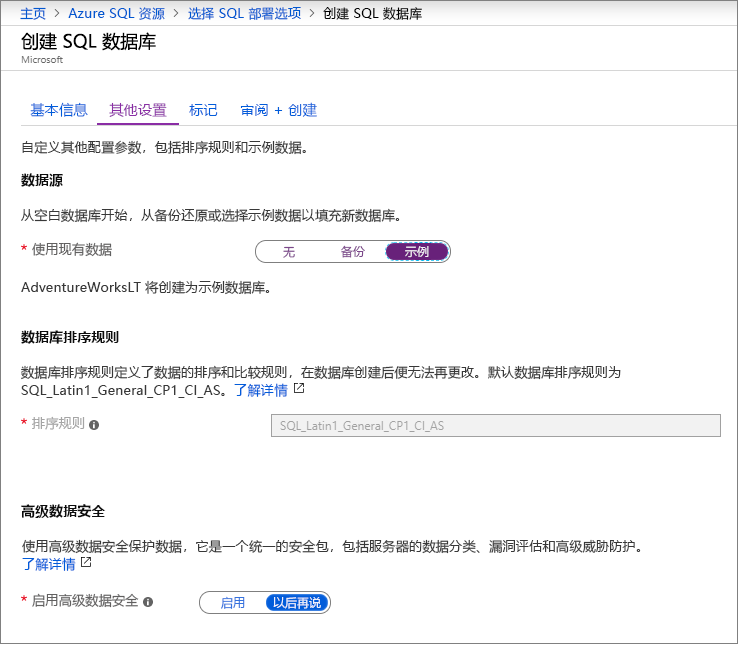

在此步骤中，将创建 Azure SQL 数据库单一数据库。 

> [!IMPORTANT]
> 请务必设置防火墙规则，以使用用于完成本文的计算机的公共 IP 地址。
>
> 有关详细信息，请参阅[创建数据库级防火墙规则](/sql/relational-databases/system-stored-procedures/sp-set-database-firewall-rule-azure-sql-database)，或参阅[创建服务器级防火墙](../sql-database-server-level-firewall-rule.md)，确定用于计算机的服务器级防火墙规则的 IP 地址。  

# <a name="portaltabazure-portal"></a>[门户](#tab/azure-portal)

使用 Azure 门户创建资源组和单一数据库。

1. 在 [Azure 门户](https://portal.azure.com)的左侧菜单中选择“Azure SQL”  。 如果 **Azure SQL** 不在列表中，请选择“所有服务”  ，然后在搜索框中键入“Azure SQL”  。 （可选）选择“Azure SQL”  旁边的星号将其收藏并将其添加为左侧导航栏中的项。 
2. 选择“+ 添加”  以打开“选择 SQL 部署选项”  页。 可以通过在“数据库”  磁贴上选择“显示详细信息”  来查看有关不同数据库的其他信息。
3. 选择“创建”  ：

   

3. 在“项目详细信息”部分的“基本信息”选项卡上，键入或选择以下值：  

   - **订阅**：下拉列表并选择正确的订阅（如果它没有出现）。
   - **资源组**：选择“新建”，键入 `myResourceGroup`，然后选择“确定”   。

     

4. 在“数据库详细信息”部分，键入或选择以下值： 

   - **数据库名称**：输入 `mySampleDatabase` 。
   - **服务器**：选择“新建”并输入以下值，然后选择“选择”。  
       - **服务器名称**：键入 `mysqlserver` 和一些数字，使名称唯一。
       - **服务器管理员登录名**：键入 `azureuser`。
       - **密码**：键入符合密码要求的复杂密码。
       - **位置**：从下拉列表中选择一个位置，例如 `West US`。

         

      > [!IMPORTANT]
      > 请记得记录服务器管理员登录名和密码，以便可以登录服务器和数据库以获取此快速入门和其他快速入门。 如果忘记了登录名或密码，可在“SQL 服务器”页上获取登录名或重置密码  。 若要打开“SQL 服务器”页，请在创建数据库后在数据库“概述”页上选择服务器名称   。

   - **想要使用 SQL 弹性池**：选择“否”选项。 
   - **计算 + 存储**：选择“配置数据库”  。 

     

   - 选择“已预配”  。

     

   - 查看“Vcore”和“数据最大大小”设置   。 根据需要进行更改。 
     - 还可以选择“更改配置”来更改硬件生成  。
   - 选择“应用”。 

5. 选择“其他设置”选项卡。  
6. 在“数据源”部分的“使用现有数据”下，选择 `Sample`。  

   

   > [!IMPORTANT]
   > 确保选择“示例(AdventureWorksLT)”数据，这样就可以轻松地按照本指南以及使用此数据的其他 Azure SQL 数据库快速入门进行操作  。

7. 将剩余字段保留默认值，然后选择窗体底部的“查看 + 创建”。 
8. 检查最终的设置，然后选择“创建”。 

9. 在“SQL 数据库”窗体中，选择“创建”来部署和预配资源组、服务器和数据库   。

# <a name="powershelltabazure-powershell"></a>[PowerShell](#tab/azure-powershell)

[!INCLUDE [updated-for-az](../../../includes/updated-for-az.md)]

使用 PowerShell 创建资源组和单一数据库。

   ```powershell-interactive
   # Set variables for your server and database
   $subscriptionId = '<SubscriptionID>'
   $resourceGroupName = "myResourceGroup-$(Get-Random)"
   $location = "West US"
   $adminLogin = "azureuser"
   $password = "PWD27!"+(New-Guid).Guid
   $serverName = "mysqlserver-$(Get-Random)"
   $databaseName = "mySampleDatabase"

   # The ip address range that you want to allow to access your server 
   # (leaving at 0.0.0.0 will prevent outside-of-azure connections to your DB)
   $startIp = "0.0.0.0"
   $endIp = "0.0.0.0"

   # Show randomized variables
   Write-host "Resource group name is" $resourceGroupName 
   Write-host "Password is" $password  
   Write-host "Server name is" $serverName 

   # Connect to Azure
   Connect-AzAccount

   # Set subscription ID
   Set-AzContext -SubscriptionId $subscriptionId 

   # Create a resource group
   Write-host "Creating resource group..."
   $resourceGroup = New-AzResourceGroup -Name $resourceGroupName -Location $location -Tag @{Owner="SQLDB-Samples"}
   $resourceGroup

   # Create a server with a system wide unique server name
   Write-host "Creating primary logical server..."
   $server = New-AzSqlServer -ResourceGroupName $resourceGroupName `
      -ServerName $serverName `
      -Location $location `
      -SqlAdministratorCredentials $(New-Object -TypeName System.Management.Automation.PSCredential `
      -ArgumentList $adminLogin, $(ConvertTo-SecureString -String $password -AsPlainText -Force))
   $server

   # Create a server firewall rule that allows access from the specified IP range
   Write-host "Configuring firewall for primary logical server..."
   $serverFirewallRule = New-AzSqlServerFirewallRule -ResourceGroupName $resourceGroupName `
      -ServerName $serverName `
      -FirewallRuleName "AllowedIPs" -StartIpAddress $startIp -EndIpAddress $endIp
   $serverFirewallRule

   # Create General Purpose Gen4 database with 1 vCore
   Write-host "Creating a gen5 2 vCore database..."
   $database = New-AzSqlDatabase  -ResourceGroupName $resourceGroupName `
      -ServerName $serverName `
      -DatabaseName $databaseName `
      -Edition GeneralPurpose `
      -VCore 2 `
      -ComputeGeneration Gen5 `
      -MinimumCapacity 2 `
      -SampleName "AdventureWorksLT"
   $database
   ```

本文的此部分使用以下 PowerShell cmdlet：

| 命令 | 说明 |
|---|---|
| [New-AzResourceGroup](/powershell/module/az.resources/new-azresourcegroup) | 创建用于存储所有资源的资源组。 |
| [New-AzSqlServer](/powershell/module/az.sql/new-azsqlserver) | 创建托管单一数据库和弹性池的 SQL 数据库服务器。 |
| [New-AzSqlServerFirewallRule](/powershell/module/az.sql/new-azsqlserverfirewallrule) | 为逻辑服务器创建防火墙规则。 | 
| [New-AzSqlDatabase](/powershell/module/az.sql/new-azsqldatabase) | 新建 Azure SQL 数据库单一数据库。 | 

# <a name="azure-clitabazure-cli"></a>[Azure CLI](#tab/azure-cli)

使用 AZ CLI 创建资源组和单一数据库。

   ```azurecli-interactive
   #!/bin/bash
   # Set variables
   subscriptionID=<SubscriptionID>
   resourceGroupName=myResourceGroup-$RANDOM
   location=SouthCentralUS
   adminLogin=azureuser
   password="PWD27!"+`openssl rand -base64 18`
   serverName=mysqlserver-$RANDOM
   databaseName=mySampleDatabase
   drLocation=NorthEurope
   drServerName=mysqlsecondary-$RANDOM
   failoverGroupName=failovergrouptutorial-$RANDOM

   # The ip address range that you want to allow to access your DB. 
   # Leaving at 0.0.0.0 will prevent outside-of-azure connections to your DB
   startip=0.0.0.0
   endip=0.0.0.0
  
   # Connect to Azure
   az login

   # Set the subscription context for the Azure account
   az account set -s $subscriptionID

   # Create a resource group
   echo "Creating resource group..."
   az group create \
      --name $resourceGroupName \
      --location $location \
      --tags Owner[=SQLDB-Samples]

   # Create a logical server in the resource group
   echo "Creating primary logical server..."
   az sql server create \
      --name $serverName \
      --resource-group $resourceGroupName \
      --location $location  \
      --admin-user $adminLogin \
      --admin-password $password

   # Configure a firewall rule for the server
   echo "Configuring firewall..."
   az sql server firewall-rule create \
      --resource-group $resourceGroupName \
      --server $serverName \
      -n AllowYourIp \
      --start-ip-address $startip \
      --end-ip-address $endip

   # Create a gen5 1vCore database in the server 
   echo "Creating a gen5 2 vCore database..."
   az sql db create \
      --resource-group $resourceGroupName \
      --server $serverName \
      --name $databaseName \
      --sample-name AdventureWorksLT \
      --edition GeneralPurpose \
      --family Gen5 \
      --capacity 2
   ```

此脚本使用以下命令。 表中的每条命令均链接到特定于命令的文档。

| 命令 | 说明 |
|---|---|
| [az account set](/cli/azure/account?view=azure-cli-latest#az-account-set) | 将订阅设置为当前的活动订阅。 | 
| [az group create](/cli/azure/group#az-group-create) | 创建用于存储所有资源的资源组。 |
| [az sql server create](/cli/azure/sql/server#az-sql-server-create) | 创建托管单一数据库和弹性池的 SQL 数据库服务器。 |
| [az sql server firewall-rule create](/cli/azure/sql/server/firewall-rule) | 创建服务器的防火墙规则。 | 
| [az sql db create](/cli/azure/sql/db?view=azure-cli-latest) | 创建数据库。 | 


---
