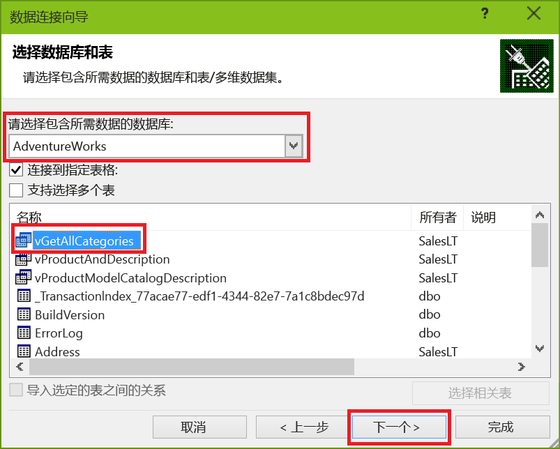
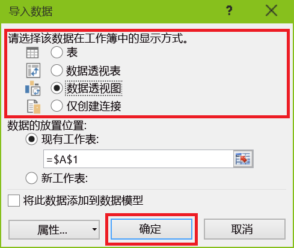
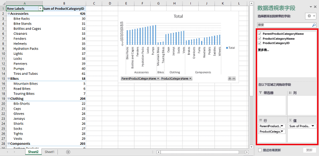

# 将 Excel 连接到 Azure SQL 数据库并创建报表

将 Excel 连接到云中的 SQL 数据库，导入数据并根据数据库中的值来创建表和图表。 在本教程中，将设置 Excel 与数据库表之间的连接，保存用于存储 Excel 的数据和连接信息的文件，然后根据数据库值创建分析数据透视图。

在开始之前，需要在 Azure 中创建一个 SQL 数据库。 如果没有，请参阅 [创建第一个 SQL 数据库](sql-database-get-started-portal.md)，以在几分钟内获取数据库，并让其中的示例数据正常运行。 在本文中，会将该文章中的示例数据导入 Excel，但可以使用自己的数据执行类似的步骤。

还需要 Excel 的副本。 本文使用 [Microsoft Excel 2016](https://products.office.com/)。

## 将 Excel 连接到 SQL 数据库并加载数据
1. 要将 Excel 连接到 SQL 数据库，请打开 Excel，然后创建新的工作簿或打开现有的 Excel 工作簿。
2. 在页面顶部的菜单栏中，依次选择“数据”选项卡、“获取数据”、“从 Azure 获取”，然后选择“从 Azure SQL 数据库获取”。 
   
   
   
   此时会打开“数据连接”向导。
3. 在“连接到数据库服务器”对话框中，以 <服务器名称>**.database.windows.net** 的格式键入要连接到的 SQL 数据库**服务器名称**。 例如“msftestserver.database.windows.net”。 输入数据库名称（可选）。 选择“确定”以打开凭据窗口。 

   

1. 在“SQL Server 数据库”对话框中，选择左侧的“数据库”，然后输入要连接到的 SQL 数据库服务器的用户名和密码。 选择“连接”以打开“导航器”。 

  
   
  > [!TIP]
  > 根据网络环境，可能无法连接；如果 SQL 数据库服务器不允许来自客户端 IP 地址的流量，可能会断开连接。 转到 [Azure 门户](https://portal.azure.com/)，依次单击“SQL 服务器”、服务器、“设置”下面的“防火墙”，然后添加客户端 IP 地址。 有关详细信息，请参阅 [如何配置防火墙设置](sql-database-configure-firewall-settings.md) 。
   
   
5. 在“导航器”中，从列表中选择想要使用的数据库，选择想要使用的表格或视图（我们选择的是“vGetAllCategories”），然后选择“加载”以将数据从 SQL Azure 数据库移至 Excel 电子表格。
   
    
   

## 将数据导入 Excel 并创建数据透视图
建立连接后，有多种加载数据的方式可供选择。 例如，以下步骤使用来自 SQL 数据库的数据创建数据透视表。 

1. 按照前一部分中的步骤进行操作，不过这次不再选择“加载”，而是改为从“加载”下拉列表中选择“加载至”。
2. 然后选择该数据在工作簿中的显示方式。 **将此数据添加到数据模型**。 也可以选择创建**新工作表**或**将此数据添加到数据模型**。 有关数据模型的详细信息，请参阅[在 Excel 中创建数据模型](https://support.office.com/article/Create-a-Data-Model-in-Excel-87E7A54C-87DC-488E-9410-5C75DBCB0F7B)。 
   
    
   
    工作表现在包含空白的数据透视表和图表。
2. 在“数据透视表字段”下，选中要查看的所有字段的复选框。
   
    

> [!TIP]
> 如果想将其他 Excel 工作簿和工作表与数据库连接，请选择“数据”选项卡，然后选择“最近使用的源”以启动“最近使用的源”对话框。 从该对话框中的列表中选择之前创建的连接，然后单击“打开”。
> 
 
## 使用 .odc 文件创建永久连接
若要永久保存连接详细信息，可以创建一个 .odc 文件，并将此连接作为“现有连接”对话框中的一个选项。 

1. 在页面顶部的菜单栏中选择“数据”选项卡，然后选择“现有连接”以启动“现有连接”对话框。 
    1. 选择“浏览更多”以打开“选择数据源”对话框。   
    2. 选择“+NewSqlServerConnection.odc”文件并选择“打开”以打开“数据连接向导”。

    

2. 在“数据连接向导”中键入服务器名称和 SQL 数据库凭据。 选择“**下一步**”。 
    1. 从下拉列表中选择包含数据的数据库。 
    2. 选择感兴趣的表格或视图。 我们选择的是“vGetAllCategories”。
    3. 选择“**下一步**”。 

     

3. 在数据连接向导的下一个屏幕中选择文件位置、文件名以及友好名称。 还可以选择将密码保存在文件中，但这样做可能会将数据泄露给未经允许的访问。 准备就绪后，选择“完成”。 

    

4. 选择所需的数据导入方式。 我们选择制作一个数据透视表。 还可以通过选择“属性”修改连接的属性。 准备就绪后，选择“确定”。 如果未选择将密码保存在文件中，系统会提示输入凭据。 

    

5. 通过展开“数据”选项卡并选择“现有连接”可以验证新的连接是否已保存。 

    

## 后续步骤
* 了解如何 [使用 SQL Server Management Studio 连接到 SQL 数据库](sql-database-connect-query-ssms.md) ，以便进行高级查询和分析。
* 了解 [弹性池](sql-database-elastic-pool.md)的优点。
* 了解如何 [创建与后端 SQL 数据库连接的 Web 应用程序](../app-service/app-service-web-tutorial-dotnet-sqldatabase.md)。

