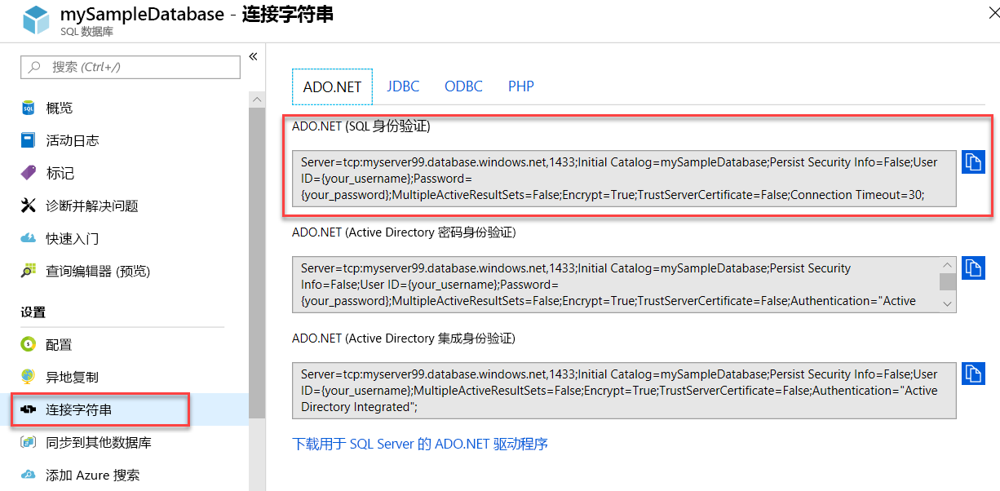

# <a name="quickstart-use-net-core-c-to-query-an-azure-sql-database"></a>快速入门：使用 .NET Core (C#) 查询 Azure SQL 数据库

在本快速入门中，将使用 [.NET Core](https://www.microsoft.com/net/) 和 C# 代码连接到 Azure SQL 数据库。 然后，将运行 Transact-SQL 语句来查询数据。

> [!TIP]
> 以下 Microsoft Learn 模块可帮助你免费学习如何[开发和配置可查询 Azure SQL 数据库的 ASP.NET 应用程序](https://docs.microsoft.com/learn/modules/develop-app-that-queries-azure-sql/)

## <a name="prerequisites"></a>先决条件

对于本教程的内容，你需要：

- Azure SQL 数据库。 可以根据下述快速入门中的一个的说明在 Azure SQL 数据库中创建数据库，然后对其进行配置：

  || 单一数据库 | 托管实例 |
  |:--- |:--- |:---|
  | 创建| [门户](sql-database-single-database-get-started.md) | [门户](sql-database-managed-instance-get-started.md) |
  || [CLI](scripts/sql-database-create-and-configure-database-cli.md) | [CLI](https://medium.com/azure-sqldb-managed-instance/working-with-sql-managed-instance-using-azure-cli-611795fe0b44) |
  || [PowerShell](scripts/sql-database-create-and-configure-database-powershell.md) | [PowerShell](scripts/sql-database-create-configure-managed-instance-powershell.md) |
  | 配置 | [服务器级别 IP 防火墙规则](sql-database-server-level-firewall-rule.md)| [从 VM 进行连接](sql-database-managed-instance-configure-vm.md)|
  |||[从现场进行连接](sql-database-managed-instance-configure-p2s.md)
  |加载数据|根据快速入门加载的 Adventure Works|[还原 Wide World Importers](sql-database-managed-instance-get-started-restore.md)
  |||从 [GitHub](https://github.com/Microsoft/sql-server-samples/tree/master/samples/databases/adventure-works) 所提供的 [BACPAC](sql-database-import.md) 文件还原或导入 Adventure Works|
  |||

  > [!IMPORTANT]
  > 本文中脚本的编写目的是使用 Adventure Works 数据库。 使用托管实例时，必须将 Adventure Works 数据库导入一个实例数据库，或者修改本文中的脚本，以便使用 Wide World Importers 数据库。

- 已安装[适用于操作系统的 .NET Core](https://www.microsoft.com/net/core)。

> [!NOTE]
> 本快速入门使用 mySampleDatabase 数据库  。 若要使用其他数据库，需更改数据库引用并修改 C# 代码中的 `SELECT` 查询。

## <a name="get-sql-server-connection-information"></a>获取 SQL Server 连接信息

获取连接到 Azure SQL 数据库所需的连接信息。 在后续过程中，将需要完全限定的服务器名称或主机名称、数据库名称和登录信息。

1. 登录到 [Azure 门户](https://portal.azure.com/)。

2. 导航到“SQL 数据库”或“SQL 托管实例”页。  

3. 在“概览”页中，查看单一数据库的“服务器名称”旁边的完全限定的服务器名称，或者托管实例的“主机”旁边的完全限定的服务器名称    。 若要复制服务器名称或主机名称，请将鼠标悬停在其上方，然后选择“复制”图标  。

## <a name="get-adonet-connection-information-optional"></a>获取 ADO.NET 连接信息（可选）

1. 导航到“mySampleDatabase”页，并在“设置”下选择“连接字符串”    。

2. 查看完整的 ADO.NET  连接字符串。

    

3. 如果想要使用 ADO.NET 连接字符串，请复制它  。
  
## <a name="create-a-new-net-core-project"></a>创建新的 .NET Core 项目

1. 打开命令提示符，然后创建一个名为 sqltest 的文件夹  。 导航到此文件夹，并运行以下命令。

    ```cmd
    dotnet new console
    ```
    此命令将创建新的应用项目文件，包括初始 C# 代码文件 (**Program.cs**)、XML 配置文件 (**sqltest.csproj**) 和所需的二进制文件。

2. 在文本编辑器中，打开 sqltest.csproj 并在 `<Project>` 标记之间粘贴以下 XML  。 此 XML 会添加 `System.Data.SqlClient` 作为依赖项。

    ```xml
    <ItemGroup>
        <PackageReference Include="System.Data.SqlClient" Version="4.6.0" />
    </ItemGroup>
    ```

## <a name="insert-code-to-query-sql-database"></a>插入用于查询 SQL 数据库的代码

1. 在文本编辑器中打开 Program.cs 文件  。

2. 将内容替换为以下代码，为服务器、数据库、用户名和密码添加相应的值。

> [!NOTE]
> 若要使用 ADO.NET 连接字符串，请将代码中设置服务器、数据库、用户名和密码的 4 行替换为以下行。 在字符串中，设置用户名和密码。
>
>    `builder.ConnectionString="<your_ado_net_connection_string>";`

```csharp
using System;
using System.Data.SqlClient;
using System.Text;

namespace sqltest
{
    class Program
    {
        static void Main(string[] args)
        {
            try 
            { 
                SqlConnectionStringBuilder builder = new SqlConnectionStringBuilder();

                builder.DataSource = "<your_server.database.windows.net>"; 
                builder.UserID = "<your_username>";            
                builder.Password = "<your_password>";     
                builder.InitialCatalog = "<your_database>";
         
                using (SqlConnection connection = new SqlConnection(builder.ConnectionString))
                {
                    Console.WriteLine("\nQuery data example:");
                    Console.WriteLine("=========================================\n");
                    
                    connection.Open();       
                    StringBuilder sb = new StringBuilder();
                    sb.Append("SELECT TOP 20 pc.Name as CategoryName, p.name as ProductName ");
                    sb.Append("FROM [SalesLT].[ProductCategory] pc ");
                    sb.Append("JOIN [SalesLT].[Product] p ");
                    sb.Append("ON pc.productcategoryid = p.productcategoryid;");
                    String sql = sb.ToString();

                    using (SqlCommand command = new SqlCommand(sql, connection))
                    {
                        using (SqlDataReader reader = command.ExecuteReader())
                        {
                            while (reader.Read())
                            {
                                Console.WriteLine("{0} {1}", reader.GetString(0), reader.GetString(1));
                            }
                        }
                    }                    
                }
            }
            catch (SqlException e)
            {
                Console.WriteLine(e.ToString());
            }
            Console.WriteLine("\nDone. Press enter.");
            Console.ReadLine(); 
        }
    }
}
```

## <a name="run-the-code"></a>运行代码

1. 在提示符处，运行以下命令。

   ```cmd
   dotnet restore
   dotnet run
   ```

2. 验证是否返回前 20 行。

   ```text
   Query data example:
   =========================================

   Road Frames HL Road Frame - Black, 58
   Road Frames HL Road Frame - Red, 58
   Helmets Sport-100 Helmet, Red
   Helmets Sport-100 Helmet, Black
   Socks Mountain Bike Socks, M
   Socks Mountain Bike Socks, L
   Helmets Sport-100 Helmet, Blue
   Caps AWC Logo Cap
   Jerseys Long-Sleeve Logo Jersey, S
   Jerseys Long-Sleeve Logo Jersey, M
   Jerseys Long-Sleeve Logo Jersey, L
   Jerseys Long-Sleeve Logo Jersey, XL
   Road Frames HL Road Frame - Red, 62
   Road Frames HL Road Frame - Red, 44
   Road Frames HL Road Frame - Red, 48
   Road Frames HL Road Frame - Red, 52
   Road Frames HL Road Frame - Red, 56
   Road Frames LL Road Frame - Black, 58
   Road Frames LL Road Frame - Black, 60
   Road Frames LL Road Frame - Black, 62

   Done. Press enter.
   ```
3. 选择 Enter 关闭应用程序窗口  。

## <a name="next-steps"></a>后续步骤

- [在 Windows/Linux/macOS 中通过命令行使用 .NET Core 入门](/dotnet/core/tutorials/using-with-xplat-cli)。
- 了解如何[使用 .NET Framework 和 Visual Studio 连接和查询 Azure SQL 数据库](sql-database-connect-query-dotnet-visual-studio.md)。  
- 了解如何[使用 SSMS 设计首个 Azure SQL 数据库](sql-database-design-first-database.md)，或者如何[使用 C# 和 ADO.NET 设计 Azure SQL 数据库并进行连接](sql-database-design-first-database-csharp.md)。
- 有关 .NET 的详细信息，请参阅 [.NET 文档](https://docs.microsoft.com/dotnet/)。
