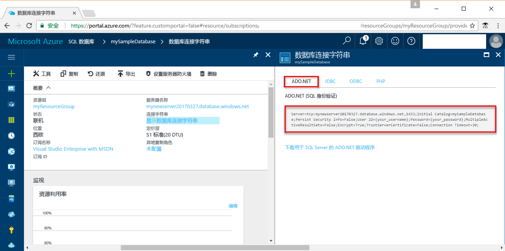

# <a name="azure-sql-database-use-net-c-to-connect-and-query-data"></a>Azure SQL 数据库：使用 .NET (C#) 进行连接和数据查询

本快速入门演示了如何通过 Windows、Mac OS 和 Ubuntu Linux 平台使用 [C# 和 ADO.NET](https://msdn.microsoft.com/library/kb9s9ks0.aspx) 连接到 Azure SQL 数据库，然后使用 Transact-SQL 语句在数据库中查询、插入、更新和删除数据。

## <a name="prerequisites"></a>先决条件

此快速入门使用以下某个快速入门中创建的资源作为其起点：

- [创建 DB - 门户](sql-database-get-started-portal.md)
- [创建 DB - CLI](sql-database-get-started-cli.md)
- [创建 DB - PowerShell](sql-database-get-started-powershell.md)

## <a name="install-net"></a>安装 .NET

本部分中的步骤假定你熟悉使用 .NET 开发，但不熟悉如何使用 Azure SQL 数据库。 如果你不熟悉如何使用 .NET 进行开发，请转到[使用 SQL Server 生成应用](https://www.microsoft.com/sql-server/developer-get-started/)并选择 **C#**，然后选择操作系统。

### <a name="windows-net-framework-and-net-core"></a>**Windows .NET Framework 和 .NET Core**

Visual Studio 2017 Community 是全功能、可扩展的免费 IDE，用于创建适用于 Android、iOS、Windows 以及 Web 和数据库应用程序与云服务的新式应用程序。 可以安装完整的 .NET Framework，也可以只安装 .NET Core。 快速入门中的代码片段二者都可以使用。 如果已在计算机上安装了 Visual Studio，请跳过下面几个步骤。

1. 下载 [Visual Studio 2017 安装程序](https://www.visualstudio.com/thank-you-downloading-visual-studio/?sku=Community&rel=15)。 
2. 运行该安装程序，并遵照安装提示完成安装。

### <a name="mac-os"></a>**Mac OS**
打开终端并导航到要在其中创建 .NET Core 项目的目录。 输入以下命令安装 **brew**、**OpenSSL** 和 **.NET Core**。 

```bash
ruby -e "$(curl -fsSL https://raw.githubusercontent.com/Homebrew/install/master/install)"
brew update
brew install openssl
mkdir -p /usr/local/lib
ln -s /usr/local/opt/openssl/lib/libcrypto.1.0.0.dylib /usr/local/lib/
ln -s /usr/local/opt/openssl/lib/libssl.1.0.0.dylib /usr/local/lib/
```

在 macOS 上安装 .NET Core。 下载[正式的安装程序](https://go.microsoft.com/fwlink/?linkid=843444)。 此安装程序会安装工具并将其放置在 PATH 中，使你可以从控制台运行 dotnet

### <a name="linux-ubuntu"></a>**Linux (Ubuntu)**
打开终端并导航到要在其中创建 .NET Core 项目的目录。 输入以下命令安装 **.NET Core**。

```bash
sudo sh -c 'echo "deb [arch=amd64] https://apt-mo.trafficmanager.net/repos/dotnet-release/ xenial main" > /etc/apt/sources.list.d/dotnetdev.list'
sudo apt-key adv --keyserver hkp://keyserver.ubuntu.com:80 --recv-keys 417A0893
sudo apt-get update
sudo apt-get install dotnet-dev-1.0.1
```

## <a name="get-connection-information"></a>获取连接信息

获取连接到 Azure SQL 数据库所需的连接信息。 在后续过程中，将需要完全限定的服务器名称、数据库名称和登录信息。

1. 登录到 [Azure 门户](https://portal.azure.com/)。
2. 从左侧菜单中选择“SQL 数据库”，然后单击“SQL 数据库”页上的数据库。 
3. 在数据库的“概览”页上，查看如下图所示的完全限定的服务器名称。 可以将鼠标悬停在服务器名称上以打开“单击以复制”选项。 

    

4. 如果忘了 Azure SQL 数据库服务器的登录信息，请导航到 SQL 数据库服务器页，以查看服务器管理员名称并重置密码（如果需要）。

5. 单击“显示数据库连接字符串”。

6. 查看完整的 **ADO.NET** 连接字符串。

    
  
## <a name="add-systemdatasqlclient"></a>添加 System.Data.SqlClient
使用 .NET Core 时，请将 System.Data.SqlClient 作为依赖项添加到项目的 ***csproj*** 文件。

```xml
<ItemGroup>
    <PackageReference Include="System.Data.SqlClient" Version="4.3.0" />
</ItemGroup>
```

## <a name="select-data"></a>选择数据

1. 在开发环境中，打开一个空白的代码文件。
2. 将 ```using System.Data.SqlClient``` 添加到代码文件 ([System.Data.SqlClient namespace](https://msdn.microsoft.com/library/system.data.sqlclient.aspx))。 

3. 通过以下代码将 [SqlCommand.ExecuteReader](https://msdn.microsoft.com/library/system.data.sqlclient.sqlcommand.executereader.aspx) 命令与 [SELECT](https://msdn.microsoft.com/library/ms189499.aspx) Transact-SQL 语句配合使用，以便按类别查询前 20 个产品。 为服务器、数据库、用户和密码添加相应的值。

```csharp
using System;
using System.Data;
using System.Data.SqlClient;

namespace ConsoleApplication1
{
    class Program
    {
        static void Main(string[] args)
        {
            try 
            { 
                SqlConnectionStringBuilder builder = new SqlConnectionStringBuilder();
                builder.DataSource = "your_server.database.windows.net"; 
                builder.UserID = "your_user";            
                builder.Password = "your_password";     
                builder.InitialCatalog = "your_database";

                using (SqlConnection connection = new SqlConnection(builder.ConnectionString))
                {
                    Console.WriteLine("\nQuery data example:");
                    Console.WriteLine("=========================================\n");
                    
                    connection.Open();       
                    StringBuilder sb = new StringBuilder();
                    sb.Append("SELECT TOP 20 pc.Name as CategoryName, p.name as ProductName ");
                    sb.Append("FROM [SalesLT].[ProductCategory] pc ");
                    sb.Append("JOIN [SalesLT].[Product] p ");
                    sb.Append("ON pc.productcategoryid = p.productcategoryid;");
                    String sql = sb.ToString();

                    using (SqlCommand command = new SqlCommand(sql, connection))
                    {
                        using (SqlDataReader reader = command.ExecuteReader())
                        {
                            while (reader.Read())
                            {
                                Console.WriteLine("{0} {1}", reader.GetString(0), reader.GetString(1));
                            }
                        }
                    }                    
                }
            }
            catch (SqlException e)
            {
                Console.WriteLine(e.ToString());
            }
        }
    }
}
```

## <a name="insert-data"></a>插入数据

通过以下代码将 [SqlCommand.ExecuteNonQuery](https://msdn.microsoft.com/library/system.data.sqlclient.sqlcommand.executenonquery.aspx) 与 [INSERT](https://msdn.microsoft.com/library/ms174335.aspx) Transact-SQL 语句配合使用，以便将新产品插入到 SalesLT.Product 表中。 为服务器、数据库、用户和密码添加相应的值。

```csharp
using System;
using System.Data;
using System.Data.SqlClient;

namespace ConsoleApplication1
{
    class Program
    {
        static void Main(string[] args)
        {
            try 
            { 
                SqlConnectionStringBuilder builder = new SqlConnectionStringBuilder();
                builder.DataSource = "your_server.database.windows.net"; 
                builder.UserID = "your_user";            
                builder.Password = "your_password";     
                builder.InitialCatalog = "your_database";

                using (SqlConnection connection = new SqlConnection(builder.ConnectionString))
                {
                    Console.WriteLine("\nInsert data example:");
                    Console.WriteLine("=========================================\n");

                    connection.Open();       
                    StringBuilder sb = new StringBuilder();
                    sb.Append("INSERT INTO [SalesLT].[Product] ([Name], [ProductNumber], [Color], [StandardCost], [ListPrice], [SellStartDate]) ");
                    sb.Append("VALUES (@Name, @ProductNumber, @Color, @StandardCost, @ListPrice, @SellStartDate);");
                    String sql = sb.ToString();
                    using (SqlCommand command = new SqlCommand(sql, connection))
                    {
                        command.Parameters.AddWithValue("@Name", "BrandNewProduct");
                        command.Parameters.AddWithValue("@ProductNumber", "200989");
                        command.Parameters.AddWithValue("@Color", "Blue");
                        command.Parameters.AddWithValue("@StandardCost", 75);
                        command.Parameters.AddWithValue("@ListPrice", 80);
                        command.Parameters.AddWithValue("@SellStartDate", "7/1/2016");
                        int rowsAffected = command.ExecuteNonQuery();
                        Console.WriteLine(rowsAffected + " row(s) inserted");
                    }         
                }
            }
            catch (SqlException e)
            {
                Console.WriteLine(e.ToString());
            }
        }
    }
}
```

## <a name="update-data"></a>更新数据

通过以下代码将 [SqlCommand.ExecuteNonQuery](https://msdn.microsoft.com/library/system.data.sqlclient.sqlcommand.executenonquery.aspx) 与 [UPDATE](https://msdn.microsoft.com/library/ms177523.aspx) Transact-SQL 语句配合使用，以便更新此前添加的新产品。 为服务器、数据库、用户和密码添加相应的值。

```csharp
using System;
using System.Data;
using System.Data.SqlClient;

namespace ConsoleApplication1
{
    class Program
    {
        static void Main(string[] args)
        {
            try 
            { 
                SqlConnectionStringBuilder builder = new SqlConnectionStringBuilder();
                builder.DataSource = "your_server.database.windows.net"; 
                builder.UserID = "your_user";            
                builder.Password = "your_password";     
                builder.InitialCatalog = "your_database";

                using (SqlConnection connection = new SqlConnection(builder.ConnectionString))
                {
                    Console.WriteLine("\nUpdate data example");
                    Console.WriteLine("=========================================\n");

                    connection.Open();       
                    StringBuilder sb = new StringBuilder();
                    sb.Append("UPDATE [SalesLT].[Product] SET ListPrice = @ListPrice WHERE Name = @Name;");
                    String sql = sb.ToString();
                    using (SqlCommand command = new SqlCommand(sql, connection))
                    {
                        command.Parameters.AddWithValue("@Name", "BrandNewProduct");
                        command.Parameters.AddWithValue("@ListPrice", 500);
                        int rowsAffected = command.ExecuteNonQuery();
                        Console.WriteLine(rowsAffected + " row(s) updated");
                    }         
                }
            }
            catch (SqlException e)
            {
                Console.WriteLine(e.ToString());
            }
        }
    }
}
```

## <a name="delete-data"></a>删除数据

通过以下代码将 [SqlCommand.ExecuteNonQuery](https://msdn.microsoft.com/library/system.data.sqlclient.sqlcommand.executenonquery.aspx) 与 [DELETE](https://msdn.microsoft.com/library/ms189835.aspx) Transact-SQL 语句配合使用，以便删除此前添加的新产品。 为服务器、数据库、用户和密码添加相应的值。

```csharp
using System;
using System.Data;
using System.Data.SqlClient;

namespace ConsoleApplication1
{
    class Program
    {
        static void Main(string[] args)
        {
            try 
            { 
                SqlConnectionStringBuilder builder = new SqlConnectionStringBuilder();
                builder.DataSource = "your_server.database.windows.net"; 
                builder.UserID = "your_user";            
                builder.Password = "your_password";     
                builder.InitialCatalog = "your_database";

                using (SqlConnection connection = new SqlConnection(builder.ConnectionString))
                {
                    Console.WriteLine("\nDelete data example");
                    Console.WriteLine("=========================================\n");

                    connection.Open();       
                    StringBuilder sb = new StringBuilder();
                    sb.Append("DELETE FROM SalesLT.Product WHERE Name = @Name;");
                    String sql = sb.ToString();
                    using (SqlCommand command = new SqlCommand(sql, connection))
                    {
                        command.Parameters.AddWithValue("@Name", "BrandNewProduct");
                        int rowsAffected = command.ExecuteNonQuery();
                        Console.WriteLine(rowsAffected + " row(s) deleted");
                    }         
                }
            }
            catch (SqlException e)
            {
                Console.WriteLine(e.ToString());
            }
        }
    }
}
```

## <a name="next-steps"></a>后续步骤
- [设计你的第一个 Azure SQL 数据库](sql-database-design-first-database.md)
- [.NET 文档](https://docs.microsoft.com/dotnet/)。
- [使用 SSMS 进行连接和查询](sql-database-connect-query-ssms.md)
- [使用 Visual Studio Code 进行连接和查询](sql-database-connect-query-vscode.md)。


