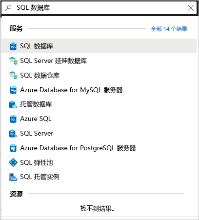
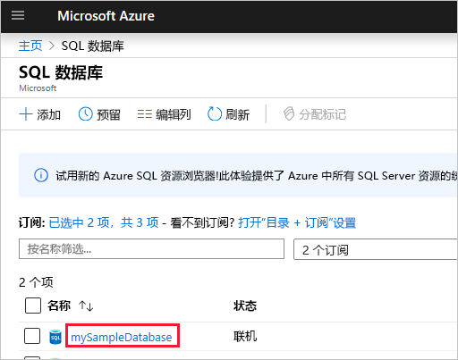

# <a name="quickstart-use-the-azure-portals-sql-query-editor-to-connect-and-query-data"></a>快速入门：使用 Azure 门户的 SQL 查询编辑器进行连接并查询数据

SQL 查询编辑器是一个 Azure 门户浏览器工具，它提供了一种在 Azure SQL 数据库或 Azure SQL 数据仓库上执行 SQL 查询的简便方法。 在本快速入门中，将使用查询编辑器连接到 SQL 数据库，然后运行 Transact-SQL 语句以查询、插入、更新和删除数据。

## <a name="prerequisites"></a>先决条件

要完成本教程，需要：

- Azure SQL 数据库。 可以根据下述快速入门之一，在 Azure SQL 数据库中创建数据库，然后对其进行配置：

  || 单一数据库 |
  |:--- |:--- |
  | 创建| [门户](sql-database-single-database-get-started.md) |
  || [CLI](scripts/sql-database-create-and-configure-database-cli.md) |
  || [PowerShell](scripts/sql-database-create-and-configure-database-powershell.md) |
  | 配置 | [服务器级别 IP 防火墙规则](sql-database-server-level-firewall-rule.md)|
  |||

> [!NOTE]
> 查询编辑器使用端口 443 和 1443 进行通信。  请确保已在这些端口上启用出站 HTTPS 流量。 还需要将出站 IP 地址添加到服务器的允许防火墙规则中，以访问你的数据库和数据仓库。

## <a name="sign-in-the-azure-portal"></a>登录 Azure 门户

登录 [Azure 门户](https://portal.azure.com/)。

## <a name="connect-using-sql-authentication"></a>使用 SQL 身份验证进行连接

1. 转到 Azure 门户以连接到 SQL 数据库。 搜索并选择“SQL 数据库”  。

    

2. 选择 SQL 数据库。

    

3. 在“SQL 数据库”菜单中，选择“查询编辑器(预览)”   。

    

4. 在“登录”页面的“SQL Server 身份验证”标签下，输入用于创建数据库的服务器管理员帐户的登录 ID 和密码     。 然后选择“确定”。 

    

## <a name="connect-using-azure-active-directory"></a>使用 Azure Active Directory 进行连接

配置一个 Azure Active Directory (Azure AD) 管理员即可使用单个标识登录到 Azure 门户和 SQL 数据库。 请按照以下步骤配置 SQL Server 的 Azure AD 管理员。

> [!NOTE]
> * Azure AD 管理员尚不支持电子邮件帐户（例如，outlook.com、gmail.com、yahoo.com 等）。 请确保选择在 Azure AD 中本机创建或联合到 Azure AD 中的用户。
> * Azure AD 管理员登录不适用于已启用双因素身份验证的帐户。

1. 在 Azure 门户菜单或“主页”页上，选择“所有资源”   。

2. 选择 SQL Server。

3. 从“SQL Server”菜单的“设置”中，选择“Active Directory 管理员”    。

4. 在 SQL Server“Active Directory 管理员”页工具栏中，选择“设置管理员”，然后选择用户或组作为 Azure AD 管理员   。

    

5. 在“添加管理员”页面的搜索框中，输入要查找的用户或组，选择其作为管理员，然后选择“选择”按钮   。

6. 返回 SQL Server“Active Directory 管理员”页工具栏中，选择“保存”   。

7. 在“SQL Server”菜单中，选择“SQL 数据库”，然后选择 SQL数据库   。

8. 在“SQL 数据库”菜单中，选择“查询编辑器(预览)”   。 在“登录”页面中的“Active Directory 身份验证”标签下，将显示一条消息，说明你已登录（如果你是 Azure AD 管理员）   。然后选择“以 \<用户或组 ID> 身份继续”按钮   。

## <a name="view-data"></a>查看数据

1. 完成身份验证后，在查询编辑器中粘贴以下 SQL，按类别检索排名前 20 的产品。

   ```sql
    SELECT TOP 20 pc.Name as CategoryName, p.name as ProductName
    FROM SalesLT.ProductCategory pc
    JOIN SalesLT.Product p
    ON pc.productcategoryid = p.productcategoryid;
   ```

2. 在工具栏上，选择“运行”，然后查看“结果”窗格中的输出   。

   

## <a name="insert-data"></a>插入数据

运行以下 [INSERT](https://msdn.microsoft.com/library/ms174335.aspx) Transact-SQL 语句，将新产品添加到 `SalesLT.Product` 表中。

1. 将之前的查询替换为此查询。

    ```sql
    INSERT INTO [SalesLT].[Product]
           ( [Name]
           , [ProductNumber]
           , [Color]
           , [ProductCategoryID]
           , [StandardCost]
           , [ListPrice]
           , [SellStartDate]
           )
    VALUES
           ('myNewProduct'
           ,123456789
           ,'NewColor'
           ,1
           ,100
           ,100
           ,GETDATE() );
   ```


2. 选择“运行”在 `Product` 表中插入新行  。 “消息”窗格显示“查询已成功  ：受影响的行：1” **。**


## <a name="update-data"></a>更新数据

运行以下 [UPDATE](https://msdn.microsoft.com/library/ms177523.aspx) Transact-SQL 语句修改新产品。

1. 将之前的查询替换为此查询。

   ```sql
   UPDATE [SalesLT].[Product]
   SET [ListPrice] = 125
   WHERE Name = 'myNewProduct';
   ```

2. 选择“运行”更新 `Product` 表中的指定行  。 “消息”窗格显示“查询已成功  ：受影响的行：1” **。**

## <a name="delete-data"></a>删除数据

运行以下 [DELETE](https://msdn.microsoft.com/library/ms189835.aspx) Transact-SQL 语句删除新产品。

1. 将之前的查询替换为此查询：

   ```sql
   DELETE FROM [SalesLT].[Product]
   WHERE Name = 'myNewProduct';
   ```

2. 选择“运行”删除 `Product` 表中的指定行  。 “消息”窗格显示“查询已成功  ：受影响的行：1” **。**


## <a name="query-editor-considerations"></a>查询编辑器注意事项

使用查询编辑器时，需要注意以下要点。

* 查询编辑器使用端口 443 和 1443 进行通信。  请确保已在这些端口上启用出站 HTTPS 流量。 还需要将出站 IP 地址添加到服务器的允许防火墙规则中，以访问你的数据库和数据仓库。

* 查询编辑器使用专用链接，无需将客户端 IP 地址添加到 SQL 数据库防火墙中

* 按 F5 刷新查询编辑器页，任何正在处理的查询都将丢失。

* 查询编辑器不支持连接到 `master` 数据库。

* 查询执行的超时为 5 分钟。

* 查询编辑器仅支持地理数据类型的柱面投影。

* 不支持适用于数据库表和视图的 IntelliSense。 但是，此编辑器支持对已键入的名称启用自动完成功能。


## <a name="next-steps"></a>后续步骤

若要了解有关 Azure SQL 数据库支持的 Transact-SQL 的详细信息，请参阅[解析迁移到 SQL 数据库的过程中的 Transact-SQL 差异](sql-database-transact-sql-information.md)。
