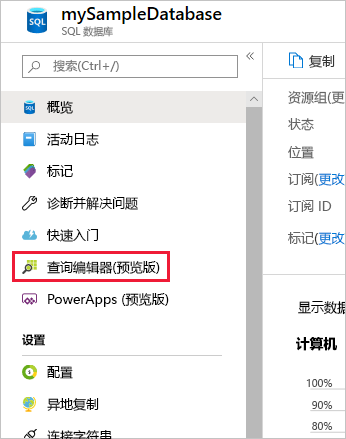
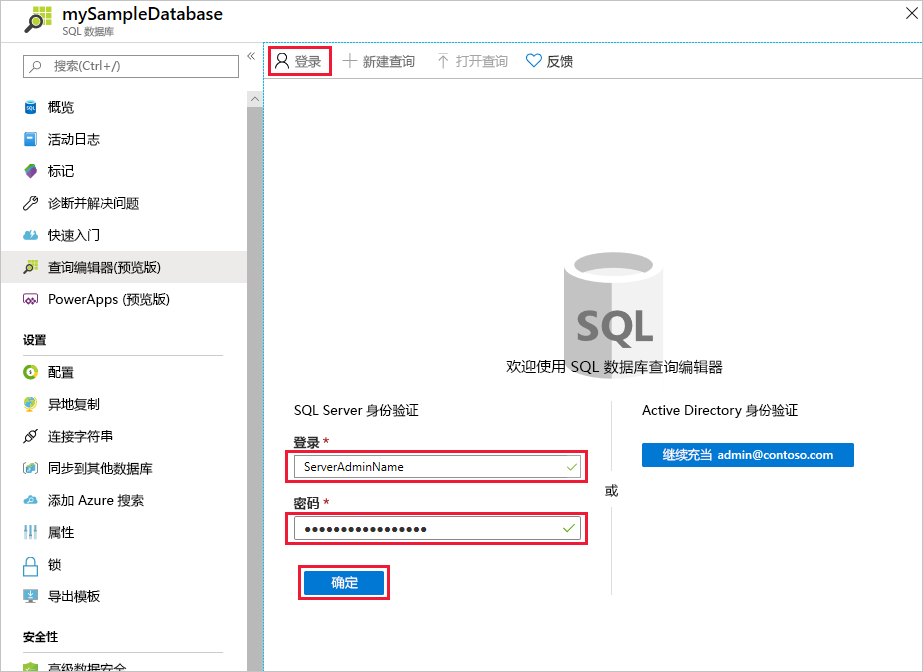
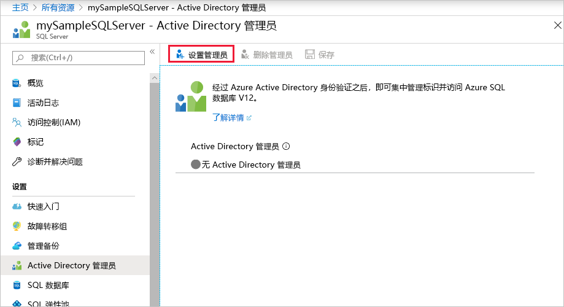
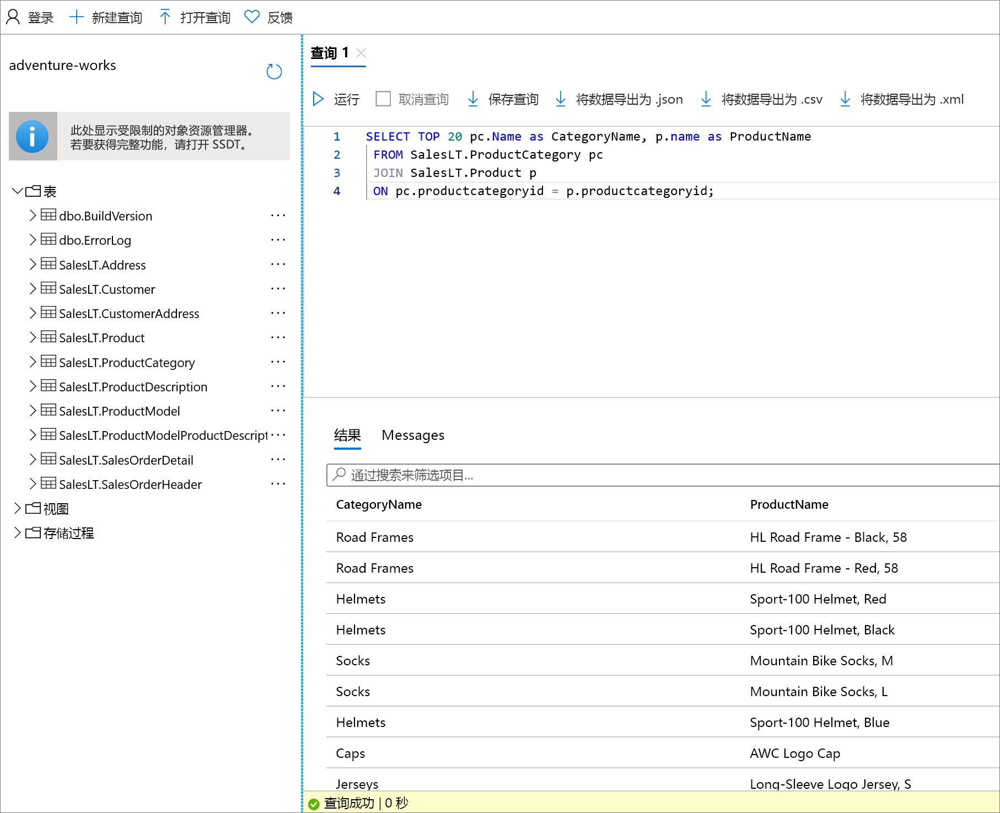

# <a name="azure-portal-use-the-sql-query-editor-to-connect-and-query-data"></a>Azure 门户：使用 SQL 查询编辑器进行连接并查询数据

SQL 查询编辑器是一款浏览器查询工具，可以轻松有效地在 Azure SQL 数据库或 Azure SQL 数据仓库中执行 SQL 查询，不需离开 Azure 门户。 此快速入门教程演示如何使用查询编辑器连接到 SQL 数据库，然后使用 Transact-SQL 语句在数据库中查询、插入、更新和删除数据。

## <a name="prerequisites"></a>先决条件

本快速入门使用以下某个快速入门中创建的资源作为其起点：

[!INCLUDE [prerequisites-create-db](../../includes/sql-database-connect-query-prerequisites-create-db-includes.md)]

> [!NOTE]
> 确保在 SQL Server 防火墙设置中将“允许访问 Azure 服务”选项设置为“打开”。 此选项允许 SQL 查询编辑器访问数据库和数据仓库。

## <a name="log-in-to-the-azure-portal"></a>登录到 Azure 门户

登录到 [Azure 门户](https://portal.azure.com/)。


## <a name="connect-using-sql-authentication"></a>使用 SQL 身份验证进行连接

1. 单击左侧菜单中的“SQL 数据库”，然后单击要查询的数据库。

2. 在数据库的 SQL 数据库页的左侧菜单中找到并单击“查询编辑器(预览)”。

    

3. 单击“登录”，在出现提示时选择“SQL Server 身份验证”，然后提供在创建数据库时提供的服务器管理员登录名和密码。

    

4. 单击“确定”登录。


## <a name="connect-using-azure-ad"></a>使用 Azure AD 进行连接

配置一个 Active Directory 管理员即可使用单个标识登录到 Azure 门户和 SQL 数据库。 请按以下步骤为所创建的 SQL Server 配置 Active Directory 管理员。

> [!NOTE]
> 目前尚不允许使用电子邮件帐户（例如 outlook.com、hotmail.com、live.com、gmail.com、yahoo.com）作为 Active Directory 管理员。 在选择用户时，请确保该用户原本就是在 Azure Active Directory 中创建的，或者是通过联合方式进入 Azure Active Directory 中的。

1. 从左侧菜单中选择“SQL Server”，然后从服务器列表中选择 SQL Server。

2. 从 SQL Server 的设置菜单中选择“Active Directory 管理员”设置。

3. 在 Active Directory 管理员边栏选项卡中，单击“设置管理员”命令，选择将成为 Active Directory 管理员的用户或组。

    

4. 在 Active Directory 管理员边栏选项卡顶部单击“保存”命令，设置 Active Directory 管理员。

导航到要查询的 SQL 数据库，单击左侧菜单中的“数据资源管理器(预览)”。 “数据资源管理器”页此时会打开，并自动将你连接到数据库。


## <a name="run-query-using-query-editor"></a>使用查询编辑器运行查询

完成身份验证后，在查询编辑器窗格中键入以下查询，按类别查询排名前 20 的产品。

```sql
 SELECT TOP 20 pc.Name as CategoryName, p.name as ProductName
 FROM SalesLT.ProductCategory pc
 JOIN SalesLT.Product p
 ON pc.productcategoryid = p.productcategoryid;
```

单击“运行”，然后在“结果”窗格中查看查询结果。



## <a name="insert-data-using-query-editor"></a>使用查询编辑器插入数据

通过以下代码使用 [INSERT](https://msdn.microsoft.com/library/ms174335.aspx) Transact-SQL 语句，将新产品插入到 SalesLT.Product 表中。

1. 在查询窗口中，以前的查询替换为以下查询：

   ```sql
   INSERT INTO [SalesLT].[Product]
           ( [Name]
           , [ProductNumber]
           , [Color]
           , [ProductCategoryID]
           , [StandardCost]
           , [ListPrice]
           , [SellStartDate]
           )
     VALUES
           ('myNewProduct'
           ,123456789
           ,'NewColor'
           ,1
           ,100
           ,100
           ,GETDATE() );
   ```

2. 在工具栏上单击“运行”，将新行插入 Product 表。

## <a name="update-data-using-query-editor"></a>使用查询编辑器更新数据

通过以下代码使用 [UPDATE](https://msdn.microsoft.com/library/ms177523.aspx) Transact-SQL 语句，以便更新此前添加的新产品。

1. 在查询窗口中，以前的查询替换为以下查询：

   ```sql
   UPDATE [SalesLT].[Product]
   SET [ListPrice] = 125
   WHERE Name = 'myNewProduct';
   ```

2. 在工具栏上单击“运行”，更新 Product 表中的指定行。

## <a name="delete-data-using-query-editor"></a>使用查询编辑器删除数据

通过以下代码使用 [DELETE](https://msdn.microsoft.com/library/ms189835.aspx) Transact-SQL 语句，以便删除此前添加的新产品。

1. 在查询窗口中，以前的查询替换为以下查询：

   ```sql
   DELETE FROM [SalesLT].[Product]
   WHERE Name = 'myNewProduct';
   ```

2. 在工具栏上单击“运行”，删除 Product 表中的指定行。


## <a name="query-editor-considerations"></a>查询编辑器注意事项

使用查询编辑器时，需要注意以下要点：

1. 确保在 Azure SQL Server 防火墙设置中将“允许访问 Azure 服务”选项设置为“打开”。 此选项允许 SQL 查询编辑器访问 SQL 数据库和数据仓库。

2. 如果 SQL Server 位于虚拟网络中，则无法使用查询编辑器来查询该服务器中的数据库。

3. 按 F5 键会刷新查询编辑器页面，丢失正在处理的查询。 请使用工具栏上的“运行”按钮来执行查询。

4. 查询编辑器不支持连接到 master 数据库

5. 查询执行的超时为 5 分钟。

6. Azure Active Directory 管理员登录不适用于已启用双重身份验证的帐户。

7. 目前尚不允许使用电子邮件帐户（例如 outlook.com、hotmail.com、live.com、gmail.com、yahoo.com）作为 Active Directory 管理员。 在选择用户时，请确保该用户原本就是在 Azure Active Directory 中创建的，或者是通过联合方式进入 Azure Active Directory 中的。

8. 查询编辑器仅支持地理数据类型的柱面投影。

9. 不支持适用于数据库表和视图的 IntelliSense。 但是，此编辑器支持针对已键入的名称启用自动完成功能。


## <a name="next-steps"></a>后续步骤

- 若要了解 Azure SQL 数据库支持的 Transact-SQL，请参阅 [SQL 数据库中的 Transact-SQL 差异](sql-database-transact-sql-information.md)。
