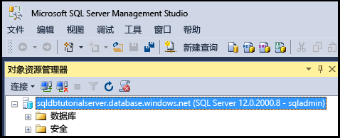
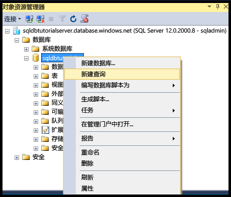

# <a name="connect-to-sql-database-with-sql-server-management-studio-and-execute-a-sample-t-sql-query"></a>使用 SQL Server Management Studio 连接到 SQL 数据库并执行示例 T-SQL 查询
> [!div class="op_single_selector"]
> * [Visual Studio](sql-database-connect-query.md)
> * [SSMS](sql-database-connect-query-ssms.md)
> * [Excel](sql-database-connect-excel.md)
> 

本文将介绍如何使用 SQL Server Management Studio (SSMS) 连接到 Azure SQL 数据库。 成功连接后，我们将运行一个简单的 Transact-SQL (T-SQL) 查询，验证与数据库的通信。

[!INCLUDE [SSMS Install](../../includes/sql-server-management-studio-install.md)]

1. 使用“下载 SQL Server Management Studio”下载并安装最新版本的 SSMS（如果尚未这样做）。[](https://msdn.microsoft.com/library/mt238290.aspx) 为保持最新状态，最新版本的 SSMS 会提示你有新版本可供下载。

2. 安装后，在 Windows 搜索框中键入 **Microsoft SQL Server Management Studio**，然后单击 **Enter** 打开 SSMS：

    
3. 在“连接到服务器”对话框中输入所需的信息，以便使用 SQL Server 身份验证连接到 SQL 服务器。

    
4. 单击“连接”。

    
5. 在“对象资源管理器”中，展开“数据库”，展开任何数据库以查看该数据库中的对象。

    
6. 右键单击此数据库，然后单击“新建查询”。

    
7. 在查询窗口中键入以下查询：

   ```select * from sys.objects```
   
8.  在工具栏上单击“执行”，返回示例数据库中所有系统对象的列表。

    

> [!Tip]
> 有关教程，请参阅[教程：使用 Azure 门户与 SQL Server Management Studio 预配和访问 Azure SQL 数据库](sql-database-get-started.md)。    
>

## <a name="next-steps"></a>后续步骤

- 可以按照与 SQL Server 基本相同的方法，使用 T-SQL 语句来创建和管理 Azure 中的数据库。 如果熟悉 T-SQL 与 SQL Server 的用法，请参阅 [Azure SQL 数据库 Transact-SQL 信息）](sql-database-transact-sql-information.md) ，大致了解它们之间的差异。
- 如果不熟悉 T-SQL，请参阅[教程：编写 Transact-SQL 语句](https://msdn.microsoft.com/library/ms365303.aspx)和 [Transact-SQL 参考（数据库引擎）](https://msdn.microsoft.com/library/bb510741.aspx)。
- 有关 SQL Server 身份验证的入门教程，请参阅 [SQL 身份验证和授权](sql-database-control-access-sql-authentication-get-started.md)
- 有关 Azure Active Directory 身份验证的入门教程，请参阅 [Azure AD 身份验证和授权](sql-database-control-access-aad-authentication-get-started.md)
- 有关 SSMS 的详细信息，请参阅 [使用 SQL Server Management Studio](https://msdn.microsoft.com/library/ms174173.aspx)。


<!--HONumber=Feb17_HO1-->


