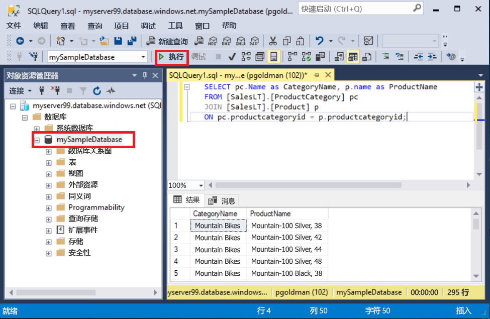
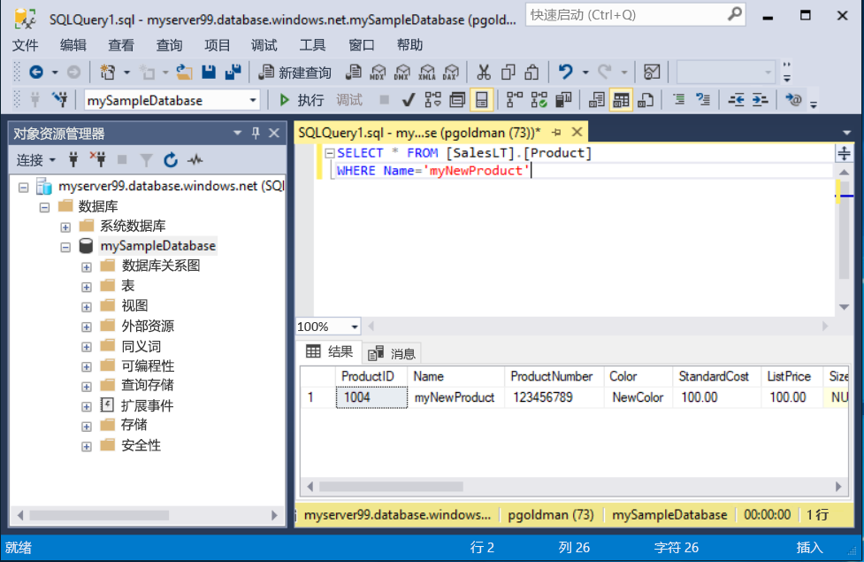

# <a name="quickstart-use-sql-server-management-studio-to-connect-and-query-an-azure-sql-database"></a>快速入门：使用 SQL Server Management Studio 连接和查询 Azure SQL 数据库

在本快速入门中，将使用 [SQL Server Management Studio][ssms-install-latest-84g] (SSMS) 连接到 Azure SQL 数据库。 然后，将运行 Transact-SQL 语句来查询、插入、更新和删除数据。 可以使用 SSMS 管理任何 SQL 基础结构（从适用于 Microsoft Windows 的 SQL Server 到 SQL 数据库，不一而足）。  

## <a name="prerequisites"></a>先决条件

- Azure SQL 数据库。 可以根据下述快速入门中的一个的说明在 Azure SQL 数据库中创建数据库，然后对其进行配置：

  || 单一数据库 | 托管实例 |
  |:--- |:--- |:---|
  | 创建| [门户](sql-database-single-database-get-started.md) | [门户](sql-database-managed-instance-get-started.md) |
  || [CLI](scripts/sql-database-create-and-configure-database-cli.md) | [CLI](https://medium.com/azure-sqldb-managed-instance/working-with-sql-managed-instance-using-azure-cli-611795fe0b44) |
  || [PowerShell](scripts/sql-database-create-and-configure-database-powershell.md) | [PowerShell](scripts/sql-database-create-configure-managed-instance-powershell.md) |
  | 配置 | [服务器级别 IP 防火墙规则](sql-database-server-level-firewall-rule.md)| [从 VM 进行连接](sql-database-managed-instance-configure-vm.md)|
  |||[从现场进行连接](sql-database-managed-instance-configure-p2s.md)
  |加载数据|根据快速入门加载的 Adventure Works|[还原 Wide World Importers](sql-database-managed-instance-get-started-restore.md)
  |||从 [GitHub](https://github.com/Microsoft/sql-server-samples/tree/master/samples/databases/adventure-works) 所提供的 [BACPAC](sql-database-import.md) 文件还原或导入 Adventure Works|
  |||

  > [!IMPORTANT]
  > 本文中脚本的编写目的是使用 Adventure Works 数据库。 使用托管实例时，必须将 Adventure Works 数据库导入一个实例数据库，或者修改本文中的脚本，以便使用 Wide World Importers 数据库。

## <a name="install-the-latest-ssms"></a>安装最新的 SSMS

在开始之前，请确保已安装最新的 [SSMS][ssms-install-latest-84g]。

## <a name="get-sql-server-connection-information"></a>获取 SQL Server 连接信息

获取连接到 Azure SQL 数据库所需的连接信息。 在后续过程中，将需要完全限定的服务器名称或主机名称、数据库名称和登录信息。

1. 登录到 [Azure 门户](https://portal.azure.com/)。

2. 导航到“SQL 数据库”或“SQL 托管实例”页。

3. 在“概览”页中，查看单一数据库的“服务器名称”旁边的完全限定的服务器名称，或者托管实例的“主机”旁边的完全限定的服务器名称。 若要复制服务器名称或主机名称，请将鼠标悬停在其上方，然后选择“复制”图标。

## <a name="connect-to-your-database"></a>连接到数据库

在 SMSS 中，连接到 Azure SQL 数据库服务器。

> [!IMPORTANT]
> Azure SQL 数据库服务器在端口 1433 上进行侦听。 若要从公司防火墙后连接到 SQL 数据库服务器，该防火墙必须打开此端口。
>

1. 打开 SSMS。 此时会显示“连接到服务器”对话框。

2. 输入以下信息：

   | 设置      | 建议的值    | 说明 |
   | ------------ | ------------------ | ----------- |
   | **服务器类型** | 数据库引擎 | 所需的值。 |
   | **服务器名称** | 完全限定的服务器名称 | 类似于：mynewserver20170313.database.windows.net。 |
   | **Authentication** | SQL Server 身份验证 | 本教程使用 SQL 身份验证。 |
   | **登录** | 服务器管理员帐户用户 ID | 用于创建服务器的服务器管理员帐户的用户 ID。 |
   | **密码** | 服务器管理员帐户密码 | 用于创建服务器的服务器管理员帐户的密码。 |
   ||||

     

3. 选择“连接到服务器”对话框中的“选项”。 在“连接到数据库”下拉菜单中，选择“mySampleDatabase”。

     

4. 选择“连接”。 此时会打开“对象资源管理器”窗口。

5. 要查看数据库的对象，请展开“数据库”，然后展开“mySampleDatabase”。

     

## <a name="query-data"></a>查询数据

运行此 [SELECT](https://msdn.microsoft.com/library/ms189499.aspx) Transact-SQL 代码，按类别查询前 20 个产品。

1. 在对象资源管理器中，右键单击“mySampleDatabase”，并选择“新建查询”。 此时会打开一个连接到数据库的新查询窗口。

2. 在查询窗口中，粘贴此 SQL 查询。

   ```sql
   SELECT pc.Name as CategoryName, p.name as ProductName
   FROM [SalesLT].[ProductCategory] pc
   JOIN [SalesLT].[Product] p
   ON pc.productcategoryid = p.productcategoryid;
   ```

3. 在工具栏上，选择“执行”，以便从 `Product` 和 `ProductCategory` 表检索数据。

    

## <a name="insert-data"></a>插入数据

运行此 [INSERT](https://msdn.microsoft.com/library/ms174335.aspx) Transact-SQL 代码，在 `SalesLT.Product` 表中创建新产品。

1. 将之前的查询替换为此查询。

   ```sql
   INSERT INTO [SalesLT].[Product]
           ( [Name]
           , [ProductNumber]
           , [Color]
           , [ProductCategoryID]
           , [StandardCost]
           , [ListPrice]
           , [SellStartDate] )
     VALUES
           ('myNewProduct'
           ,123456789
           ,'NewColor'
           ,1
           ,100
           ,100
           ,GETDATE() );
   ```

2. 选择“执行”在 `Product` 表中插入新行。 “消息”面板显示“(受影响的 1 行)”。

## <a name="view-the-result"></a>查看结果

1. 将之前的查询替换为此查询。

   ```sql
   SELECT * FROM [SalesLT].[Product]
   WHERE Name='myNewProduct'
   ```

2. 选择“执行”。 将显示以下结果。

   

## <a name="update-data"></a>更新数据

运行此 [UPDATE](https://msdn.microsoft.com/library/ms177523.aspx) Transact-SQL 代码以修改新产品。

1. 将之前的查询替换为此查询。

   ```sql
   UPDATE [SalesLT].[Product]
   SET [ListPrice] = 125
   WHERE Name = 'myNewProduct';
   ```

2. 选择“执行”更新 `Product` 表中的指定行。 “消息”面板显示“(受影响的 1 行)”。

## <a name="delete-data"></a>删除数据

运行此 [DELETE](https://msdn.microsoft.com/library/ms189835.aspx) Transact-SQL 代码以删除新产品。

1. 将之前的查询替换为此查询。

   ```sql
   DELETE FROM [SalesLT].[Product]
   WHERE Name = 'myNewProduct';
   ```

2. 选择“执行”删除 `Product` 表中的指定行。 “消息”面板显示“(受影响的 1 行)”。

## <a name="next-steps"></a>后续步骤

- 有关 SSMS 的信息，请参阅 [SQL Server Management Studio](https://msdn.microsoft.com/library/ms174173.aspx)。
- 若要使用 Azure 门户进行连接和查询，请参阅[使用 Azure 门户 SQL 查询编辑器进行连接和查询](sql-database-connect-query-portal.md)。
- 若要使用 Visual Studio Code 进行连接和查询，请参阅[使用 Visual Studio Code 进行连接和查询](sql-database-connect-query-vscode.md)。
- 若要使用 .NET 进行连接和查询，请参阅[使用 .NET 进行连接和查询](sql-database-connect-query-dotnet.md)。
- 若要使用 PHP 进行连接和查询，请参阅[使用 PHP 进行连接和查询](sql-database-connect-query-php.md)。
- 若要使用 Node.js 进行连接和查询，请参阅[使用 Node.js 进行连接和查询](sql-database-connect-query-nodejs.md)。
- 若要使用 Java 进行连接和查询，请参阅[使用 Java 进行连接和查询](sql-database-connect-query-java.md)。
- 若要使用 Python 进行连接和查询，请参阅[使用 Python 进行连接和查询](sql-database-connect-query-python.md)。
- 若要使用 Ruby 进行连接和查询，请参阅[使用 Ruby 进行连接和查询](sql-database-connect-query-ruby.md)。

<!-- Article link references. -->

[ssms-install-latest-84g]: https://docs.microsoft.com/sql/ssms/sql-server-management-studio-ssms