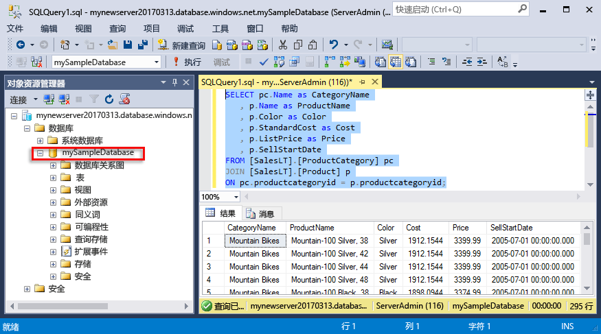
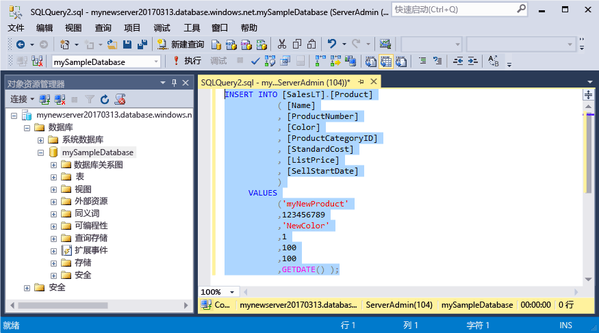
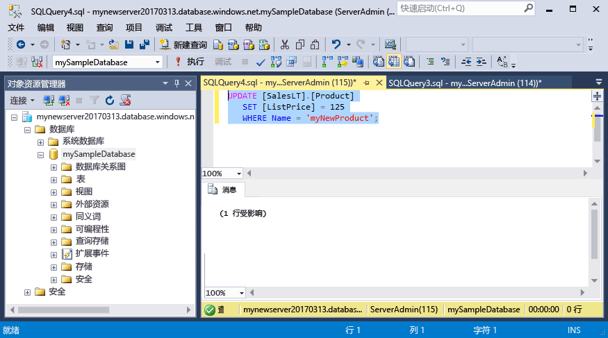
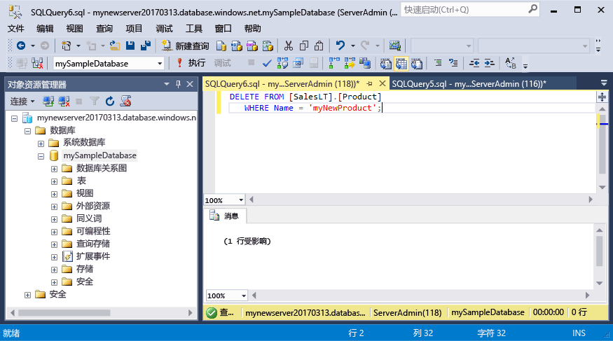

# <a name="azure-sql-database-use-sql-server-management-studio-to-connect-and-query-data"></a>Azure SQL 数据库：使用 SQL Server Management Studio 进行连接和数据查询

[SQL Server Management Studio](https://msdn.microsoft.com/library/ms174173.aspx) (SSMS) 是一项管理工具，用于通过用户界面或脚本创建和管理 SQL Server 资源。 本快速入门演示了如何使用 SSMS 连接到 Azure SQL 数据库，然后使用 Transact-SQL 语句在数据库中查询、插入、更新和删除数据。 

此快速入门使用以下某个快速入门中创建的资源作为其起点：

- [创建 DB - 门户](sql-database-get-started-portal.md)
- [创建 DB - CLI](sql-database-get-started-cli.md)

在开始之前，请确保已安装最新版本的 [SSMS](https://msdn.microsoft.com/library/mt238290.aspx)。 

## <a name="get-connection-information"></a>获取连接信息

请在 Azure 门户中获取 Azure SQL 数据库服务器的完全限定服务器名称。 请使用 SQL Server Management Studio 通过完全限定的服务器名称连接到服务器。

1. 登录到 [Azure 门户](https://portal.azure.com/)。
2. 从左侧菜单中选择“SQL 数据库”，然后单击“SQL 数据库”页上的数据库。 
3. 在数据库的“Azure 门户”页的“概要”窗格中，找到并复制“服务器名称”。

    


## <a name="connect-to-the-server-and-your-new-database"></a>连接到服务器和新数据库

使用 SQL Server Management Studio 建立到 Azure SQL 数据库服务器的连接。 

> [!IMPORTANT]
> Azure SQL 数据库逻辑服务器在端口 1433 上进行侦听。 如果尝试在企业防火墙内连接到 Azure SQL 数据库逻辑服务器，则必须在企业防火墙中打开此端口，否则无法成功进行连接。
>

1. 打开 SQL Server Management Studio。

2. 在“连接到服务器”对话框中，输入以下信息：
   - **服务器类型**：指定数据库引擎
   - **服务器名称**：输入完全限定的服务器名称，例如 **mynewserver20170313.database.windows.net**
   - **身份验证**：指定 SQL Server 身份验证
   - **登录名**：输入服务器管理员帐户
   - **密码**：输入服务器管理员帐户的密码

     

3. 单击“选项” 。 在“连接到数据库”部分输入 **mySampleDatabase**，以便连接到你此前创建的该数据库。

     

4. 单击“连接”。 此时会在 SSMS 中打开“对象资源管理器”窗口。 

     

4. 在对象资源管理器中展开“数据库”，然后展开 **mySampleDatabase**，查看示例数据库中的对象。

## <a name="query-data"></a>查询数据

使用 [SELECT](https://msdn.microsoft.com/library/ms189499.aspx) Transact-SQL 语句查询 Azure SQL 数据库中的数据。

1. 在“对象资源管理器”中，右键单击“mySampleDatabase”，然后单击“新建查询”。 此时会打开一个空白查询窗口，该窗口连接到数据库。
2. 在查询窗口中输入以下查询：

   ```sql
   SELECT pc.Name as CategoryName, p.name as ProductName
   FROM [SalesLT].[ProductCategory] pc
   JOIN [SalesLT].[Product] p
   ON pc.productcategoryid = p.productcategoryid;
   ```

3. 在工具栏中，单击“执行”从 Product 表和 ProductCategory 表检索数据。

    

## <a name="insert-data"></a>插入数据

使用 [INSERT](https://msdn.microsoft.com/library/ms174335.aspx) Transact-SQL 语句将数据插入 Azure SQL 数据库。

1. 在查询窗口中，将以前的查询替换为以下查询：

   ```sql
   INSERT INTO [SalesLT].[Product]
           ( [Name]
           , [ProductNumber]
           , [Color]
           , [ProductCategoryID]
           , [StandardCost]
           , [ListPrice]
           , [SellStartDate]
           )
     VALUES
           ('myNewProduct'
           ,123456789
           ,'NewColor'
           ,1
           ,100
           ,100
           ,GETDATE() );
   ```

2. 在工具栏上单击“执行”，将新行插入 Product 表。

    

## <a name="update-data"></a>更新数据

使用 [UPDATE](https://msdn.microsoft.com/library/ms177523.aspx) Transact-SQL 语句更新 Azure SQL 数据库中的数据。

1. 在查询窗口中，将以前的查询替换为以下查询：

   ```sql
   UPDATE [SalesLT].[Product]
   SET [ListPrice] = 125
   WHERE Name = 'myNewProduct';
   ```

2. 在工具栏上单击“执行”，更新 Product 表中的指定行。

    

## <a name="delete-data"></a>删除数据

使用 [DELETE](https://msdn.microsoft.com/library/ms189835.aspx) Transact-SQL 语句删除 Azure SQL 数据库中的数据。

1. 在查询窗口中，将以前的查询替换为以下查询：

   ```sql
   DELETE FROM [SalesLT].[Product]
   WHERE Name = 'myNewProduct';
   ```

2. 在工具栏上单击“执行”，删除 Product 表中的指定行。

    

## <a name="next-steps"></a>后续步骤

- 有关 SSMS 的信息，请参阅[使用 SQL Server Management Studio](https://msdn.microsoft.com/library/ms174173.aspx)。
- 若要使用 Visual Studio Code 进行连接和查询，请参阅[使用 Visual Studio Code 进行连接和查询](sql-database-connect-query-vscode.md)。
- 若要使用 .NET 进行连接和查询，请参阅[使用 .NET 进行连接和查询](sql-database-connect-query-dotnet.md)。
- 若要使用 PHP 进行连接和查询，请参阅[使用 PHP 进行连接和查询](sql-database-connect-query-php.md)。
- 若要使用 Node.js 进行连接和查询，请参阅[使用 Node.js 进行连接和查询](sql-database-connect-query-nodejs.md)。
- 若要使用 Java 进行连接和查询，请参阅[使用 Java 进行连接和查询](sql-database-connect-query-java.md)。
- 若要使用 Python 进行连接和查询，请参阅[使用 Python 进行连接和查询](sql-database-connect-query-python.md)。
- 若要使用 Ruby 进行连接和查询，请参阅[使用 Ruby 进行连接和查询](sql-database-connect-query-ruby.md)。

