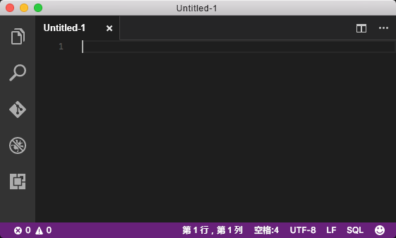
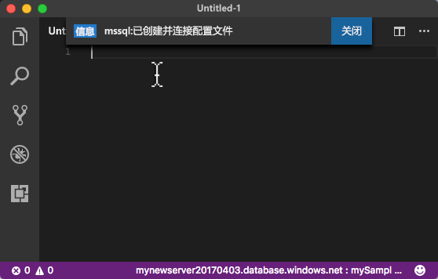

# <a name="azure-sql-database-use-visual-studio-code-to-connect-and-query-data"></a>Azure SQL 数据库：使用 Visual Studio Code 进行连接和数据查询

[Visual Studio Code](https://code.visualstudio.com/docs) 是一种图形代码编辑器，适用于 Linux、macOS 和 Windows，并且支持各种扩展，其中包括 [mssql 扩展](https://aka.ms/mssql-marketplace)（用于查询 Microsoft SQL Server、Azure SQL 数据库和 SQL 数据仓库）。 本快速入门演示了如何使用 Visual Studio Code 连接到 Azure SQL 数据库，并使用 Transact-SQL 语句在数据库中查询、插入、更新和删除数据。

## <a name="prerequisites"></a>先决条件

本快速入门使用以下某个快速入门中创建的资源作为其起点：

[!INCLUDE [prerequisites-create-db](../../includes/sql-database-connect-query-prerequisites-create-db-includes.md)]

#### <a name="install-vs-code"></a>安装 VS Code

在开始之前，请确保已安装最新版 [Visual Studio Code](https://code.visualstudio.com/Download) 并加载 [mssql 扩展](https://aka.ms/mssql-marketplace)。 有关 mssql 扩展的安装指南，请参阅 [Install VS Code](https://docs.microsoft.com/sql/linux/sql-server-linux-develop-use-vscode#install-vs-code)（安装 VS Code）和 [mssql for Visual Studio Code](https://marketplace.visualstudio.com/items?itemName=ms-mssql.mssql)（适用于 Visual Studio Code 的 mssql）。 

## <a name="configure-vs-code"></a>配置 VS Code 

### <a name="mac-os"></a>**Mac OS**
对于 macOS，需安装 OpenSSL，这是 mssql 扩展所使用的 DotNet Core 的先决条件。 打开终端并输入以下命令，以便安装 **brew** 和 **OpenSSL**。 

```bash
ruby -e "$(curl -fsSL https://raw.githubusercontent.com/Homebrew/install/master/install)"
brew update
brew install openssl
mkdir -p /usr/local/lib
ln -s /usr/local/opt/openssl/lib/libcrypto.1.0.0.dylib /usr/local/lib/
ln -s /usr/local/opt/openssl/lib/libssl.1.0.0.dylib /usr/local/lib/
```

### <a name="linux-ubuntu"></a>**Linux (Ubuntu)**

无需特殊配置。

### <a name="windows"></a>**Windows**

无需特殊配置。

## <a name="sql-server-connection-information"></a>SQL Server 连接信息

获取连接到 Azure SQL 数据库所需的连接信息。 在后续过程中，将需要完全限定的服务器名称、数据库名称和登录信息。

[!INCLUDE [prerequisites-server-connection-info](../../includes/sql-database-connect-query-prerequisites-server-connection-info-includes.md)]

## <a name="set-language-mode-to-sql"></a>将语言模式设置为 SQL

在 Visual Studio Code 中将语言模式设置为 **SQL**，以便启用 mssql 命令和 T-SQL IntelliSense。

1. 打开新的 Visual Studio Code 窗口。 

2. 单击状态栏右下角的“纯文本”。
3. 在打开的“选择语言模式”下拉列表中键入 **SQL**，然后按 **ENTER** 将语言模式设置为 SQL。 

   

## <a name="connect-to-your-database"></a>连接到数据库

使用 Visual Studio Code 建立到 Azure SQL 数据库服务器的连接。

> [!IMPORTANT]
> 在继续之前，请确保服务器、数据库和登录信息已准备就绪。 在开始输入连接配置文件信息的情况下，如果在 Visual Studio Code 中更改焦点，则需重新开始创建连接配置文件。
>

1. 在 VS Code 中，按 **CTRL+SHIFT+P**（或 **F1**）打开命令面板。

2. 键入 **sqlcon** 并按 **ENTER**。

3. 按 **ENTER** 选择“创建连接配置文件”。 这会为 SQL Server 实例创建连接配置文件。

4. 按照提示为新的连接配置文件指定连接属性。 指定每个值后，按 **ENTER** 继续。 

   | 设置       | 建议的值 | 说明 |
   | ------------ | ------------------ | ------------------------------------------------- | 
   | **服务器名称 | 完全限定的服务器名称 | 该名称应类似于：mynewserver20170313.database.windows.net。 |
   | **数据库名称** | mySampleDatabase | 要连接到其中的数据库的名称。 |
   | **身份验证** | SQL 登录名| SQL 身份验证是本教程中配置的唯一身份验证类型。 |
   | **用户名** | 服务器管理员帐户 | 这是在创建服务器时指定的帐户。 |
   | **密码(SQL 登录名)** | 服务器管理员帐户的密码 | 这是在创建服务器时指定的密码。 |
   | **保存密码?** | 是或否 | 如果不希望每次都输入密码，则请选择“是”。 |
   | 输入此配置文件的名称 | 配置文件名称，例如 mySampleDatabase。 | 保存配置文件名称可以在后续登录时加快连接速度。 | 

5. 按 ESC 键关闭信息消息，该消息通知你，配置文件已创建并且已连接。

6. 验证状态栏中的连接。

   

## <a name="query-data"></a>查询数据

通过以下代码使用 [SELECT](https://msdn.microsoft.com/library/ms189499.aspx) Transact-SQL 语句，以便按类别查询前 20 个产品。

1. 在“编辑器”窗口的空查询窗口中，输入以下查询：

   ```sql
   SELECT pc.Name as CategoryName, p.name as ProductName
   FROM [SalesLT].[ProductCategory] pc
   JOIN [SalesLT].[Product] p
   ON pc.productcategoryid = p.productcategoryid;
   ```

2. 按 **CTRL+SHIFT+E** 从 Product 表和 ProductCategory 表检索数据。

    

## <a name="insert-data"></a>插入数据

通过以下代码使用 [INSERT](https://msdn.microsoft.com/library/ms174335.aspx) Transact-SQL 语句，将新产品插入到 SalesLT.Product 表中。

1. 在“编辑器”窗口中删除以前的查询，并输入以下查询：

   ```sql
   INSERT INTO [SalesLT].[Product]
           ( [Name]
           , [ProductNumber]
           , [Color]
           , [ProductCategoryID]
           , [StandardCost]
           , [ListPrice]
           , [SellStartDate]
           )
     VALUES
           ('myNewProduct'
           ,123456789
           ,'NewColor'
           ,1
           ,100
           ,100
           ,GETDATE() );
   ```

2. 按 **CTRL+SHIFT+E** 在 Product 表中插入新行。

## <a name="update-data"></a>更新数据

通过以下代码使用 [UPDATE](https://msdn.microsoft.com/library/ms177523.aspx) Transact-SQL 语句，以便更新此前添加的新产品。

1.  在“编辑器”窗口中删除以前的查询，并输入以下查询：

   ```sql
   UPDATE [SalesLT].[Product]
   SET [ListPrice] = 125
   WHERE Name = 'myNewProduct';
   ```

2. 按 **CTRL+SHIFT+E** 更新 Product 表中的指定行。

## <a name="delete-data"></a>删除数据

通过以下代码使用 [DELETE](https://docs.microsoft.com/sql/t-sql/statements/delete-transact-sql) Transact-SQL 语句，以便删除此前添加的新产品。

1. 在“编辑器”窗口中删除以前的查询，并输入以下查询：

   ```sql
   DELETE FROM [SalesLT].[Product]
   WHERE Name = 'myNewProduct';
   ```

2. 按 **CTRL+SHIFT+E** 删除 Product 表中的指定行。

## <a name="next-steps"></a>后续步骤

- 若要使用 SQL Server Management Studio 进行连接和查询，请参阅[使用 SSMS 进行连接和查询](sql-database-connect-query-ssms.md)。
- 若要使用 Azure 门户进行连接和查询，请参阅[使用 Azure 门户 SQL 查询编辑器进行连接和查询](sql-database-connect-query-portal.md)。
- 有关使用 Visual Studio Code 的 MSDN 杂志文章，请参阅[“利用 MSSQL 扩展创建数据库 IDE”博客文章](https://msdn.microsoft.com/magazine/mt809115)。
