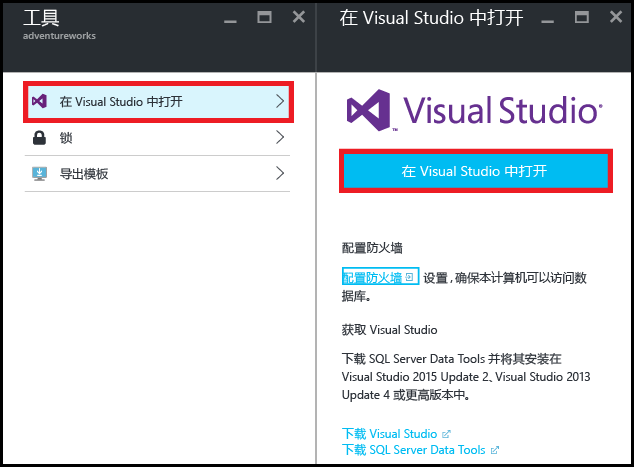
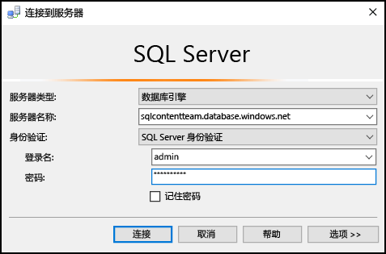
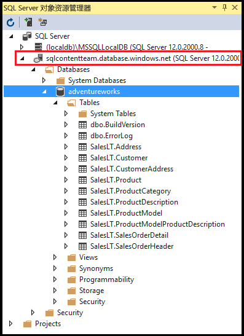
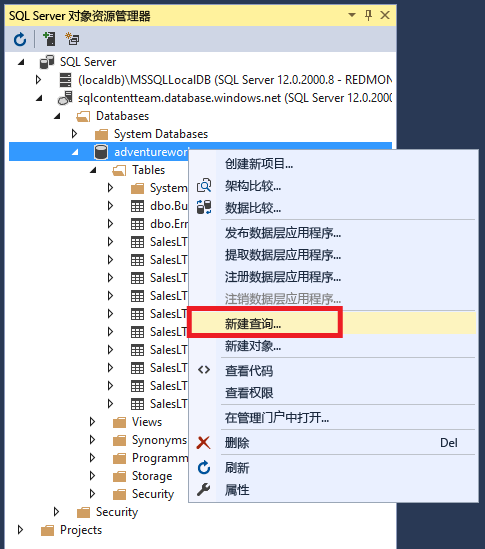
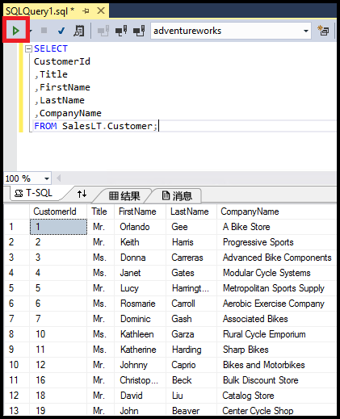

# 使用 Visual Studio 连接到 SQL 数据库

了解如何使用 Visual Studio 连接到 Azure SQL 数据库。 

## 先决条件
若要使用 Visual Studio 连接到 SQL 数据库，需要以下内容： 

* 要连接到的 SQL 数据库。 本文使用的是 **AdventureWorks** 示例数据库。 若要获取 AdventureWorks 示例数据库，请参阅 [创建演示数据库](sql-database-get-started.md)。
* Visual Studio 2013 Update 4（或更高版本）。 Microsoft 现在 *免费*提供 Visual Studio Community。
  
  * [Visual Studio Community，下载](http://www.visualstudio.com/products/visual-studio-community-vs)
  * [Visual Studio 的更多免费选项](http://www.visualstudio.com/products/free-developer-offers-vs.aspx)

## 从 Azure 门户打开 Visual Studio
1. 登录到 [Azure 门户](https://portal.azure.com/)。
2. 单击“更多服务” > “SQL 数据库”
3. 找到并单击“AdventureWorks”数据库即可打开“AdventureWorks”数据库边栏选项卡。
4. 在该数据库边栏选项卡顶部，单击“工具”  按钮：
   
    
5. 单击“在 Visual Studio 中打开”  （如果需要安装 Visual Studio，请单击下载链接）：
   
    
6. Visual Studio 将与“连接到服务器”  窗口（已设置为连接到在门户中所选的服务器和数据库）一起打开。  （单击“选项”即可验证连接是否已设置到正确数据库。）键入服务器管理员密码，然后单击“连接”。

    

1. 如果没有为计算机的 IP 地址设置防火墙规则，将在此处收到“无法连接”  消息。 若要创建防火墙规则，请参阅 [配置 Azure SQL 数据库服务器级防火墙规则](sql-database-configure-firewall-settings.md)。
2. 成功连接到数据库后，“SQL Server 对象资源管理器”  窗口将随之打开。
   
    

## 运行示例查询
鉴于我们已连接到数据库，下列步骤将介绍如何运行简单的查询：

1. 右键单击数据库，然后选择“新建查询” 。
   
    
2. 在查询窗口中，复制并粘贴以下代码。
   
        SELECT
        CustomerId
        ,Title
        ,FirstName
        ,LastName
        ,CompanyName
        FROM SalesLT.Customer;
3. 单击“执行”  按钮运行查询：
   
    

## 后续步骤
* 在 Visual Studio 中打开 SQL 数据库将使用 SQL Server 数据工具。 有关详细信息，请参阅 [SQL Server 数据工具](https://msdn.microsoft.com/library/hh272686.aspx)。
* 若要使用代码连接到 SQL 数据库，请参阅 [使用 .NET (C#) 连接到 SQL 数据库](sql-database-develop-dotnet-simple.md)。

