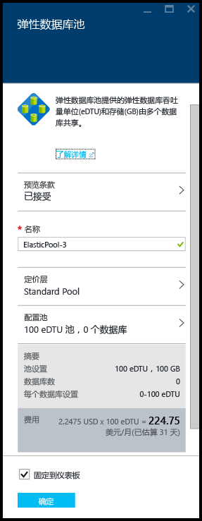
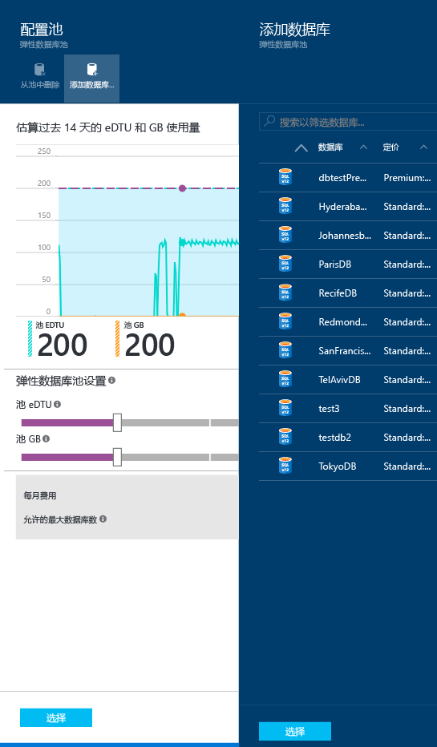
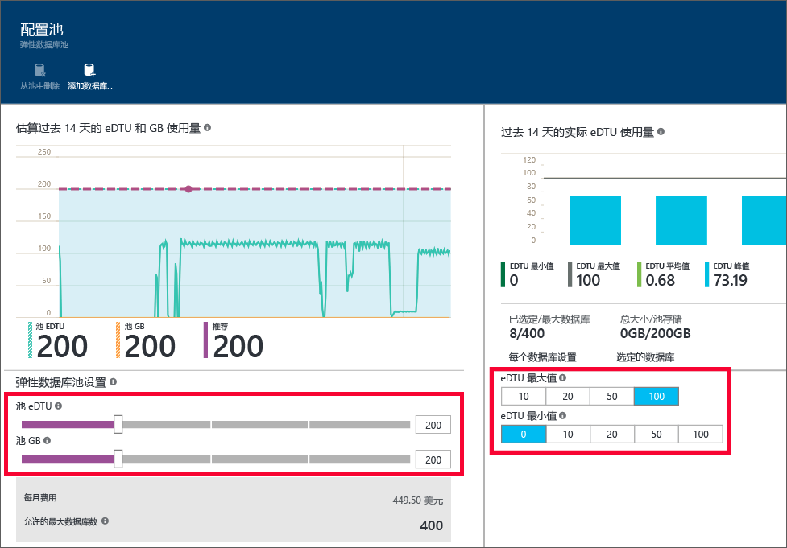

<properties
	pageTitle="使用 Azure 门户创建新的弹性池 | Microsoft Azure"
	description="如何将可缩放的弹性数据库池添加到 SQL 数据库配置，以简化多个数据库的管理和资源共享。"
	keywords="可缩放的数据库,数据库配置"
	services="sql-database"
	documentationCenter=""
	authors="ninarn"
	manager="jhubbard"
	editor=""/>

<tags
	ms.service="sql-database"
	ms.devlang="NA"
	ms.date="07/20/2016"
	ms.author="ninarn"
	ms.workload="data-management"
	ms.topic="get-started-article"
	ms.tgt_pltfrm="NA"/>

# 使用 Azure 门户创建新的弹性数据库池

> [AZURE.SELECTOR]
- [Azure 门户](sql-database-elastic-pool-create-portal.md)
- [PowerShell](sql-database-elastic-pool-create-powershell.md)
- [C#](sql-database-elastic-pool-create-csharp.md)

本文介绍如何在 [Azure 门户](https://portal.azure.com/)中创建可缩放的[弹性数据库池](sql-database-elastic-pool.md)。可以通过两种方法创建池。如果你知道想要的池设置，可以从头开始创建，或者根据服务的建议进行创建。SQL 数据库具有内置智能，可以根据数据库的过去的使用遥测数据来推荐更加经济高效的池设置。

可以将多个池添加到服务器，但不能将数据库从不同的服务器添加到同一个池中。若要创建池，需要在 V12 服务器中至少有一个数据库。如果你没有这样的数据库，请参阅[创建首个 Azure SQL 数据库](sql-database-get-started.md)。可以创建只有一个数据库的池，但是池只有在具有多个数据库时才会经济高效。请参阅[弹性数据库池的价格和性能注意事项](sql-database-elastic-pool-guidance.md)。

> [AZURE.NOTE] 弹性池在所有 Azure 区域中均已正式发布 (GA)，但美国中北部和印度西部除外，这些区域当前仅发布了预览版。将尽快在这些区域中正式发布弹性池。此外，弹性池当前不支持使用[内存中 OLTP 或内存中分析](sql-database-in-memory.md)的数据库。

## 步骤 1：创建新池

本文介绍如何在门户的现有“服务器”边栏选项卡中创建新池，这是将现有数据库移到池中的最简单方法。

> [AZURE.NOTE] 无论是否具有服务器，都可以在“SQL 弹性池”边栏选项卡中（在门户左侧的列表下面，单击“浏览”**>**“SQL 弹性池”）创建新池。单击“SQL 弹性池”边栏选项卡上的“+添加”，可提供池预配工作流中创建新服务器的步骤。

1. 在 [Azure 门户](http://portal.azure.com/)左侧的列表下面，单击“浏览”**>**“SQL 服务器”，然后单击包含要添加到池的数据库的服务器。
2. 单击“新建池”。

    

    **- 或 -**

    你可能会看到一条消息说该服务器已有建议的弹性数据库池（仅限 V12）。单击消息以查看基于历史数据库使用量遥测的建议池，然后单击层以查看更多详细信息并自定义池。有关如何进行建议的信息，请参阅本主题后面的[了解池建议](#understand-pool-recommendations)。

    

    显示“弹性数据库池”边栏选项卡，可在其中设置池。如果在上一步骤中单击了“新建池”，则门户在“定价层”下选择“标准池”，以及为池选择唯一“名称”和默认配置。如果选择了建议池，则池的建议层和配置已处于选择状态，不过你仍可以更改它们。

    

3. 指定弹性池的名称，或保留默认名称。

## 步骤 2：选择定价层

该池的定价层决定了池中弹性数据库的可用功能、eDTU 数目上限 (DTU MAX)，以及每个数据库的可用存储 (GB)。有关详细信息，请参阅“服务层”。

若要更改池的定价层，请单击“定价层”，单击所需定价层，然后单击“选择”。

> [AZURE.IMPORTANT] 选择定价层并在最后一个步骤中单击“确定”来提交更改之后，便无法更改池的定价层。若要更改现有弹性池的定价层，请在所需的定价层中创建新的弹性池，然后将弹性数据库移转到这个新池。

## 步骤 3：配置池

设置定价层后，请单击“配置池”，在其中添加数据库、设置池 eDTU 和存储（池 GB），并且在其中为池中的弹性数据库设置最小值和最大值 eDTU。

1. 单击“配置池”
2. 选择要添加到池的数据库。创建池时该步骤是可选的。创建池后可以添加数据库。若要添加数据库，请单击“添加数据库”，单击要添加的数据库，然后单击“选择”按钮。

    

    如果所使用的数据库具有足够的历史使用情况遥测数据，则将更新“估计的弹性 DTU 和 GB 使用量”图表和“弹性 DTU 实际使用量”条形图，以帮助进行配置决策。此外，服务可能会向你提供建议消息，以帮助正确调整池大小。请参阅[动态建议](#dynamic-recommendations)。

3. 使用“配置池”页面上的控件浏览设置并配置池。请参阅 [Elastic pools limits](sql-database-elastic-pool.md#edtu-and-storage-limits-for-elastic-pools-and-elastic-databases)（弹性池限制）以了解有关每个服务层的限制的详细信息，以及参阅 [Price and performance considerations for elastic database pools](sql-database-elastic-pool-guidance.md)（弹性数据库池的价格和性能注意事项）以了解有关正确调整池大小的详细指南。有关池设置的详细信息，请参阅 [Elastic database pool properties](sql-database-elastic-pool.md#elastic-database-pool-properties)（弹性数据库池属性）。

	

4. 更改设置后单击“配置池”边栏选项卡中的“选择”。
5. 单击“确定”以创建池。

## 了解池建议

SQL 数据库服务将评估使用量历史记录，并在比使用单一数据库更符合成本效益时，建议使用一个或多个池。每项建议是使用最适合该池的服务器数据库的唯一子集配置的。

池建议包括：

- 池的定价层（基本、标准或高级）
- 合适的**池弹性 DTU**（也称为每个池的“弹性 DTU 最大值”）
- 每个数据库的**弹性 DTU 最大值**和**弹性 DTU 最小值**
- 池的建议数据库列表

建议池时，服务将考虑过去 30 天的遥测数据。被视为弹性数据库池候选项的数据库必须至少存在 7 天。已在弹性数据库池中的数据库不被视为建议的弹性数据库池候选项。

服务会评估将每个服务层中的单一数据库移到同一层的池的资源需求和成本效益。例如，评估服务器上的所有标准数据库是否适合标准弹性池。这意味着，服务不进行跨层建议，例如将标准数据库移到高级池。

### 动态建议

将数据库添加到池中后，将基于所选数据库的历史使用情况动态地生成建议。这些建议显示在 eDTU 和 GB 使用情况图表中以及“配置池”边栏选项卡顶部的建议横幅中。这些建议旨在帮助你创建针对特定数据库进行了优化的池。

## 其他资源

- [使用门户管理 SQL 数据库弹性池](sql-database-elastic-pool-manage-portal.md)
- [使用 PowerShell 管理 SQL 数据库弹性池](sql-database-elastic-pool-manage-powershell.md)
- [使用 C# 管理 SQL 数据库弹性池](sql-database-elastic-pool-manage-csharp.md)
- [Scaling out with Azure SQL Database（使用 Azure SQL 数据库进行扩展）](sql-database-elastic-scale-introduction.md)

<!---HONumber=AcomDC_0921_2016-->