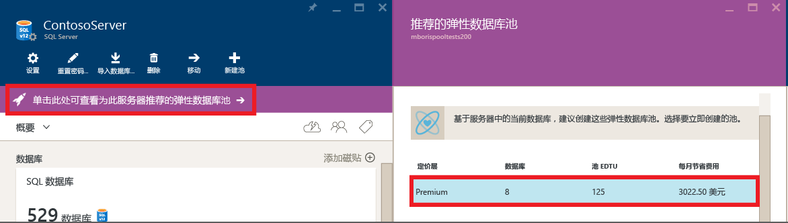

# 弹性池有助于管理和缩放多个 Azure SQL 数据库

SQL 数据库弹性池是一种简单且经济高效的解决方案，用于管理和缩放具有不断变化且不可预测的使用需求的多个数据库。 同一弹性池中的所有数据库都位于单个 Azure SQL 数据库服务器上，并以固定价格共享固定数量的资源（[弹性数据库事务单位](sql-database-what-is-a-dtu.md) (eDTU)）。 Azure SQL 数据库中的弹性池可使 SaaS 开发人员将一组数据库的价格性能优化在规定的预算内，同时为每个数据库提供性能弹性。 

> [!NOTE]
> 弹性池在所有 Azure 区域中均已正式发布 (GA)，但印度西部除外，这些区域当前仅发布了预览版。 将尽快在此区域中正式发布弹性池。
>

## 什么是 SQL 弹性池？ 

SaaS 开发人员构建在由多个数据库组成的大规模数据层上的应用程序。 常见的应用程序模式是为每位客户设置单一数据库。 但不同的客户通常拥有不同和不可预测的使用模式，很难预测每位数据库用户的资源需求。 传统上，有两个选择： 

- 基于高峰使用情况和付款情况过度预配资源或
- 采用低配节省成本，但这样会牺牲高峰期的性能和客户满意度。 

弹性池通过确保数据库获取需要时所需的性能资源来解决这个问题。 它们提供了一个可预测预算内的简单的资源分配机制。 若要深入了解如何通过弹性池设计 SaaS 应用程序的模式，请参阅 [具有 Azure SQL 数据库的多租户 SaaS 应用程序的设计模式](sql-database-design-patterns-multi-tenancy-saas-applications.md)。

> [!VIDEO https://channel9.msdn.com/Blogs/Azure/Elastic-databases-helps-SaaS-developers-tame-explosive-growth/player]
>

弹性池可让开发人员为由多个数据库共享的池购买[弹性数据库事务单位](sql-database-what-is-a-dtu.md) (eDTU)，以适应单一数据库使用时段不可预测的情况。 池的 eDTU 要求取决于其数据库的聚合使用量。 池可用的 eDTU 数量由开发者预算控制。 开发人员只需将数据库添加到池，为数据库设置 eDTU 最小值和最大值，然后根据其预算设置池的 eDTU。 开发人员可以使用池顺畅地扩大其服务，以渐增的规模从精简的新创公司发展到成熟的企业。

在池中，单独的数据库都被赋予了在固定参数内自动缩放的灵活性。 高负荷下的数据库可能会消耗更多的 eDTU 以满足需求。 低负荷下的数据库消耗较少的 eDTU，没有任何负荷的数据库不会消耗任何 eDTU。 设置整个池（而非单个数据库）的资源简化了管理任务。 此外，必须具有该池的可预测预算。 可将更多 eDTU 添加现有池而不会造成数据库关闭，除非需要移动数据库以便提供更多计算资源来预留新 eDTU。 同样，随时可以从现有池中删除不再需要的额外 eDTU。 并且可以向池添加或缩减数据库。 如果可以预测到数据库的资源利用率不足，则将其移出。

## 何时应当考虑使用 SQL 数据库弹性池？

池很适合具有特定使用模式的大量数据库。 对于给定的数据库，此模式的特征是低平均使用量与相对不频繁的使用高峰。

可以加入池的数据库越多，实现的节省就越大。 但根据应用程序使用模式，可能会看到与使用两个 S3 数据库一样少的节约。 

以下各部分将帮助用户了解如何评估特定的数据库集合是否会因使用池而受益。 这些示例使用标准池，但同样的原理也适用于基本和高级池。

### 评估数据库使用模式

下图显示了一个数据库示例，该数据库有大量的闲置时间，但也会定期出现活动高峰。 这是适合池的使用模式：

   

在所示的五分钟时间段内，DB1 高峰最高达到 90 个 DTU，但其整体平均使用量低于五个 DTU。 在单一数据库中，运行此工作负荷需要 S3 性能级别，但在低活动期间，大多数资源都处在未使用的状态。

池可让这些未使用的 DTU 跨多个数据库共享，因此减少了所需的 DTU 和总体成本。

以上一个示例为基础，假设有其他数据库具有与 DB1 类似的使用模式。 在接下来的两个图形中，4 个数据库和 20 个数据库的使用量分层放在相同的图形，以说明随时间推移，它们的使用率非重叠的性质：

   

   

在上图中，黑线表示跨所有 20 个数据库的聚合 DTU 使用量。 其中表明聚合 DTU 使用量永远不会超过 100 个 DTU，并指出 20 个数据库可以在这段期间共享 100 个 eDTU。 相比于将每个数据库放在单一数据库的 S3 性能级别，这会导致 DTU 减少 20 倍和价格降低 13 倍。

由于以下原因，此示例很理想：

* 每一数据库之间的高峰使用量和平均使用量有相当大的差异。 
* 每个数据库的高峰使用量在不同时间点发生。
* eDTU 在多个数据库之间共享。

池的价格取决于池的 eDTU。 尽管池的 eDTU 单位价格比单一数据库的 DTU 的单位价格多 1.5 倍，但**池 eDTU 可由多个数据库共享，所需的 eDTU 总数更少**。 定价方面和 eDTU 共享的这些差异是池可以提供成本节省可能性的基础。 

以下数据库计数和数据库使用率相关规则的经验法则可帮助确保池提供相比于使用单一数据库的性能级别降低的成本。

### 数据库的最小数目

如果单一数据库的性能级别的 DTU 总和比池所需的 eDTU 多 1.5 倍，则弹性池更具成本效益。 有关可用的大小，请参阅[弹性池和弹性数据库的 eDTU 和存储限制](sql-database-resource-limits.md#elastic-pool-storage-sizes-and-performance-levels)。

***示例*** 
至少需要 2 个 S3 数据库或 15 个 S0 数据库，才能使 100 个 eDTU 池比使用单一数据库性能级别更具成本效益。

### 并发高峰数据库的最大数目

通过共享 eDTU，并非池中的所有数据库都能同时使用 eDTU 达到使用单一数据库的性能级别时的最大限制。 并发高峰的数据库越少，可以设置的池 eDTU 就越低，也就能实现池更大的成本效益。 一般而言，池中不能有 2/3（或 67%）以上的数据库的高峰同时达到其 eDTU 限制。

***示例*** 
为了降低 200 个 eDTU 池内 3 个 S3 数据库的成本，在使用过程中最多可使其中两个数据库同时处于高峰。 否则，如果四个 S3 数据库中超过两个同时高峰，则必须将池缩放为超过 200 个 eDTU。 如果将池缩放大小为超过 200 个 eDTU，则需要加入更多的 S3 数据库到池，使成本始终低于单一数据库的性能级别。

请注意，此示例未考虑池中其他数据库的使用率。 如果在任何给定时间点，所有数据库都有一些使用量，则可以同时处于高峰的数据库应少于 2/3（或 67%）。

### 每个数据库的 DTU 使用率
数据库的高峰和平均使用率之间的差异为，长时间的低使用率和短时间的高使用率。 这个使用模式非常适合在数据库之间共享资源。 当数据库的高峰使用率比平均使用率大 1.5 倍左右时，应考虑将数据库用作池。

***示例*** 
高峰为 100 个 DTU 且平均使用 67 个或更少 DTU 的 S3 数据库是在池中共享 eDTU 的良好候选项。 或者，高峰为 20 个 DTU 且平均使用 13 个或更少 DTU 的 S1 数据库是池的良好候选项。

## 如何选择正确的池大小？

池的最佳大小取决于聚合 eDTU 和池中所有数据库所需的存储资源。 这涉及到决定以下两个数量的较大值：

* 池中所有数据库使用的最大 DTU。
* 池中所有数据库使用的最大存储字节。

有关可用的大小，请参阅[弹性池和弹性数据库的 eDTU 和存储限制](sql-database-resource-limits.md#elastic-pool-storage-sizes-and-performance-levels)。

SQL数据库自动评估现有 SQL 数据库服务器中数据库的历史资源使用率，并在 Azure 门户中推荐适当的池配置。 除推荐外，内置体验还估算服务器上自定义组数据库的 eDTU 使用率。 这样便可以执行“假设”分析，其方法为：通过交互方式将数据库添加到池并删除它们以在提交所做的更改之前获取资源使用率分析和调整建议。 相关操作方式，请参阅[监视、管理弹性池并调整其大小](sql-database-elastic-pool-manage-portal.md)。

在无法使用工具的情况下，以下分步步骤可以帮助你评估池是否比单一数据库更具成本效益：

1. 通过如下方式来估算池所需的 eDTU：

   MAX（<数据库的总数目 X 每一数据库的平均 DTU 使用率>、 
   <并发高峰数据库的数目** X 每一数据库的高峰 DTU 使用率**）
2. 通过将池内所有的数据库所需的字节数相加来估算池所需要的存储空间。 然后，确定提供此存储量的 eDTU 池的大小。 有关基于 eDTU 池大小的池存储限制，请参阅[弹性池和弹性数据库的 eDTU 和存储限制](sql-database-resource-limits.md#elastic-pool-storage-sizes-and-performance-levels)。
3. 选择步骤 1 和步骤 2 中 eDTU 估算值中较大的那个。
4. 请参阅 [SQL 数据库定价页面](https://azure.microsoft.com/pricing/details/sql-database/)，查找大于步骤 3 中估计值的最低 eDTU 池大小。
5. 将步骤 5 的池价格与单一数据库适当性能级别的价格相比较。

## 将其他 SQL 数据库功能与弹性池一起使用

### 弹性作业和弹性池

借助池，可以通过在**[弹性作业](sql-database-elastic-jobs-overview.md)**中运行脚本来简化管理任务。 弹性作业可消除与大量数据库有关的大部分麻烦。 若要开始使用该作业，请参阅[弹性作业入门](sql-database-elastic-jobs-getting-started.md)。

有关用于操作多个数据库的其他数据库工具的详细信息，请参阅[使用 Azure SQL 数据库进行扩展](sql-database-elastic-scale-introduction.md)。

### 弹性池中的数据库的业务连续性选项
入池数据库通常支持可用于单一数据库的相同的[业务连续性功能](sql-database-business-continuity.md)。

- **时间点还原**：时间点还原使用自动数据库备份将池中的数据库恢复到特定的时间点。 请参阅[时间点还原](sql-database-recovery-using-backups.md#point-in-time-restore)

- **异地还原**：当数据库因其所在的区域发生事故而不可用时，异地还原会提供默认的恢复选项。 请参阅[还原 Azure SQL 数据库或故障转移到辅助数据库](sql-database-disaster-recovery.md)

- **活动异地复制**：对于具有异地还原无法提供的更强烈的恢复要求的应用程序，请配置[活动异地复制](sql-database-geo-replication-overview.md)。

## 使用 Azure 门户管理弹性池和数据库

### 使用 Azure 门户创建新的 SQL 数据库弹性池

在 Azure 门户中可以通过两种方法创建弹性池。 如果知道想要的池设置，可以从头开始创建，或者根据服务的建议进行创建。 SQL 数据库具有内置智能，可以根据数据库过去的使用情况遥测数据来推荐更加经济高效的弹性池设置。 

在门户的现有服务器页中创建弹性池，这是将现有数据库移到弹性池中的最简单方法。 还可以通过在 **Marketplace** 中搜索“SQL 弹性池”，或者通过在 SQL 弹性池页中单击“+添加”来创建弹性池。 可以通过此池预配工作流指定新的或现有的服务器。

> [!NOTE]
> 可以在服务器上创建多个池，但不能将数据库从不同的服务器添加到同一个池中。
> 

该池的定价层决定了池中弹性数据库的可用功能、eDTU 数目上限 (eDTU MAX)，以及每个数据库的可用存储 (GB)。 有关详细信息，请参阅[弹性池的资源限制](sql-database-resource-limits.md#elastic-pool-storage-sizes-and-performance-levels)。

要更改池的定价层，请单击“定价层”，单击所需的定价层，并单击“选择”。

> [!IMPORTANT]
> 选择定价层并在最后一个步骤中单击“确定”来提交更改之后，便无法更改池的定价层。 要更改现有弹性池的定价层，请在所需的定价层中创建弹性池，并将数据库移转到这个新池。
>

如果所使用的数据库具有足够的历史使用情况遥测数据，则将更新“估计的弹性 DTU 和 GB 使用量”图表和“弹性 DTU 实际使用量”条形图，以帮助进行配置决策。 此外，服务可能会向你提供建议消息，以帮助正确调整池大小。

SQL 数据库服务将评估使用量历史记录，并在比使用单一数据库更符合成本效益时，建议使用一个或多个池。 每项建议是使用最适合该池的服务器数据库的唯一子集配置的。

 

池建议包括：

- 池的定价层（基本、标准、高级或高级 RS）
- 合适的 **池弹性 DTU** （也称为每个池的“弹性 DTU 最大值”）
- 每个数据库的“弹性 DTU 最大值”和“弹性 DTU 最小值”
- 池的建议数据库列表

> [!IMPORTANT]
> 建议池时，服务将考虑过去 30 天的遥测数据。 数据库若要被视为弹性池的候选项，则必须至少存在 7 天。 已在弹性池中的数据库不会被视为推荐的弹性池候选项。
>

服务会评估将每个服务层中的单一数据库移到同一层的池的资源需求和成本效益。 例如，评估服务器上的所有标准数据库是否适合标准弹性池。 这意味着，服务不进行跨层建议，例如将标准数据库移到高级池。

将数据库添加到池中后，会基于所选数据库的历史使用情况动态地生成建议。 这些建议显示在 eDTU 和 GB 使用情况图表中，以及“配置池”页顶部的建议横幅中。 这些建议旨在帮助创建针对特定数据库进行了优化的弹性池。

### 管理和监视弹性池

在 Azure 门户中，可以监视弹性池和该池中的数据库的利用率。 还可以对弹性池进行一组更改，并同时提交所有更改。 这些更改包括添加或删除数据库、更改弹性池设置或更改数据库设置。

下图显示一个示例弹性池。 视图包括：

* 监视弹性池以及池中包含的数据库的资源使用率的图表。
* 用于对弹性池进行更改的“配置”池按钮。
* 用于创建数据库并将其添加到当前弹性池的“创建数据库”按钮。
* 弹性作业，通过对列表中的所有数据库运行 Transact SQL 脚本来帮助管理大量数据库。

可以转到特定池以查看其资源利用率。 默认情况下，池配置为显示最近一小时的存储和 eDTU 使用率。 图表可以配置为按各种时间范围显示不同指标。 单击“弹性池监视”下的“资源利用率”图表可显示指定指标在指定时间窗口内的详细视图。

### 自定义图表显示

可以编辑图表和指标页以显示其他指标，如 CPU 百分比、数据 IO 百分比和已用日志 IO 百分比。

在“编辑图表”窗体中，可以选择时间范围（前一个小时、今天或过去一周），或单击“自定义”选择过去两周中的任何日期范围。 可以在条形图和折线图之间进行选择，然后选择要监视的资源。

> [!Note]
> 仅可同时在图表中显示具有相同度量单位的指标。 例如，如果选择“eDTU 百分比”，则只能选择以百分比作为度量单位的其他指标。
>

### 管理和监视弹性池中的数据库

还可以监视单个数据库以发现潜在问题。 “弹性数据库监视”下有一个图表，其中显示五个数据库的指标。 默认情况下，该图表显示池中按前一个小时平均 eDTU 使用率排名前五的数据库。 

在“弹性数据库监视”下单击“前一小时数据库的 eDTU 使用率”。 这将打开“数据库资源使用率”并提供池中数据库使用率的详细视图。 使用该页下半部分中的网格，可以选择池中的任何数据库以在图表中显示其使用率（最多 5 个数据库）。 还可以通过单击“编辑图表”来自定义在图表中显示的指标和时间范围。

### 自定义视图

可以编辑图表来选择时间范围（前一个小时或过去 24 小时），或单击“自定义”选择过去 2 周内的另一天进行显示。

还可以单击“数据库比较依据”下拉列表来选择在比较数据库时要使用的其他指标。

### 选择要监视的数据库

在“数据库资源利用率”页上的数据库列表中，可以通过浏览列表中的各页或通过键入数据库名称来查找特定数据库。 使用复选框可选择数据库。

### 向弹性池资源添加警报

可以向弹性池添加规则，以便在弹性池达到设置的利用率阈值时，向人员发送电子邮件或是向 URL 终结点发送警报字符串。

**向任何资源添加警报：**

1. 单击“资源利用率”图表以打开“指标”页，单击“添加警报”，并在“添加警报规则”页中填写信息（“资源”会自动设置为所使用的池）。
2. 键入可标识发送给你和收件人的警报的“名称”和“说明”。
3. 从列表中选择要发送相关警报的“指标”。

   图表会动态显示该指标的资源利用率，以帮助选择阈值。

4. 选择“条件”（大于、小于等）和“阈值”。
5. 选择触发警报前必须满足指标规则的时间段。
6. 单击 **“确定”**。

有关详细信息，请参阅[在 Azure 门户中创建 SQL 数据库警报](sql-database-insights-alerts-portal.md)。

### 将数据库移入弹性池

可以对现有池添加或删除数据库。 数据库可以位于其他池中。 但是，只能添加位于相同逻辑服务器上的数据库。

 

### 将数据库移出弹性池

### 更改弹性池的性能设置

监视弹性池的资源利用率时，可能会发现需要进行一些调整。 池可能需要在性能或存储限制方面进行更改。 可能要更改池中的数据库设置。 可以随时更改池的设置以获得性能和成本的最佳平衡。 请参阅[何时应使用弹性池？](sql-database-elastic-pool.md)，了解详细信息。

更改每个池的 eDTU 或存储限制以及每个数据库的 eDTU：

## 使用 PowerShell 管理弹性池和数据库

若要使用 Azure PowerShell 创建并管理 SQL 数据库弹性池，请使用以下 PowerShell cmdlet。 如果需要安装或升级 PowerShell，请参阅[安装 Azure PowerShell 模块](/powershell/azure/install-azurerm-ps)。 若要创建和管理数据库、服务器和防火墙规则，请参阅[使用 PowerShell 创建和管理 Azure SQL 数据库服务器和数据库](sql-database-servers-databases.md#manage-azure-sql-servers-databases-and-firewalls-using-powershell)。 

> [!TIP]
> 有关 PowerShell 示例脚本，请参阅[使用 PowerShell 创建弹性池、在池之间移动数据库以及将数据库移出池](scripts/sql-database-move-database-between-pools-powershell.md)和[使用 PowerShell 监视和缩放 Azure SQL 数据库中的 SQL 弹性池](scripts/sql-database-monitor-and-scale-pool-powershell.md)。
>

| Cmdlet | 说明 |
| --- | --- |
|[New-AzureRmSqlElasticPool](/powershell/module/azurerm.sql/new-azurermsqlelasticpool)|在逻辑 SQL 服务器上创建弹性数据库池。|
|[Get-AzureRmSqlElasticPool](/powershell/module/azurerm.sql/get-azurermsqlelasticpool)|获取逻辑 SQL 服务器上的弹性池及其属性值。|
|[Set-AzureRmSqlElasticPool](/powershell/module/azurerm.sql/set-azurermsqlelasticpool)|修改逻辑 SQL 服务器上的弹性数据库池的属性。 例如，使用 **StorageMB** 属性修改弹性池的最大存储。|
|[Remove-AzureRmSqlElasticPool](/powershell/module/azurerm.sql/remove-azurermsqlelasticpool)|删除逻辑 SQL 服务器上的弹性数据库池。|
|[Get-AzureRmSqlElasticPoolActivity](/powershell/module/azurerm.sql/get-azurermsqlelasticpoolactivity)|获取逻辑 SQL 服务器上的弹性池的运行状态。|
|[New-AzureRmSqlDatabase](/powershell/module/azurerm.sql/new-azurermsqldatabase)|在现有池中创建新数据库或将其创建为单一数据库。 |
|[Get-AzureRmSqlDatabase](/powershell/module/azurerm.sql/get-azurermsqldatabase)|获取一个或多个数据库。|
|[Set-AzureRmSqlDatabase](/powershell/module/azurerm.sql/set-azurermsqldatabase)|设置数据库的属性，将现有数据库移入、移出弹性池或在其之间移动。|
|[Remove-AzureRmSqlDatabase](/powershell/module/azurerm.sql/remove-azurermsqldatabase)|删除数据库。|

> [!TIP]
> 使用门户或每次只能创建一个单一数据库的 PowerShell cmdlet 在弹性池中创建多个数据库可能需要一段时间。 若要自动创建到弹性池中，请参阅 [CreateOrUpdateElasticPoolAndPopulate](https://gist.github.com/billgib/d80c7687b17355d3c2ec8042323819ae)。
>

## 使用 Azure CLI 管理弹性池和数据库

若要使用 [Azure CLI](/cli/azure/overview) 创建和管理 SQL 数据库弹性池，请使用下面的 [Azure CLI SQL 数据库](/cli/azure/sql/db)命令。 使用 [Cloud Shell](/azure/cloud-shell/overview) 在浏览器中运行 CLI，或者在 macOS、Linux 或 Windows 上[安装](/cli/azure/install-azure-cli)它。 

> [!TIP]
> 有关 Azure CLI 示例脚本，请参阅[使用 CLI 移动 SQL 弹性池中的 Azure SQL 数据库](scripts/sql-database-move-database-between-pools-cli.md)和[使用 Azure CLI 缩放 Azure SQL 数据库中的 SQL 弹性池](scripts/sql-database-scale-pool-cli.md)。
>

| Cmdlet | 说明 |
| --- | --- |
|[az sql elastic-pool create](/cli/azure/sql/elastic-pool#create)|创建弹性池。|
|[az sql elastic-pool list](/cli/azure/sql/elastic-pool#list)|返回服务器中弹性池的列表。|
|[az sql elastic-pool list-dbs](/cli/azure/sql/elastic-pool#list-dbs)|返回弹性池中数据库的列表。|
|[az sql elastic-pool list-editions](/cli/azure/sql/elastic-pool#list-editions)|还包括可用的池 DTU 设置、存储限制和每数据库设置。 为了降低冗长，默认情况下会隐藏附加的存储限制以及每数据库设置。|
|[az sql elastic-pool update](/cli/azure/sql/elastic-pool#update)|更新弹性池。|
|[az sql elastic-pool delete](/cli/azure/sql/elastic-pool#delete)|删除弹性池。|

## 使用 Transact-SQL 管理弹性池中的数据库

若要使用 Transact-SQL 在现有弹性池内创建和移动数据库或者返回有关 SQL 数据库弹性池的信息，请使用以下 T-SQL 命令。 可以使用 Azure 门户、[SQL Server Management Studio](/sql/ssms/use-sql-server-management-studio)、[Visual Studio Code](https://code.visualstudio.com/docs) 或可以连接到 Azure SQL 数据库服务器并传递 Transact-SQL 命令的其他任何程序，发出这些命令。 若要创建和管理数据库、服务器和防火墙规则，请参阅[使用 Transact-SQL 创建和管理 Azure SQL 数据库服务器和数据库](sql-database-servers-databases.md#manage-azure-sql-servers-databases-and-firewalls-using-transact-sql)。

> [!IMPORTANT]
> 无法使用 Transact-SQL 创建、更新或删除 Azure SQL 数据库弹性池。 可以在弹性池中添加或删除数据库，并且可以使用 DMV 返回有关现有弹性池的信息。
>

| 命令 | 说明 |
| --- | --- |
|[CREATE DATABASE (Azure SQL Database)](/sql/t-sql/statements/create-database-azure-sql-database)|在现有池中创建新数据库或将其创建为单一数据库。 必须连接到 master 数据库，才能新建数据库。|
| [ALTER DATABASE（Azure SQL 数据库）](/sql/t-sql/statements/alter-database-azure-sql-database) |将数据库移入、移出弹性池或在其之间移动。|
|[DROP DATABASE (Transact-SQL)](/sql/t-sql/statements/drop-database-transact-sql)|删除数据库。|
|[sys.elastic_pool_resource_stats（Azure SQL 数据库）](/sql/relational-databases/system-catalog-views/sys-elastic-pool-resource-stats-azure-sql-database)|返回逻辑服务器中所有弹性数据库池的资源使用率统计信息。 对于每个弹性数据库池，每 15 秒的报告窗口就会提供一行（每分钟四行）。 这包括池中所有数据库的 CPU、IO、日志和存储消耗以及并发的请求/会话利用率。|
|[sys.database_service_objectives (Azure SQL Database)](/sql/relational-databases/system-catalog-views/sys-database-service-objectives-azure-sql-database)|返回 Azure SQL 数据库或 Azure SQL 数据仓库的版本（服务层）、服务目标（定价层）和弹性池名称（若有）。 如果已登录 Azure SQL 数据库服务器中的 master 数据库，返回所有数据库的相关信息。 对于 Azure SQL 数据仓库，必须连接到 master 数据库。|

## 使用 REST API 管理弹性池和数据库

若要创建和管理 SQL 数据库弹性池，请使用这些 REST API 请求。

| 命令 | 说明 |
| --- | --- |
|[弹性池 - 创建或更新](/rest/api/sql/elasticpools/createorupdate)|创建新弹性池或更新现有的弹性池。|
|[弹性池 - 删除](/rest/api/sql/elasticpools/delete)|删除弹性池。|
|[弹性池 - 获取](/rest/api/sql/elasticpools/get)|获取弹性池。|
|[弹性池 - 按服务器列出](/rest/api/sql/elasticpools/listbyserver)|返回服务器中弹性池的列表。|
|[弹性池 - 更新](/rest/api/sql/elasticpools/update)|更新现有的弹性池。|
|[推荐的弹性池 - 获取](/rest/api/sql/recommendedelasticpools/get)|获取推荐的弹性池。|
|[推荐的弹性池 - 按服务器列出](/rest/api/sql/recommendedelasticpools/listbyserver)|返回推荐的弹性池。|
|[推荐的弹性池 - 列出指标](/rest/api/sql/recommendedelasticpools/listmetrics)|返回推荐的弹性池指标。|
|[弹性池活动](/rest/api/sql/elasticpoolactivities)|返回弹性池活动。|
|[弹性池数据库活动](/rest/api/sql/elasticpooldatabaseactivities)|返回弹性池内数据库上的活动。|
|[数据库 - 创建或更新](/rest/api/sql/databases/createorupdate)|创建新数据库或更新现有数据库。|
|[数据库 - 获取](/rest/api/sql/databases/get)|获取数据库。|
|[数据库 - 按弹性池获取](/rest/api/sql/databases/getbyelasticpool)|获取弹性池内的数据库。|
|[数据库 - 按推荐的弹性池获取](/rest/api/sql/databases/getbyrecommendedelasticpool)|获取推荐弹性池内的数据库。|
|[数据库 - 按弹性池列出](/rest/api/sql/databases/listbyelasticpool)|返回弹性池中数据库的列表。|
|[数据库 - 按推荐的弹性池列出](/rest/api/sql/databases/listbyrecommendedelasticpool)|返回推荐弹性池内的数据库列表。|
|[数据库 - 按服务器列出](/rest/api/sql/databases/listbyserver)|返回服务器中的数据库列表。|
|[数据库 - 更新](/rest/api/sql/databases/update)|更新现有的数据库。|

## 后续步骤

* 有关视频，请参阅[有关 Azure SQL 数据库弹性功能的 Microsoft 虚拟大学视频课程](https://mva.microsoft.com/training-courses/elastic-database-capabilities-with-azure-sql-db-16554)
* 若要深入了解如何通过弹性池设计 SaaS 应用程序的模式，请参阅 [具有 Azure SQL 数据库的多租户 SaaS 应用程序的设计模式](sql-database-design-patterns-multi-tenancy-saas-applications.md)。
* 有关使用弹性池的 SaaS 教程，请参阅 [Wingtip SaaS 应用程序简介](sql-database-wtp-overview.md)。

