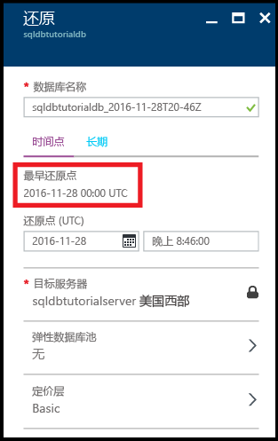
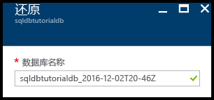
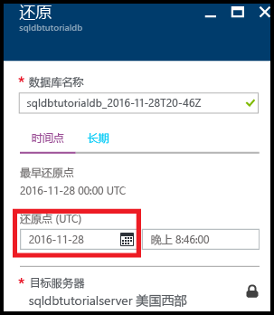
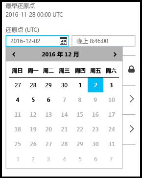
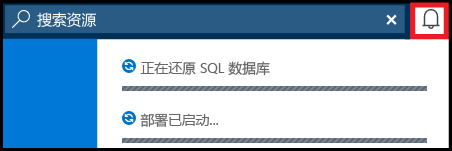
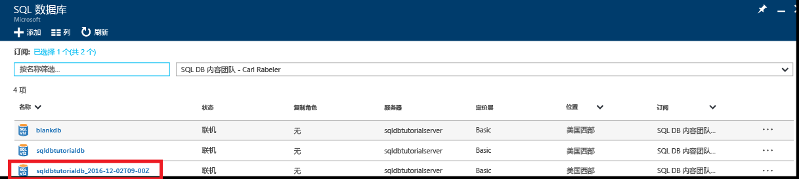
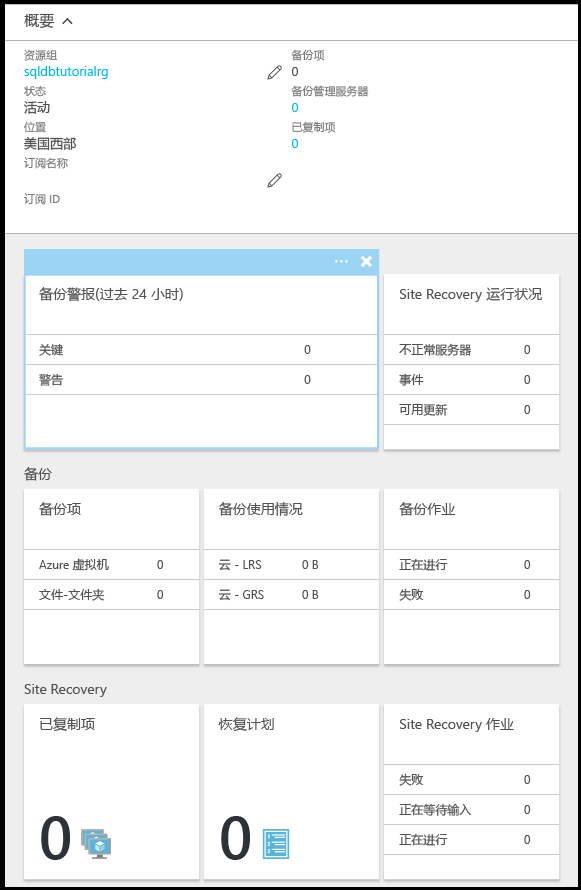

# 教程：使用 Azure 门户备份和还原 Azure SQL 数据库
本教程介绍如何使用 Azure 门户来完成以下操作：

- 查看数据库的现有备份
- 将数据库还原到以前的时间点
- 在 Azure 恢复服务保管库中配置数据库备份文件的长期保留期
- 从 Azure 恢复服务保管库还原数据库

**用时估计**：完成本教程大约需要 30 分钟（假设满足先决条件）。

> [!TIP]
> 可以使用 [PowerShell](sql-database-get-started-backup-recovery-powershell.md) 来执行入门教程中的相同任务。
>

## 先决条件

* 需要一个 Azure 帐户。 可以[建立一个免费 Azure 帐户](https://azure.microsoft.com/free/)或[激活 Visual Studio 订户权益](https://azure.microsoft.com/pricing/member-offers/msdn-benefits/)。 

* 必须能够使用属于订阅所有者成员或参与者角色成员的帐户连接到 Azure 门户。 有关基于角色的访问控制 (RBAC) 的详细信息，请参阅 [Getting started with access management in the Azure portal](../active-directory/role-based-access-control-what-is.md)（Azure 门户中的访问管理入门）。

* 已完成本教程中[通过 Azure 门户和 SQL Server Management Studio 开始使用 Azure SQL 数据库服务器、数据库和防火墙规则](sql-database-get-started.md)或等效的 [PowerShell 版本](sql-database-get-started-powershell.md)的步骤。 如果没有，请完成此必备教程或在本教程的 [PowerShell 版本](sql-database-get-started-powershell.md)结束时执行 PowerShell 脚本，然后再继续。

> [!NOTE]
> 本教程帮助读者了解以下学习主题的内容：[SQL 数据库备份](sql-database-automated-backups.md)、[长期备份保留](sql-database-long-term-retention.md)和[使用自动数据库备份恢复 Azure SQL 数据库](sql-database-recovery-using-backups.md)。
>  

## 使用 Azure 帐户登录到 Azure 门户
使用 [现有订阅](https://account.windowsazure.com/Home/Index)，按照以下步骤连接到 Azure 门户。

1. 打开所选的浏览器并连接到 [Azure 门户](https://portal.azure.com/)。
2. 登录到 [Azure 门户](https://portal.azure.com/)。
3. 在“登录”  页面上，提供订阅的凭据。
   
   

## 从数据库的服务生成备份查看最早的还原点

在教程的本部分中，从数据库的[服务生成的自动备份](sql-database-automated-backups.md)中查看有关最早还原点的信息。 

1. 打开数据库的“SQL 数据库”边栏选项卡 (**sqldbtutorialdb**)。

   

2. 在工具栏上，单击“还原”。

   

3. 在“还原”边栏选项卡，查看最早还原点。

   

## 将数据库还原到以前的时间点

本教程的此部分介绍如何将数据库恢复到特定时间点的新数据库。

1. 在数据库的“还原”边栏选项卡，查看要将数据库还原到以前某个时间点的新数据库的默认名称（名称为附加了时间戳的现有数据库名称）。 此名称会更改，以反映在接下来的步骤中指定的时间。

   

2. 单击“还原点(UTC)”输入框中的**日历**图标。

   

2. 在日历上，选择保留期内的日期

   

3. 在“还原点(UTC)”输入框中，指定要从自动数据库备份中将数据库中的数据还原到的所选日期的时间。

   

   >[!NOTE]
   >请注意，数据库名称已更改，以反映选择的日期和时间。 另请注意，无法更改要还原到特定时间点的服务器。 若要还原到其他服务器，请使用[异地还原](sql-database-disaster-recovery.md#recover-using-geo-restore)。 最后，请注意，可还原到[弹性池](sql-database-elastic-jobs-overview.md)或其他定价层。 
   >

4. 单击“确定”将数据库还原到以前某个时间点的新数据库。

5. 在工具栏上，单击通知图标以查看还原作业的状态。

   

6. 完成还原作业后，打开“SQL 数据库”边栏选项卡以查看新还原的数据库。

   

> [!NOTE]
> 从此处，可使用 SQL Server Management Studio 连接到已还原的数据库，以执行所需任务，例如[从恢复的数据库中提取一部分数据，复制到现有数据库或删除现有数据库，并将已还原数据库的名称重命名为现有数据库名称](sql-database-recovery-using-backups.md#point-in-time-restore)。
>

## 在 Azure 恢复服务保管库中配置自动备份的长期保留 

本教程的此部分介绍如何[配置 Azure 恢复服务保管库以保留自动备份](sql-database-long-term-retention.md)，使其保留期长于服务层。 

> [!TIP]
> 若要删除长期备份保留中的备份，请参阅[使用 PowerShell 管理长期备份保留](sql-database-manage-long-term-backup-retention-powershell.md)。
>

1. 打开服务器的“SQL Server”边栏选项卡（**sqldbtutorialserver**）。

   

2. 单击“长期备份保留”。

   

3. 在“sqldbtutorial - 长期备份保留”边栏选项卡上，查看并接受预览条款（除非已执行此操作或此功能已不处于预览中）。

   

4. 若要为 sqldbtutorialdb 数据库配置长期备份保留，请在网格中选择该数据库，然后在工具栏上单击“配置”。

   

5. 在“配置”边栏选项卡上，单击“恢复服务保管库”下的“配置所需设置”。

   

6. 在“恢复服务保管库”边栏选项卡上，选择现有保管库（如果有）。 如果找不到订阅的恢复服务保管库，则单击以退出此流程并创建恢复服务保管库。

   

7. 在“恢复服务保管库”边栏选项卡上，单击“添加”。

   
   
8. 在“恢复服务保险库”边栏选项卡上，为新的恢复服务保管库提供有效的名称。

   

9. 选择订阅和资源组，然后选择保管库的位置。 完成后，单击“创建”。

   

   > [!IMPORTANT]
   > 保管库必须位于与 Azure SQL 逻辑服务器相同的区域，并且必须使用与逻辑服务器相同的资源组。
   >

10. 创建新保管库后，执行必要的步骤以返回到“恢复服务保管库”边栏选项卡。

11. 在“恢复服务保管库”边栏选项卡上，单击保管库，然后单击“选择”。

   

12. 在“配置”边栏选项卡上，为新保留策略提供有效的名称，根据需要修改默认保留策略，然后单击“确定”。

   

13. 在“sqldbtutorial - 长期备份保留”边栏选项卡上，单击“保存”，然后单击“确定”，将长期备份保留策略应用于所选数据库。

   

14. 单击“保存”以使用此新策略对你配置的 Azure 恢复服务保管库启用长期备份保留。

   

15. 在启用长期备份保留后，打开“sqldbtutorialvault”边栏选项卡（转到“所有资源”并从订阅的资源列表中选择它）。

   

> [!IMPORTANT]
> 配置后，备份将在接下来的七天内显示在保管库中。 备份显示在保管库中后再继续本教程。
>

## 查看长期保留的备份

在教程的本部分中，可在[长期备份保留](sql-database-long-term-retention.md)中查看有关数据库备份的信息。 

1. 打开“sqldbtutorialvault”边栏选项卡（转到“所有资源”并从订阅的资源列表中选择它）以查看数据库备份在保管库中使用的存储量。

   

2. 打开数据库的“SQL 数据库”边栏选项卡 (**sqldbtutorialdb**)。

   

3. 在工具栏上，单击“还原”。

   

4. 在“还原”边栏选项卡上，单击“长期”。

5. 在 Azure 保管库备份下，单击“选择备份”以查看长期备份保留中的可用数据库备份。

   

## 从长期备份保留中的备份还原数据库

教程的本部分介绍如何从 Azure 恢复服务保管库中的备份将数据库还原到新数据库。

1. 在“Azure 保管库备份”边栏选项卡上，单击要还原的备份，然后单击“选择”。

   

2. 在“数据库名称”文本框中，为已还原的数据库提供名称。

   

3. 单击“确定”将数据库从保管库中的备份还原到新数据库。

4. 在工具栏上，单击通知图标以查看还原作业的状态。

   

5. 完成还原作业后，打开“SQL 数据库”边栏选项卡以查看新还原的数据库。

   

> [!NOTE]
> 从此处，可使用 SQL Server Management Studio 连接到已还原的数据库，以执行所需任务，例如[从恢复的数据库中提取一部分数据，复制到现有数据库或删除现有数据库，并将已还原数据库的名称重命名为现有数据库名称](sql-database-recovery-using-backups.md#point-in-time-restore)。
>

## 后续步骤

- 若要了解服务生成的自动备份，请参阅[自动备份](sql-database-automated-backups.md)
- 若要了解长期备份保留，请参阅[长期备份保留](sql-database-long-term-retention.md)
- 若要了解如何从备份中还原，请参阅[从备份中还原](sql-database-recovery-using-backups.md)

