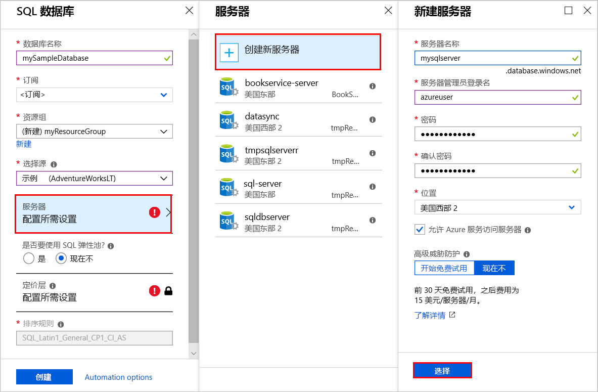
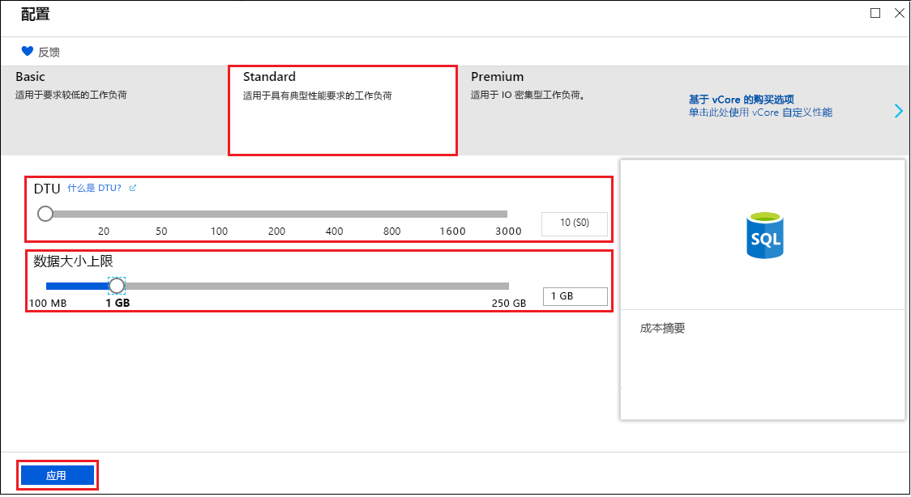
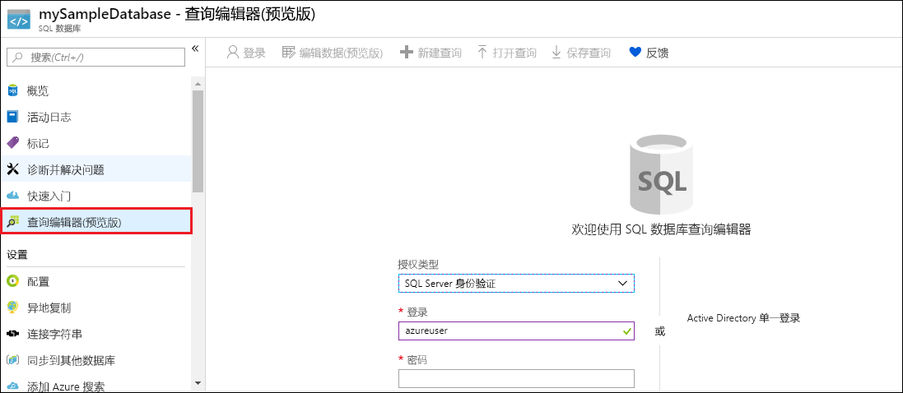
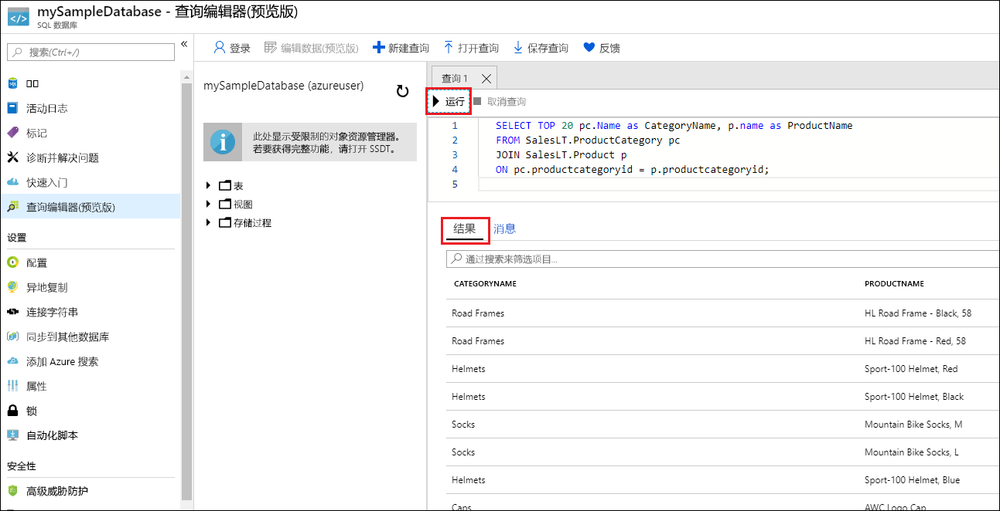

# <a name="create-an-azure-sql-database-in-the-azure-portal"></a>在 Azure 门户中创建 Azure SQL 数据库

本快速入门逐步讲解如何使用[基于 DTU 的购买模型](sql-database-service-tiers-dtu.md)在 Azure 中创建 SQL 数据库。 Azure SQL 数据库是一种“数据库即服务”产品，可用于在云中运行和缩放高可用性 SQL Server 数据库。 本快速入门教程介绍如何开始使用 Azure 门户创建 SQL 数据库。

如果没有 Azure 订阅，请在开始之前创建一个[免费](https://azure.microsoft.com/free/)帐户。

  >[!NOTE]
  >本教程使用的是基于 DTU 的购买模型，但[基于 vCore 的购买模型](sql-database-service-tiers-vcore.md)也可用。

## <a name="log-in-to-the-azure-portal"></a>登录到 Azure 门户

登录到 [Azure 门户](https://portal.azure.com/)。

## <a name="create-a-sql-database"></a>创建 SQL 数据库

创建 Azure SQL 数据库时，会使用定义好的一组[计算和存储资源](sql-database-service-tiers-dtu.md)。 数据库在 [Azure 资源组](../azure-resource-manager/resource-group-overview.md)和 [Azure SQL 数据库逻辑服务器](sql-database-features.md)中创建。

请按以下步骤创建包含 Adventure Works LT 示例数据的 SQL 数据库。

1. 在 Azure 门户的左上角单击“创建资源”。

2. 从“新建”页中选择“数据库”，然后从“新建”页的“SQL 数据库”中选择“创建”。

   

3. 如上图所示，在“SQL 数据库”窗体中填写以下信息：   

   | 设置       | 建议的值 | 说明 |
   | ------------ | ------------------ | ------------------------------------------------- |
   | **数据库名称** | mySampleDatabase | 如需有效的数据库名称，请参阅 [Database Identifiers](https://docs.microsoft.com/sql/relational-databases/databases/database-identifiers)（数据库标识符）。 |
   | **订阅** | 你的订阅  | 有关订阅的详细信息，请参阅[订阅](https://account.windowsazure.com/Subscriptions)。 |
   | **资源组**  | myResourceGroup | 如需有效的资源组名称，请参阅 [Naming rules and restrictions](https://docs.microsoft.com/azure/architecture/best-practices/naming-conventions)（命名规则和限制）。 |
   | **选择源** | 示例 (AdventureWorksLT) | 将 AdventureWorksLT 架构和数据加载到新数据库中 |

   > [!IMPORTANT]
   > 必须选择此表单中的示例数据库，因为本快速入门中的其余部分会用到它。
   >

4. 在“服务器”下，单击“配置所需设置”，并在“SQL Server (逻辑服务器)”窗体中填写以下信息，如下图所示：   

   | 设置       | 建议的值 | 说明 |
   | ------------ | ------------------ | ------------------------------------------------- |
   | **服务器名称** | 任何全局唯一名称 | 如需有效的服务器名称，请参阅 [Naming rules and restrictions](https://docs.microsoft.com/azure/architecture/best-practices/naming-conventions)（命名规则和限制）。 |
   | 服务器管理员登录名 | 任何有效的名称 | 如需有效的登录名，请参阅 [Database Identifiers](https://docs.microsoft.com/sql/relational-databases/databases/database-identifiers)（数据库标识符）。 |
   | **密码** | 任何有效的密码 | 密码必须至少有 8 个字符，且必须包含以下类别中的三个类别的字符：大写字符、小写字符、数字以及非字母数字字符。 |
   | **订阅** | 你的订阅 | 有关订阅的详细信息，请参阅[订阅](https://account.windowsazure.com/Subscriptions)。 |
   | **资源组** | myResourceGroup | 如需有效的资源组名称，请参阅 [Naming rules and restrictions](https://docs.microsoft.com/azure/architecture/best-practices/naming-conventions)（命名规则和限制）。 |
   | **位置** | 任何有效的位置 | 有关区域的信息，请参阅 [Azure 区域](https://azure.microsoft.com/regions/)。 |

   > [!IMPORTANT]
   > 此处指定的服务器管理员登录名和密码是以后在本快速入门中登录到服务器及其数据库所必需的。 请牢记或记录此信息，以后会使用到它。
   >  

   

5. 完成表单操作后，单击“选择”。

6. 单击“定价层”，指定服务层、DTU 数和存储量。 浏览相关选项，了解适用于每个服务层的 DTU 数和存储量。

   > [!IMPORTANT]
   > 除以下区域外，所有区域当前均提供超过 1 TB 的高级层存储：英国北部、美国中西部、英国南部 2、中国东部、USDoDCentral、德国中部、USDoDEast、US Gov 西南部、US Gov 中南部、德国东北部、中国北部、US Gov 东部。 在其他区域，高级层中的最大存储限制为 1 TB。 请参阅 [P11-P15 当前限制]( sql-database-dtu-resource-limits-single-databases.md#single-database-limitations-of-p11-and-p15-when-the-maximum-size-greater-than-1-tb)。  

7. 对于本快速入门，请选择“标准”服务层，然后使用滑块选择“10 DTU (S0)”和“1”GB 存储。

   

8. 若要使用“附加存储”选项，请接受预览版条款。

   > [!IMPORTANT]
   > 除以下区域外的所有区域当前均提供超过 1 TB 的高级层存储：美国中西部、中国东部、USDoDCentral、USGov Iowa、德国中部、USDoDEast、US Gov 西南部、德国东北部、中国北部。 在其他区域，高级层中的最大存储限制为 1 TB。 请参阅 [P11-P15 当前限制]( sql-database-dtu-resource-limits-single-databases.md#single-database-limitations-of-p11-and-p15-when-the-maximum-size-greater-than-1-tb)。  

9. 选择服务器层、DTU 数和存储量后，单击“应用”。  

10. 完成 SQL 数据库表单后，即可单击“创建”对数据库进行预配。 预配需要数分钟。

11. 在工具栏上，单击“通知”可监视部署过程。

     

## <a name="create-a-server-level-firewall-rule"></a>创建服务器级防火墙规则

SQL 数据库服务在服务器级别创建一个防火墙。除非创建了防火墙规则来为特定的 IP 地址打开防火墙，否则会阻止外部应用程序和工具连接到服务器或服务器上的任何数据库。 按照以下步骤为客户端 IP 地址创建 [SQL 数据库服务器级防火墙规则](sql-database-firewall-configure.md)，并只允许通过针对你的 IP 地址打开的 SQL 数据库防火墙建立外部连接。

> [!NOTE]
> 通过端口 1433 进行的 SQL 数据库通信。 如果尝试从企业网络内部进行连接，则该网络的防火墙可能不允许经端口 1433 的出站流量。 如果是这样，则无法连接到 Azure SQL 数据库服务器，除非 IT 部门打开了端口 1433。
>

1. 部署完成后，在左侧菜单中单击“SQL 数据库”，然后在“SQL 数据库”页上单击“mySampleDatabase”。 此时会打开数据库的概览页，其中显示了完全限定的服务器名称（例如 mynewserver-20170824.database.windows.net），并提供了其他配置的选项。

2. 在后续的快速入门中，请复制此完全限定的服务器名称，将其用于连接到服务器及其数据库。

   

3. 如上图所示，在工具栏上单击“设置服务器防火墙”。 此时会打开 SQL 数据库服务器的“防火墙设置”页。

   

4. 在工具栏上单击“添加客户端 IP”，将当前的 IP 地址添加到新的防火墙规则。 防火墙规则可以针对单个 IP 地址或一系列 IP 地址打开端口 1433。

5. 单击“保存”。 此时会针对当前的 IP 地址创建服务器级防火墙规则，在逻辑服务器上打开 端口 1433。

6. 单击“确定”，然后关闭“防火墙设置”页。

现在可以使用之前创建的服务器管理员帐户通过 SQL Server Management Studio 或其他所选工具从此 IP 地址连接到 SQL 数据库服务器及其数据库。

> [!IMPORTANT]
> 默认情况下，所有 Azure 服务都允许通过 SQL 数据库防火墙进行访问。 在此页上单击“关”即可对所有 Azure 服务执行禁用操作。
>

## <a name="query-the-sql-database"></a>查询 SQL 数据库

在 Azure 中创建示例数据库以后，即可使用 Azure 门户中的内置查询工具确认你是否能够连接到数据库并查询数据。

1. 在数据库的“SQL 数据库”页上，单击左侧菜单中的“查询编辑器(预览版)”，然后单击“登录”。

   

2. 选择 SQL Server 身份验证，提供所需的登录信息，然后单击“确定”进行登录。

3. 完成 ServerAdmin 身份验证后，在查询编辑器窗格中键入以下查询。

   ```sql
   SELECT TOP 20 pc.Name as CategoryName, p.name as ProductName
   FROM SalesLT.ProductCategory pc
   JOIN SalesLT.Product p
   ON pc.productcategoryid = p.productcategoryid;
   ```

4. 单击“运行”，然后在“结果”窗格中查看查询结果。

   

5. 关闭“查询编辑器”页，单击“确定”放弃未保存的编辑内容。

## <a name="clean-up-resources"></a>清理资源

若要转到[后续步骤](#next-steps)，以便了解如何使用多种不同的方法连接和查询数据库，请保存这些资源。 但如果希望删除在本快速入门中创建的资源，请执行以下步骤。


1. 在 Azure 门户的左侧菜单中，单击“资源组”，然后单击“myResourceGroup”。
2. 在资源组页上单击“删除”，在文本框中键入 **myResourceGroup**，然后单击“删除”。

## <a name="next-steps"></a>后续步骤

- 有了数据库以后，即可使用一种偏好的工具或语言进行[连接和查询](sql-database-connect-query.md)。 
- 若要了解如何设计第一个数据库、创建表和插入数据，请参阅以下教程之一：
 - [使用 SSMS 设计第一个 Azure SQL 数据库](sql-database-design-first-database.md)
  - [设计 Azure SQL 数据库，并使用 C# 和 ADO.NET 进行连接](sql-database-design-first-database-csharp.md)
