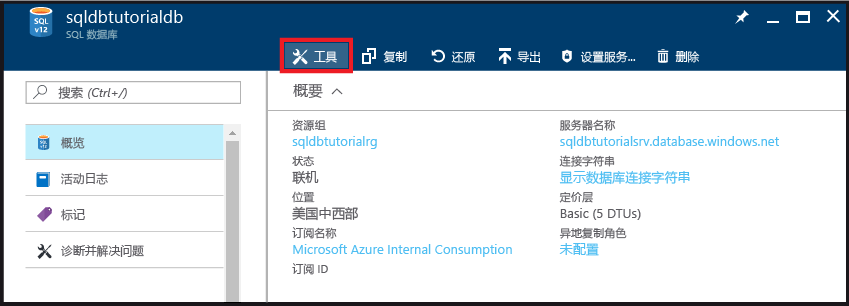
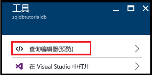
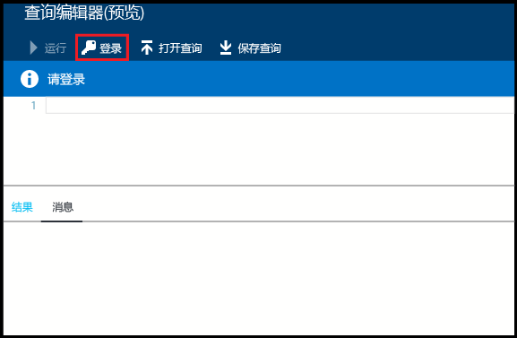
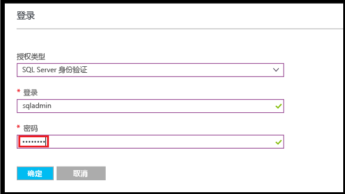
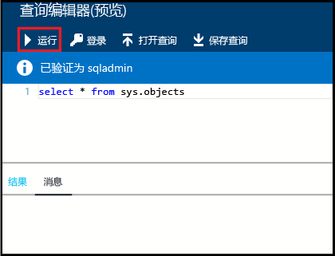
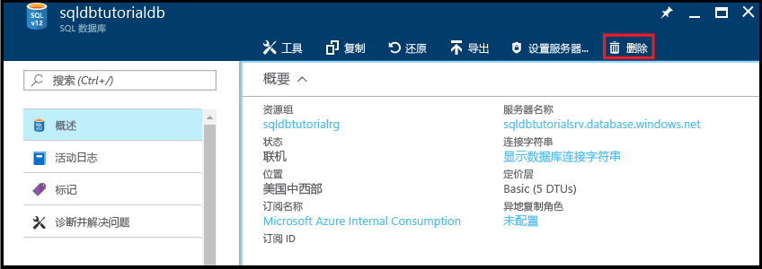

# <a name="create-connect-to-and-query-your-first-azure-sql-databases-in-the-azure-portal-and-using-ssms"></a>使用 Azure 门户与 SSMS 创建、连接和查询第一个 Azure SQL 数据库

本教程介绍如何使用 Azure 门户与 SQL Server Management Studio 创建、连接和查询 Azure SQL 数据库 完成本教程后，你将：

* 创建一个包含逻辑服务器、服务器级防火墙规则和两个数据库的资源组。
* 知道如何使用 Azure 门户与 SQL Server Management Studio 查看服务器和数据库属性。
* 知道如何使用 Azure 门户与 SQL Server Management Studio 查询数据库。

**用时估计**：完成本教程大约需要 30 分钟（假设满足先决条件）。

> [!TIP]
> 本文还将介绍如何使用 [PowerShell](sql-database-get-started-powershell.md) 或 [C#](sql-database-get-started-csharp.md) 创建、连接和查询 Azure SQL 数据库。
>

> [!NOTE]
> 本教程帮助读者了解以下学习主题的内容：[SQL 数据库服务器概述](sql-database-server-overview.md)、[SQL 数据库概述](sql-database-overview.md)和 [Azure SQL 数据库防火墙规则概述](sql-database-firewall-configure.md)。 有关 SQL 数据库服务的概述，请参阅[什么是 SQL 数据库？](sql-database-technical-overview.md)
>  

## <a name="prerequisites"></a>先决条件

* **一个 Azure 帐户**。 可以[建立一个免费 Azure 帐户](https://azure.microsoft.com/free/)或[激活 Visual Studio 订户权益](https://azure.microsoft.com/pricing/member-offers/msdn-benefits/)。 

* **Azure 创建权限**。 必须能够使用属于订阅所有者成员或参与者角色成员的帐户连接到 Azure 门户。 有关基于角色的访问控制 (RBAC) 的详细信息，请参阅 [Getting started with access management in the Azure portal](../active-directory/role-based-access-control-what-is.md)（Azure 门户中的访问管理入门）。

* **SQL Server Management Studio**。 可以通过[下载 SQL Server Management Studio](https://msdn.microsoft.com/library/mt238290.aspx) 下载并安装最新版本的 SQL Server Management Studio (SSMS)。 连接到 Azure SQL 数据库时，请始终使用最新版本的 SSMS，因为其中会不断地发布新功能。

### <a name="sign-in-to-the-azure-portal"></a>登录到 Azure 门户

本过程中的步骤说明如何使用 [Azure 帐户](https://account.windowsazure.com/Home/Index)连接到 Azure 门户。

1. 打开所选的浏览器并连接到 [Azure 门户](https://portal.azure.com/)。
2. 登录到 [Azure 门户](https://portal.azure.com/)。
3. 在“登录”  页面上，提供订阅的凭据。
   
   


<a name="create-logical-server-bk"></a>

## <a name="create-a-new-logical-sql-server"></a>创建新的逻辑 SQL Server

本过程中的步骤说明如何在所选区域中的 Azure 门户上创建逻辑服务器。 逻辑服务器是可在其中创建 SQL 数据库的对象，也是可在其中创建防火墙规则，使用户能够通过 Azure SQL 数据库防火墙进行连接的对象。 

1. 单击“新建”，键入 **sql server**，然后单击 **ENTER**。

    
2. 单击“SQL 服务器(逻辑服务器)”。
   
    
3. 单击“创建”打开“新建 SQL 服务器(逻辑服务器)”边栏选项卡。

    
3. 在“服务器名称”文本框中，提供新逻辑服务器的有效名称。 绿色的对勾表示已提供有效名称。
    
    

    > [!IMPORTANT]
    > 新服务器的完全限定名称必须唯一，格式为：**<服务器名称>.database.windows.net**。 在本教程稍后的步骤中，需要使用此完全限定的服务器名称连接到服务器和数据库。
    >
    
4. 在“服务器管理员登录名”文本框中，提供此服务器的 SQL 身份验证登录名的用户名。 此登录名也称为服务器主体登录名。 绿色的对勾表示已提供有效名称。
    
    
5. 在“密码”和“确认密码”文本框中，提供服务器主体登录帐户的密码。 绿色复选标记表示提供的密码有效。
    
    
6. 在“订阅”下拉框中，选择你有权在其中创建对象的订阅。

    
7. 在“资源组”文本框中选择“新建”，然后提供新资源组的有效名称。 绿色的对勾表示已提供有效名称。

    

8. 在“位置”文本框中，选择要在其中创建逻辑服务器的数据中心。
    
    
    
    > [!TIP]
    > 无法在此边栏选项卡中更改“允许 Azure 服务访问服务器”复选框的状态。 可以在服务器防火墙边栏选项卡中更改此设置。 有关详细信息，请参阅 [Get started with security](sql-database-control-access-sql-authentication-get-started.md)（安全性入门）。
    >
    
9. 选中“固定到仪表板”复选框。

10. 单击“创建”，将此脚本部署到 Azure 以创建逻辑服务器。

    

11. 创建服务器后，请检查默认显示的服务器属性。 

    
12. 单击“属性”查看逻辑 SQL 服务器的其他属性。

    
13. 将完全限定的服务器名称复制到剪贴板，以便稍后在本教程中使用。

    

## <a name="create-a-server-level-firewall-rule"></a>创建服务器级防火墙规则

本过程中的步骤说明如何在 Azure 门户中创建服务器级防火墙规则。 默认情况下，Azure SQL 数据库防火墙会阻止从外部连接到逻辑服务器及其数据库。 若要连接到服务器，需要为执行下一过程时要从中连接的计算机的 IP 地址创建防火墙规则。 有关详细信息，请参阅 [Azure SQL 数据库防火墙规则概述](sql-database-firewall-configure.md)。

1. 在“SQL 服务器”边栏选项卡，单击“防火墙”打开服务器的“防火墙”边栏选项卡。 请注意，显示的 IP 地址是客户端计算机的地址。

    

2. 在工具栏上单击“添加客户端 IP”，为当前的 IP 地址创建防火墙规则。

    

    > [!NOTE]
    > 可为单个 IP 地址或整个 IP 地址范围创建防火墙规则。 打开防火墙可让 SQL 管理员和用户登录到服务器上他们拥有有效凭据的任何数据库。
    >

4. 在工具栏上单击“保存”保存此服务器级防火墙规则，然后单击“确定”关闭“成功”对话框。

    

## <a name="connect-to-the-server-with-ssms"></a>使用 SSMS 连接到服务器

本过程中的步骤说明如何使用 SQL Server Management Studio 连接到 SQL 逻辑服务器。 SSMS 是 DBA 用来管理 SQL 服务器和数据库的主要工具。

1. 打开 SQL Server Management Studio（在 Windows 搜索框中键入 **Microsoft SQL Server Management Studio**，然后单击 **Enter** 打开 SSMS）。

    
3. 在“连接到服务器”对话框中，输入在上一过程中获取的完全限定的服务器名称，选择“SQL Server 身份验证”，然后提供预配服务器期间指定的登录名和密码。

    
4. 单击“连接”启动连接并打开 SSMS 中的对象资源管理器。

    
5. 在“对象资源管理器”中依次展开“数据库”、“系统数据库”、“master”，查看 master 数据库中的对象。

    
6. 右键单击“master”，然后单击“新建查询”。

    

8. 在查询窗口中键入以下查询：

   ```select * from sys.objects```

9.  在工具栏上单击“执行”，返回 master 数据库中所有系统对象的列表。

    

    > [!NOTE]
    > 若要开始使用 SQL 安全性，请参阅 [SQL 身份验证入门](sql-database-control-access-sql-authentication-get-started.md)
    >

## <a name="create-a-database-with-sample-data"></a>使用示例数据创建数据库

本过程中的步骤说明如何在 Azure 门户中使用与前面创建的逻辑服务器关联的示例数据创建数据库。 

1. 在 Azure 门户上的默认边栏选项卡中单击“SQL 数据库”。

    
2. 在“SQL 数据库”边栏选项卡中，单击“添加”。 

    

    
3. 在“数据库名称”文本框中，提供有效的数据库名称。

    
4. 在“选择源”下面，选择“示例(AdventureWorksLT)”。
   
    
5. 在“服务器”下面，检查是否已选择你的服务器。 另请注意，将某个数据库添加到服务器时，可将它添加为单一数据库（默认设置），或将其添加到弹性池。 有关弹性池的详细信息，请参阅[弹性池](sql-database-elastic-pool.md)。

6. 在“定价层”下面，将定价层更改为“基本”，然后单击“选择”。 以后可以根据需要提高定价层，但在学习过程中，我们建议使用最低的定价层。

    
7. 选中“固定到仪表板”复选框，然后单击“创建”。

    

8. 创建数据库后，请在 Azure 门户中查看其属性。 后续教程将会介绍此边栏选项卡中提供的选项。 

    

## <a name="query-the-database-in-the-azure-portal"></a>在 Azure 门户中查询数据库

本过程中的步骤说明如何在 Azure 门户中直接查询数据库。 

1. 在“SQL 数据库”边栏选项卡中，单击工具栏上的“工具”。

    
2. 在“工具”边栏选项卡中，单击“查询编辑器(预览)”。。

    
3. 单击确认查询编辑器是一项预览功能的复选框，然后单击“确定”。。
4. 在“查询编辑器”边栏选项卡上，单击“登录”。

    
5. 检查授权类型和登录名，然后提供该登录名的密码。 

    
6. 单击“确定”尝试登录。
7. 完成身份验证后，在查询窗口中键入以下查询，然后单击“运行”。

   ```select * from sys.objects```

    

8. 在“结果”窗格中查看查询结果。

    

## <a name="query-the-database-with-ssms"></a>使用 SSMS 查询数据库

本过程中的步骤说明如何使用 SQL Server Management Studio 连接到数据库，然后查询示例数据，以查看数据库中的对象。

1. 切换到 SQL Server Management Studio，在对象资源管理器中单击“数据库”，然后单击工具栏上的“刷新”查看示例数据库。

    
2. 在对象资源管理器中展开新数据库以查看其对象。

    
3. 右键单击示例数据库，然后单击“新建查询”。

    
4. 在查询窗口中键入以下查询：

   ```select * from sys.objects```
   
9.  在工具栏上单击“执行”，返回示例数据库中所有系统对象的列表。

    

## <a name="create-a-blank-database-with-ssms"></a>使用 SSMS 创建空数据库

本过程中的步骤说明如何使用 SQL Server Management Studio 创建新数据库。

1. 在对象资源管理器中，右键单击“数据库”，然后单击“新建数据库”。

    

2. 在“新建数据库”对话框中的“数据库名称”文本框内提供数据库的名称。 

    

3. 在“新建数据库”对话框中单击“选项”，然后将“版本”更改为“基本”。

    

    > [!TIP]
    > 查看此对话框中可根据 Azure SQL 数据库修改的其他选项。 有关这些选项的详细信息，请参阅 [Create Database](https://msdn.microsoft.com/library/dn268335.aspx)（创建数据库）。
    >

4. 单击“确定”创建空白数据库。
5. 完成后，在对象资源管理器中刷新“数据库”节点即可查看新建的空白数据库。 

    

## <a name="troubleshoot-connectivity"></a>排查连接问题

与 Azure SQL 数据库连接失败时，会出现错误消息。 连接问题可能是 SQL Azure 数据库重新配置、防火墙设置、连接超时或不正确的登录信息造成的。 有关连接故障排除工具，请参阅 [Troubleshooting connectivity issues with Microsoft Azure SQL Database](https://support.microsoft.com/help/10085/troubleshooting-connectivity-issues-with-microsoft-azure-sql-database)（排查 Microsoft Azure SQL 数据库连接问题）。

## <a name="delete-a-single-database-in-the-azure-portal"></a>在 Azure 门户中删除单一数据库

本过程中的步骤说明如何使用 Azure 门户删除单一数据库。

1. 在 Azure 门户中的 SQL 数据库边栏选项卡上，单击想要删除的数据库。 
2.  单击与该 SQL 数据库对应的“删除”。

    
2. 单击“是”确认要永久删除此数据库。

    

> [!TIP]
> 在数据库的保留期内，可将数据库从服务启动的自动备份还原（前提是未删除服务器本身）。 基本版数据库在七天内可以还原。 使用其他所有版本时，在 35 天内可以还原。 如果删除了服务器本身，则无法恢复该服务器或在其中删除的任何数据库。 有关数据库备份的详细信息，请参阅[了解 SQL 数据库备份](sql-database-automated-backups.md)；有关从备份还原数据库的信息，请参阅[数据库恢复](sql-database-recovery-using-backups.md)。 有关如何还原已删除数据库的操作方法文章，请参阅[还原已删除的 Azure SQL 数据库 - Azure 门户](sql-database-restore-deleted-database-portal.md)。
>


## <a name="next-steps"></a>后续步骤
本教程到此结束。建议学习其他一些教程来巩固你在本教程中学到的知识。 

- 有关 SQL Server 身份验证的入门教程，请参阅 [SQL 身份验证和授权](sql-database-control-access-sql-authentication-get-started.md)
- 有关 Azure Active Directory 身份验证的入门教程，请参阅 [AAD 身份验证和授权](sql-database-control-access-aad-authentication-get-started.md)
* 如果想要在 Azure 门户中查询示例数据库，请参阅 [Public preview: Interactive query experience for SQL databases](https://azure.microsoft.com/updates/azure-sql-database-public-preview-t-sql-editor/)（公共预览版：SQL 数据库的交互式查询体验）
* 如果了解 Excel，请学习如何 [使用 Excel 连接到 Azure 中的 SQL 数据库](sql-database-connect-excel.md)。
* 如果已准备好开始编码，请在 [用于 SQL 数据库和 SQL Server 的连接库](sql-database-libraries.md)中选择所需的编程语言。
* 如果想要将本地 SQL Server 数据库移到 Azure，请参阅 [Migrating a database to SQL Database](sql-database-cloud-migrate.md)（将数据库迁移到 SQL 数据库）。
* 如果希望使用 BCP 命令行工具将 CSV 文件中的某些数据加载到新的表中，请参阅[使用 BCP 将 CSV 文件中的数据加载到 SQL 数据库](sql-database-load-from-csv-with-bcp.md)。
* 如果想要开始创建表和其他对象，请参阅[创建表](https://msdn.microsoft.com/library/ms365315.aspx)中的“创建表”主题。

## <a name="additional-resources"></a>其他资源

- 有关技术概述，请参阅[什么是 SQL 数据库？](sql-database-technical-overview.md)
- 有关定价信息，请参阅 [Azure SQL 数据库定价](https://azure.microsoft.com/pricing/details/sql-database/)。


