# <a name="get-started-with-azure-sql-database-servers-databases-and-firewall-rules-by-using-the-azure-portal-and-sql-server-management-studio"></a>开始使用使用 Azure 门户和 SQL Server Management Studio 创建 Azure SQL 数据库服务器、数据库和防火墙规则

本入门教程介绍如何使用 Azure 门户来完成以下操作：

* 创建新的 Azure 资源组
* 创建 Aure SQL 逻辑服务器
* 查看 Azure SQL 逻辑服务器属性
* 创建服务器级防火墙规则
* 以单一数据库的形式创建 Adventure Works LT 示例数据库
* 在 Azure 中查看 Adventure Works LT 示例数据库属性

本教程还使用最新版本的 SQL Server Management Studio 来执行以下操作：

* 连接到逻辑服务器及其 master 数据库
* 查询 master 数据库
* 连接到示例数据库
* 查询示例数据库

完成本教程后，将会创建一个示例数据库，以及一个在 Azure 资源组中运行的并已附加到逻辑服务器的空数据库。 此外，还将创建一个服务器级防火墙规则，它已配置为启用服务器级主体，用于从指定的 IP 地址（或 IP 地址范围）登录到服务器。 

**用时估计**：完成本教程大约需要 30 分钟（假设满足先决条件）。

## <a name="prerequisites"></a>先决条件

* 需要一个 Azure 帐户。 可以[建立一个免费 Azure 帐户](/pricing/free-trial/?WT.mc_id=A261C142F)或[激活 Visual Studio 订户权益](/pricing/member-offers/msdn-benefits-details/?WT.mc_id=A261C142F)。 

* 必须能够使用属于订阅所有者成员或参与者角色成员的帐户连接到 Azure 门户。 有关基于角色的访问控制 (RBAC) 的详细信息，请参阅 [Getting started with access management in the Azure portal](../active-directory/role-based-access-control-what-is.md)（Azure 门户中的访问管理入门）。

> [!TIP]
> 可以使用 [C#](sql-database-get-started-csharp.md) 或 [PowerShell](sql-database-get-started-powershell.md) 来执行入门教程中的相同任务。
>

### <a name="sign-in-by-using-your-existing-account"></a>使用现有帐户登录
使用 [现有订阅](https://account.windowsazure.com/Home/Index)，按照以下步骤连接到 Azure 门户。

1. 打开所选的浏览器并连接到 [Azure 门户](https://portal.azure.com/)。
2. 登录到 [Azure 门户](https://portal.azure.com/)。
3. 在“登录”  页面上，提供订阅的凭据。
   
   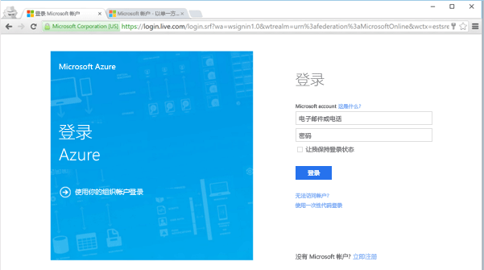


<a name="create-logical-server-bk"></a>

## <a name="create-a-new-logical-sql-server-in-the-azure-portal"></a>在 Azure 门户中创建新的 SQL 逻辑服务器

1. 单击“新建”，键入 **sql server**，然后单击 **ENTER**。

    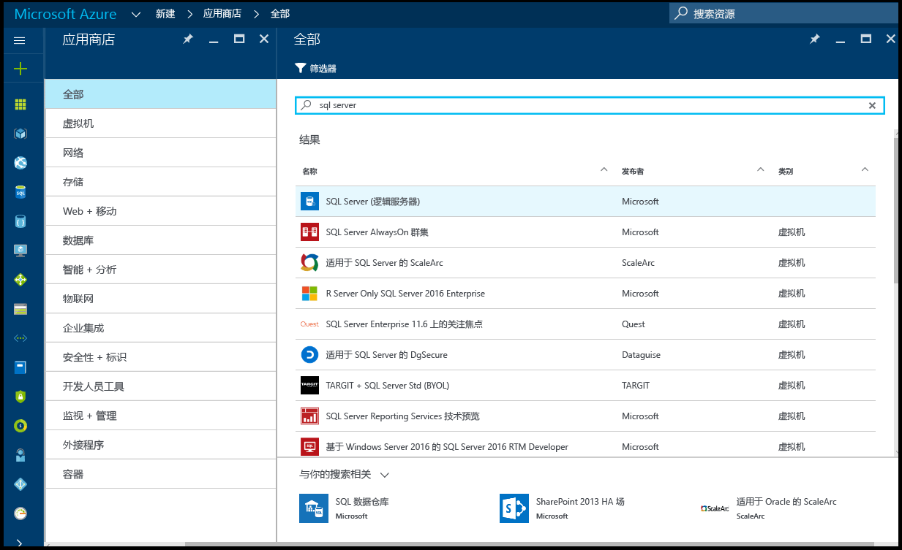
2. 单击“SQL 服务器(逻辑服务器)”。
   
    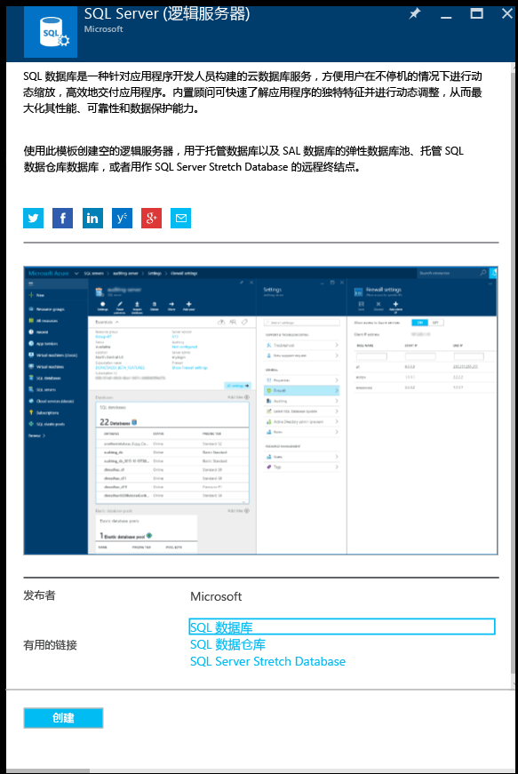
3. 单击“创建”打开“新建 SQL 服务器(逻辑服务器)”边栏选项卡。

    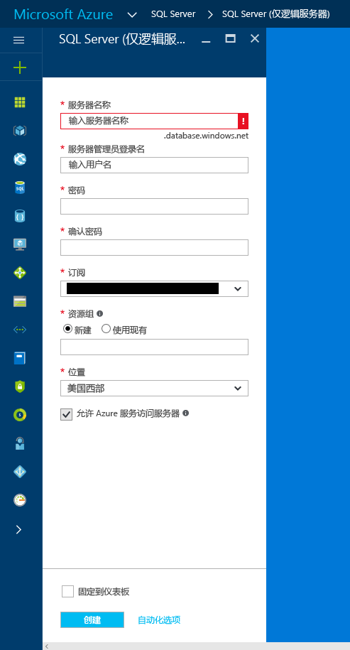
3. 在“服务器名称”文本框中，提供新逻辑服务器的有效名称。 绿色的对勾表示已提供有效名称。
    
    

    > [!IMPORTANT]
    > 新服务器的完全限定名称为 <服务器名称>.database.windows.net。
    >
    
4. 在“服务器管理员登录名”文本框中，提供此服务器的 SQL 身份验证登录名的用户名。 此登录名称为服务器主体登录名。 绿色的对勾表示已提供有效名称。
    
    
5. 在“密码”和“确认密码”文本框中，提供服务器主体登录帐户的密码。 绿色复选标记表示提供的密码有效。
    
    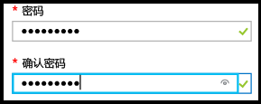
6. 选择一个有权在其中创建对象的订阅。

    
7. 在“资源组”文本框中选择“新建”，然后在“资源组”文本框中提供新资源组的有效名称（如果已自行创建了一个资源组，则也可以使用该资源组）。 绿色的对勾表示已提供有效名称。

    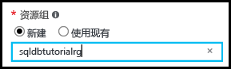

8. 在“位置”文本框中，选择适合你所在位置的数据中心，如“澳大利亚东部”。
    
    
    
    > [!TIP]
    > 无法在此边栏选项卡中更改“允许 Azure 服务访问服务器”复选框的状态。 可以在服务器防火墙边栏选项卡中更改此设置。 有关详细信息，请参阅 [Get started with security](sql-database-get-started-security.md)（安全性入门）。
    >
    
9. 单击“创建” 。

    

## <a name="view-the-logical-sql-server-properties-in-the-azure-portal"></a>在 Azure 门户中查看 SQL 逻辑服务器属性

1. 在 Azure 门户中，单击“更多服务”。

    
2. 在“筛选”文本框中键入 **SQL**，然后单击 SQL 服务器对应的星形图标，将 SQL 服务器指定为 Azure 中的收藏对象。 

    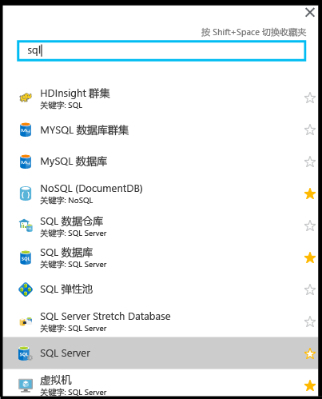
3. 在默认边栏选项卡中，单击“SQL 服务器”打开 Azure 订阅中 SQL 服务器的列表。 

    

4. 单击新 SQL 服务器，在 Azure 门户中查看其属性。 后续教程将会介绍此边栏选项卡中提供的选项。

    
5. 在“设置”下面，单击“属性”查看 SQL 逻辑服务器的各种属性。

    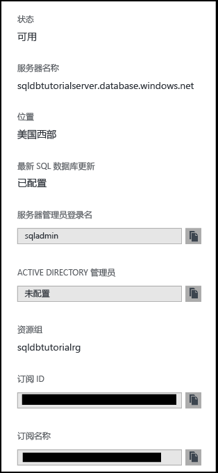
6. 将完全限定的服务器名称复制到剪贴板，以便稍后在本教程中使用。

    

## <a name="create-a-server-level-firewall-rule-in-the-azure-portal"></a>在 Azure 门户中创建服务器级防火墙规则

1. 在“SQL 服务器”边栏选项卡中的“设置”下面，单击“防火墙”打开 SQL 服务器的“防火墙”边栏选项卡。

    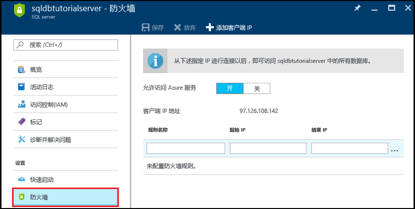

2. 查看显示的客户端 IP 地址，并使用所选的浏览器验证该地址是否为你在 Internet 上使用的 IP 地址（确认自己的 IP 地址）。 有时出于各种原因，这些 IP 地址并不匹配。

    

3. 假设 IP 地址匹配，请在工具栏上单击“添加客户端 IP”。

    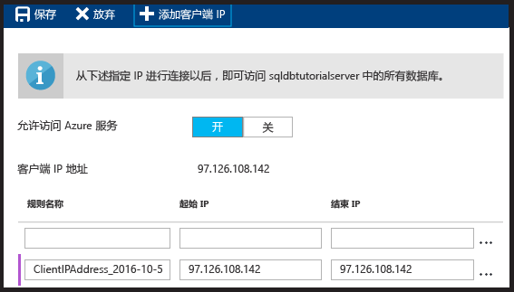

    > [!NOTE]
    > 可以在服务器上向单个 IP 地址或整个地址范围打开 SQL 数据库防火墙。 打开防火墙后，SQL 管理员和用户可以登录到服务器上他们拥有有效凭据的任何数据库。
    >

4. 在工具栏上单击“保存”以保存此服务器级防火墙规则，然后单击“确定”。

    

## <a name="connect-to-sql-server-using-sql-server-management-studio-ssms"></a>使用 SQL Server Management Studio (SSMS) 连接到 SQL 服务器

1. 使用“下载 SQL Server Management Studio”下载并安装最新版本的 SSMS（如果尚未这样做）。[](https://msdn.microsoft.com/library/mt238290.aspx) 为保持最新状态，最新版本的 SSMS 会提示你有新版本可供下载。

2. 安装后，在 Windows 搜索框中键入 **Microsoft SQL Server Management Studio**，然后单击 **Enter** 打开 SSMS：

    
3. 在“连接到服务器”对话框中输入所需的信息，以便使用 SQL Server 身份验证连接到 SQL 服务器。

    
4. 单击“连接”。

    
5. 在“对象资源管理器”中依次展开“数据库”、“系统数据库”、“master”，查看 master 数据库中的对象。

    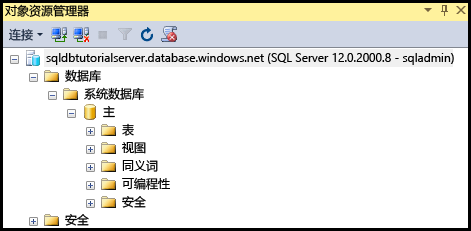
6. 右键单击“master”，然后单击“新建查询”。

    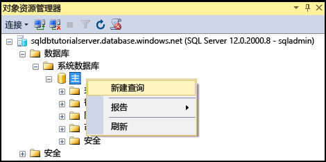

8. 在查询窗口中键入以下查询：

   ```select * from sys.objects```

9.  在工具栏上单击“执行”，返回 master 数据库中所有系统对象的列表。

    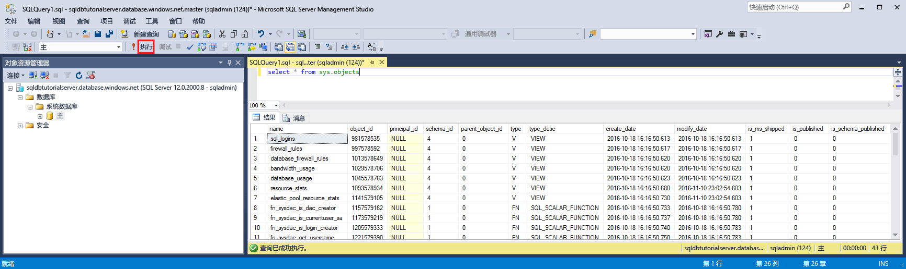

    > [!NOTE]
    > 若要了解 SQL 安全性，请参阅 [Get Started with SQL security](sql-database-get-started-security.md)（SQL 安全性入门）
    >

## <a name="create-new-database-in-the-azure-portal-using-adventure-works-lt-sample"></a>使用 Adventure Works LT 示例在 Azure 门户中创建新数据库

1. 在 Azure 门户上的默认边栏选项卡中单击“SQL 数据库”。

    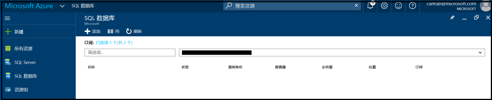
2. 在“SQL 数据库”边栏选项卡中，单击“添加”。

    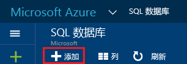
3. 在“SQL 数据库”边栏选项卡中，查看自动填充的信息。

    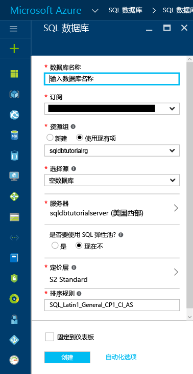
4. 提供有效的数据库名称。

    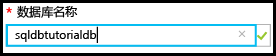
5. 在“选择源”下面单击“示例”，然后在“选择示例”下面单击“AdventureWorksLT [V12]”。
   
    
6. 在“服务器”下面，提供服务器管理员登录用户名和密码。

    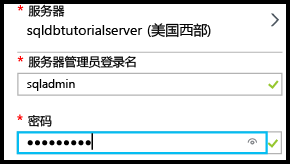

    > [!NOTE]
    > 将某个数据库添加到服务器时，可将它添加为单一数据库（默认设置），或将其添加到弹性池。 有关弹性池的详细信息，请参阅[弹性池](sql-database-elastic-pool.md)。
    >

7. 在“定价层”下面，将定价层更改为“基本”（以后可以根据需要提高定价层，但在学习过程中，我们建议使用最低的定价层）。

    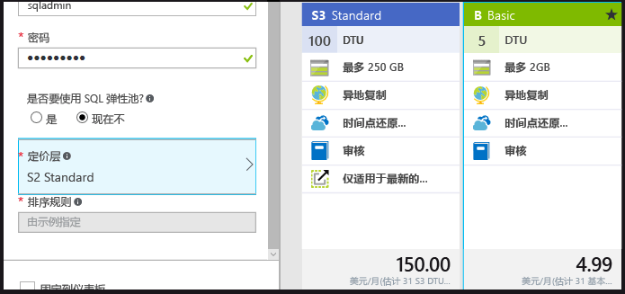
8. 单击“创建” 。

    

## <a name="view-database-properties-in-the-azure-portal"></a>在 Azure 门户中查看数据库属性

1. 在“SQL 数据库”边栏选项卡中单击新建的数据库，在 Azure 门户中查看其属性。 后续教程将会介绍此边栏选项卡中提供的选项。 

    
2. 单击“属性”查看有关数据库的其他信息。

    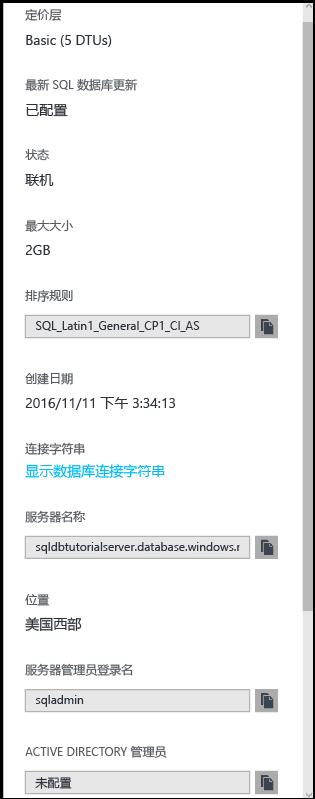

3. 单击“显示数据库连接字符串”。

    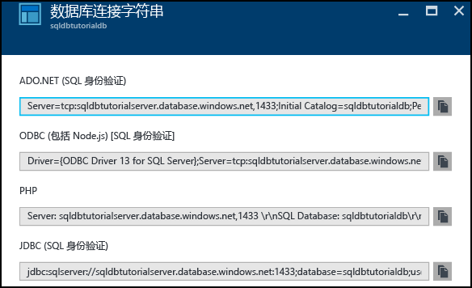
4. 单击“概述”，然后在“概要”窗格中单击你的服务器名称。
    
    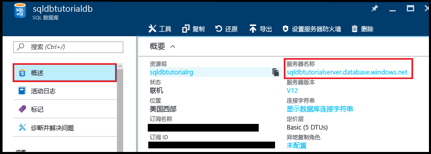
5. 在服务器的“概要”窗格中，查看新添加的数据库。

    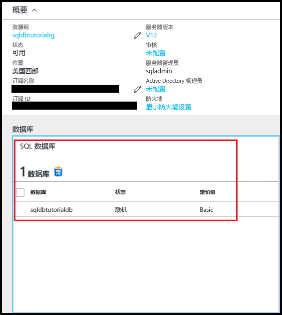

## <a name="connect-and-query-sample-database-using-sql-server-management-studio"></a>使用 SQL Server Management Studio 连接和查询示例数据库

1. 切换到 SQL Server Management Studio，在对象资源管理器中单击“数据库”，然后单击工具栏上的“刷新”查看示例数据库。

    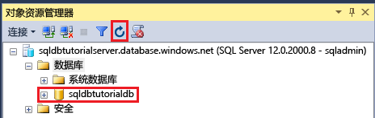
2. 在对象资源管理器中展开新数据库以查看其对象。

    
3. 右键单击示例数据库，然后单击“新建查询”。

    
4. 在查询窗口中键入以下查询：

   ```select * from sys.objects```
   
9.  在工具栏上单击“执行”，返回示例数据库中所有系统对象的列表。

    

## <a name="create-a-new-blank-database-using-sql-server-management-studio"></a>使用 SQL Server Management Studio 创建新的空白数据库

1. 在对象资源管理器中，右键单击“数据库”，然后单击“新建数据库”。

    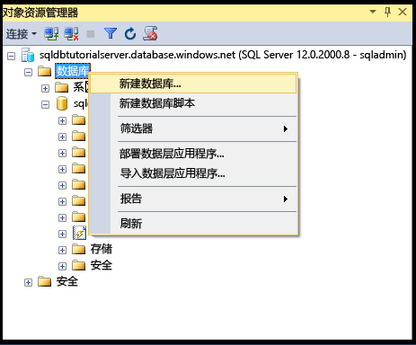

    > [!NOTE]
    > 也可以让 SSMS 自动创建一个数据库脚本，以便使用 Transact-SQL 创建新数据库。
    >

2. 在“新建数据库”对话框中的“数据库名称”文本框内提供数据库的名称。 

    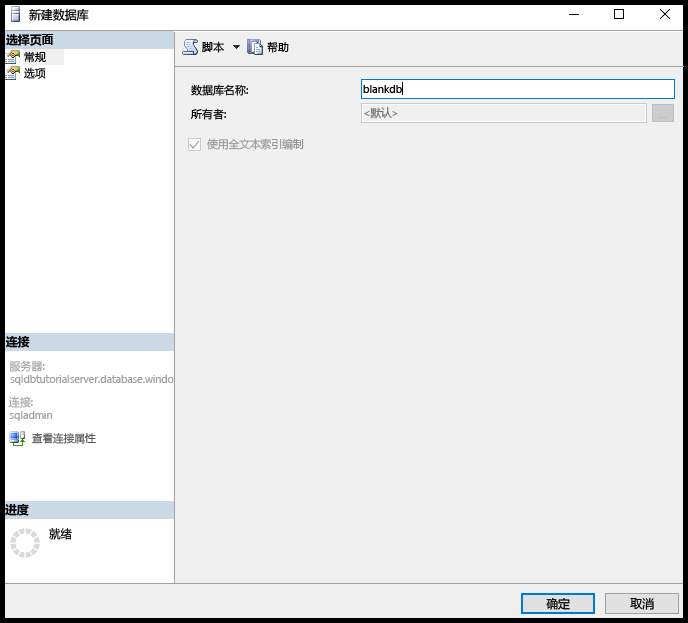

3. 在“新建数据库”对话框中单击“选项”，然后将“版本”更改为“基本”。

    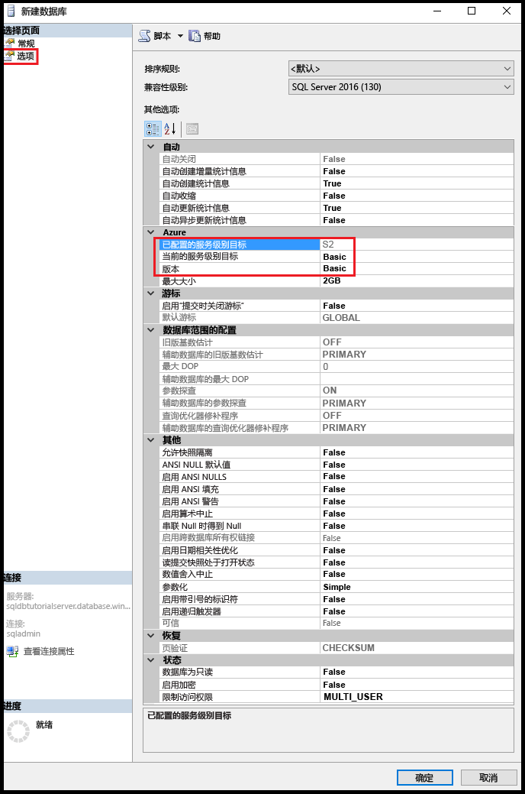

    > [!TIP]
    > 查看此对话框中可根据 Azure SQL 数据库修改的其他选项。 有关这些选项的详细信息，请参阅 [Create Database](https://msdn.microsoft.com/library/dn268335.aspx)（创建数据库）。
    >

4. 单击“确定”创建空白数据库。
5. 完成后，在对象资源管理器中刷新“数据库”节点即可查看新建的空白数据库。 

    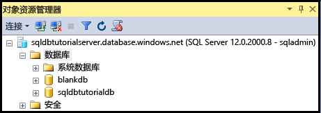

> [!TIP]
> 在学习过程中，删除不再使用的数据库可以节省部分费用。 基本版数据库在七天内可以还原。 但是，请不要删除服务器， 否则无法恢复该服务器或在其中删除的任何数据库。
>


## <a name="next-steps"></a>后续步骤
本教程到此结束。建议学习其他一些教程来巩固你在本教程中学到的知识。 

* 如果想要开始探索 Azure SQL 数据库的安全性，请参阅 [Getting started with security](sql-database-get-started-security.md)（安全性入门）。
* 如果了解 Excel，请学习如何 [使用 Excel 连接到 Azure 中的 SQL 数据库](sql-database-connect-excel.md)。
* 如果已准备好开始编码，请在 [用于 SQL 数据库和 SQL Server 的连接库](sql-database-libraries.md)中选择所需的编程语言。
* 如果想要将本地 SQL Server 数据库移到 Azure，请参阅 [Migrating a database to SQL Database](sql-database-cloud-migrate.md)（将数据库迁移到 SQL 数据库）。
* 如果希望使用 BCP 命令行工具将 CSV 文件中的某些数据加载到新的表中，请参阅 [使用 BCP 将 CSV 文件中的数据加载到 SQL 数据库](sql-database-load-from-csv-with-bcp.md)。
* 如果想要开始创建表和其他对象，请参阅[创建表](https://msdn.microsoft.com/library/ms365315.aspx)中的“创建表”主题。

## <a name="additional-resources"></a>其他资源

- 有关技术概述，请参阅[什么是 SQL 数据库？](sql-database-technical-overview.md)。
- 有关定价信息，请参阅 [Azure SQL 数据库定价](https://azure.microsoft.com/pricing/details/sql-database/)。


<!--HONumber=Dec16_HO3-->


