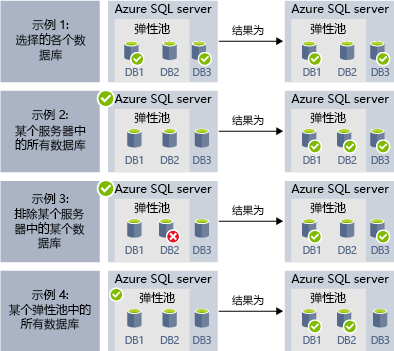
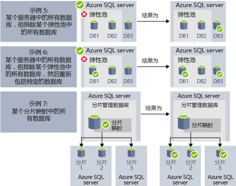

# <a name="automate-management-tasks-using-database-jobs"></a>使用数据库作业自动完成管理任务

Azure SQL 数据库允许创建和计划可针对一个或多个数据库定期执行的作业，以运行 T-SQL 查询和执行维护任务。 每个作业会记录执行状态，如果发生任何失败，则还会自动重试操作。
可以定义目标数据库或者要在其中执行作业的 Azure SQL 数据库组，同时定义作业的运行计划。
作业可以处理登录到目标数据库的任务。 此外，可以定义、维护以及保存要跨一组 Azure SQL 数据库执行的 Transact-SQL 脚本。

## <a name="when-to-use-automated-jobs"></a>何时使用自动化作业

作业自动化有多种使用方案：

- 自动完成管理任务，并将作业计划为在每个工作日、数小时之后或按其他频率运行。
  - 部署架构更改、凭据管理、性能数据收集或租户（客户）遥测数据收集。
  - 更新引用数据（所有数据库的公用信息）、从 Azure Blob 存储加载数据。
  - 重建索引以提升查询性能。 配置作业，以便定期（例如，在非高峰时段）对一系列数据库执行作业。
  - 持续将一组数据库中的查询结果收集到中央表中。 性能查询可以持续执行，并可配置为触发执行其他任务。
- 收集要报告的数据
  - 将 Azure SQL 数据库集合中的数据聚合到单个目标表中。
  - 对大量的数据库执行长时间运行的数据处理查询，例如，收集客户遥测数据。 结果将收集到单个目标表以供进一步分析。
- 数据移动
  - 创建作业，用于将数据库中所做的更新复制到其他数据库，或者收集远程数据库中所做的更新，并在数据库中应用更改。
  - 创建作业用于通过 SQL Server Integration Services (SSIS) 从/向数据库加载数据。

## <a name="overview"></a>概述

在 Azure SQL 数据库中可以使用以下作业计划技术：

- **SQL 代理作业**是经典的且经过实战检验的 SQL Server 作业计划组件，可在托管实例中使用。 SQL 代理作业在 Azure SQL 单一数据库中不可用。
- **弹性数据库作业（预览）** 是针对一个或多个 Azure SQL 数据库执行自定义作业的作业计划服务。

值得注意的是，SQL 代理（可以在本地使用以及作为 SQL 数据库托管实例的一部分使用）与数据库弹性作业代理（适用于 Azure SQL 数据库中的单一数据库和 SQL 数据仓库中的数据库）之间存在一些差异。

|  |弹性作业  |SQL 代理 |
|---------|---------|---------|
|范围     |  作业代理所在 Azure 云中任意数目的 Azure SQL 数据库和/或数据仓库。 目标可以位于不同的 SQL 数据库服务器、订阅和/或区域中。 <br><br>目标组可以包含单个数据库或数据仓库，也可以包含某个服务器、池或分片映射中的所有数据库（在作业运行时动态枚举）。 | SQL 代理所在 SQL Server 实例中的任何单个数据库。 |
|支持的 API 和工具     |  门户、PowerShell、T-SQL、Azure 资源管理器      |   T-SQL、SQL Server Management Studio (SSMS)     |

## <a name="sql-agent-jobs"></a>SQL 代理作业

SQL 代理作业是针对数据库指定的 T-SQL 脚本系列。 使用作业能够定义可一次或多次运行的，并且可以监视其成功或失败状态的管理任务。
一个作业可在一台本地服务器或者多台远程服务器上运行。 SQL 代理作业是内部的数据库引擎组件，在托管实例服务中执行。
SQL 代理作业有几个关键概念：

- **作业步骤**集是指应在作业中执行的一个或多个步骤。 对于每个作业步骤，可以定义重试策略，以及该作业步骤成功或失败时应执行的操作。
- **计划**定义何时应执行该作业。
- 使用**通知**可以定义作业完成后，用于通过电子邮件通知操作员的规则。

### <a name="job-steps"></a>作业步骤

SQL 代理作业步骤是 SQL 代理应执行的操作序列。 每个步骤包含该步骤成功或失败时应执行的后续步骤，以及失败时的重试次数。
SQL 代理允许创建不同类型的作业步骤，例如，用于针对数据库执行单个 Transact-SQL 批处理的 Transact-SQL 作业步骤、可执行自定义 OS 脚本的 OS 命令/PowerShell 步骤、用于通过 SSIS 运行时加载数据的 SSIS 作业步骤，或者可将数据库中的更改发布到其他数据库的[复制](sql-database-managed-instance-transactional-replication.md)步骤。

[事务复制](sql-database-managed-instance-transactional-replication.md)是一项数据库引擎功能，可用于发布对一个数据库中的一个或多个表所做的更改，然后将这些更改发布/分发到一组订阅服务器数据库。 更改发布是使用以下 SQL 代理作业步骤类型实现的：

- 事务日志读取器。
- 快照。
- 分发服务器。

目前不支持其他类型的工作步骤，包括：

- 不支持合并复制作业步骤。
- 不支持队列读取器。
- 不支持 Analysis Services

### <a name="job-schedules"></a>作业计划

计划指定运行作业的时间。 多个作业可按同一计划运行，可将多个计划应用到同一作业。
计划可为作业运行时间定义以下条件：

- 每次重启实例时（或 SQL Server 代理启动时）。 每次故障转移后会激活作业。
- 在特定的日期和时间运行一次，这对于延迟执行某些作业非常有用。
- 按重复的计划运行。

> [!Note]
> 托管实例目前不允许在实例“空闲”时启动作业。

### <a name="job-notifications"></a>作业通知

当作业成功完成或失败时，SQL 代理作业可让你接收通知。 可以通过电子邮件接收通知。

首先，需要设置用于发送电子邮件通知的电子邮件帐户，然后将该帐户分配到名为 `AzureManagedInstance_dbmail_profile` 的电子邮件配置文件，如以下示例中所示：

```sql
-- Create a Database Mail account
EXECUTE msdb.dbo.sysmail_add_account_sp
    @account_name = 'SQL Agent Account',
    @description = 'Mail account for Azure SQL Managed Instance SQL Agent system.',
    @email_address = '$(loginEmail)',
    @display_name = 'SQL Agent Account',
    @mailserver_name = '$(mailserver)' ,
    @username = '$(loginEmail)' ,  
    @password = '$(password)' 

-- Create a Database Mail profile
EXECUTE msdb.dbo.sysmail_add_profile_sp
    @profile_name = 'AzureManagedInstance_dbmail_profile',
    @description = 'E-mail profile used for messages sent by Managed Instance SQL Agent.' ;

-- Add the account to the profile
EXECUTE msdb.dbo.sysmail_add_profileaccount_sp
    @profile_name = 'AzureManagedInstance_dbmail_profile',
    @account_name = 'SQL Agent Account',
    @sequence_number = 1;
```

此外，需要在托管实例上启用数据库邮件：

```sql
GO
EXEC sp_configure 'show advanced options', 1;  
GO  
RECONFIGURE;  
GO  
EXEC sp_configure 'Database Mail XPs', 1;  
GO  
RECONFIGURE 
```

可以通知操作员 SQL 代理作业发生了问题。 操作员为一个或多个托管实例的维护负责人定义联系信息。 有时，操作员职责会分配给一个人。
在包含多个托管实例或 SQL Server 的系统中，可由多个人分担操作员的职责。 操作员不涉及安全信息，因此不会定义安全主体。

可以使用 SSMS 或以下示例中所示的 Transact-SQL 脚本创建操作员：

```sql
EXEC msdb.dbo.sp_add_operator 
    @name=N'Mihajlo Pupun', 
        @enabled=1, 
        @email_address=N'mihajlo.pupin@contoso.com'
```

可以使用 SSMS 或以下 Transact-SQL 脚本修改任何作业并分配操作员，以便在作业完成、失败或成功时向其发送电子邮件通知：

```sql
EXEC msdb.dbo.sp_update_job @job_name=N'Load data using SSIS', 
        @notify_level_email=3,                        -- Options are: 1 on succeed, 2 on failure, 3 on complete
        @notify_email_operator_name=N'Mihajlo Pupun'
```

### <a name="sql-agent-job-limitations"></a>SQL 代理作业限制

在 SQL Server 中可用的某些 SQL 代理功能在托管实例中不受支持：
- SQL 代理设置为只读。 托管实例不支持过程 `sp_set_agent_properties`。
- 目前，托管实例不支持启用/禁用 SQL 代理。 SQL 代理始终运行。
- 部分支持通知
  - 不支持寻呼机。
  - 不支持 NetSend。
  - 不支持警报。
- 不支持代理。
- 不支持事件日志。

有关 SQL Server 代理的信息，请参阅 [SQL Server 代理](https://docs.microsoft.com/sql/ssms/agent/sql-server-agent)。

## <a name="elastic-database-jobs-preview"></a>弹性数据库作业（预览版）

使用**弹性数据库作业**，可以按计划或按需跨大量数据库并行运行一个或多个 T-SQL 脚本。

**针对数据库的任意组合运行作业**：可以是一个或多个单独的数据库，可以是一个服务器上的所有数据库，可以是一个弹性池中的所有数据库，也可以是分片映射，而且还可以灵活地包括或排除任何特定的数据库。 **作业可以跨多个服务器、多个池来运行，甚至可以针对不同订阅中的数据库来运行。** 服务器和池会在运行时进行动态枚举，因此作业会针对执行时目标组中存在的所有数据库来运行。

下图显示了一个跨不同类型的目标组执行作业的作业代理：


### <a name="elastic-job-components"></a>弹性作业组件

|组件  | 说明（表下提供其他详细信息） |
|---------|---------|
|[**弹性作业代理**](#elastic-job-agent) |  为了运行和管理作业而创建的 Azure 资源。   |
|[**作业数据库**](#job-database)    |    作业代理用来存储作业相关数据、作业定义等内容的 Azure SQL 数据库。      |
|[**目标组**](#target-group)      |  一组服务器、池、数据库和分片映射，可对其运行作业。       |
|[**作业**](#job)  |  作业是由一个或多个[作业步骤](#job-step)组成的工作单元。 作业步骤指定要运行的 T-SQL 脚本，以及执行脚本所需的其他详细信息。  |


#### <a name="elastic-job-agent"></a>弹性作业代理

弹性作业代理是用于创建、运行和管理作业的 Azure 资源。 弹性作业代理是在门户（也支持 [PowerShell](elastic-jobs-powershell.md) 和 REST）中创建的 Azure 资源。 

创建**弹性作业代理**需要现有的 SQL 数据库。 代理将此现有的数据库配置为[  作业数据库](#job-database)。

弹性作业代理免费。 作业数据库的费率与任何 SQL 数据库一样。

#### <a name="job-database"></a>作业数据库

作业数据库  用于定义作业以及跟踪作业执行操作的状态和历史记录。  作业数据库也用于存储代理元数据、日志、结果、作业定义，并且还包含许多有用的存储过程，以及其他数据库对象，可以通过 T-SQL 创建、运行和管理作业。

就目前的预览版来说，需要使用现有的 Azure SQL 数据库（S0 或更高级别）来创建弹性作业代理。

 作业数据库不一定需要是新的，但应该干净且为空，其服务层级应该为 S0 或更高级别。 作业数据库的服务层级建议使用  S1 或更高版本，但在实际应用中取决于作业的性能需求：作业步骤数，以及作业的运行次数和频率。 例如，对于每小时只运行数个作业的作业代理，也许 S0 数据库就够用了，但每分钟运行一个作业在性能上可能不够佳，因此使用更高的服务层级可能会更好。


##### <a name="job-database-permissions"></a>作业数据库权限

在创建作业代理期间，会在作业数据库中创建一个架构、多个表和一个名为 *jobs_reader* 的角色。  此角色使用以下权限创建，旨在为管理员提供进行作业监视所需的更细致访问控制：


|角色名称  |“作业”架构权限  |“jobs_internal”架构权限  |
|---------|---------|---------|
|**jobs_reader**     |    SELECT     |    无     |

> [!IMPORTANT]
> 在以数据库管理员身份授予作业数据库的访问权限之前，请考虑清楚安全隐患。  有权创建或编辑作业的恶意用户可能会创建或编辑一个作业，以便使用存储的凭据连接到受其控制的数据库，从而确定凭据的密码。


#### <a name="target-group"></a>目标组

目标组定义可以在其上执行作业步骤的数据库集。  目标组可以包含任意数目和任意组合的以下项：

- **SQL 数据库服务器** - 如果指定一个服务器，则在执行作业时存在于该服务器中的所有数据库都会成为组的一部分。 必须提供 master 数据库凭据，然后才能在执行作业之前枚举和更新组。
- **弹性池** - 如果指定一个弹性池，则在执行作业时位于该弹性池中的所有数据库都会成为组的一部分。 就服务器来说，必须提供 master 数据库凭据，然后才能在执行作业之前更新组。
- **单个数据库** - 指定一个或多个将要成为组的一部分的单独数据库。
- **分片映射** - 一个分片映射的数据库。

> [!TIP]
> 在执行作业时，  动态枚举会重新评估包含服务器或池的目标组中的数据库集。 动态枚举确保**在执行作业时，作业可以跨服务器或池中存在的所有数据库运行**。 在池或服务器成员身份更改频繁的情况下，在运行时重新评估数据库列表特别有用。

可以将池和单个数据库指定为包括在组中或从组中排除。 这样就可以使用任意数据库组合来创建目标组。 例如，可以向目标组添加一个服务器，但将弹性池中的特定数据库排除出去（也可以排除整个池）。

目标组可以包括多个区域的多个订阅中的数据库。 请注意，跨区域执行的延迟高于同一区域内的执行。

以下示例演示了如何在执行作业时动态枚举不同的目标组定义，以便确定作业要运行哪些数据库：



**示例 1** 演示的目标组包含一个由各个数据库组成的列表。 使用此目标组执行某个作业步骤时，作业步骤的操作会在这其中的每个数据库中执行。<br>
**示例 2** 演示的目标组包含一个充当目标的 Azure SQL Server。 使用此目标组执行某个作业步骤时，会动态枚举服务器，以便确定目前在服务器中的数据库的列表。 作业步骤的操作会在这其中的每个数据库中执行。<br>
**示例 3** 演示的目标组与*示例 2* 的类似，但明确排除了单个数据库。 作业步骤的操作不会在排除的数据库中执行。 <br>
**示例 4** 演示的目标组包含一个充当目标的弹性池。 与*示例 2* 类似，此池会在作业运行时动态枚举，以便确定池中数据库的列表。
<br><br>




**示例 5** 和**示例 6** 演示高级方案，其中的 Azure SQL Server、弹性池和数据库可以使用包括和排除规则进行组合。<br>
**示例 7** 表明分片映射中的分片也可在作业运行时进行评估。

#### <a name="job"></a>作业

 作业是按计划执行的或只执行一次的工作单元。 作业包含一个或多个作业步骤。 

##### <a name="job-step"></a>作业步骤

每个作业步骤都会指定一个要执行的 T-SQL 脚本、一个或多个要对其运行 T-SQL 脚本的目标组，以及作业代理连接到目标数据库所需的凭据。 每个作业步骤都有可自定义的超时和重试策略，并且可以选择性地指定输出参数。

#### <a name="job-output"></a>作业输出

针对每个目标数据库执行的作业步骤的结果会详细记录，而脚本输出则可捕获到指定的表中。 可以指定一个数据库，用于保存从作业返回的任何数据。

#### <a name="job-history"></a>作业历史记录

作业执行历史记录存储在作业数据库中。  系统清除作业会清除时间超过 45 天的执行历史记录。 若要删除时间不到 45 天的历史记录，请调用作业数据库中的 **sp_purge_history** 存储过程。 

### <a name="agent-performance-capacity-and-limitations"></a>代理性能、容量和限制

弹性作业在等待长时间运行的作业完成时使用极少的计算资源。

根据目标数据库组的大小和作业所需执行时间（并发辅助角色数）的不同，代理需要的计算量和作业数据库性能也会有所不同（目标数和作业数越多，所需计算量越大）。 

目前，预览版的限制是 100 个并发作业。

#### <a name="prevent-jobs-from-reducing-target-database-performance"></a>防止作业降低目标数据库性能

若要确保针对 SQL 弹性池中的数据库运行作业时资源不会超负荷，可以对作业进行配置，限制可以在同一时间对其运行作业的数据库数。

## <a name="next-steps"></a>后续步骤

- [什么是 SQL Server 代理](https://docs.microsoft.com/sql/ssms/agent/sql-server-agent) 
- [如何创建和管理弹性作业](elastic-jobs-overview.md) 
- [使用 PowerShell 创建和管理弹性作业](elastic-jobs-powershell.md) 
- [使用 Transact-SQL (T-SQL) 创建和管理弹性作业](elastic-jobs-tsql.md) 
