# <a name="configure-and-restore-from-azure-sql-database-long-term-backup-retention-using-azure-recovery-services-vault"></a>使用 Azure 恢复服务保管库配置 Azure SQL 数据库长期备份保留和从其中进行还原

可配置 Azure 恢复服务保管库来存储 Azure SQL 数据库备份，并通过 Azure 门户或 PowerShell 使用保管库中保留的备份恢复数据库。

> [!NOTE]
> 在 2016 年 10 月首次发行的长期备份保留的预览版中，备份存储在 Azure 服务恢复服务保管库中。 此次更新删除了此依赖关系，但是，为了实现向后兼容性，原始 API 在 2018 年 5 月 31 之前仍受支持。 如果需要与 Azure 服务恢复保管库中的备份进行交互，请参阅[使用 Azure 服务恢复服务保管库的长期备份保留](sql-database-long-term-backup-retention-configure-vault.md)。 


## <a name="azure-portal"></a>Azure 门户

以下章节介绍如何使用 Azure 门户配置 Azure 恢复服务保管库、查看保管库中的备份和从保管库进行恢复。

### <a name="configure-the-vault-register-the-server-and-select-databases"></a>配置保管库、注册服务器，并选择数据库

可配置 Azure 恢复服务保管库以[保留自动备份](sql-database-long-term-retention.md)，使其保留期长于服务层的保留期。 

1. 打开服务器的“SQL 服务器”页面。

   

2. 单击“长期备份保留”。

   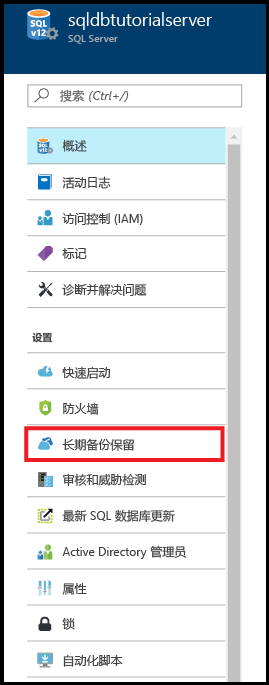

3. 在服务器的“长期备份保留”页面上，查看并接受预览条款（除非已执行此操作或此功能已不处于预览中）。

   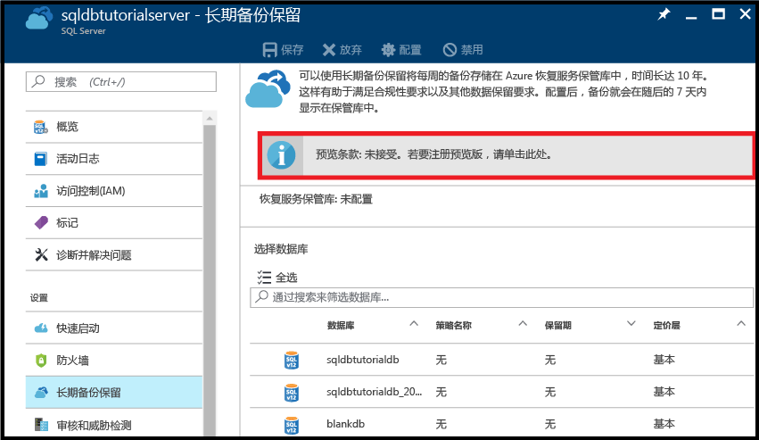

4. 要配置长期备份保留，请在网格中选择该数据库，并在工具栏上单击“配置”。

   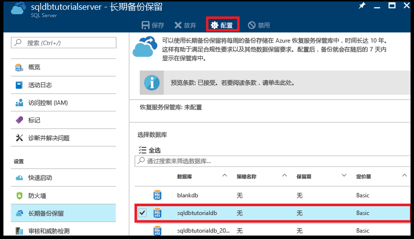

5. 在“配置”页面上，单击“恢复服务保管库”下的“配置所需设置”。

   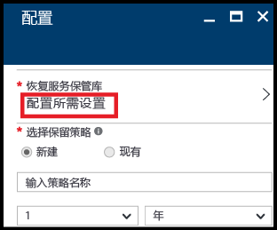

6. 在“恢复服务保管库”页面上，选择现有保管库（如果有）。 如果找不到订阅的恢复服务保管库，则单击以退出此流程并创建恢复服务保管库。

   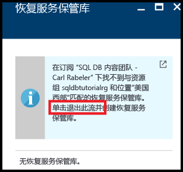

7. 在“恢复服务保管库”页面上，单击“添加”。

   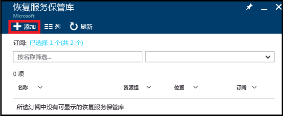
   
8. 在“恢复服务保管库”页面上，为恢复服务保管库提供有效的名称。

   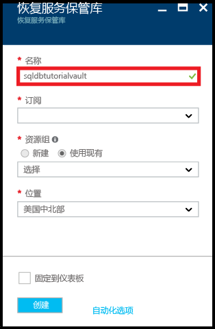

9. 选择订阅和资源组，并选择保管库的位置。 完成后，单击“创建”。

   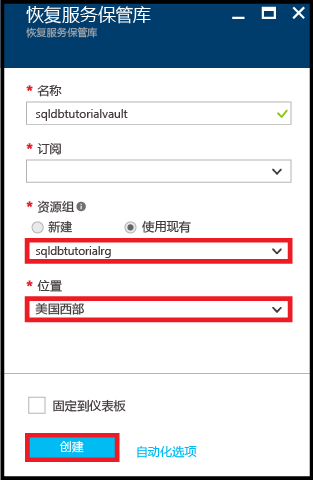

   > [!IMPORTANT]
   > 保管库必须位于与 Azure SQL 逻辑服务器相同的区域，并且必须使用与逻辑服务器相同的资源组。
   >

10. 创建新保管库后，执行必要的步骤以返回到“恢复服务保管库”页面。

11. 在“恢复服务保管库”页面上，单击保管库，并单击“选择”。

   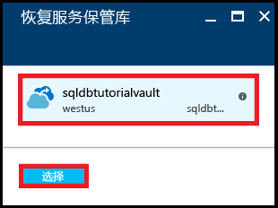

12. 在“配置”页面上，为新保留策略提供有效的名称，根据需要修改默认保留策略，并单击“确定”。

   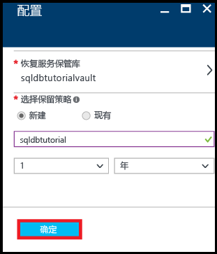
   
   >[!NOTE]
   >保留策略名称不允许使用某些字符，包括空格。

13. 在数据库的“长期备份保留”页面上，单击“保存”，然后单击“确定”，将长期备份保留策略应用于所选数据库。

   

14. 单击“保存”以使用此新策略对你配置的 Azure 恢复服务保管库启用长期备份保留。

   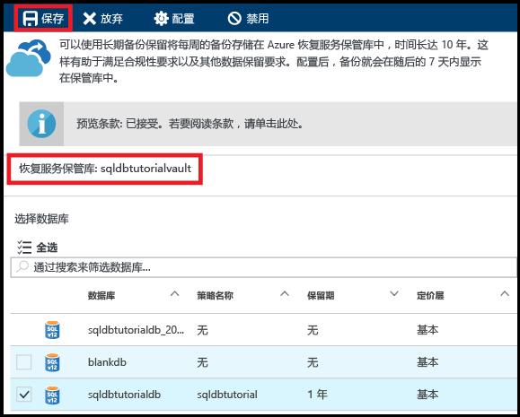

> [!IMPORTANT]
> 配置后，备份会在接下来的七天内显示在保管库中。 备份显示在保管库中后再继续本教程。
>

### <a name="view-backups-in-long-term-retention-using-azure-portal"></a>使用 Azure 门户查看长期保留的备份

在[长期备份保留](sql-database-long-term-retention.md)中查看有关数据库备份的信息。 

1. 在 Azure 门户中，打开数据库备份的 Azure 恢复服务保管库（转到“所有资源”并从订阅的资源列表中选择它）以查看数据库备份在保管库中使用的存储量。

   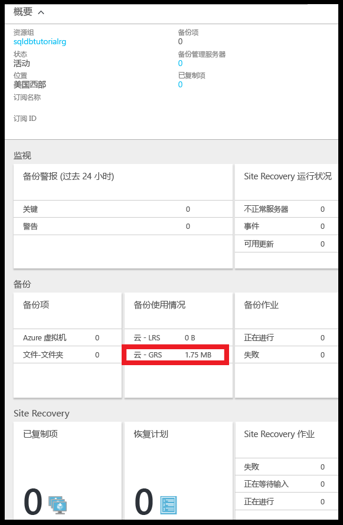

2. 打开数据库的“SQL 数据库”页面。

   

3. 在工具栏上，单击“还原”。

   

4. 在“还原”页面上，单击“长期”。

5. 在 Azure 保管库备份下，单击“选择备份”以查看长期备份保留中的可用数据库备份。

   

### <a name="restore-a-database-from-a-backup-in-long-term-backup-retention-using-the-azure-portal"></a>使用 Azure 门户从长期备份保留中的备份还原数据库

从 Azure 恢复服务保管库中的备份将数据库还原到新数据库。

1. 在“Azure 保管库备份”页面上，单击要还原的备份，并单击“选择”。

   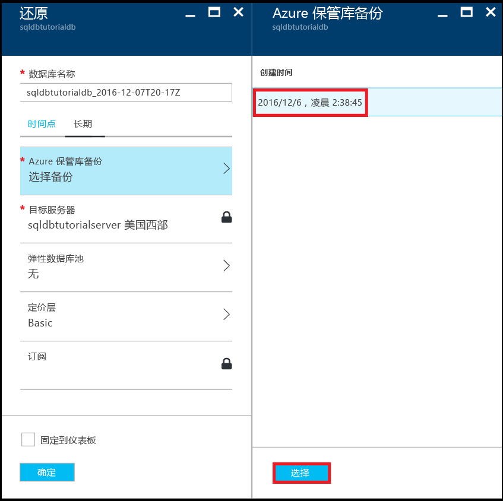

2. 在“数据库名称”文本框中，为已还原的数据库提供名称。

   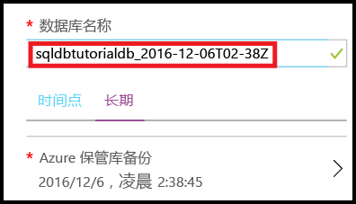

3. 单击“确定”将数据库从保管库中的备份还原到新数据库。

4. 在工具栏上，单击通知图标以查看还原作业的状态。

   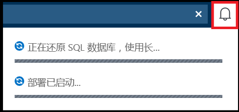

5. 完成还原作业后，打开“SQL 数据库”页面以查看新还原的数据库。

   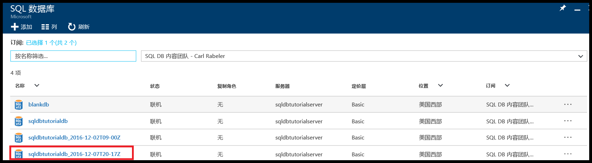

> [!NOTE]
> 从此处，可使用 SQL Server Management Studio 连接到已还原的数据库，以执行所需任务，例如[从恢复的数据库中提取一部分数据，复制到现有数据库或删除现有数据库，并将已还原数据库的名称重命名为现有数据库名称](sql-database-recovery-using-backups.md#point-in-time-restore)。
>

## <a name="powershell"></a>PowerShell

以下章节介绍如何使用 PowerShell 配置 Azure 恢复服务保管库、查看保管库中的备份和从保管库进行还原。

### <a name="create-a-recovery-services-vault"></a>创建恢复服务保管库

使用 [New-AzureRmRecoveryServicesVault](/powershell/module/azurerm.recoveryservices/new-azurermrecoveryservicesvault) 创建恢复服务保管库。

> [!IMPORTANT]
> 保管库必须位于与 Azure SQL 逻辑服务器相同的区域，并且必须使用与逻辑服务器相同的资源组。

```PowerShell
# Create a recovery services vault

#$resourceGroupName = "{resource-group-name}"
#$serverName = "{server-name}"
$serverLocation = (Get-AzureRmSqlServer -ServerName $serverName -ResourceGroupName $resourceGroupName).Location
$recoveryServiceVaultName = "{new-vault-name}"

$vault = New-AzureRmRecoveryServicesVault -Name $recoveryServiceVaultName -ResourceGroupName $ResourceGroupName -Location $serverLocation 
Set-AzureRmRecoveryServicesBackupProperties -BackupStorageRedundancy LocallyRedundant -Vault $vault
```

### <a name="set-your-server-to-use-the-recovery-vault-for-its-long-term-retention-backups"></a>将服务器设置为使用其长期保留备份的恢复保管库

使用 [Set-AzureRmSqlServerBackupLongTermRetentionVault](/powershell/module/azurerm.sql/set-azurermsqlserverbackuplongtermretentionvault) cmdlet 将先前创建的恢复服务保管库与特定 Azure SQL 服务器关联。

```PowerShell
# Set your server to use the vault to for long-term backup retention 

Set-AzureRmSqlServerBackupLongTermRetentionVault -ResourceGroupName $resourceGroupName -ServerName $serverName -ResourceId $vault.Id
```

### <a name="create-a-retention-policy"></a>创建保留策略

保留策略用于设置数据库备份的保留时间。 使用 [Get-AzureRmRecoveryServicesBackupRetentionPolicyObject](https://docs.microsoft.com/powershell/resourcemanager/azurerm.recoveryservices.backup/v2.3.0/get-azurermrecoveryservicesbackupretentionpolicyobject) cmdlet 获取默认保留策略，以用作策略创建的模板。 此模板中，保留期设置为 2 年。 接下来，运行 [New-AzureRmRecoveryServicesBackupProtectionPolicy](/powershell/module/azurerm.recoveryservices.backup/new-azurermrecoveryservicesbackupprotectionpolicy) 来最终创建策略。 

> [!NOTE]
> 某些 cmdlet 要求在运行 ([Set-AzureRmRecoveryServicesVaultContext](/powershell/module/azurerm.recoveryservices/set-azurermrecoveryservicesvaultcontext)) 之前设置保管库上下文，因此会在多个相关的代码片段中看到此 cmdlet。 设置上下文是因为策略是保管库的一部分。 可以为每个保管库创建多个保留策略，然后将所需策略应用到特定数据库。 


```PowerShell
# Retrieve the default retention policy for the AzureSQLDatabase workload type
$retentionPolicy = Get-AzureRmRecoveryServicesBackupRetentionPolicyObject -WorkloadType AzureSQLDatabase

# Set the retention value to two years (you can set to any time between 1 week and 10 years)
$retentionPolicy.RetentionDurationType = "Years"
$retentionPolicy.RetentionCount = 2
$retentionPolicyName = "my2YearRetentionPolicy"

# Set the vault context to the vault you are creating the policy for
Set-AzureRmRecoveryServicesVaultContext -Vault $vault

# Create the new policy
$policy = New-AzureRmRecoveryServicesBackupProtectionPolicy -name $retentionPolicyName -WorkloadType AzureSQLDatabase -retentionPolicy $retentionPolicy
$policy
```

### <a name="configure-a-database-to-use-the-previously-defined-retention-policy"></a>将数据库配置为使用以前定义的保留策略

使用 [Set-AzureRmSqlDatabaseBackupLongTermRetentionPolicy](/powershell/module/azurerm.sql/set-azurermsqldatabasebackuplongtermretentionpolicy) cmdlet 将新策略应用到特定数据库。

```PowerShell
# Enable long-term retention for a specific SQL database
$policyState = "enabled"
Set-AzureRmSqlDatabaseBackupLongTermRetentionPolicy -ResourceGroupName $resourceGroupName -ServerName $serverName -DatabaseName $databaseName -State $policyState -ResourceId $policy.Id
```

### <a name="view-backup-info-and-backups-in-long-term-retention"></a>查看长期保留的备份信息和备份

在[长期备份保留](sql-database-long-term-retention.md)中查看有关数据库备份的信息。 

使用以下 cmdlet 查看备份信息：

- [Get-AzureRmRecoveryServicesBackupContainer](/powershell/module/azurerm.recoveryservices.backup/get-azurermrecoveryservicesbackupcontainer)
- [Get-AzureRmRecoveryServicesBackupItem](/powershell/module/azurerm.recoveryservices.backup/get-azurermrecoveryservicesbackupitem)
- [Get-AzureRmRecoveryServicesBackupRecoveryPoint](/powershell/module/azurerm.recoveryservices.backup/get-azurermrecoveryservicesbackuprecoverypoint)

```PowerShell
#$resourceGroupName = "{resource-group-name}"
#$serverName = "{server-name}"
$databaseNeedingRestore = $databaseName

# Set the vault context to the vault we want to restore from
#$vault = Get-AzureRmRecoveryServicesVault -ResourceGroupName $resourceGroupName
Set-AzureRmRecoveryServicesVaultContext -Vault $vault

# the following commands find the container associated with the server 'myserver' under resource group 'myresourcegroup'
$container = Get-AzureRmRecoveryServicesBackupContainer -ContainerType AzureSQL -FriendlyName $vault.Name

# Get the long-term retention metadata associated with a specific database
$item = Get-AzureRmRecoveryServicesBackupItem -Container $container -WorkloadType AzureSQLDatabase -Name $databaseNeedingRestore

# Get all available backups for the previously indicated database
# Optionally, set the -StartDate and -EndDate parameters to return backups within a specific time period
$availableBackups = Get-AzureRmRecoveryServicesBackupRecoveryPoint -Item $item
$availableBackups
```

### <a name="restore-a-database-from-a-backup-in-long-term-backup-retention"></a>从长期备份保留中的备份还原数据库

从长期备份保留还原使用 [Restore-AzureRmSqlDatabase](/powershell/module/azurerm.sql/restore-azurermsqldatabase) cmdlet。

```PowerShell
# Restore the most recent backup: $availableBackups[0]
#$resourceGroupName = "{resource-group-name}"
#$serverName = "{server-name}"
$restoredDatabaseName = "{new-database-name}"
$edition = "Basic"
$performanceLevel = "Basic"

$restoredDb = Restore-AzureRmSqlDatabase -FromLongTermRetentionBackup -ResourceId $availableBackups[0].Id -ResourceGroupName $resourceGroupName `
 -ServerName $serverName -TargetDatabaseName $restoredDatabaseName -Edition $edition -ServiceObjectiveName $performanceLevel
$restoredDb
```


> [!NOTE]
> 从此处，可使用 SQL Server Management Studio 连接到已还原的数据库，执行所需任务，例如从恢复的数据库中提取一部分数据，复制到现有数据库或删除现有数据库，并将已还原的数据库重命名为现有数据库名。 请参阅[时间点还原](sql-database-recovery-using-backups.md#point-in-time-restore)。

## <a name="how-to-cleanup-backups-in-recovery-services-vault"></a>如何清理恢复服务保管库中的备份

自 2018 年 7 月 1 日起，LTR V1 API 已弃用，恢复服务保管库中的所有现有备份均已迁移到 SQL 数据库托管的 LTR 存储容器中。 为确保你不再为原始备份付费，迁移后这些备份已从保管库中删除。 但是，如果你在保管库上设置了锁定，则这些备份将保留在那里。 为避免不必要的费用，你可以使用以下脚本手动从恢复服务保管库中删除旧备份。 

```PowerShell
<#
.EXAMPLE
    .\Drop-LtrV1Backup.ps1 -SubscriptionId “{vault_sub_id}” -ResourceGroup “{vault_resource_group}” -VaultName “{vault_name}” 
#>
[CmdletBinding()]
Param (
    [Parameter(Mandatory = $true, HelpMessage="The vault subscription ID")]
    $SubscriptionId,

    [Parameter(Mandatory = $true, HelpMessage="The vault resource group name")]
    $ResourceGroup,

    [Parameter(Mandatory = $true, HelpMessage="The vault name")]
    $VaultName
)

Login-AzureRmAccount

Select-AzureRmSubscription -SubscriptionId $SubscriptionId

$vaults = Get-AzureRmRecoveryServicesVault
$vault = $vaults | where { $_.Name -eq $VaultName }

Set-AzureRmRecoveryServicesVaultContext -Vault $vault

$containers = Get-AzureRmRecoveryServicesBackupContainer -ContainerType AzureSQL

ForEach ($container in $containers)
{
   $canDeleteContainer = $true  
   $ItemCount = 0
   Write-Host "Working on container" $container.Name
   $items = Get-AzureRmRecoveryServicesBackupItem -container $container -WorkloadType AzureSQLDatabase
   ForEach ($item in $items)
   {
          write-host "Deleting item" $item.name
          Disable-AzureRmRecoveryServicesBackupProtection -RemoveRecoveryPoints -item $item -Force
   }

   Write-Host "Deleting container" $container.Name
   Unregister-AzureRmRecoveryServicesBackupContainer -Container $container
}
```

## <a name="next-steps"></a>后续步骤

- 若要了解服务生成的自动备份，请参阅[自动备份](sql-database-automated-backups.md)
- 若要了解长期备份保留，请参阅[长期备份保留](sql-database-long-term-retention.md)
- 若要了解如何从备份中还原，请参阅[从备份中还原](sql-database-recovery-using-backups.md)
