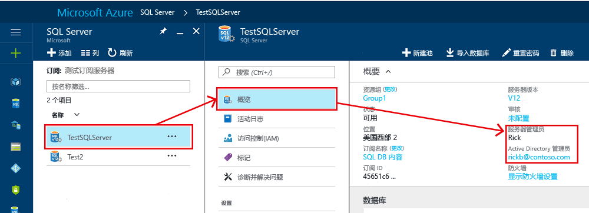

# 使用登录名和用户帐户授予数据库访问权限并授权到 SQL 数据库和 Azure Synapse Analytics

使用登录名和用户帐户对 Azure SQL 数据库和 Azure Synapse Analytics （以前称为 Azure SQL 数据仓库）中的数据库进行经过身份验证的访问。 [**身份验证**](sql-database-security-overview.md#authentication)是证明用户身份的过程。

- 登录名是 master 数据库中的单个帐户
- 用户帐户是任何数据库中的个人帐户，无需与登录名相关联

> [!IMPORTANT]
> Azure SQL 数据库和 Azure Synapse Analytics （以前称为 Azure SQL 数据仓库）中的数据库将在本文的其余部分统称为 Azure SQL 数据库（为简单起见）。

数据库用户使用用户帐户连接到 Azure SQL 数据库，并使用以下两种方法之一进行身份验证：

- [SQL 身份验证](https://docs.microsoft.com/sql/relational-databases/security/choose-an-authentication-mode#connecting-through-sql-server-authentication)，由存储在 Azure SQL 数据库中的登录名、用户帐户名和关联密码组成。
- [Azure Active Directory 身份验证](sql-database-aad-authentication.md)，它使用存储在 Azure Active Directory 中的登录凭据

在 Azure SQL 数据库中访问数据和执行各种操作的授权使用数据库角色和显式权限进行管理。 [**授权**](sql-database-security-overview.md#authorization)是指分配给 Azure SQL 数据库中的用户的权限，并确定允许用户执行的操作。 授权由用户帐户的数据库[角色成员身份](https://docs.microsoft.com/sql/relational-databases/security/authentication-access/database-level-roles)和[对象级权限](https://docs.microsoft.com/sql/relational-databases/security/permissions-database-engine)控制。 作为最佳实践，应向用户授予所需的最低权限。

在本文中，将学习以下内容：

- 最初创建新的 Azure SQL 数据库后的访问和授权配置
- 如何在 master 数据库和用户帐户中添加登录名和用户帐户，然后向这些帐户授予管理权限
- 如何在用户数据库中添加用户帐户（与登录名或作为包含的用户帐户关联）
- 使用数据库角色和显式权限在用户数据库中配置具有权限的用户帐户

## 创建新数据库后的现有登录名和用户帐户

创建第一个 Azure SQL 数据库部署时，为该登录名指定管理员登录名和关联的密码。 此管理帐户称为**服务器管理员**。在部署过程中，主数据库和用户数据库中的登录名和用户的以下配置将会发生：

- 使用指定的登录名创建具有管理权限的 SQL 登录名。 [登录名](https://docs.microsoft.com/sql/relational-databases/security/authentication-access/principals-database-engine#sa-login)是用于登录到 SQL 数据库的单个用户帐户。
- 此登录名被授予了对所有数据库作为[服务器级别主体](https://docs.microsoft.com/sql/relational-databases/security/authentication-access/principals-database-engine)的完全管理权限。 此登录名在 SQL 数据库中具有所有可用的权限，并且不能受到限制。 在托管实例中，此登录名添加到[sysadmin 固定服务器角色](https://docs.microsoft.com/sql/relational-databases/security/authentication-access/server-level-roles)中（对于单一或共用数据库，此角色不存在）。
- 将为每个用户数据库中的此登录名创建一个名为 `dbo` 的[用户帐户](https://docs.microsoft.com/sql/relational-databases/security/authentication-access/getting-started-with-database-engine-permissions#database-users)。 [Dbo](https://docs.microsoft.com/sql/relational-databases/security/authentication-access/principals-database-engine)用户在数据库中拥有所有数据库权限，并将其映射到 `db_owner` 固定数据库角色。 本文稍后将讨论其他固定数据库角色。

若要确定 SQL server 的管理员帐户，请打开 Azure 门户，然后导航到 SQL server 或 SQL 数据库的 "**属性**" 选项卡。

> [!IMPORTANT]
> 在创建管理员登录名后，不能对其进行更改。 若要重置逻辑服务器管理员的密码，请单击 " [Azure 门户](https://portal.azure.com)"，单击 " **SQL server**"，从列表中选择服务器，然后单击 "**重置密码**"。 若要重置托管实例服务器的密码，请前往 Azure 门户，单击该实例，然后单击 "**重置密码**"。 你还可以使用 PowerShell 或 Azure CLI。

## 创建具有管理权限的其他登录名和用户

此时，只使用单个 SQL 登录名和用户帐户对 SQL 数据库进行访问配置。 若要创建具有完全或部分管理权限的其他登录名，可以使用以下选项（具体取决于部署模式）：

- **创建具有完全管理权限的 Azure Active Directory 管理员帐户**

  启用 Azure Active Directory 身份验证，并创建 Azure AD 管理员登录名。 可以将一个 Azure Active Directory 帐户配置为具有完全管理权限的 SQL 数据库部署的管理员。 此帐户可以是个人帐户或安全组帐户。 如果要使用 Azure AD 帐户连接到 SQL 数据库，则**必须**配置 Azure AD 管理员。 有关为所有 SQL 数据库部署类型启用 Azure AD 身份验证的详细信息，请参阅以下文章：

  - [将 Azure Active Directory 身份验证用于使用 SQL 进行身份验证](sql-database-aad-authentication.md)
  - [使用 SQL 配置和管理 Azure Active Directory 身份验证](sql-database-aad-authentication-configure.md)

- **在托管实例部署中，创建具有完全管理权限的 SQL 登录名**

  - 在托管实例中创建其他 SQL Server 登录名
  - 使用[ALTER SERVER role](https://docs.microsoft.com/sql/t-sql/statements/alter-server-role-transact-sql)语句将登录名添加到[sysadmin 固定服务器角色](https://docs.microsoft.com/sql/relational-databases/security/authentication-access/server-level-roles)。 此登录名具有完全管理权限。
  - 或者，使用<a href="/sql/t-sql/statements/create-login-transact-sql?view=azuresqldb-mi-current">CREATE login</a>语法创建[Azure AD 登录名](sql-database-aad-authentication-configure.md?tabs=azure-powershell#new-azure-ad-admin-functionality-for-mi)。

- **在单个或共用部署中，创建具有有限管理权限的 SQL 登录名**

  - 在 master 数据库中为单个或共用数据库部署或托管实例部署创建附加的 SQL 登录名
  - 在与此新登录名关联的 master 数据库中创建用户帐户
  - 使用[ALTER SERVER role](https://docs.microsoft.com/sql/t-sql/statements/alter-server-role-transact-sql) [sp_addrolemember](https://docs.microsoft.com/sql/relational-databases/system-stored-procedures/sp-addrolemember-transact-sql)语句将用户帐户添加到 `master` 数据库中的 `dbmanager`，`loginmanager` 角色，或者同时添加这两者。

  > [!NOTE]
  > `dbmanager` 和 `loginmanager` 角色与托管实例**部署无关。**

  对于单个或共用数据库，这些[特殊的 master 数据库角色](https://docs.microsoft.com/sql/relational-databases/security/authentication-access/database-level-roles#special-roles-for--and-)的成员使用户拥有创建和管理数据库的权限，或者用于创建和管理登录名的权限。 在由作为 `dbmanager` 角色成员的用户创建的数据库中，成员将映射到 `db_owner` 固定数据库角色，并可以使用 `dbo` 用户帐户登录和管理该数据库。 这些角色没有 master 数据库外的显式权限。

  > [!IMPORTANT]
  > 不能在单个或共用数据库中创建具有完全管理权限的其他 SQL 登录名。

## 为非管理员用户创建帐户

您可以使用以下两种方法之一为非管理用户创建帐户：

- **创建登录名**

  在 master 数据库中创建 SQL 登录名。 然后在每个需要访问该用户的数据库中创建一个用户帐户，并将用户帐户与该登录名相关联。 如果用户必须访问多个数据库，并且你希望使密码保持同步，此方法是首选方法。 但是，与异地复制结合使用时，这种方法很复杂，因为必须同时在主服务器和辅助服务器上创建登录名。 有关详细信息，请参阅为[异地还原或故障转移配置和管理 AZURE SQL 数据库安全性](sql-database-geo-replication-security-config.md)。
- **创建用户帐户**

  在数据库中创建用户需要访问的用户帐户（也称为[包含的用户](https://docs.microsoft.com/sql/relational-databases/security/contained-database-users-making-your-database-portable)）。

  - 使用单个或共用数据库，您始终可以创建这种类型的用户帐户。
  - 对于不支持[Azure AD 服务器主体](sql-database-aad-authentication-configure.md?tabs=azure-powershell#create-contained-database-users-in-your-database-mapped-to-azure-ad-identities)的托管实例数据库，只能在[包含的数据库](https://docs.microsoft.com/sql/relational-databases/databases/contained-databases)中创建这种类型的用户帐户。 通过支持[Azure AD 服务器主体](sql-database-aad-authentication-configure.md?tabs=azure-powershell#create-contained-database-users-in-your-database-mapped-to-azure-ad-identities)的托管实例，你可以创建用户帐户以向托管实例进行身份验证，而无需将数据库用户创建为包含的数据库用户。

  采用此方法时，用户身份验证信息存储在每个数据库中，并自动复制到异地复制的数据库。 但是，如果同一帐户存在于多个数据库中，并且你使用的是 SQL 身份验证，则必须保持密码同步。 此外，如果用户在不同的数据库中具有不同密码的帐户，则记住这些密码可能会成为问题。

> [!IMPORTANT]
> 若要创建映射到 Azure AD 标识的包含用户，必须使用 SQL 数据库中的管理员 Azure AD 帐户进行登录。 在托管实例中，具有 `sysadmin` 权限的 SQL 登录还可以创建 Azure AD 登录名或用户。

有关演示如何创建登录名和用户的示例，请参阅：

- [为单个或共用数据库创建登录名](https://docs.microsoft.com/sql/t-sql/statements/create-login-transact-sql?view=azuresqldb-current#examples-1)
- [为托管实例数据库创建登录名](https://docs.microsoft.com/t-sql/statements/create-login-transact-sql?view=azuresqldb-mi-current#examples-2)
- [为 Azure Synapse Analytics 数据库创建登录名](https://docs.microsoft.com/sql/t-sql/statements/create-login-transact-sql?view=azure-sqldw-latest#examples-3)
- [创建用户](https://docs.microsoft.com/sql/t-sql/statements/create-user-transact-sql#examples)
- [创建 Azure AD 包含的用户](sql-database-aad-authentication-configure.md#create-contained-database-users-in-your-database-mapped-to-azure-ad-identities)

> [!TIP]
> 有关包含在单个或共用数据库中创建 SQL Server 包含的用户的安全教程，请参阅[教程：保护单个或共用数据库](sql-database-security-tutorial.md)。

## 使用固定数据库角色和自定义数据库角色

在数据库中创建用户帐户之后，无论是基于登录名还是包含用户，都可以授权该用户执行各种操作并访问特定数据库中的数据。 你可以使用以下方法来授权访问：

- **固定数据库角色**

  将用户帐户添加到[固定数据库角色](https://docs.microsoft.com/sql/relational-databases/security/authentication-access/database-level-roles)。 有9个固定数据库角色，每个角色都有一组已定义的权限。 最常见的固定数据库角色是： **db_owner**、 **db_ddladmin**、 **db_datawriter**、 **db_datareader**、 **db_denydatawriter**和**db_denydatareader**。 **db_owner** 通常用于向部分用户授予完全权限。 其他固定数据库角色可用于快速开发简单的数据库，但不建议用于大多数生产数据库。 例如， **db_datareader**固定数据库角色授予对数据库中每个表的读取访问权限，而这是绝对必要的。

  - 若要将用户添加到固定数据库角色：

    - 在 Azure SQL 数据库中，使用[ALTER ROLE](https://docs.microsoft.com/sql/t-sql/statements/alter-role-transact-sql)语句。 有关示例，请参阅[ALTER ROLE 示例](https://docs.microsoft.com/sql/t-sql/statements/alter-role-transact-sql#examples)
    - Azure Synapse Analytics，请使用[sp_addrolemember](https://docs.microsoft.com/sql/relational-databases/system-stored-procedures/sp-addrolemember-transact-sql)语句。 有关示例，请参阅[sp_addrolemember 示例](https://docs.microsoft.com/sql/t-sql/statements/alter-role-transact-sql)。

- **自定义数据库角色**

  使用[CREATE role](https://docs.microsoft.com/sql/t-sql/statements/create-role-transact-sql)语句创建自定义数据库角色。 使用自定义角色，您可以创建自己的用户定义的数据库角色，并为每个角色认真授予业务需求所需的最小权限。 然后，你可以将用户添加到自定义角色。 如果用户是多个角色的成员，则会聚合所有这些角色的权限。
- **直接授予权限**

  直接向用户帐户授予[权限](https://docs.microsoft.com/sql/relational-databases/security/permissions-database-engine)。 可以在 SQL 数据库中单独授予或拒绝 100 多种权限。 这些权限中，许多都是嵌套式的。 例如，针对架构的 `UPDATE` 权限包括针对该架构中每个表的 `UPDATE` 权限。 与大多数权限系统中的情况一样，拒绝某个权限将覆盖对该权限的授予操作。 考虑到权限的嵌套性质和数目，可能需要进行仔细的研究才能设计出适当的权限系统，以便对数据库进行恰当的保护。 一开始可以了解[权限（数据库引擎）](https://docs.microsoft.com/sql/relational-databases/security/permissions-database-engine)中的权限列表，并查看这些权限的[海报大小的图](https://docs.microsoft.com/sql/relational-databases/security/media/database-engine-permissions.png)。

## 使用组

有效的访问管理使用分配给 Active Directory 安全组和固定角色或自定义角色（而不是单个用户）的权限。

- 使用 Azure Active Directory 身份验证时，请将 Azure Active Directory 用户放入 Azure Active Directory 安全组。 为该组创建包含数据库用户。 将一个或多个数据库用户放入具有适用于该用户组的特定权限的自定义数据库角色。

- 使用 SQL 身份验证时，在数据库中创建包含的数据库用户。 将一个或多个数据库用户放入具有适用于该用户组的特定权限的自定义数据库角色。

  > [!NOTE]
  > 你还可以对非包含数据库用户使用组。

用户应熟悉以下功能，以便限制或提升权限：

- [模拟](https://docs.microsoft.com/dotnet/framework/data/adonet/sql/customizing-permissions-with-impersonation-in-sql-server)和[模块签名](https://docs.microsoft.com/dotnet/framework/data/adonet/sql/signing-stored-procedures-in-sql-server)可用于安全地暂时提升权限。
- [行级安全性](https://docs.microsoft.com/sql/relational-databases/security/row-level-security)可用于限制用户可访问的行。
- [数据屏蔽](sql-database-dynamic-data-masking-get-started.md)可用于限制敏感数据的公开。
- [存储过程](https://docs.microsoft.com/sql/relational-databases/stored-procedures/stored-procedures-database-engine)可用于限制可对数据库执行的操作。

## 后续步骤

有关所有 SQL 数据库安全功能的概述，请参阅 [SQL 安全概述](sql-database-security-overview.md)。
