# 使用 Azure 门户管理 Azure SQL 数据库

在 [Azure 门户](https://portal.azure.com/)中，可以创建、监视和管理 Azure SQL 数据库与服务器。 本文提供更多常见任务的快速说明和详细信息的链接。

> [!TIP]
> 若需通过教程来了解如何创建服务器、创建基于服务器的防火墙、查看服务器属性、使用 SQL Server Management Studio 进行连接、查询 master 数据库、创建示例数据库和空数据库、查询数据库属性、使用 SQL Server Management Studio 进行连接，以及查询示例数据库，请参阅[入门教程](sql-database-get-started.md)。

## 查看 Azure SQL 数据库、服务器和池
若要查看可用的 SQL 数据库服务，请单击“**更多服务**”，然后在搜索框中键入 **SQL**：

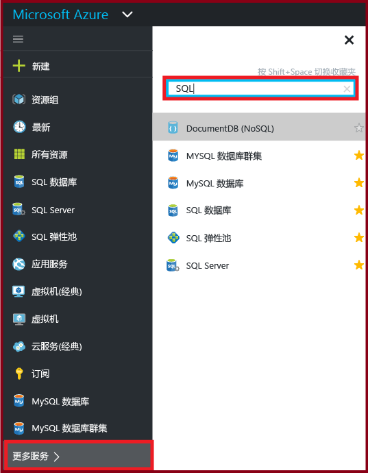

## 如何创建或查看 Azure SQL 数据库？
若要打开“**SQL 数据库**”边栏选项卡，请单击“**SQL 数据库**”，然后单击要使用的数据库，或单击“**+添加**”创建 SQL 数据库。 有关详细信息，请参阅[使用 Azure 门户创建第一个 Azure SQL 数据库](sql-database-get-started.md)。

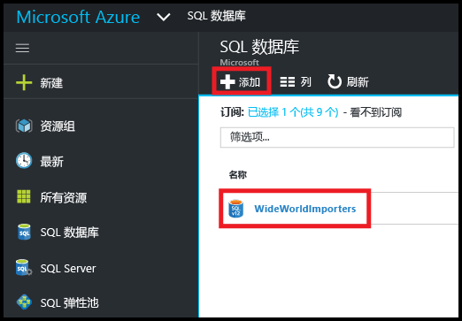

## 如何创建或查看 Azure SQL Server？
若要打开“**SQL Server**”边栏选项卡，请单击“**SQL Server**”，然后单击要使用的服务器，或单击“**+添加**”创建 SQL Server。 有关详细信息，请参阅[使用 Azure 门户创建第一个 Azure SQL 数据库](sql-database-get-started.md)。

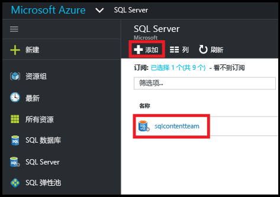

## 如何创建或查看 SQL 弹性池？
若要打开“**SQL 弹性池**”边栏选项卡，请单击“**SQL 弹性池**”，然后单击要使用的池，或单击“**+添加**”创建池。 有关详细信息，请参阅[使用 Azure 门户创建弹性池](sql-database-elastic-pool-manage-portal.md)。

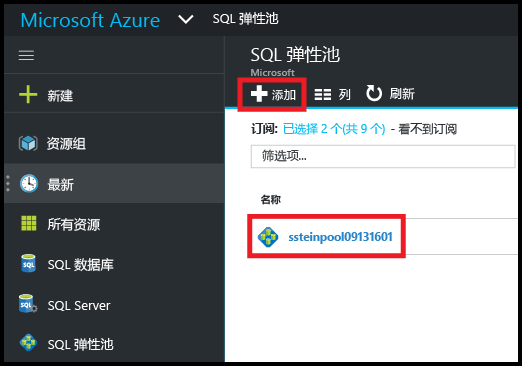

## 如何更新或查看 SQL 数据库设置？
若要查看或更新数据库设置，请在“SQL 数据库”边栏选项卡中单击所需的设置：

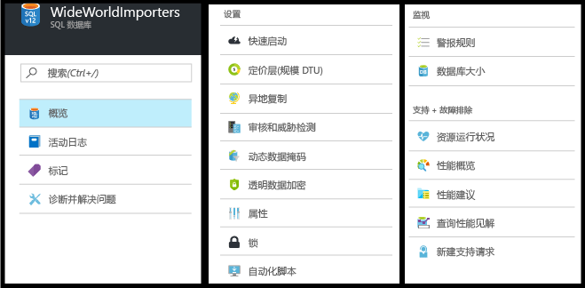

## 如何查找 SQL 数据库的完整限定服务器名称？
若要查看数据库服务器名称，请在“ **SQL 数据库**”边栏选项卡中单击“**概述**”，然后记下服务器名称：

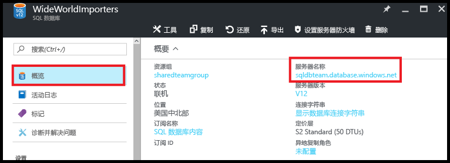

## 如何管理防火墙规则以控制 SQL Server 和数据库的访问权限？
若要查看、创建或更新防火墙规则，请在“SQL 数据库”边栏选项卡中单击“设置服务器防火墙”。 有关详细信息，请参阅[使用 Azure 门户配置 Azure SQL 数据库服务器级防火墙规则](sql-database-configure-firewall-settings.md)。

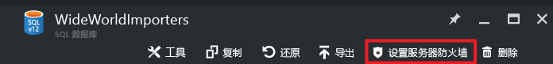

## 如何更改 SQL 数据库服务层或性能级别？
若要更新 SQL 数据库的服务层或性能级别，请在“**SQL 数据库**”边栏选项卡中单击“**定价层(缩放 DTU)**”。 有关详细信息，请参阅[更改 SQL 数据库的服务层和性能级别（定价层）](sql-database-service-tiers.md)。

## 如何为 SQL 数据库配置审核和威胁检测？
若要为 SQL 数据库配置审核和威胁检测，请在“**SQL 数据库**”边栏选项卡中单击“**审核与威胁检测**”。 有关详细信息，请参阅[数据库审核](sql-database-auditing.md)和 [SQL 数据库威胁检测入门](sql-database-threat-detection.md)。

## 如何为 SQL 数据库配置动态数据掩码？
若要为 SQL 数据库配置动态数据掩码，请在“**SQL 数据库**”边栏选项卡中单击“**动态数据掩码**。 有关详细信息，请参阅 [SQL 数据库动态数据掩码入门](sql-database-dynamic-data-masking-get-started.md)。

## 如何为 SQL 数据库配置透明数据加密 (TDE)？
若要将 SQL 数据库配置为透明数据加密，请在“**SQL 数据库**”边栏选项卡中单击“**透明数据加密**”。 有关详细信息，请参阅[使用门户在数据库上启用 TDE](https://msdn.microsoft.com/library/dn948096#Anchor_1)。

## 如何查看或更改SQL 数据库的大小上限？
若要查看或更改 SQL 数据库的大小，请在“**SQL 数据库**”边栏选项卡中单击“**数据库大小**”。 通过更改服务层或性能级别来更新数据库的大小上限。 有关详细信息，请参阅[更改 SQL 数据库的服务层和性能级别（定价层）](sql-database-service-tiers.md)。

## 如何监视和改善 SQL 数据库的性能？
若要监视和改善 SQL 数据库的性能特征，请在“**SQL 数据库**”边栏选项卡中单击“**性能概述**”。 有关详细信息，请参阅 [SQL 数据库性能见解](sql-database-performance.md)。

## 如何配置异地复制？
若要为 SQL 数据库配置异地复制，请在“**SQL 数据库**”边栏选项卡中单击“**异地复制**”。 有关详细信息，请参阅[使用 Azure 门户为 Azure SQL 数据库配置异地复制](sql-database-geo-replication-portal.md)。

## 如何故障转移到异地复制的 SQL 数据库？
若要故障转移到异地复制的辅助数据库，请在“SQL 数据库”边栏选项卡中单击“异地复制”，然后单击“故障转移”。 有关详细信息，请参阅[使用 Azure 门户为 Azure SQL 数据库启动计划的或未计划的故障转移](sql-database-geo-replication-failover-portal.md)。

## 如何复制 SQL 数据库？
若要复制 SQL 数据库，请在“**SQL 数据库**”边栏选项卡中单击“**复制**”。 有关详细信息，请参阅[使用 Azure 门户复制 Azure SQL 数据库](sql-database-copy-portal.md)。

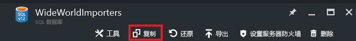

## 如何将 Azure SQL 数据库存档到 BACPAC 文件？
若要创建 SQL 数据库的 BACPAC，请在“**SQL 数据库**”边栏选项卡中单击“**导出**”。 有关详细信息，请参阅[使用 Azure 门户将 Azure SQL 数据库存档到 BACPAC 文件](sql-database-export.md)。

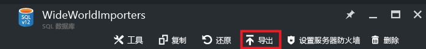

## 如何将 SQL 数据库还原到以前的时间点？
若要还原 SQL 数据库，请在“**SQL 数据库**”边栏选项卡中单击“**还原**”。 有关详细信息，请参阅[使用 Azure 门户将 Azure SQL 数据库还原到以前的时间点](sql-database-point-in-time-restore-portal.md)。

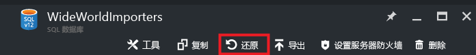

## 如何从 BACPAC 文件创建 Azure SQL 数据库？
若要从 BACPAC 文件创建 SQL 数据库，请在“**SQL Server**”边栏选项卡中单击“**导入数据库**”。 有关详细信息，请参阅[导入 BACPAC 文件以创建 Azure SQL 数据库](sql-database-import-portal.md)。

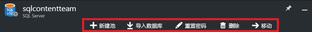

## 如何还原已删除的 SQL 数据库？
若要还原已删除的 SQL 数据库，请在“**SQL Server**”边栏选项卡中单击“**已删除的数据库**”（包含已删除的数据库的 SQL Server）。 有关详细信息，请参阅[使用 Azure 门户还原已删除的 Azure SQL 数据库](sql-database-restore-deleted-database-portal.md)。

## 如何删除 SQL 数据库？
若要删除 SQL 数据库，请在“**SQL 数据库**”边栏选项卡中单击“**删除**”。 

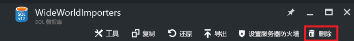

## 其他资源
* [SQL 数据库](sql-database-technical-overview.md)
* [使用 Azure 门户监视和管理弹性池](sql-database-elastic-pool-manage-portal.md)

