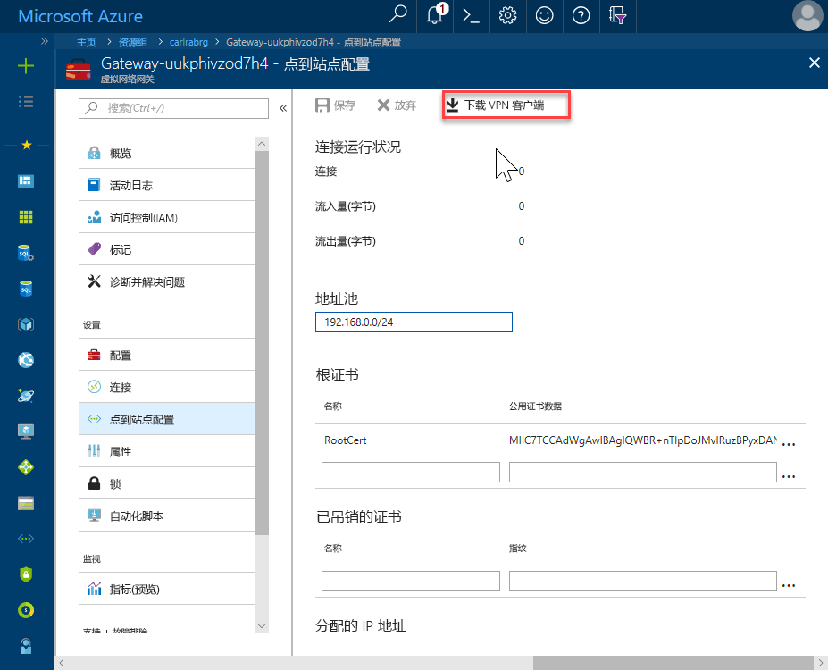
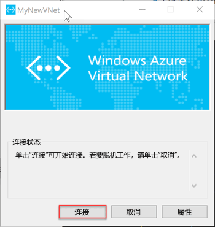

# <a name="quickstart-configure-a-point-to-site-connection-to-an-azure-sql-database-managed-instance-from-on-premises"></a>快速入门：配置从本地到 Azure SQL 数据库托管实例的点到站点连接

本快速入门演示如何使用本地客户端计算机的点到站点连接，通过 [SQL Server Management Studio](https://docs.microsoft.com/sql/ssms/sql-server-management-studio-ssms) (SSMS) 连接到 Azure SQL 数据库托管实例。 有关点到站点连接的信息，请参阅[关于点到站点 VPN](../vpn-gateway/point-to-site-about.md)

## <a name="prerequisites"></a>先决条件

本快速入门：

- 从[创建托管实例](sql-database-managed-instance-get-started.md)中创建的资源着手。
- 本地客户端计算机需要 PowerShell 5.1 和 AZ PowerShell 1.4.0 或更高版本。 必要时，请根据说明来[安装 Azure PowerShell 模块](https://docs.microsoft.com/powershell/azure/install-az-ps#install-the-azure-powershell-module)。
- 本地客户端计算机需要最新版本的 [SQL Server Management Studio](https://docs.microsoft.com/sql/ssms/sql-server-management-studio-ssms) (SSMS)。

## <a name="attach-a-vpn-gateway-to-your-managed-instance-virtual-network"></a>将 VPN 网关附加到托管实例虚拟网络

1. 在本地客户端计算机上打开 PowerShell。

2. 复制此 PowerShell 脚本。 此脚本将 VPN 网关附加到在[创建托管实例](sql-database-managed-instance-get-started.md)快速入门中创建的托管实例虚拟网络。 此脚本使用 Azure PowerShell Az 模块，并将对基于 Windows 或 Linux 的主机执行以下操作：

   - 在客户端计算机上创建并安装证书
   - 计算未来的 VPN 网关子网 IP 范围
   - 创建 GatewaySubnet
   - 部署可将 VPN 网关附加到 VPN 子网的 Azure 资源管理器模板

     ```powershell
     $scriptUrlBase = 'https://raw.githubusercontent.com/Microsoft/sql-server-samples/master/samples/manage/azure-sql-db-managed-instance/attach-vpn-gateway'

     $parameters = @{
       subscriptionId = '<subscriptionId>'
       resourceGroupName = '<resourceGroupName>'
       virtualNetworkName = '<virtualNetworkName>'
       certificateNamePrefix  = '<certificateNamePrefix>'
       }

     Invoke-Command -ScriptBlock ([Scriptblock]::Create((iwr ($scriptUrlBase+'/attachVPNGateway.ps1?t='+ [DateTime]::Now.Ticks)).Content)) -ArgumentList $parameters, $scriptUrlBase
     ```

3. 将该脚本粘贴到 PowerShell 窗口并提供所需的参数。 `<subscriptionId>`、`<resourceGroup>`、`<virtualNetworkName>` 的值应匹配用于[创建托管实例](sql-database-managed-instance-get-started.md)快速入门的值。 `<certificateNamePrefix>` 的值可以是所选字符串。

4. 执行 PowerShell 脚本。

> [!IMPORTANT]
> 在 PowerShell 脚本完成前，请勿继续操作。

## <a name="create-a-vpn-connection-to-your-managed-instance"></a>创建连接到托管实例的 VPN 连接

1. 登录到 [Azure 门户](https://portal.azure.com/)。
2. 打开在其中创建了虚拟网关的资源组，然后打开虚拟网关资源。
3. 选择“点到站点配置”，然后选择“下载 VPN 客户端”。

      
4. 在本地客户端计算机上，从 zip 文件中提取文件，然后打开包含已提取文件的文件夹。
5. 打开 **WindowsAmd64** 文件夹，然后打开 **VpnClientSetupAmd64.exe** 文件。
6. 如果收到“Windows 已保护你的电脑”消息，请单击“更多信息”，然后单击“仍然运行”。

    \
7. 在“用户帐户控制”对话框中单击“是”，继续下一步。
8. 在引用虚拟网络的对话框中选择“是”，为虚拟网络安装 VPN 客户端。

## <a name="connect-to-the-vpn-connection"></a>连接到 VPN 连接

1. 在本地客户端计算机上的“网络和 Internet”中转到“VPN”，选择“托管实例”虚拟网络，以便建立到此 VNet 的连接。 在下图中，VNet 命名为 **MyNewVNet**。

      
2. 选择“连接”。
3. 在对话框中，选择“连接”。

      
4. 当系统提示连接管理器需要提升的权限才能更新路由表时，请选择“继续”。
5. 在“用户帐户控制”对话框中选择“是”以继续。

   已建立到托管实例 VNet 的 VPN 连接。

      

## <a name="use-ssms-to-connect-to-the-managed-instance"></a>使用 SSMS 连接到托管实例

1. 在本地客户端计算机上，打开 SQL Server Management Studio (SSMS)。
2. 在“连接到服务器”对话框的“服务器名称”框中输入托管实例的完全限定**主机名**。
3. 选择“SQL Server 身份验证”，提供用户名和密码，然后选择“连接”。

      

连接后，可以在“数据库”节点中查看系统和用户数据库。 还可在安全性、服务器对象、复制、管理、SQL Server 代理和 XEvent Profiler 节点中查看各种对象。

## <a name="next-steps"></a>后续步骤

- 有关介绍如何从 Azure 虚拟机进行连接的快速入门，请参阅[配置点到站点连接](sql-database-managed-instance-configure-p2s.md)。
- 如需应用程序的连接选项的概述，请参阅[将应用程序连接到托管实例](sql-database-managed-instance-connect-app.md)。
- 若要将现有 SQL Server 数据库从本地还原到托管实例，可以使用[用于迁移的 Azure 数据库迁移服务 (DMS)](../dms/tutorial-sql-server-to-managed-instance.md)，或使用 [T-SQL RESTORE 命令](sql-database-managed-instance-get-started-restore.md)从数据库备份文件还原。
