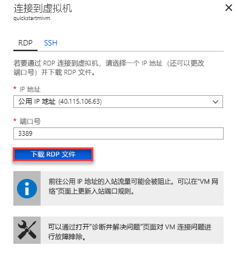

# 配置 Azure VM，以便连接到 Azure SQL 数据库托管实例

本快速入门演示如何配置 Azure 虚拟机，以便使用 SQL Server Management Studio (SSMS) 连接到 Azure SQL 数据库托管实例。 如需介绍如何使用点到站点连接从本地客户端计算机进行连接的快速入门，请参阅[配置点到站点连接](sql-database-managed-instance-configure-p2s.md) 

## 先决条件

本快速入门从以下快速入门中创建的资源着手：[创建托管实例](sql-database-managed-instance-get-started.md)。

## 登录到 Azure 门户

登录到 [Azure 门户](https://portal.azure.com/)。

## 在托管实例 VNet 中创建新的子网

以下步骤在托管实例 VNet 中创建新的子网，以便 Azure 虚拟机连接到托管实例。 托管实例子网专用于托管实例，不能在该子网中创建任何其他的资源（例如 Azure 虚拟机）。 

1. 打开在[创建托管实例](sql-database-managed-instance-get-started.md)快速入门中创建的托管实例的资源组，单击托管实例的虚拟网络，然后单击“子网”。

   

2. 单击“子网”旁边的 **+** 符号，创建新的实例。

   

3. 根据下表中的说明，在窗体中填充请求的信息：

   | 设置| 建议的值 | 说明 |
   | ---------------- | ----------------- | ----------- | 
   | **Name** | 任何有效的名称|请参阅[命名规则和限制](https://docs.microsoft.com/azure/architecture/best-practices/naming-conventions)，了解什么是有效的名称。|
   | **地址范围(CIDR 块)** | 有效的范围 | 默认值适用于本快速入门。|
   | **网络安全组** | 无 | 默认值适用于本快速入门。|
   | **路由表** | 无 | 默认值适用于本快速入门。|
   | **服务终结点** | 已选择 0 | 默认值适用于本快速入门。|
   | **子网委派** | 无 | 默认值适用于本快速入门。|
 
   

4. 单击“确定”，在托管实例 VNet 中创建这个额外的子网。

## 在 VNet 的新子网中创建虚拟机

以下步骤说明如何在新的子网中创建虚拟机，以便连接到托管实例。 

## 准备 Azure 虚拟机

由于 SQL 托管实例放置在专用虚拟网络中，因此需创建一个 Azure VM，其中需安装一些 SQL 客户端工具（例如 SQL Server Management Studio 或 Azure Data Studio），以便连接到托管实例并执行查询。 本快速入门使用 SQL Server Management Studio。

若要使用所有必需的工具创建一个客户端虚拟机，最容易的方式是使用 Azure 资源管理器模板。

1. 单击下面的按钮，创建客户端虚拟机并安装 SQL Server Management Studio（确保在另一浏览器标签页中登录到 Azure 门户）：

    

2. 根据下表中的说明，在窗体中填充请求的信息：

   | 设置| 建议的值 | Description |
   | ---------------- | ----------------- | ----------- |
   | **订阅** | 有效的订阅 | 必须是有权在其中创建新资源的订阅 |
   | **资源组** |在[创建托管实例](sql-database-managed-instance-get-started.md)快速入门中指定的资源组。|此资源组必须是 VNet 所在的资源组。|
   | **位置** | 资源组的位置 | 此值基于所选资源组进行填充 | 
   | **虚拟机名称**  | 任何有效的名称 | 请参阅[命名规则和限制](https://docs.microsoft.com/azure/architecture/best-practices/naming-conventions)，了解什么是有效的名称。|
   |**管理员用户名**|任何有效的用户名|请参阅[命名规则和限制](https://docs.microsoft.com/azure/architecture/best-practices/naming-conventions)，了解什么是有效的名称。 不要使用“serveradmin”，因为这是保留的服务器级角色。| 
   |**密码**|任何有效的密码|密码必须至少 12 个字符长，且符合[定义的复杂性要求](../virtual-machines/windows/faq.md#what-are-the-password-requirements-when-creating-a-vm)。|
   | **虚拟机大小** | 任何有效的大小 | 此模板中的默认值 **Standard_B2s 足以满足本快速入门的要求。 |
   | **位置**|[resourceGroup().location]。| 请勿更改此值 |
   | **虚拟网络名称**|以前选择的位置|有关区域的信息，请参阅 [Azure 区域](https://azure.microsoft.com/regions/)。|
   | **子网名称**|在前述过程中创建的子网的名称| 请勿选择在其中创建了托管实例的子网|
   | **项目位置** | [deployment().properties.templateLink.uri]  请勿更改此值 |
   | **项目位置 Sas 令牌** | 留空 | 请勿更改此值 |

   

   如果使用了在[创建托管实例](sql-database-managed-instance-get-started.md)中建议的 VNet 名称和默认子网，则不需更改后两个参数。 否则，应将这些值更改为设置网络环境时输入的值。

3. 选择“我同意上述条款和条件”复选框。
4. 单击“购买”，在网络中部署 Azure VM。
5. 单击“通知”图标，查看部署的状态。
   
   在创建好 Azure 虚拟机之前，请勿继续操作。 

## 连接到虚拟机

以下步骤说明如何通过远程桌面连接连接到新创建的虚拟机。

1. 部署完成后，转到虚拟机资源。

      

2. 单击“连接”。 
   
   此时会显示远程桌面协议文件（.rdp 文件）窗体，其中包含虚拟机的公共 IP 地址和端口号。 

     

3. 单击“下载 RDP 文件”。
 
   > [!NOTE]
   > 也可使用 SSH 连接到 VM。

4. 关闭“连接到虚拟机”窗体。
5. 若要连接到 VM，请打开下载的 RDP 文件。 
6. 出现提示时，请单击“连接”。 在 Mac 上，需要一个 RDP 客户端，例如 Mac 应用商店提供的这个[远程桌面客户端](https://itunes.apple.com/us/app/microsoft-remote-desktop/id715768417?mt=12)。

6. 输入在创建虚拟机时指定的用户名和密码，单击“确定”。

7. 你可能会在登录过程中收到证书警告。 单击“是”或“继续”继续进行连接。

已连接到“服务器管理器”仪表板中的虚拟机。

## 使用 SSMS 连接到托管实例

1. 在虚拟机中，打开 SQL Server Management Studio (SSMS)。
 
   需要一些时间才能打开，因为这是第一次启动 SSMS，因此需要完成其配置。
2. 在“连接到服务器”对话框的“服务器名称”框中输入托管实例的完全限定**主机名**，选择“SQL Server 身份验证”，提供登录名和密码，然后单击“连接”。

      

连接后，可以在“数据库”节点中查看系统和用户数据库，以及在“安全性”、“服务器对象”、“复制”、“管理”、“SQL Server 代理”和“XEvent 探查器”节点中查看各种对象。

## 后续步骤

- 如需介绍如何使用点到站点连接从本地客户端计算机进行连接的快速入门，请参阅[配置点到站点连接](sql-database-managed-instance-configure-p2s.md)。
- 如需应用程序的连接选项的概述，请参阅[将应用程序连接到托管实例](sql-database-managed-instance-connect-app.md)。
- 若要将现有 SQL 服务器数据库从本地还原到托管实例，可以使用[用于迁移的 Azure 数据库迁移服务 (DMS)](../dms/tutorial-sql-server-to-managed-instance.md) 从数据库备份文件还原，或使用 [T-SQL RESTORE 命令](sql-database-managed-instance-get-started-restore.md)从数据库备份文件还原。
