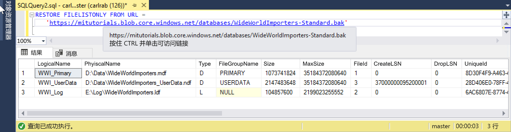

# <a name="quickstart-restore-a-database-to-a-managed-instance"></a>快速入门：将数据库还原到托管实例

本快速入门介绍如何使用 SQL Server Management Studio (SSMS) 将某个数据库（Wide World Importers - Standard 备份文件）从 Azure Blob 存储还原到 Azure SQL 数据库[托管实例](sql-database-managed-instance.md)。

> [!VIDEO https://www.youtube.com/embed/RxWYojo_Y3Q]

> [!NOTE]
> 有关使用 Azure 数据库迁移服务 (DMS) 进行迁移的详细信息，请参阅[使用 DMS 进行托管实例迁移](../dms/tutorial-sql-server-to-managed-instance.md)。
> 有关各种迁移方法的详细信息，请参阅[将 SQL Server 实例迁移到 Azure SQL 数据库托管实例](sql-database-managed-instance-migrate.md)。

## <a name="prerequisites"></a>先决条件

本快速入门：

- 使用[创建托管实例](sql-database-managed-instance-get-started.md)快速入门中的资源。
- 要求计算机上已安装最新的 [SQL Server Management Studio](https://docs.microsoft.com/sql/ssms/sql-server-management-studio-ssms)。
- 要求使用 SSMS 连接到托管实例。 有关连接方法，请参阅以下快速入门：
  - [从 Azure VM 连接到 Azure SQL 数据库托管实例](sql-database-managed-instance-configure-vm.md)
  - [配置从本地到 Azure SQL 数据库托管实例的点到站点连接](sql-database-managed-instance-configure-p2s.md)。

> [!NOTE]
> 有关使用 Azure Blob 存储与[共享访问签名 (SAS) 密钥](https://docs.microsoft.com/azure/storage/common/storage-dotnet-shared-access-signature-part-1)备份和还原 SQL Server 数据库的详细信息，请参阅[将 SQL Server 备份到 URL](sql-database-managed-instance-get-started-restore.md)。

## <a name="restore-the-database-from-a-backup-file"></a>从备份文件还原数据库

在 SSMS 中，遵循以下步骤将 Wide World Importers 数据库还原到托管实例。 数据库备份文件存储在预配置的 Azure Blob 存储帐户中。

1. 打开 SMSS 并连接到托管实例。
2. 在左侧菜单中，右键单击托管实例，并选择“新建查询”打开新的查询窗口。
3. 运行以下 SQL 脚本。该脚本使用预配置的存储帐户和 SAS 密钥在托管实例中[创建凭据](https://docs.microsoft.com/sql/t-sql/statements/create-credential-transact-sql)。

   ```sql
   CREATE CREDENTIAL [https://mitutorials.blob.core.windows.net/databases]
   WITH IDENTITY = 'SHARED ACCESS SIGNATURE'
   , SECRET = 'sv=2017-11-09&ss=bfqt&srt=sco&sp=rwdlacup&se=2028-09-06T02:52:55Z&st=2018-09-04T18:52:55Z&spr=https&sig=WOTiM%2FS4GVF%2FEEs9DGQR9Im0W%2BwndxW2CQ7%2B5fHd7Is%3D'
   ```

    

4. 若要检查凭据，请运行以下脚本。该脚本使用[容器](https://azure.microsoft.com/services/container-instances/) URL 获取备份文件列表。

   ```sql
   RESTORE FILELISTONLY FROM URL =
      'https://mitutorials.blob.core.windows.net/databases/WideWorldImporters-Standard.bak'
   ```

    

5. 运行以下脚本还原 Wide World Importers 数据库。

   ```sql
   RESTORE DATABASE [Wide World Importers] FROM URL =
     'https://mitutorials.blob.core.windows.net/databases/WideWorldImporters-Standard.bak'
   ```

    

6. 运行以下脚本跟踪还原状态。

   ```sql
   SELECT session_id as SPID, command, a.text AS Query, start_time, percent_complete
      , dateadd(second,estimated_completion_time/1000, getdate()) as estimated_completion_time
   FROM sys.dm_exec_requests r
   CROSS APPLY sys.dm_exec_sql_text(r.sql_handle) a
   WHERE r.command in ('BACKUP DATABASE','RESTORE DATABASE')
   ```

7. 还原完成后，请在对象资源管理器中查看它。

## <a name="next-steps"></a>后续步骤

- 若要排查备份到 URL 时出现的问题，请参阅[将 SQL Server 备份到 URL 的最佳做法和故障排除](https://docs.microsoft.com/sql/relational-databases/backup-restore/sql-server-backup-to-url-best-practices-and-troubleshooting)。
- 有关应用连接选项的概述，请参阅[将应用程序连接到托管实例](sql-database-managed-instance-connect-app.md)。
- 若要使用偏好的工具或语言进行查询，请参阅[快速入门：Azure SQL 数据库连接和查询](sql-database-connect-query.md)。
