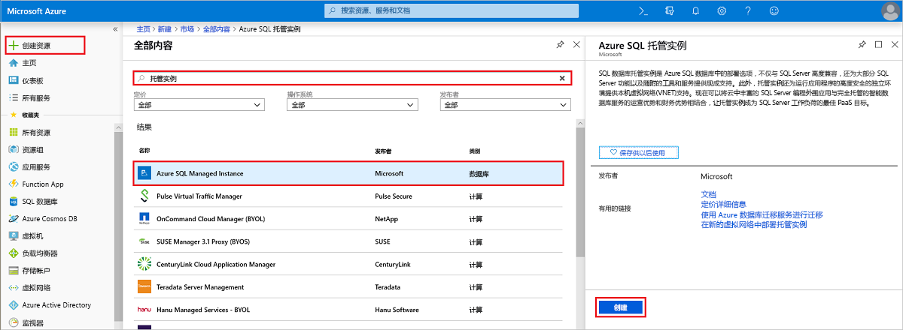
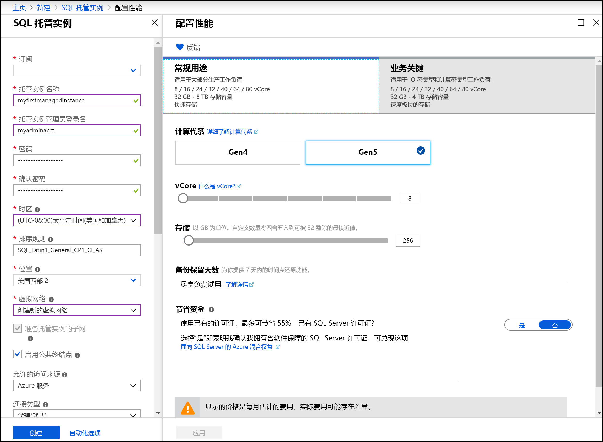
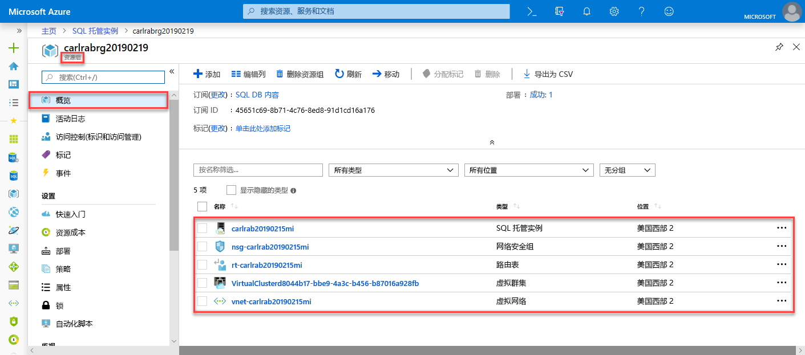
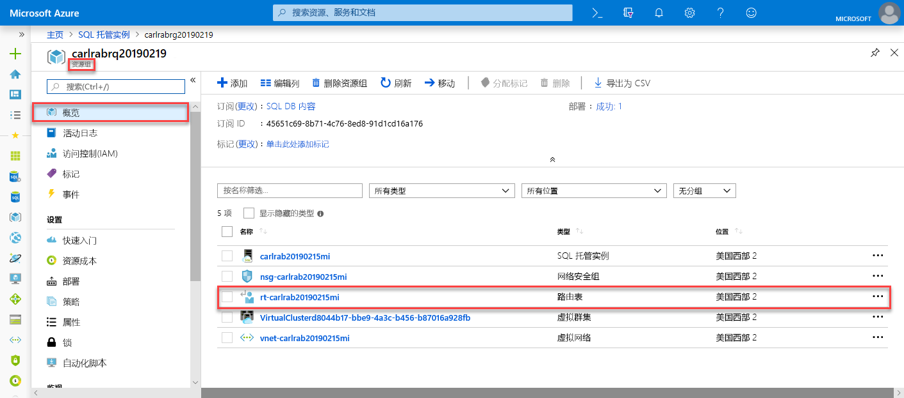
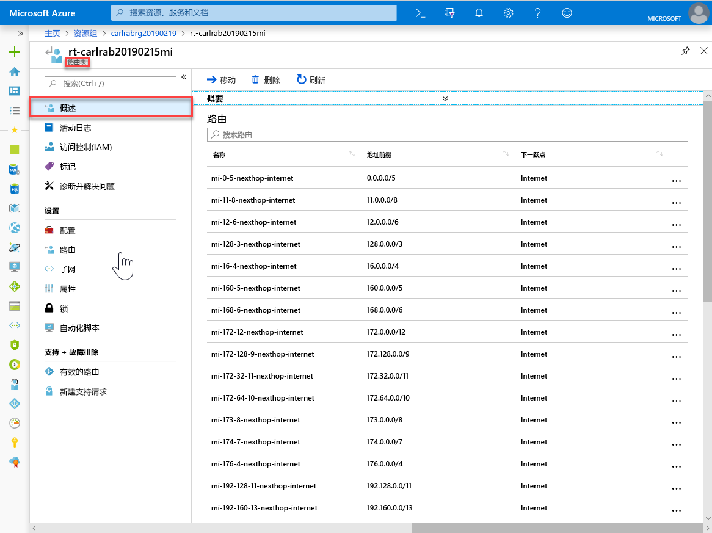
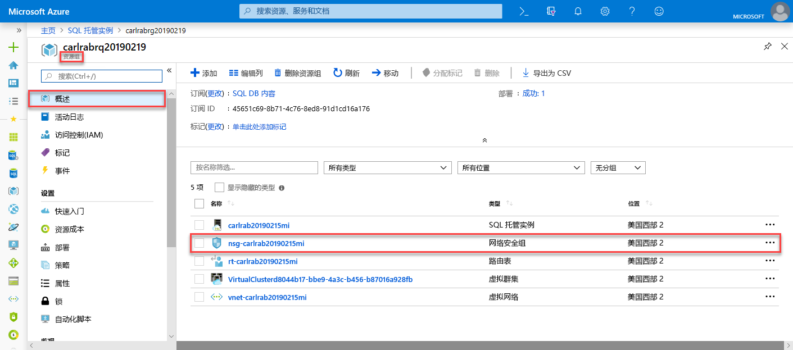
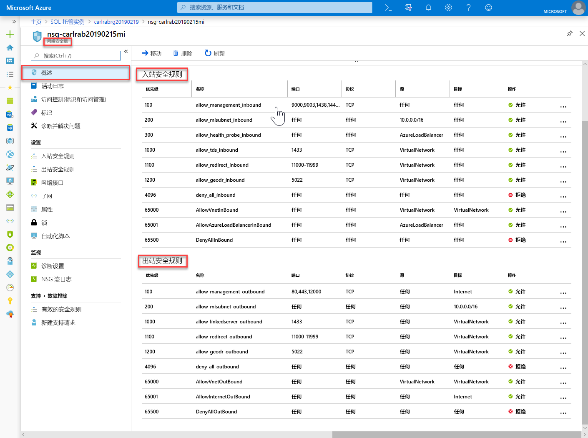
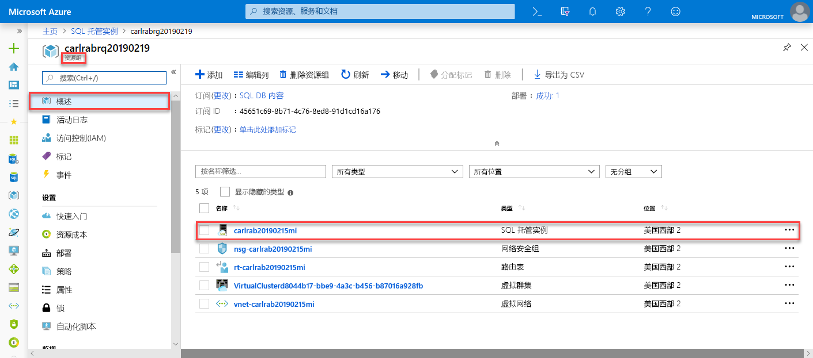
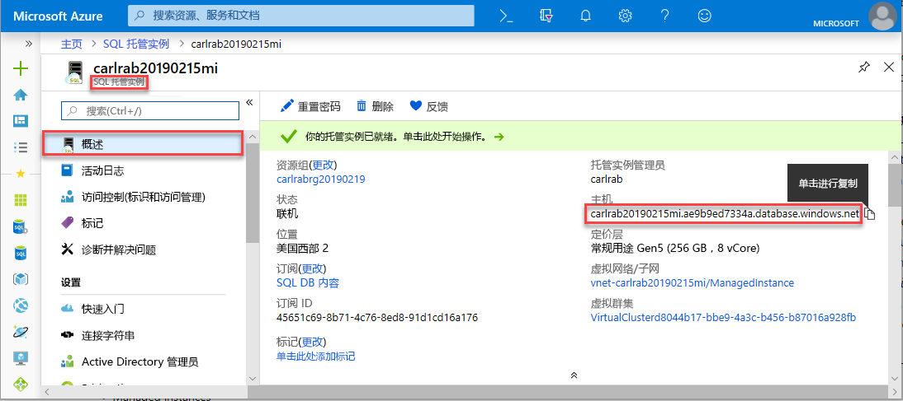

# 快速入门：创建 Azure SQL 数据库托管实例

本快速入门分步介绍了如何在 Azure 门户中创建 Azure SQL 数据库[托管实例](sql-database-managed-instance.md)。

> [!IMPORTANT]
> 有关限制，请参阅[支持的区域](sql-database-managed-instance-resource-limits.md#supported-regions)和[支持的订阅类型](sql-database-managed-instance-resource-limits.md#supported-subscription-types)。

## 登录到 Azure 门户

登录到 [Azure 门户](https://portal.azure.com/)。

## 创建托管实例

下列步骤展示了如何创建托管实例。

1. 在 Azure 门户的左上角选择“创建资源”。
2. 找到“托管实例”，然后选择“Azure SQL 托管实例”。
3. 选择“创建”。

   

4. 根据下表中的信息，在“SQL 托管实例”窗体中填充要求的信息：

   | 设置| 建议的值 | Description |
   | ------ | --------------- | ----------- |
   | **订阅** | 订阅 | 你有权在其中创建新资源的订阅 |
   |**托管实例名称**|任何有效的名称|请参阅[命名规则和限制](https://docs.microsoft.com/azure/architecture/best-practices/naming-conventions)，了解有效名称。|
   |**托管实例管理员登录名**|任何有效的用户名|请参阅[命名规则和限制](https://docs.microsoft.com/azure/architecture/best-practices/naming-conventions)，了解有效名称。 不要使用“serveradmin”，因为这是保留的服务器级角色。|
   |**密码**|任何有效的密码|密码必须至少 16 个字符，且符合[定义的复杂性要求](../virtual-machines/windows/faq.md#what-are-the-password-requirements-when-creating-a-vm)。|
   |**排序规则**|要为托管实例使用的排序规则|如果从 SQL Server 迁移数据库，请使用 `SELECT SERVERPROPERTY(N'Collation')` 检查源排序规则并使用该值。 有关排序规则的信息，请参阅[服务器级别排序规则](https://docs.microsoft.com/sql/relational-databases/collations/set-or-change-the-server-collation)。|
   |**位置**|要在其中创建托管实例的位置|有关区域的信息，请参阅 [Azure 区域](https://azure.microsoft.com/regions/)。|
   |**虚拟网络**|选择“创建新的虚拟网络”或有效的虚拟网络和子网。| 如果网络/子网不可用，则必须先[对其进行修改以满足网络要求](sql-database-managed-instance-configure-vnet-subnet.md)，然后再选择它作为新托管实例的目标。 若要了解为托管实例配置网络环境的要求，请参阅[为托管实例配置 VNet](sql-database-managed-instance-connectivity-architecture.md)。 |
   |**资源组**|新的或现有的资源组|如需有效的资源组名称，请参阅 [Naming rules and restrictions](https://docs.microsoft.com/azure/architecture/best-practices/naming-conventions)（命名规则和限制）。|

   

5. 若要将托管实例用作实例故障转移组辅助实例，请选择“签出”并指定 DnsAzurePartner 托管实例。 此功能处于预览状态，未在随附的屏幕截图中显示。
6. 选择“定价层”，设置计算和存储资源的大小并查看定价层选项。 默认值是具有 32 GB 内存和 16 个 vCore 的“常规用途”定价层。
7. 使用滑块或文本框指定存储量和虚拟核心数。
8. 完成后选择“应用”，保存选择的内容。  
9. 选择“创建”，部署托管实例。
10. 选择“通知”图标，查看部署的状态。

    

11. 选择“正在进行的部署”以打开“托管实例”窗口，进一步监视部署进度。

> [!IMPORTANT]
> 子网中第一个实例的部署时间通常远超后续实例的部署时间。 请勿因持续时间超出预期而取消部署操作。 在子网中创建第二个托管实例仅需要花费数分钟时间。

## 查看资源并检索你的完全限定的服务器名称

在部署成功完成后，查看创建的资源，并检索完全限定的服务器名称以在后续快速入门中使用。

1. 打开托管实例的资源组，并查看在[创建托管实例](#create-a-managed-instance)快速入门中创建的资源。

   

2. 选择路由表以查看创建的用户定义的路由 (UDR) 表。

   

3. 在路由表中，查看用于从托管实例虚拟网络或在其中路由流量的条目。 若要手动创建或配置路由表，必须确保在路由表中创建这些条目。

   

4. 返回资源组并选择网络安全组，查看安全规则。

   

5. 查看入站和出站安全规则。

   

6. 返回资源组并选择托管实例。

   

7. 在“概览”选项卡上，找到“主机”属性并复制托管实例的完全限定主机地址，以供在下一个快速入门中使用。

   

   名称类似于 **your_machine_name.a1b2c3d4e5f6.database.windows.net**。

## 后续步骤

- 若要了解如何连接到托管实例，请参阅：
  - 有关应用程序的连接选项概述，请参阅[将应用程序连接到托管实例](sql-database-managed-instance-connect-app.md)。
  - 有关介绍如何从 Azure 虚拟机连接到托管实例的快速入门，请参阅[配置 Azure 虚拟机连接](sql-database-managed-instance-configure-vm.md)。
  - 有关介绍如何使用点到站点连接从本地客户端计算机连接到托管实例的快速入门，请参阅[配置点到站点连接](sql-database-managed-instance-configure-p2s.md)。
- 若要将现有 SQL 服务器数据库从本地还原到托管实例，可以使用[用于迁移的 Azure 数据库迁移服务 (DMS)](../dms/tutorial-sql-server-to-managed-instance.md) 从数据库备份文件还原，或使用 [T-SQL RESTORE 命令](sql-database-managed-instance-get-started-restore.md)从数据库备份文件还原。
- 有关使用内置故障排除智能对托管实例数据库性能进行的高级监视，请参阅[使用 Azure SQL Analytics 监视 Azure SQL 数据库](../azure-monitor/insights/azure-sql.md)
