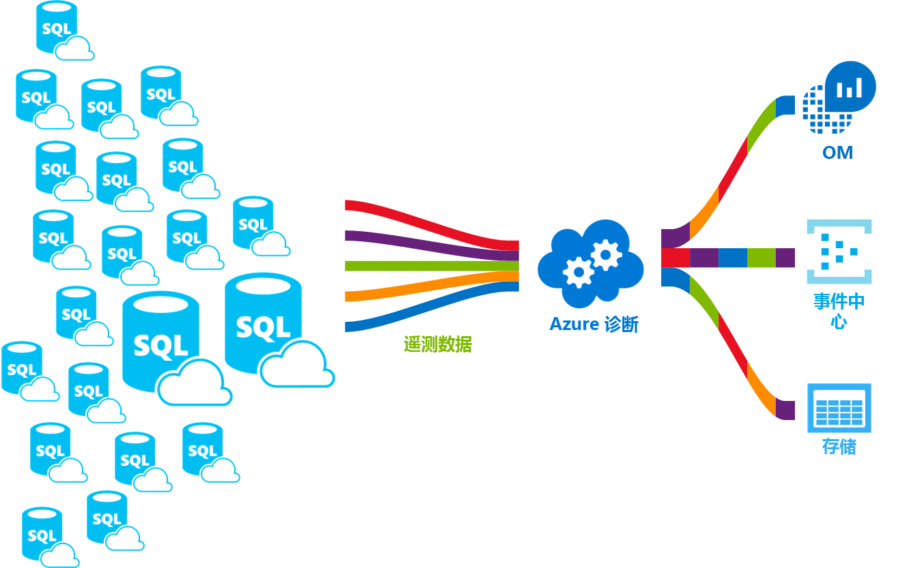

# <a name="azure-sql-database-metrics-and-diagnostics-logging"></a>Azure SQL 数据库指标和诊断日志记录 
Azure SQL 数据库可发出指标和诊断日志，以便更轻松地进行监视。 可配置 SQL 数据库，将资源使用情况、辅助角色和会话以及连接性存储到以下 Azure 资源之一：

* **Azure 存储**：用于低价存档大量遥测数据。
* **Azure 事件中心**：用于将 SQL 数据库遥测与自定义监视解决方案或热门管道集成。
* **Azure Log Analytics**：用于具有报告、警报和缓解功能的立即可用的监视解决方案。 这是 [Operations Management Suite (OMS)](../operations-management-suite/operations-management-suite-overview.md) 的一项功能

    

## <a name="enable-logging"></a>启用日志记录

默认情况下，不启用指标和诊断日志记录。 可使用以下方法之一启用并管理指标和诊断日志记录：

- Azure 门户
- PowerShell
- Azure CLI
- Azure Monitor REST API 
- Azure 资源管理器模板

启用指标和诊断日志记录时，需要指定收集所选数据的 Azure 资源。 可用选项包括：

- Log Analytics
- 事件中心
- 存储 

可预配新的 Azure 资源或选择现有资源。 选择存储资源后，需要指定要收集的数据。 可用选项包括：

- [所有指标](sql-database-metrics-diag-logging.md#all-metrics)：包含 DTU 百分比、DTU 限制、CPU 百分比、物理数据读取百分比、日志写入百分比、成功/失败/防火墙阻止的连接数、会话百分比、辅助角色百分比、存储、存储百分比和 XTP 存储百分比。
- [QueryStoreRuntimeStatistics](sql-database-metrics-diag-logging.md#query-store-runtime-statistics)：包含有关查询运行时统计信息（如 CPU 使用率、查询持续时间等）的信息。
- [QueryStoreWaitStatistics](sql-database-metrics-diag-logging.md#query-store-wait-statistics)：包含有关查询等待统计信息的信息，可告知用户查询在什么项上等待，如 CPU、日志、锁定。
- [错误](sql-database-metrics-diag-logging.md#errors-dataset)：包含有关此数据库发生的 SQL 错误的信息。
- [DatabaseWaitStatistics](sql-database-metrics-diag-logging.md#database-wait-statistics-dataset)：包含有关数据库针对不同等待类型花费多少时间等待的信息。
- [超时](sql-database-metrics-diag-logging.md#time-outs-dataset)：包含有关数据库超时的信息。
- [阻塞](sql-database-metrics-diag-logging.md#blockings-dataset)：包含有关在数据库上发生的阻塞事件的信息。
- [SQLInsights](sql-database-metrics-diag-logging.md#intelligent-insights-dataset)：包含 Intelligent Insights。 [详细了解 Intelligent Insights](sql-database-intelligent-insights.md)。
- Audit / SQLSecurityAuditEvents当前不可用。

如果选择事件中心或存储帐户，可以指定保留策略。 此策略删除早于选定时间段的数据。 如果指定 Log analytics，保留策略将取决于所选的定价层。 有关详细信息，请参阅 [Log Analytics 定价](https://azure.microsoft.com/pricing/details/log-analytics/)。 

若要了解如何启用日志记录并了解各种 Azure 服务支持的指标和日志类别，建议阅读以下主题： 

* [Microsoft Azure 中的指标概述](../monitoring-and-diagnostics/monitoring-overview-metrics.md)
* [Azure 诊断日志概述](../monitoring-and-diagnostics/monitoring-overview-of-diagnostic-logs.md) 

### <a name="azure-portal"></a>Azure 门户

1. 若要在门户中启用指标和诊断日志集合，请转到 SQL 数据库或弹性池页，然后选择“诊断设置”。

   

2. 通过选择目标和遥测数据来新建或编辑现有诊断设置。

   

### <a name="powershell"></a>PowerShell

若要使用 PowerShell 启用指标和诊断日志记录，请使用以下命令：

- 若要允许在存储帐户中存储诊断日志，请使用以下命令：

   ```powershell
   Set-AzureRmDiagnosticSetting -ResourceId [your resource id] -StorageAccountId [your storage account id] -Enabled $true
   ```

   存储帐户 ID 是需要向其发送日志的存储帐户的资源 ID。

- 要允许将诊断日志流式传输到事件中心，请使用以下命令：

   ```powershell
   Set-AzureRmDiagnosticSetting -ResourceId [your resource id] -ServiceBusRuleId [your service bus rule id] -Enabled $true
   ```

   Azure 服务总线规则 ID 是以下格式的字符串：

   ```powershell
   {service bus resource ID}/authorizationrules/{key name}
   ``` 

- 若要允许将诊断日志发送到 Log Analytics 工作区，请使用以下命令：

   ```powershell
   Set-AzureRmDiagnosticSetting -ResourceId [your resource id] -WorkspaceId [resource id of the log analytics workspace] -Enabled $true
   ```

- 可以使用以下命令获取 Log Analytics 工作区的资源 ID：

   ```powershell
   (Get-AzureRmOperationalInsightsWorkspace).ResourceId
   ```

可以组合这些参数以启用多个输出选项。

### <a name="to-configure-multiple-azure-resources"></a>配置多个 Azure 资源

若要支持多个订阅，请使用 [Enable Azure resource metrics logging using PowerShell](https://blogs.technet.microsoft.com/msoms/2017/01/17/enable-azure-resource-metrics-logging-using-powershell/)（通过 PowerShell 启用 Azure 资源指标日志记录）中的 PowerShell 脚本。

在执行脚本时提供工作区资源 ID &lt;$WSID&gt; 作为参数 (Enable-AzureRMDiagnostics.ps1)，以便将诊断数据从多个资源发送到工作区。 若要获取要向其发送诊断数据的工作区 ID &lt;$WSID&gt;，请将 &lt;subID&gt; 替换为订阅 ID，将 replace &lt;RG_NAME&gt; 替换为资源组名称，并将 &lt;WS_NAME&gt; 替换为以下脚本中的工作区名称。

- 若要配置多个 Azure 资源，请使用以下命令：

    ```powershell
    PS C:\> $WSID = "/subscriptions/<subID>/resourcegroups/<RG_NAME>/providers/microsoft.operationalinsights/workspaces/<WS_NAME>"
    PS C:\> .\Enable-AzureRMDiagnostics.ps1 -WSID $WSID
    ```

### <a name="azure-cli"></a>Azure CLI

若要使用 Azure CLI 启用指标和诊断日志记录，请使用以下命令：

- 若要允许在存储帐户中存储诊断日志，请使用以下命令：

   ```azurecli-interactive
   azure insights diagnostic set --resourceId <resourceId> --storageId <storageAccountId> --enabled true
   ```

   存储帐户 ID 是需要向其发送日志的存储帐户的资源 ID。

- 要允许将诊断日志流式传输到事件中心，请使用以下命令：

   ```azurecli-interactive
   azure insights diagnostic set --resourceId <resourceId> --serviceBusRuleId <serviceBusRuleId> --enabled true
   ```

   服务总线规则 ID 是以下格式的字符串：

   ```azurecli-interactive
   {service bus resource ID}/authorizationrules/{key name}
   ```

- 若要允许将诊断日志发送到 Log Analytics 工作区，请使用以下命令：

   ```azurecli-interactive
   azure insights diagnostic set --resourceId <resourceId> --workspaceId <resource id of the log analytics workspace> --enabled true
   ```

可以组合这些参数以启用多个输出选项。

### <a name="rest-api"></a>REST API

阅读有关如何[使用 Azure Monitor REST API 更改诊断设置](https://docs.microsoft.com/en-us/rest/api/monitor/diagnosticsettings)的信息。 

### <a name="resource-manager-template"></a>资源管理器模板

阅读有关如何[在创建资源时使用资源管理器模板启用诊断设置](../monitoring-and-diagnostics/monitoring-enable-diagnostic-logs-using-template.md)的信息。 

## <a name="stream-into-log-analytics"></a>流式传输到 Log Analytics 中 
在门户中使用内置的“发送到 Log Analytics”选项，可将 SQL 数据库指标和诊断日志流式处理到 Log Analytics 中。 此外，还可以通过 PowerShell cmdlet、Azure CLI 或 Azure Monitor REST API 使用诊断设置来启用 Log Analytics。

### <a name="installation-overview"></a>安装概述

使用 Log Analytics 监视 SQL 数据库群的方法很简单。 需要三个步骤：

1. 创建 Log Analytics 资源。

2. 将数据库配置为将指标和诊断日志记录到创建的 Log Analytics 资源中。

3. 在 Log Analytics 中，从库中安装 Azure SQL Analytics 解决方案。

### <a name="create-a-log-analytics-resource"></a>创建 Log Analytics 资源

1. 在左侧菜单中，选择“创建资源”。

2. 单击“监视 + 管理”。

3. 选择“Log Analytics”。

4. 在“Log Analytics”窗体中填写所需的附加信息：工作区名称、订阅、资源组、位置和定价层。

   

### <a name="configure-databases-to-record-metrics-and-diagnostics-logs"></a>将数据库配置为记录指标和诊断日志

通过 Azure 门户配置数据库记录其指标的位置是最简单的方式。 在门户中，转到 SQL 数据库资源，然后选择“诊断设置”。 

### <a name="install-the-sql-analytics-solution-from-the-gallery"></a>从库中安装 SQL Analytics 解决方案

1. 在创建了 Log Analytics 资源并且数据流入其中后，请安装 SQL Analytics 解决方案。 在主页的边栏菜单上，选择“解决方案库”。 在库中，选择“Azure SQL Analytics”解决方案，然后选择“添加”。

   

2. 此时将在主页上显示“Azure SQL Analytics”磁贴。 选择此磁贴，打开 SQL Analytics 仪表板。

### <a name="use-the-sql-analytics-solution"></a>使用 SQL Analytics 解决方案

SQL Analytics 是一个分层仪表板，用户使用它可在 SQL 数据库资源的层次结构中移动。 若要了解如何使用 SQL Analytics 解决方案，请参阅[使用 SQL Analytics 解决方案监视 SQL 数据库](../log-analytics/log-analytics-azure-sql.md)。

## <a name="stream-into-event-hubs"></a>流式传输到事件中心

在门户中使用内置的“流式传输到事件中心”选项，可将 SQL 数据库指标和诊断日志流式传输到事件中心。 此外，还可以通过 PowerShell cmdlet、Azure CLI 或 Azure Monitor REST API 使用诊断设置来启用服务总线规则 ID。 

### <a name="what-to-do-with-metrics-and-diagnostics-logs-in-event-hubs"></a>如何处理事件中心内的指标和诊断日志
将选定的数据流式传输到事件中心后，就离启动高级监视方案更进一步了。 事件中心充当事件管道的前门。 将数据收集到事件中心后，可以使用任何实时分析提供程序或批处理/存储适配器转换和存储这些数据。 事件中心将事件流的生成从这些事件的使用中分离出来。 通过这种方式，事件使用者可以访问自己的计划中的事件。 有关事件中心的详细信息，请参阅：

- [什么是 Azure 事件中心？](../event-hubs/event-hubs-what-is-event-hubs.md)
- [事件中心入门](../event-hubs/event-hubs-csharp-ephcs-getstarted.md)


可以通过以下几种方式使用流式传输功能：

* **通过将热路径数据流式传输到 Power BI 来查看服务运行状况**。 使用事件中心、流分析和 PowerBI，可以在 Azure 服务中轻松地将指标和诊断数据转换成几近实时的分析结果。 有关如何设置事件中心、如何使用流分析处理数据，以及如何使用 PowerBI 作为输出的概述，请参阅[流分析和 Power BI](../stream-analytics/stream-analytics-power-bi-dashboard.md)。

* **将日志流式传输到第三方日志记录和遥测流**。 使用事件中心流式传输，可将指标和诊断日志引入不同的第三方监视和日志分析解决方案。 

* **生成自定义遥测和日志记录平台**。 如果已经有一个自定义生成的遥测平台，或者正想生成一个，可利用事件中心高度可缩放的发布-订阅功能，灵活地引入诊断日志。 请参阅 [Dan Rosanova 的指南：了解如何在全局规模的遥测平台中使用事件中心](https://azure.microsoft.com/documentation/videos/build-2015-designing-and-sizing-a-global-scale-telemetry-platform-on-azure-event-Hubs/)。

## <a name="stream-into-storage"></a>流式传输到存储

在门户中使用内置的“存档到存储帐户”选项，可以在存储中存储 SQL 数据库指标和诊断日志。 此外，还可以通过 PowerShell cmdlet、Azure CLI 或 Azure Monitor REST API 使用诊断设置来启用存储。

### <a name="schema-of-metrics-and-diagnostics-logs-in-the-storage-account"></a>存储帐户中指标和诊断日志的架构

设置指标和诊断日志集合后，当第一行数据可用时，将在你选择的存储帐户中创建一个存储容器。 这些 blob 的结构为：

```powershell
insights-{metrics|logs}-{category name}/resourceId=/SUBSCRIPTIONS/{subscription ID}/ RESOURCEGROUPS/{resource group name}/PROVIDERS/Microsoft.SQL/servers/{resource_server}/ databases/{database_name}/y={four-digit numeric year}/m={two-digit numeric month}/d={two-digit numeric day}/h={two-digit 24-hour clock hour}/m=00/PT1H.json
```
    
或者使用更简单的形式：

```powershell
insights-{metrics|logs}-{category name}/resourceId=/{resource Id}/y={four-digit numeric year}/m={two-digit numeric month}/d={two-digit numeric day}/h={two-digit 24-hour clock hour}/m=00/PT1H.json
```

例如，所有指标的 blob 名称可能是：

```powershell
insights-metrics-minute/resourceId=/SUBSCRIPTIONS/s1id1234-5679-0123-4567-890123456789/RESOURCEGROUPS/TESTRESOURCEGROUP/PROVIDERS/MICROSOFT.SQL/ servers/Server1/databases/database1/y=2016/m=08/d=22/h=18/m=00/PT1H.json
```

如果要记录弹性池中的数据，blob 名称则有所不同：

```powershell
insights-{metrics|logs}-{category name}/resourceId=/SUBSCRIPTIONS/{subscription ID}/ RESOURCEGROUPS/{resource group name}/PROVIDERS/Microsoft.SQL/servers/{resource_server}/ elasticPools/{elastic_pool_name}/y={four-digit numeric year}/m={two-digit numeric month}/d={two-digit numeric day}/h={two-digit 24-hour clock hour}/m=00/PT1H.json
```

### <a name="download-metrics-and-logs-from-storage"></a>从存储下载指标和日志

了解如何[从存储下载指标和诊断日志](../storage/blobs/storage-quickstart-blobs-dotnet.md#download-the-sample-application)。

## <a name="metrics-and-logs-available"></a>可用的指标和日志

### <a name="all-metrics"></a>所有指标

|**资源**|**指标**|
|---|---|
|数据库|DTU 百分比、已用 DTU、DTU 限制、CPU 百分比、物理数据读取百分比、日志写入百分比、成功/失败/防火墙阻止的连接数、会话百分比、辅助角色百分比、存储、存储百分比、XTP 存储百分比和死锁 |
|弹性池|eDTU 百分比、已用 eDTU、eDTU 限制、CPU 百分比、物理数据读取百分比、日志写入百分比、会话百分比、辅助角色百分比、存储、存储百分比、存储限制、XTP存储百分比 |
|||

### <a name="query-store-runtime-statistics"></a>查询数据存储运行时统计信息

|属性|说明|
|---|---|
|TenantId|租户 ID。|
|SourceSystem|始终是：Azure|
|TimeGenerated [UTC]|记录日志时的时间戳。|
|Type|始终是：AzureDiagnostics|
|ResourceProvider|资源提供程序的名称。 始终是：MICROSOFT.SQL|
|类别|类别的名称。 始终是：QueryStoreRuntimeStatistics|
|OperationName|操作的名称。 始终是：QueryStoreRuntimeStatisticsEvent|
|资源|资源的名称。|
|ResourceType|资源类型的名称。 始终是：SERVERS/DATABASES|
|SubscriptionId|数据库所属的订阅 GUID。|
|resourceGroup|数据库所属的资源组的名称。|
|LogicalServerName_s|数据库所属的服务器的名称。|
|ElasticPoolName_s|数据库所属的弹性池的名称（如果存在）。|
|DatabaseName_s|数据库的名称。|
|ResourceId|资源 URI。|
|query_hash_s|查询哈希。|
|query_plan_hash_s|查询计划哈希。|
|statement_sql_handle_s|语句 SQL 句柄。|
|interval_start_time_d|自 1900-1-1 以时钟周期数开始 datetimeoffset 的时间间隔。|
|interval_end_time_d|自 1900-1-1 以时钟周期数结束 datetimeoffset 的时间间隔。|
|logical_io_writes_d|逻辑 IO 写入总次数。|
|max_logical_io_writes_d|每次执行逻辑 IO 写入的最大次数。|
|physical_io_reads_d|物理 IO 读取总次数。|
|max_physical_io_reads_d|每次执行逻辑 IO 读取的最大次数。|
|logical_io_reads_d|逻辑 IO 读取总次数。|
|max_logical_io_reads_d|每次执行逻辑 IO 读取的最大次数。|
|execution_type_d|执行类型。|
|count_executions_d|执行查询的次数。|
|cpu_time_d|查询使用的总 CPU 时间（以微秒为单位）。|
|max_cpu_time_d|单个执行消耗的最大 CPU 时间（以微秒为单位）。|
|dop_d|并行度总和。|
|max_dop_d|用于单个执行的最大并行度。|
|rowcount_d|返回的总行数。|
|max_rowcount_d|单个执行中返回的最大行数。|
|query_max_used_memory_d|已使用的内存总量（以 KB 为单位）。|
|max_query_max_used_memory_d|单个执行使用的最大内存量（以 KB 为单位）。|
|duration_d|总执行时间（以微秒为单位）。|
|max_duration_d|单个执行的最大执行时间。|
|num_physical_io_reads_d|总物理读取次数。|
|max_num_physical_io_reads_d|每次执行最大物理读取次数。|
|log_bytes_used_d|使用的日志字节总量。|
|max_log_bytes_used_d|每次执行使用的日志字节最大数量。|
|query_id_d|查询存储中查询的 ID。|
|plan_id_d|查询存储中计划的 ID。|

详细了解[查询存储运行时统计信息数据](https://docs.microsoft.com/sql/relational-databases/system-catalog-views/sys-query-store-runtime-stats-transact-sql)。

### <a name="query-store-wait-statistics"></a>查询存储等待统计信息

|属性|说明|
|---|---|
|TenantId|租户 ID。|
|SourceSystem|始终是：Azure|
|TimeGenerated [UTC]|记录日志时的时间戳。|
|Type|始终是：AzureDiagnostics|
|ResourceProvider|资源提供程序的名称。 始终是：MICROSOFT.SQL|
|类别|类别的名称。 始终是：QueryStoreWaitStatistics|
|OperationName|操作的名称。 始终是：QueryStoreWaitStatisticsEvent|
|资源|资源名称|
|ResourceType|资源类型的名称。 始终是：SERVERS/DATABASES|
|SubscriptionId|数据库所属的订阅 GUID。|
|resourceGroup|数据库所属的资源组的名称。|
|LogicalServerName_s|数据库所属的服务器的名称。|
|ElasticPoolName_s|数据库所属的弹性池的名称（如果存在）。|
|DatabaseName_s|数据库的名称。|
|ResourceId|资源 URI。|
|wait_category_s|等待的类别。|
|is_parameterizable_s|查询是否可以参数化。|
|statement_type_s|语句的类型。|
|statement_key_hash_s|语句密钥哈希。|
|exec_type_d|执行的类型。|
|total_query_wait_time_ms_d|关于具体等待类别的查询的总等待时间。|
|max_query_wait_time_ms_d|单个执行中针对具体等待类别的查询的最大等待时间。|
|query_param_type_d|0|
|query_hash_s|查询存储中的查询哈希。|
|query_plan_hash_s|查询存储中的查询计划哈希。|
|statement_sql_handle_s|查询存储中的语句句柄。|
|interval_start_time_d|自 1900-1-1 以时钟周期数开始 datetimeoffset 的时间间隔。|
|interval_end_time_d|自 1900-1-1 以时钟周期数结束 datetimeoffset 的时间间隔。|
|count_executions_d|执行查询的次数。|
|query_id_d|查询存储中查询的 ID。|
|plan_id_d|查询存储中计划的 ID。|

详细了解[查询存储等待统计数据](https://docs.microsoft.com/sql/relational-databases/system-catalog-views/sys-query-store-wait-stats-transact-sql)。

### <a name="errors-dataset"></a>错误数据集

|属性|说明|
|---|---|
|TenantId|租户 ID。|
|SourceSystem|始终是：Azure|
|TimeGenerated [UTC]|记录日志时的时间戳。|
|Type|始终是：AzureDiagnostics|
|ResourceProvider|资源提供程序的名称。 始终是：MICROSOFT.SQL|
|类别|类别的名称。 始终是：Errors|
|OperationName|操作的名称。 始终是：ErrorEvent|
|资源|资源名称|
|ResourceType|资源类型的名称。 始终是：SERVERS/DATABASES|
|SubscriptionId|数据库所属的订阅 GUID。|
|resourceGroup|数据库所属的资源组的名称。|
|LogicalServerName_s|数据库所属的服务器的名称。|
|ElasticPoolName_s|数据库所属的弹性池的名称（如果存在）。|
|DatabaseName_s|数据库的名称。|
|ResourceId|资源 URI。|
|消息|纯文本格式的错误消息。|
|user_defined_b|用户定义位错误。|
|error_number_d|错误代码。|
|Severity|错误的严重性。|
|state_d|错误的状态。|
|query_hash_s|失败查询的查询哈希（如果存在）。|
|query_plan_hash_s|失败查询的查询计划哈希（如果存在）。|

详细了解 [SQL Server 错误消息](https://msdn.microsoft.com/library/cc645603.aspx)。

### <a name="database-wait-statistics-dataset"></a>数据库等待统计数据集

|属性|说明|
|---|---|
|TenantId|租户 ID。|
|SourceSystem|始终是：Azure|
|TimeGenerated [UTC]|记录日志时的时间戳。|
|Type|始终是：AzureDiagnostics|
|ResourceProvider|资源提供程序的名称。 始终是：MICROSOFT.SQL|
|类别|类别的名称。 始终是：DatabaseWaitStatistics|
|OperationName|操作的名称。 始终是：DatabaseWaitStatisticsEvent|
|资源|资源名称|
|ResourceType|资源类型的名称。 始终是：SERVERS/DATABASES|
|SubscriptionId|数据库所属的订阅 GUID。|
|resourceGroup|数据库所属的资源组的名称。|
|LogicalServerName_s|数据库所属的服务器的名称。|
|ElasticPoolName_s|数据库所属的弹性池的名称（如果存在）。|
|DatabaseName_s|数据库的名称。|
|ResourceId|资源 URI。|
|wait_type_s|等待类型的名称。|
|start_utc_date_t [UTC]|测量期间开始时间。|
|end_utc_date_t [UTC]|测量期间结束时间。|
|delta_max_wait_time_ms_d|每次执行最大等待时间|
|delta_signal_wait_time_ms_d|总信号等待时间。|
|delta_wait_time_ms_d|期间内的总等待时间。|
|delta_waiting_tasks_count_d|等待任务数。|

详细了解[数据库等待统计信息](https://docs.microsoft.com/sql/relational-databases/system-dynamic-management-views/sys-dm-os-wait-stats-transact-sql)。

### <a name="time-outs-dataset"></a>超时数据集

|属性|说明|
|---|---|
|TenantId|租户 ID。|
|SourceSystem|始终是：Azure|
|TimeGenerated [UTC]|记录日志时的时间戳。|
|Type|始终是：AzureDiagnostics|
|ResourceProvider|资源提供程序的名称。 始终是：MICROSOFT.SQL|
|类别|类别的名称。 始终是：Timeouts|
|OperationName|操作的名称。 始终是：TimeoutEvent|
|资源|资源名称|
|ResourceType|资源类型的名称。 始终是：SERVERS/DATABASES|
|SubscriptionId|数据库所属的订阅 GUID。|
|resourceGroup|数据库所属的资源组的名称。|
|LogicalServerName_s|数据库所属的服务器的名称。|
|ElasticPoolName_s|数据库所属的弹性池的名称（如果存在）。|
|DatabaseName_s|数据库的名称。|
|ResourceId|资源 URI。|
|error_state_d|错误状态代码。|
|query_hash_s|查询哈希（如果存在）。|
|query_plan_hash_s|查询计划哈希（如果存在）。|

### <a name="blockings-dataset"></a>阻塞数据集

|属性|说明|
|---|---|
|TenantId|租户 ID。|
|SourceSystem|始终是：Azure|
|TimeGenerated [UTC]|记录日志时的时间戳。|
|Type|始终是：AzureDiagnostics|
|ResourceProvider|资源提供程序的名称。 始终是：MICROSOFT.SQL|
|类别|类别的名称。 始终是：Blocks|
|OperationName|操作的名称。 始终是：BlockEvent|
|资源|资源名称|
|ResourceType|资源类型的名称。 始终是：SERVERS/DATABASES|
|SubscriptionId|数据库所属的订阅 GUID。|
|resourceGroup|数据库所属的资源组的名称。|
|LogicalServerName_s|数据库所属的服务器的名称。|
|ElasticPoolName_s|数据库所属的弹性池的名称（如果存在）。|
|DatabaseName_s|数据库的名称。|
|ResourceId|资源 URI。|
|lock_mode_s|查询所使用的锁定模式。|
|resource_owner_type_s|锁所有者。|
|blocked_process_filtered_s|阻止的进程报告 XML。|
|duration_d|锁定持续时间（以毫秒为单位）。|

### <a name="intelligent-insights-dataset"></a>智能见解数据集
详细了解 [Intelligent Insights 日志格式](sql-database-intelligent-insights-use-diagnostics-log.md)。

## <a name="next-steps"></a>后续步骤

若要了解如何启用日志记录并了解各种 Azure 服务支持的指标和日志类别，请阅读以下主题：

 * [Microsoft Azure 中的指标概述](../monitoring-and-diagnostics/monitoring-overview-metrics.md)
 * [Azure 诊断日志概述](../monitoring-and-diagnostics/monitoring-overview-of-diagnostic-logs.md)

若要了解事件中心，请阅读以下主题：

* [什么是 Azure 事件中心？](../event-hubs/event-hubs-what-is-event-hubs.md)
* [事件中心入门](../event-hubs/event-hubs-csharp-ephcs-getstarted.md)

若要详细了解存储，请参阅如何[从存储下载指标和诊断日志](../storage/blobs/storage-quickstart-blobs-dotnet.md#download-the-sample-application)。
