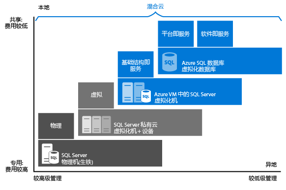

<properties
	pageTitle="SQL (PaaS) 数据库与云中 VM 上的 SQL Server (IaaS) | Microsoft Azure"
	description="了解哪个云 SQL Server 选项适合你的应用程序：Azure SQL (PaaS) 数据库或 Azure 虚拟机上的云中 SQL Server。"
	services="sql-database, virtual-machines"
	keywords="SQL Server 云, 云中 SQL Server, PaaS 数据库, 云 SQL Server, DBaaS"
	documentationCenter=""
	authors="CarlRabeler"
	manager="jhubbard"
	editor="cjgronlund"/>

<tags
	ms.service="sql-database"
	ms.workload="data-management"
	ms.tgt_pltfrm="vm-windows-sql-server"
	ms.devlang="na"
	ms.topic="get-started-article"
	ms.date="09/06/2016"
	ms.author="carlrab"/>

# 选择云 SQL Server 选项：Azure SQL (PaaS) 数据库或 Azure VM 上的 SQL Server (IaaS)

Azure 有两个选项可用于在 Microsoft Azure 中托管 SQL Server 工作负荷：

* [Azure SQL 数据库](https://azure.microsoft.com/services/sql-database/)：云的本机 SQL 数据库，也称为平台即服务 (PaaS) 数据库或数据库即服务 (DBaaS)，它已针对软件即服务 (SaaS) 应用开发进行优化。Azure SQL 数据库与大多数 SQL Server 功能兼容。有关 PaaS 的详细信息，请参阅[什么是 PaaS](https://azure.microsoft.com/overview/what-is-paas/)。
* [Azure 虚拟机上的 SQL Server](https://azure.microsoft.com/services/virtual-machines/sql-server/)：在 Azure 上运行的云中 Microsoft Azure 虚拟机 (VM) 上安装并托管的 SQL Server，也称为基础结构即服务 (IaaS)。Azure 虚拟机上的 SQL Server 针对迁移现有 SQL Server 应用程序进行了优化。SQL Server 的所有版本都可用。它与 SQL Server 100% 兼容，允许用户根据需要托管任意多的数据库和执行跨数据库事务。它提供对 SQL Server 和 Winodws 的完全控制。

了解每个选项如何配合 Microsoft 数据平台一起运行，并在匹配适合业务要求的选项时获得帮助。无论你是以节省成本为优先考虑，还是将精简管理视为第一要素，本文都会帮助你确定哪种方法能够满足你最重视的业务要求。

## Microsoft 的数据平台

在 Azure 与本地 SQL Server 数据库的任何介绍中，要了解的要点之一是你可以同时使用两者。Microsoft 数据平台利用 SQL Server 技术，使其可在跨本地物理机、私有云环境、第三方托管的私有云环境和公有云中使用。使用 Azure 虚拟机上的 SQL Server，可以通过本地和云托管部署的组合来满足独特的多样化业务需求，并同时在这些环境中使用相同的服务器产品、开发工具和专业知识组合。

   

如图所示，每个产品可根据你在基础结构（X 轴）中所拥有的管理级别，以及数据库级别合并与自动化（Y 轴）所达到的成本效益程度等特征进行分类。

设计应用程序时，可以使用四个基本选项来托管属于应用程序一部分的 SQL Server：

- 非虚拟化物理机上的 SQL Server
- 本地虚拟机中的 SQL Server（私有云）
- Azure 虚拟机中的 SQL Server（Microsoft 公有云）
- Azure SQL 数据库（Microsoft 公有云）

在以下部分中，将了解 Microsoft 公有云中的 SQL Server：Azure SQL 数据库和 Azure VM 上的 SQL Server。此外，将探讨常见的业务动机，以判断哪一个选项最适合应用程序。

## Azure SQL 数据库和 Azure VM 中的 SQL Server 详述

**Azure SQL 数据库**是托管在 Azure 云中的关系数据库即服务 (DBaaS)，属于*软件即服务 (SaaS)* 和*平台即服务 (PaaS)* 行业类别。[SQL 数据库](sql-database-technical-overview.md)构建在 Microsoft 所拥有、托管及维护的标准化硬件和软件基础之上。使用 SQL 数据库，你可以使用内置的特性和功能在服务上直接进行开发。使用 SQL 数据库时，你可以即用即付，并使用向上或向外缩放选项获得更强大的功能且不会中断服务。

**Azure 虚拟机 (VM) 上的 SQL Server** 属于*基础结构即服务 (IaaS)* 行业类别，可让你在云中的虚拟机上运行 SQL Server。与 SQL 数据库一样，它构建在 Microsoft 所拥有、托管及维护的标准化硬件基础之上。使用 VM 上的 SQL Server 时，既可使用 SQL Server 映像中已包含的 SQL Server 许可证即付即用，也可方便地使用现有的许可证。还可以根据需要轻松增加/减少和暂停/恢复 VM。

通常，这两个 SQL 选项已针对不同的用途进行优化：

- **SQL 数据库**经过优化，可将预配和管理许多数据库的整体成本降到最低。由于你无需管理任何虚拟机、操作系统或数据库软件，因此可以持续降低管理成本。用户不必管理升级、高可用性或[备份](sql-database-automated-backups.md)。一般而言，Azure SQL 数据库可以大幅增加由单个 IT 或开发资源管理的数据库数目。
- **Azure VM 上运行的 SQL Server** 已针对将现有应用程序迁移到 Azure 或将现有本地应用程序扩展到混合部署中的云进行了优化。此外，还可以使用虚拟机中的 SQL Server 开发和测试传统的 SQL Server 应用程序。有了 Azure VM 上的 SQL server，即拥有了专用 SQL Server 实例和基于云的 VM 的完全管理权限。当组织拥有可用来维护虚拟机的 IT 资源时，此选项是最佳选择。使用这些功能，可以构建高度定制的系统，以解决应用程序的特定性能和可用性要求。

下表汇总了 SQL 数据库和 Azure VM 中 SQL Server 的主要特征：

| | SQL 数据库 | Azure 虚拟机中的 SQL Server|
| -------------- | ------------ | ---------------------- |
| **最适用于：** | 开发与营销阶段有时间限制的新云式设计应用程序。 |需要几乎无需进行任何更改即可快速迁移到云的现有应用程序。你想要快速完成开发和测试方案，但又不想购买本地 SQL Server 非生产硬件。 |
|| 需要对数据库内置高可用性、灾难恢复和升级的团队。 |可以为 SQL Server 配置和管理高可用性、灾难恢复和修补的团队。提供的某些自动化功能可极大地简化此操作。 |
||不想要管理基础操作系统和配置设置的团队。| 需要一个具有完全管理权限的自定义环境。|
||最大为 1 TB 或更大的可使用扩展模式进行[水平或垂直分区](sql-database-elastic-scale-introduction.md#horizontal-and-vertical-scaling)的数据库。|存储最大为 64 TB 的 SQL Server 实例。此实例可以根据需要支持任意数目的数据库。 |
||[构建软件即服务 (SaaS) 应用程序](sql-database-design-patterns-multi-tenancy-saas-applications.md)。| 迁移和构建企业应用程序和混合应用程序。|
|||||
|**资源：**|不想使用 IT 资源来配置和管理底层基础结构，而想要重点关注应用程序层。|将一些 IT 资源用于配置和管理。提供的某些自动化功能可极大地简化此操作。|
|**总拥有成本：**|消除硬件成本并减少管理成本。|消除硬件成本。|
|**业务连续性：**|除了内置的容错基础结构功能以外，Azure SQL 数据库还提供可提高业务连续性的功能，例如[自动备份](sql-database-automated-backups.md)、[时间点还原](sql-database-recovery-using-backups.md#point-in-time-restore)、[异地还原](sql-database-recovery-using-backups.md#geo-restore)和[活动异地复制](sql-database-active-geo-replication.md)。有关详细信息，请参阅[《SQL Database business continuity overview》](sql-database-business-continuity.md)（SQL 数据库业务连续性概述）。|使用 Azure VM 上的 SQL Server 可以设置高可用性和灾难恢复解决方案，以满足数据库的具体需求。因此，可以构建针对应用程序高度优化的系统。你可以视需要自我测试并运行故障转移。有关详细信息，请参阅[《High Availability and Disaster Recovery for SQL Server on Azure Virtual Machines》](../virtual-machines/virtual-machines-windows-sql-high-availability-dr.md)（Azure 虚拟机中 SQL Server 的高可用性和灾难恢复）。|
|**混合云：**|本地应用程序可以访问 Azure SQL 数据库中的数据。|使用 Azure VN 上的 SQL Server，应用程序可以一部分在云中运行，一部分在本地运行。例如，可以通过 [Azure 虚拟网络](../virtual-network/virtual-networks-overview.md)，将本地网络和 Active Directory 域扩展到云中。此外，可以使用 [Azure 中的 SQL Server 数据文件功能](http://msdn.microsoft.com/library/dn385720.aspx)，将本地数据文件存储在 Azure 存储空间中。有关详细信息，请参阅 [SQL Server 2014 混合云简介](http://msdn.microsoft.com/library/dn606154.aspx)。|
||作为订阅服务器支持使用 [SQL Server 事务复制](https://msdn.microsoft.com/library/mt589530.aspx)来复制数据。|完全支持使用 [SQL Server 事务复制](https://msdn.microsoft.com/library/mt589530.aspx)、[AlwaysOn 可用性组](../virtual-machines/virtual-machines-windows-sql-high-availability-dr.md)、集成服务和日志传送来复制数据。此外，还完全支持传统的 SQL Server 备份|
|||||
|||||

## 选择 Azure SQL 数据库或 Azure VM 上的 SQL Server 时的业务动机

### 成本

无论你是现金不足的新公司，或是在预算有限的情况下运作的已成立公司的小组，有限资金经常是决定数据库托管方式的主要考虑因素。在本部分中，将了解 Azure 中有关以下两个关系数据库选项的计费和许可基本概念：SQL 数据库和 Azure VM 中的 SQL Server。还将了解如何计算应用程序总成本。

#### 计费和许可基础概念

**SQL 数据库**作为一种服务销售给客户，不含许可证。[Azure VM 上的 SQL Server](../virtual-machines/virtual-machines-windows-sql-server-iaas-overview.md) 销售时附带按分钟付费的许可证。如果有现有的许可证，也可以使用它。

目前，我们在多个服务层中提供 **SQL 数据库**，并根据你选择的服务层和性能级别，以固定费率向你收取每小时费用。此外，你需要对固定的[数据传输速率](https://azure.microsoft.com/pricing/details/data-transfers/)的 Internet 传出流量付费。基本、标准和高级服务层旨在以多个性能级别提供可预测的性能，以满足应用程序的高峰要求。你可以在服务层和性能级别之间进行更改，以满足应用程序的不同吞吐量需求。如果你的数据库具有高事务量且必须支持许多并发用户，我们建议使用高级服务层。有关目前支持的服务层的最新信息，请参阅 [Azure SQL 数据库服务层](sql-database-service-tiers.md)。你还可以创建[弹性数据库池](sql-database-elastic-pool.md)，在数据库实例之间共享性能资源。

使用 **Azure SQL 数据库**，Microsoft 将自动配置、修补和升级数据库软件，从而可以降低你的管理成本。此外，它的[内置备份](sql-database-automated-backups.md)功能可帮助你大幅降低成本，尤其是当你拥有大量的数据库时。

在 **Azure VM 上的 SQL Server** 中，可以使用平台提供的 SQL Server 映像（附带许可证），也可以引入自己的 SQL Server 许可证。所有受支持的 SQL Server 版本（2008R2、2012、2014、2016）和特别版（开发人员版、Express 版、Web 版、Standard 版、Enterprise 版）都可用。此外，映像的自带许可版本 (BYOL) 也可用。使用 Azure 提供的映像时，营运成本取决于所选的 VM 大小以及 SQL Server 版本。无论 VM 大小或 SQL Server 版本为何，你都需要支付 SQL Server 和 Windows Server 的每分钟许可成本，以及 VM 磁盘的 Azure 存储空间成本。每分钟计费选项可让你随时使用 SQL Server，而无需另外购买 SQL Server 许可证。如果在 Azure 中使用自己的 SQL Server 许可证，则只需支付 Windows Server 和存储成本。有关自带许可证的详细信息，请参阅 [Azure 上通过软件保障实现的许可移动性](https://azure.microsoft.com/pricing/license-mobility/)。

#### 计算应用程序总成本

开始使用云平台时，运行应用程序的成本包括开发和管理成本，以及公有云平台服务成本。

以下是针对在 SQL 数据库和 Azure VM 中的 SQL Server 上运行的应用程序的详细成本计算方法：

**使用 Azure SQL 数据库时：**

*应用程序总成本 = 大幅降低的管理成本 + 软件开发成本 + SQL 数据库服务成本*

**使用 Azure VM 上的 SQL Server 时：**

*应用程序总成本 = 降到最低的软件开发成本 + 管理成本 + SQL Server 与 Windows Server 许可成本 + Azure 存储成本*

有关定价的详细信息，请参阅以下资源：

- [SQL 数据库定价](https://azure.microsoft.com/pricing/details/sql-database/)
- [SQL](https://azure.microsoft.com/pricing/details/virtual-machines/#sql) 和 [Windows](https://azure.microsoft.com/pricing/details/virtual-machines/#windows) 的[虚拟机定价](https://azure.microsoft.com/pricing/details/virtual-machines/)
- [Azure 价格计算器](https://azure.microsoft.com/pricing/calculator/)

> [AZURE.NOTE] SQL Server 上有一小部分的功能不适用于或不可用于 SQL 数据库。有关详细信息，请参阅 [SQL 数据库一般性限制和指导原则](sql-database-general-limitations.md)以及 [SQL 数据库 Transact-SQL 信息](sql-database-transact-sql-information.md)。如果要将现有的 SQL Server 解决方案迁移到云中，请参阅[将 SQL Server 数据库迁移到 Azure SQL 数据库](sql-database-cloud-migrate.md)。当将现有的本地 SQL Server 应用程序迁移到 SQL 数据库时，建议你更新应用程序以利用云服务提供的功能。例如，可以考虑使用 [Azure Web App Service](https://azure.microsoft.com/services/app-service/web/) 或 [Azure 云服务](https://azure.microsoft.com/services/cloud-services/)来托管你的应用层，以提高成本效益。

### 管理

对许多企业来说，决定过渡到到云服务的关键在于降低管理复杂度。使用 **SQL 数据库**，Microsoft 可以管理底层硬件。Microsoft 可以自动复制所有数据以提供高可用性，配置及升级数据库软件，管理负载平衡，并在发生服务器故障时执行透明的故障转移。用户可以继续管理数据库，但不再需要管理数据库引擎、服务器操作系统或硬件。可以继续管理的项目示例包括数据库和登录、索引和查询优化，以及审核和安全性。

使用 **Azure VM 上的 SQL Server**，可以完全掌控操作系统和 SQL Server 实例配置。使用 VM，可以由用户决定何时更新/升级操作系统和数据库软件，以及何时安装任何其他软件（例如防病毒软件）。提供的一些自动化功能能够大大简化修补、备份以及高可用性。此外，你还可以控制 VM 的大小、磁盘数目及其存储配置。Azure 允许用户根据需要更改 VM 的大小。有关信息，请参阅 [Azure 的虚拟机和云服务大小](../virtual-machines/virtual-machines-linux-sizes.md)。

### 服务级别协议 (SLA)

对于许多 IT 部门而言，达到服务级别协议 (SLA) 规定的正常运行时间义务是首要任务。在本部分中，我们将了解 SLA 对每个数据库托管选项代表的含义。

对于 **SQL 数据库**基本、标准和高级服务层，Microsoft 提供 99.99% 的可用性 SLA。有关最新信息，请参阅[服务级别协议](https://azure.microsoft.com/support/legal/sla/sql-database/)。有关 SQL 数据库服务层和支持的业务连续性计划的最新信息，请参阅[服务层](sql-database-service-tiers.md)。

对于 **Azure VM 上运行的 SQL Server**，Microsoft 提供 99.95% 的可用性 SLA（仅涵盖虚拟机）。此 SLA 不涵盖 VM 上运行的进程（例如 SQL Server），并且要求你在可用性集中托管至少两个 VM 实例。有关最新信息，请参阅 [VM SLA](https://azure.microsoft.com/support/legal/sla/virtual-machines/)。为了在 VM 中实现数据库高可用性 (HA)，你应在 SQL Server 中配置一个受支持的高可用性选项，例如 [AlwaysOn 可用性组](http://blogs.technet.com/b/dataplatforminsider/archive/2014/08/25/sql-server-alwayson-offering-in-microsoft-azure-portal-gallery.aspx)。使用支持的高可用性选项不会提供更多 SLA，但使用户能够实现 >99.99% 的数据库可用性。

### 面市时间

当开发人员生产力和快速面市为关键要素时，**SQL 数据库**是云式应用程序的理想解决方案。此选项提供类似于编程 DBA 的功能，非常适合云架构师和开发员，因为它能降低管理基础操作系统和数据库的需求。例如，可以使用 [REST API](http://msdn.microsoft.com/library/azure/dn505719.aspx) 和 [PowerShell Cmdlet](http://msdn.microsoft.com/library/azure/dn546726.aspx) 来自动化和管理数千个数据库的管理操作。[弹性数据库池](sql-database-elastic-pool.md)等功能可让你将重点放在应用程序层上，更快地将解决方案推向市场。

如果现有或新的应用程序需要访问大型数据库、相互关联的数据库或访问 SQL Server 或 Windows 中的所有功能，**Azure VM 上运行的 SQL Server** 是理想选择。此外，如果你想要依现状将现有的本地应用程序和数据库迁移到 Azure，则它也是一个不错的选择。由于你无需更改呈现、应用程序和数据层，你在重新架构现有解决方案时节省时间和预算。相反地，你可以将重点放在将所有解决方案迁移到 Azure，并执行 Azure 平台可能需要的某些性能优化。有关详细信息，请参阅 [Azure 虚拟机上 SQL Server 的性能最佳实践](../virtual-machines/virtual-machines-windows-sql-performance.md)。

## 摘要

本文探讨了 SQL 数据库和 Azure 虚拟机 (VM) 上的 SQL Server，并讨论了可能会影响决策的常见业务动机。以下是供你考虑的建议摘要：

对于以下情况，请选择 **Azure SQL 数据库**：

- 打算构建全新的基于云的应用程序，以利用云服务提供的成本节省和性能优化功能。此方法提供全面管理云服务的优势，有助于加速产品面市，并提供长期的成本效益。

- 你想要让 Microsoft 在数据库上运行常见管理操作，因而数据库需要更高的可用性 SLA。

对于以下情况，请选择 **Azure VM 上的 SQL Server**：

- 有想要迁移或扩展到云中的现有本地应用程序，或者如果要构建大于 1 TB 的企业应用程序。此方法提供的优点包括：100% SQL 兼容、大数据库容量、可完全控制 SQL Server 和 Windows，以及可通过隧道安全地连接到本地。此方法将用于开发和修改现有应用程序的成本降至最低。

- 有现有的 IT 资源，并且最终可以拥有修补、备份和数据库高可用性。请注意，一些自动化功能可以极大地简化这些操作。

## 后续步骤
- 若要开始使用 SQL 数据库，请参阅[《SQL Database tutorial: Create a SQL database in minutes using the Azure portal》](sql-database-get-started.md)（SQL 数据库教程：使用 Azure 门户在几分钟内创建一个 SQL 数据库）。
- 请参阅[《SQL Database pricing》](https://azure.microsoft.com/pricing/details/sql-database/)（SQL 数据库定价）。
- 若要开始在 Azure VM 上使用 SQL Server，请参阅[《Provision a SQL Server virtual machine in Azure》](../virtual-machines/virtual-machines-windows-portal-sql-server-provision.md)（在 Azure 中预配 SQL Server 虚拟机）。
- 请参阅 [Azure 虚拟机上的 SQL Server：学习路径](https://azure.microsoft.com/documentation/learning-paths/sql-azure-vm/)。

<!---HONumber=AcomDC_0921_2016-->