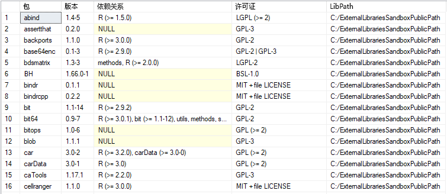

# <a name="quickstart-create-and-run-simple-r-scripts-in-azure-sql-database-machine-learning-services-preview"></a>快速入门：在 Azure SQL 数据库机器学习服务（预览版）中创建和运行简单的 R 脚本

在本快速入门中，我们使用 Azure SQL 数据库中的机器学习服务（使用 R）创建并运行一组 R 脚本。

[!INCLUDE[ml-preview-note](../../includes/sql-database-ml-preview-note.md)]

## <a name="prerequisites"></a>必备条件

- 具有活动订阅的 Azure 帐户。 [免费创建帐户](https://azure.microsoft.com/free/?ref=microsoft.com&utm_source=microsoft.com&utm_medium=docs&utm_campaign=visualstudio)。
- 一个使用[服务器级防火墙规则](sql-database-server-level-firewall-rule.md)的 [Azure SQL 数据库](sql-database-single-database-get-started.md)
- 启用了 R 的[机器学习服务](sql-database-machine-learning-services-overview.md)。 [注册预览版](sql-database-machine-learning-services-overview.md#signup)。
- [SQL Server Management Studio](/sql/ssms/sql-server-management-studio-ssms) (SSMS)

> [!NOTE]
> 在发布公共预览版期间，Microsoft 会将你加入该版本并为你的现有数据库或新数据库启用机器学习。

此示例使用存储过程 [sp_execute_external_script](/sql/relational-databases/system-stored-procedures/sp-execute-external-script-transact-sql) 包装格式正确的 R 脚本。

## <a name="run-a-simple-script"></a>运行简单脚本

若要运行 R 脚本，请将它作为参数传递给系统存储过程 [sp_execute_external_script](https://docs.microsoft.com/sql/relational-databases/system-stored-procedures/sp-execute-external-script-transact-sql)。

在下面的步骤中，你将在 SQL 数据库中运行此示例 R 脚本：

```r
a <- 1
b <- 2
c <- a/b
d <- a*b
print(c(c, d))
```

1. 打开 **SQL Server Management Studio**，连接到 SQL 数据库。

   如果在连接方面需要帮助，请参阅[快速入门：使用 SQL Server Management Studio 连接和查询 Azure SQL 数据库](sql-database-connect-query-ssms.md)。

1. 将完整的 R 脚本传递给 [sp_execute_external_script](https://docs.microsoft.com/sql/relational-databases/system-stored-procedures/sp-execute-external-script-transact-sql) 存储过程。

   通过 `@script` 参数传递脚本。 `@script` 参数内的所有内容都必须是有效的 R 代码。

    ```sql
    EXECUTE sp_execute_external_script @language = N'R'
        , @script = N'
    a <- 1
    b <- 2
    c <- a/b
    d <- a*b
    print(c(c, d))
    '
    ```

   如果出现错误，则可能是因为尚未为 SQL 数据库启用机器学习服务（使用 R）的公共预览版。 请参阅上述[先决条件](#prerequisites)。

   > [!NOTE]
   > 如果你是管理员，可以自动运行外部代码。 你可以使用以下命令向其他用户授予权限：
   <br>**GRANT EXECUTE ANY EXTERNAL SCRIPT TO** *\<username\>* .

2. 计算出正确的结果，R `print` 函数将结果返回到“消息”窗口  。

   结果应该如下所示。

    **结果**

    ```text
    STDOUT message(s) from external script:
    0.5 2
    ```

## <a name="run-a-hello-world-script"></a>运行 Hello World 脚本

典型的示例脚本只输出字符串“Hello World”。 运行以下命令。

```sql
EXECUTE sp_execute_external_script @language = N'R'
    , @script = N'OutputDataSet<-InputDataSet'
    , @input_data_1 = N'SELECT 1 AS hello'
WITH RESULT SETS(([Hello World] INT));
GO
```

此存储过程的输入包括：

| | |
|-|-|
| @language | 定义本例中要调用 R 的语言扩展 |
| @script | 定义传递给 R 运行时的命令。 必须将整个 R 脚本作为 Unicode 文本包括在此参数中。 还可将文本添加到 nvarchar 类型的变量并调用该变量  |
| @input_data_1 | 查询返回的数据将传递给 R 运行时，后者将数据以数据框架的形式返回给 SQL Server |
|WITH RESULT SETS | 子句为 SQL Server 定义返回的数据表的架构，并将“Hello World”添加为列名称且 int 为数据类型  |

命令输出以下文本：

| Hello World |
|-------------|
| 1 |

## <a name="use-inputs-and-outputs"></a>使用输入和输出

默认情况下，[sp_execute_external_script](https://docs.microsoft.com/sql/relational-databases/system-stored-procedures/sp-execute-external-script-transact-sql) 接受单个数据集作为输入，该数据集通常以有效 SQL 查询的形式提供。 然后，它返回单个 R 数据帧作为输出。

现在，让我们使用 [sp_execute_external_script](https://docs.microsoft.com/sql/relational-databases/system-stored-procedures/sp-execute-external-script-transact-sql) 的默认输入和输出变量：**InputDataSet** 和 **OutputDataSet**。

1. 创建一个小型测试数据表。

    ```sql
    CREATE TABLE RTestData (col1 INT NOT NULL)
    
    INSERT INTO RTestData
    VALUES (1);
    
    INSERT INTO RTestData
    VALUES (10);
    
    INSERT INTO RTestData
    VALUES (100);
    GO
    ```

1. 使用 `SELECT` 语句来查询表。
  
    ```sql
    SELECT *
    FROM RTestData
    ```

    **结果**

    

1. 运行以下 R 脚本。 它使用 `SELECT` 语句从表中检索数据，通过 R 运行时传递数据，并以数据帧的形式返回数据。 `WITH RESULT SETS` 子句定义 SQL 数据库的返回数据表的架构，添加列名 *NewColName*。

    ```sql
    EXECUTE sp_execute_external_script @language = N'R'
        , @script = N'OutputDataSet <- InputDataSet;'
        , @input_data_1 = N'SELECT * FROM RTestData;'
    WITH RESULT SETS(([NewColName] INT NOT NULL));
    ```

    **结果**

    

1. 现在，更改输入变量和输出变量的名称。 默认的输入和输出变量名称是 InputDataSet 和 OutputDataSet，而此脚本会将名称更改为 SQL_in 和 SQL_out     ：

    ```sql
    EXECUTE sp_execute_external_script @language = N'R'
        , @script = N' SQL_out <- SQL_in;'
        , @input_data_1 = N' SELECT 12 as Col;'
        , @input_data_1_name = N'SQL_in'
        , @output_data_1_name = N'SQL_out'
    WITH RESULT SETS(([NewColName] INT NOT NULL));
    ```

    请注意 R 区分大小写。 R 脚本中使用的输入和输出变量（**SQL_out**、**SQL_in**）需要与通过 `@input_data_1_name` 和 `@output_data_1_name` 定义的值匹配，包括大小写。

   > [!TIP]
   > 只能将一个输入数据集作为参数传递，并且只能返回一个数据集。 但是，可以从 R 代码内部调用其他数据集，并且可以返回除数据集之外的其他类型的输出。 也可向任何参数添加 OUTPUT 关键字，让该参数随结果一起返回。

1. 还可以仅使用没有输入数据的 R 脚本（`@input_data_1` 设置为空白）生成值。

   以下脚本输出文本“hello”和“world”。

    ```sql
    EXECUTE sp_execute_external_script @language = N'R'
        , @script = N'
    mytextvariable <- c("hello", " ", "world");
    OutputDataSet <- as.data.frame(mytextvariable);
    '
        , @input_data_1 = N''
    WITH RESULT SETS(([Col1] CHAR(20) NOT NULL));
    ```

    **结果**

    

## <a name="check-r-version"></a>检查 R 版本

若要查看在 SQL 数据库中安装的 R 的版本，请运行以下脚本。

```sql
EXECUTE sp_execute_external_script @language = N'R'
    , @script = N'print(version)';
GO
```

R `print` 函数将该版本返回到“消息”窗口  。 在下面的示例输出中，可以看到此示例中的 SQL 数据库已安装 R 版本 3.4.4。

**结果**

```text
STDOUT message(s) from external script:
                   _
platform       x86_64-w64-mingw32
arch           x86_64
os             mingw32
system         x86_64, mingw32
status
major          3
minor          4.4
year           2018
month          03
day            15
svn rev        74408
language       R
version.string R version 3.4.4 (2018-03-15)
nickname       Someone to Lean On
```

## <a name="list-r-packages"></a>列出 R 包

Microsoft 提供许多预安装在 SQL 数据库的机器学习服务中的 R 包。

若要查看已安装的 R 包列表（包括版本、依赖项、许可证和库路径的信息），请运行以下脚本。

```SQL
EXEC sp_execute_external_script @language = N'R'
    , @script = N'
OutputDataSet <- data.frame(installed.packages()[,c("Package", "Version", "Depends", "License", "LibPath")]);'
WITH result sets((
            Package NVARCHAR(255)
            , Version NVARCHAR(100)
            , Depends NVARCHAR(4000)
            , License NVARCHAR(1000)
            , LibPath NVARCHAR(2000)
            ));
```

输出来自 R 中的 `installed.packages()`，并作为结果集返回。

**结果**



## <a name="next-steps"></a>后续步骤

若要使用 R 在 SQL 数据库中创建机器学习模型，请遵循以下快速入门：

> [!div class="nextstepaction"]
> [通过 Azure SQL 数据库机器学习服务（预览版）使用 R 创建并训练预测模型](sql-database-quickstart-r-train-score-model.md)

有关使用 R 的 Azure SQL 数据库机器学习服务（预览版）的详细信息，请参阅以下文章。

- [使用 R 的 Azure SQL 数据库机器学习服务（预览版）](sql-database-machine-learning-services-overview.md)
- [使用机器学习服务（预览版）在 Azure SQL 数据库中编写高级 R 函数](sql-database-machine-learning-services-functions.md)
- [在 Azure SQL 数据库机器学习服务中使用 R 和 SQL 数据（预览版）](sql-database-machine-learning-services-data-issues.md)
