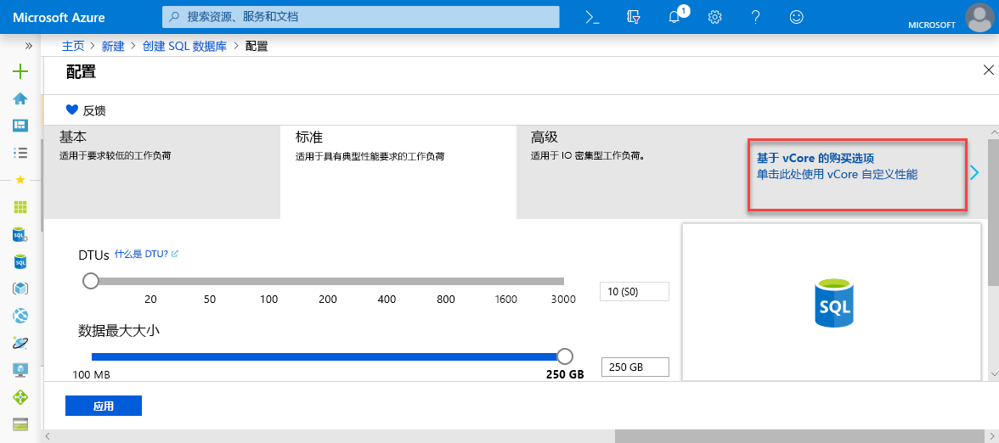
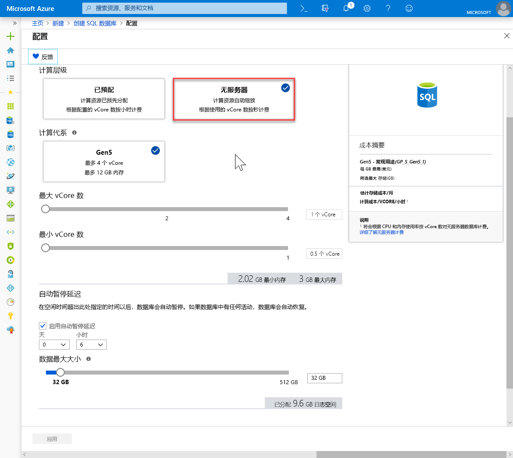

# <a name="quickstart-create-a-single-database-in-azure-sql-database-using-the-azure-portal"></a>快速入门：使用 Azure 门户在 Azure SQL 数据库中创建单一数据库

在 Azure SQL 数据库中创建数据库时，创建[单一数据库](sql-database-single-database.md)是最快速且最简单的部署选项。 本快速入门介绍如何使用 Azure 门户创建并查询单一数据库。

如果没有 Azure 订阅，可以[创建一个免费帐户](https://azure.microsoft.com/free/)。

执行本快速入门中的所有步骤都需要登录到 [Azure 门户](https://portal.azure.com/)。

## <a name="create-a-single-database"></a>创建单一数据库

在预配或无服务器（预览版）计算层中可以创建单一数据库。

- 预配计算层中的单一数据库具有已定义数量的预分配计算资源以及使用两个[购买模型](sql-database-purchase-models.md)之一的一系列内存和存储资源。
- 无服务器计算层中的单一数据库具有一系列自动扩展的计算资源，以及指定数量的每内核内存和指定数量的存储资源，且仅在[基于 vCore 的购买模型](sql-database-service-tiers-vcore.md)中提供。

创建单一数据库时，也定义一个 [SQL 数据库服务器](sql-database-servers.md)来管理它并将它放置在指定区域的 [Azure 资源组](../azure-resource-manager/resource-group-overview.md)中。

> [!NOTE]
> 本快速入门使用[基于 vCore 的购买模型](sql-database-service-tiers-vcore.md)和[无服务器](sql-database-serverless.md)计算层，但也可使用[基于 DTU 的购买模型](sql-database-service-tiers-DTU.md)。

若要创建包含 Adventure Works LT 示例数据的单一数据库，请执行以下操作：

1. 在 Azure 门户的左上角选择“创建资源”。 
2. 选择“数据库”，然后选择“SQL 数据库”打开“创建 SQL 数据库”页。   

   

3. 在“项目详细信息”部分的“基本信息”选项卡上，键入或选择以下值：  

   - **订阅**：下拉列表并选择正确的订阅（如果它没有出现）。
   - **资源组**：选择“新建”，键入 `myResourceGroup`，然后选择“确定”   。

     

4. 在“数据库详细信息”部分，键入或选择以下值： 

   - **数据库名称**：输入 `mySampleDatabase` 。
   - **服务器**：选择“新建”并输入以下值，然后选择“创建”。  
       - **服务器名称**：键入 `mysqlserver` 和一些数字，使名称唯一。
       - **服务器管理员登录名**：键入 `azureuser`。
       - **密码**：键入符合密码要求的复杂密码。
       - **位置**：从下拉列表中选择一个位置，例如 `West US 2`。

         

      > [!IMPORTANT]
      > 请记得记录服务器管理员登录名和密码，以便可以登录服务器和数据库以获取此快速入门和其他快速入门。 如果忘记了登录名或密码，可在“SQL 服务器”页上获取登录名或重置密码  。 若要打开“SQL 服务器”页，请在创建数据库后在数据库“概述”页上选择服务器名称   。

        

   - **想要使用 SQL 弹性池**：选择“否”选项。 
   - **计算 + 存储**：选择“配置数据库”，对于此快速入门，选择“基于 vCore 的购买选项”  

     

   - 选择“无服务器”  。

     

   - 查看“最大 vCore 数目”、“最小 vCore 数目”、“自动暂停延迟”和“数据最大大小”的设置     。 根据需要进行更改。
   - 接受预览版条款，然后单击“确定”  。
   - 选择“应用”。 

5. 选择“其他设置”选项卡。  
6. 在“数据源”部分的“使用现有数据”下，选择 `Sample`。   

   

   > [!IMPORTANT]
   > 确保选择“示例(AdventureWorksLT)”数据，这样就可以轻松地按照本指南以及使用此数据的其他 Azure SQL 数据库快速入门进行操作  。

7. 将剩余字段保留默认值，然后选择窗体底部的“查看 + 创建”。 
8. 检查最终的设置，然后选择“创建”。 

9. 在“SQL 数据库”窗体中，选择“创建”来部署和预配资源组、服务器和数据库   。

## <a name="query-the-database"></a>查询数据库

创建数据库后，即可使用 Azure 门户中的内置查询工具连接到数据库并查询数据。

1. 在数据库的 SQL 数据库页的左侧菜单中，选择“查询编辑器(预览)”   。

   

2. 输入你的登录信息，并选择“确定”  。
3. 在“查询编辑器”窗格中输入以下查询  。

   ```sql
   SELECT TOP 20 pc.Name as CategoryName, p.name as ProductName
   FROM SalesLT.ProductCategory pc
   JOIN SalesLT.Product p
   ON pc.productcategoryid = p.productcategoryid;
   ```

4. 选择“运行”，然后在“结果”窗格中查看查询结果。  

   

5. 关闭“查询编辑器”页，并在系统提示时选择“确定”，以放弃未保存的修改   。

## <a name="clean-up-resources"></a>清理资源

如果希望转到[后续步骤](#next-steps)，请保留此资源组、数据库服务器和单一数据库。 后续步骤展示了如何使用各种方法连接和查询数据库。

使用完这些资源后，可以通过如下方式将其删除：

1. 在 Azure 门户的左侧菜单中，选择“资源组”，然后选择“myResourceGroup”   。
2. 在资源组页上，选择“删除资源组”  。
3. 在字段中输入 *myResourceGroup*，然后选择“删除”  。

## <a name="next-steps"></a>后续步骤

- 创建服务器级防火墙规则，以便通过本地或远程工具连接到单一数据库。 有关详细信息，请参阅[创建服务器级防火墙规则](sql-database-server-level-firewall-rule.md)。
- 创建服务器级防火墙规则后，使用多种不同的工具和语言[连接和查询](sql-database-connect-query.md)数据库。
  - [使用 SQL Server Management Studio 连接和查询](sql-database-connect-query-ssms.md)
  - [使用 Azure Data Studio 连接和查询](https://docs.microsoft.com/sql/azure-data-studio/quickstart-sql-database?toc=/azure/sql-database/toc.json)
- 要使用 Azure CLI 在预配计算层中创建单一数据库，请参阅 [Azure CLI 示例](sql-database-cli-samples.md)。
- 要使用 Azure PowerShell 在预配计算层中创建单一数据库，请参阅 [Azure PowerShell 示例](sql-database-powershell-samples.md)。
- 若要在无服务器计算层中使用 Azure Powershell 创建单一数据库，请参阅[创建无服务器数据库](sql-database-serverless.md#create-new-database-in-serverless-compute-tier)。