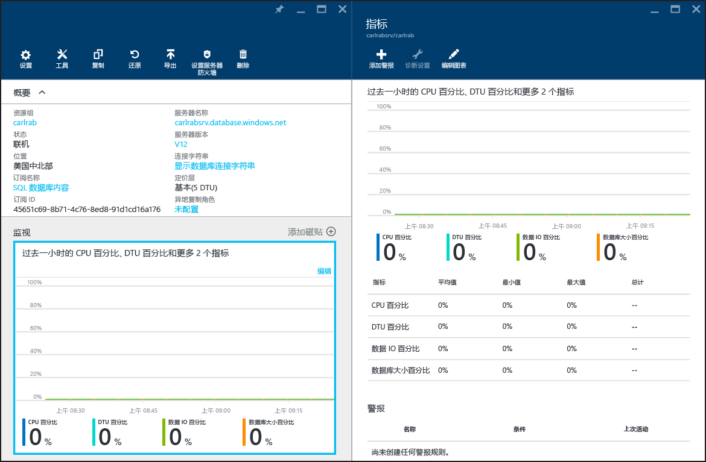

# 在 Azure SQL 数据库中监视数据库性能
若要监视 Azure 中的 SQL 数据库的性能，首先需要监视所选数据库性能级别相关的资源利用率。监视功能可帮助你确定数据库是否超出容量，或者因资源超限而遇到问题，然后确定是否有必要调整数据库的性能级别和[服务层](sql-database-service-tiers.md)。可以使用 [Azure 门户](https://portal.azure.com)中的图形工具或使用 SQL [动态管理视图](https://msdn.microsoft.com/library/ms188754.aspx)监视数据库。

## 使用 Azure 门户监视数据库
在 [Azure 门户](https://portal.azure.com/)中，可以通过选择数据库并单击“正在监视”图表监视单个数据库的使用率。这将显示“指标”窗口，可通过单击“编辑图表”按钮来对其进行更改。添加以下指标：

* CPU 百分比
* DTU 百分比
* 数据 IO 百分比
* 数据库大小百分比

添加这些指标后，你可以继续在“监视”图表上查看它们，并可在“指标”窗口上查看更多详细信息。所有这四个指标均显示相对于数据库的 **DTU** 的平均利用率百分比。参阅[服务层](sql-database-service-tiers.md)文章，了解有关 DTU 的详细信息。

你还可以针对性能指标配置警报。单击“指标”窗口中的“添加警报”按钮。按照向导说明来配置警报。你可以选择在指标超出特定阈值或指标低于特定阈值时显示警报。

例如，如果你预期数据库的工作负荷会增长，则可以选择配置在数据库的任何性能指标达到 80% 时发出电子邮件警报。你可以将此警报用作预警，以确定你何时需要切换到下一个更高的性能级别。

性能指标还可以帮助你确定是否能够降级到更低的性能级别。假定你正在使用一个标准 S2 数据库并且所有性能指标均显示该数据库在任何给定时间平均的使用率不超过 10%。很可能该数据库在标准 S1 中会很好地正常工作。但是，在决定转换到更低的性能级别之前，请注意出现峰值或波动情况的工作负荷。

## 使用 DMV 监视数据库
显示在门户中的相同指标也可以通过系统视图获取：服务器的逻辑**主**数据库中的 [sys.resource\_stats](https://msdn.microsoft.com/library/dn269979.aspx) 和用户数据库中的 [sys.dm\_db\_resource\_stats](https://msdn.microsoft.com/library/dn800981.aspx)。如果需要在更长时间段内监视更粗粒度的数据，请使用 **sys.resource\_stats**。如果需要在较小的时间范围内监视更细粒度的数据，请使用 **sys.dm\_db\_resource\_stats**。有关详细信息，请参阅 [Azure SQL 数据库性能指南](sql-database-performance-guidance.md#monitoring-resource-use-with-sysresourcestats)。

> [!NOTE]
> 如果在已停用的 Web 和企业版数据库中使用，**sys.dm\_db\_resource\_stats** 将返回空结果集。
> 
> 

对于弹性数据库池，可以使用本节中所述的技术来监视池中的单个数据库。但你还可以在总体上监视池。有关信息，请参阅[监视和管理弹性数据库池](sql-database-elastic-pool-manage-portal.md)。

<!---HONumber=AcomDC_0921_2016-->