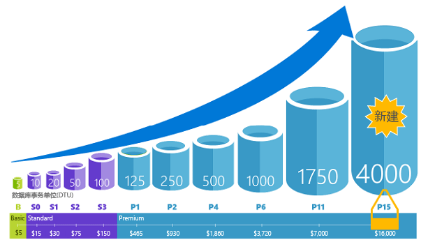
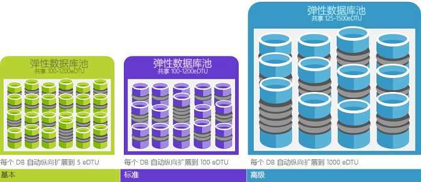

# 什么是 Azure SQL 数据库服务？ 

Azure SQL 数据库是 Microsoft 云（“Azure”）中完全托管的关系数据库即服务 (DBaaS)。 借助此平台即服务产品/服务，Microsoft 可无缝处理 SQL 代码库的所有修补和更新，并避开底层基础结构的所有管理。 SQL 数据库与 [Microsoft SQL Server 数据库引擎](https://docs.microsoft.com/sql/sql-server/sql-server-technical-documentation)共享其代码库。 

Microsoft 当前正在管理数百万个运行各种应用程序和工作负荷的生产数据库，从简单的事务数据到全球范围内需要高级数据处理的数据密集型、任务关键型应用程序。 SQL 数据库服务目前在世界各地有 38 个数据中心，且有更多数据中心定期上线。  

SQL 数据库是通用的关系数据库，支持关系数据、JSON、空间和 XML 等结构。 它提供[动态可缩放性能](sql-database-service-tiers.md)，并提供[列存储索引](https://docs.microsoft.com/sql/relational-databases/indexes/columnstore-indexes-overview)（用于极端分析和报告）和[内存中 OLTP](sql-database-in-memory.md)（用于极端事务处理）等选项。 

利用 Microsoft 的云优先策略，首先将 SQL Server 的最新功能发布到 SQL 数据库，然后再发布到 SQL Server 本身。 此方法可为你提供 SQL Server 的最新功能，这些新功能已经过数百万个数据库的测试且无任何修补或升级开销。 有关公布的新功能信息，请参阅：

- [用于 SQL 数据库的 Azure 路线图](https://azure.microsoft.com/roadmap/?category=databases)：在此处介绍新增功能和即将推出的功能。 
- [Azure SQL 数据库博客](https://azure.microsoft.com/blog/topics/database)：SQL Server 产品团队成员在此处发布关于 SQL 数据库新闻和功能的博客。 

SQL 数据库在多个服务级别提供可预测的、动态可缩放的性能，主要表现在：无停机时间、内置智能优化、全局可伸缩性和可用性，以及高级安全选项 - 一切几乎不用人工管理。 借助这些功能，用户可将注意力集中在如何快速进行应用开发、加快推向市场，而不需要投入宝贵的时间和资源来管理虚拟机与基础结构。 

> [!NOTE]
> 有关 Azure 平台安全性的信息，请参阅 [Azure 信任中心](https://azure.microsoft.com/support/trust-center/security/)。
>

## 可缩放的性能和池

使用 SQL 数据库，每个数据库都彼此独立且可移植，各有其自己的[服务层](sql-database-service-tiers.md)，且服务层具备有保证的性能级别。 SQL 数据库针对不同需求提供不同性能级别，并使数据库可存入池中，以最大化利用资源和节省资金。

### 无需停机即可调整性能和规模

SQL 数据库提供 4 个服务层，支持轻型到重型数据库工作负荷：基本、标准、高级和高级 RS。 可以在小型单一数据库中构建第一个应用，每个月只需花费少量资金。然后可以根据解决方案的需要，随时手动或以编程方式更改服务层。 可在不给应用或客户造成停机的情况下调整性能。 动态可伸缩性可让数据库以透明方式响应快速变化的资源要求，使用户只需为用到的资源付费。

   

### 弹性池可以最大化资源利用率

许多业务和应用程序只要能够创建单一数据库并按需调高或调低性能即可，尤其是当使用模式相对容易预测时。 但如果有无法预测的使用模式，则管理成本和业务模式就会变得相当困难。 [弹性池](sql-database-elastic-pool.md)旨在解决此问题。 概念很简单。 可以向池而不是单个数据库分配性能资源，并且仅需为池的总体性能资源付费，而无需为单一数据库的性能付费。 

   

使用弹性池时，不需要在资源需求波动时担心如何上下调节数据库性能。 入池的数据库可根据需要使用弹性池的性能资源。 入池的数据库会使用该池，但不会超出其限制，因此即使单个数据库的使用情况仍不可预测，成本也仍是可预测的。 此外，你可以 [向池添加和删除数据库](sql-database-elastic-pool-manage-portal.md)，将应用从少量数据库扩展到数千个，而一切费用不会超出由你控制的预算范围。 还可以控制池中数据库可用的资源量上限与下限，确保池中不会有任何数据库使用所有的池资源，每个入池数据库的可用资源量都有最低保障。 若要深入了解如何通过弹性池设计 SaaS 应用程序的模式，请参阅[具有 SQL 数据库的多租户 SaaS 应用程序的设计模式](sql-database-design-patterns-multi-tenancy-saas-applications.md)。

### 混合使用单一数据库与入池数据库

不管采用哪种方式 - 单一数据库或弹性池 - 都不会受到限制。 可将单一数据库与弹性池混合使用，快速轻松地更改单一数据库和弹性池的服务层来适应自己的情况。 凭借 Azure 的功能和作用范围，可将其他 Azure 服务与 SQL 数据库搭配使用以满足独特的应用设计需求，提高成本和资源效益，发掘新的商机。

### 集中监视和警报功能

但是，要如何比较单一数据库和数据库池的相对性能呢？ 当调高和调低性能时，如何知道该在何处停止？ 根据[单一数据库的数据库事务单位 (DTU) 和弹性池的弹性 DTU (eDTU)](sql-database-what-is-a-dtu.md)，结合性能评级使用[内置性能监视](sql-database-performance.md)和[警报](sql-database-insights-alerts-portal.md)工具。 使用这些工具，可以根据当前需求或项目性能的需求，快速评估调高或调低性能产生的影响。 有关详细信息，请参阅 [SQL 数据库选项和性能：了解每个服务层提供的功能](sql-database-service-tiers.md) 。

此外，SQL 数据库可[发出指标和诊断日志](sql-database-metrics-diag-logging.md)，以便更轻松地监视。 可配置 SQL 数据库，将资源使用情况、辅助角色和会话以及连接性存储到以下 Azure 资源之一：

- Azure 存储：用于低价存档大量遥测
- Azure 事件中心：用于将 SQL 数据库遥测与自定义监视解决方案或热门管道集成
- Azure Log Analytics：用于具有报告、警报和缓解功能的内置监视解决方案

    

## 可用性功能

Azure 行业领先的 99.99% 可用性服务级别协议 [(SLA)](http://azure.microsoft.com/support/legal/sla/)（由 Microsoft 管理的数据中心的全球网络提供支持），有助于保持应用全天候运行。 此外，SQL 数据库还提供内置[业务连续性和全局可伸缩性](sql-database-business-continuity.md)功能，包括：

- [自动备份](sql-database-automated-backups.md)：SQL 数据库自动执行完整备份、差异备份和事务日志备份。
- [时间点还原](sql-database-recovery-using-backups.md)：SQL 数据库支持恢复到自动备份保留期内的任何时间点。
- [活动异地复制](sql-database-geo-replication-overview.md)：SQL 数据库允许在同一或全局分发的 Azure 数据中心配置至多 4 个可读的辅助数据库。  例如，如果有一个 SaaS 应用程序，其中的目录数据库包含大量并发只读事务，请使用活动异地复制来启用全局读取缩放并删除主数据库上因读取工作负荷产生的瓶颈。 
- [故障转移组](sql-database-geo-replication-overview.md)：通过 SQL 数据库，可实现高可用性和全局范围内的负载均衡，包括透明异地复制和大型数据库集和弹性池故障转移。 通过故障转移组和活动异地复制，能够以最小管理开销创建全局分发式 SaaS 应用程序，将所有复杂监视、路由和故障转移业务流程留给 SQL 数据库。

## 内置智能

使用 SQL 数据库，可获得内置智能，帮助你大幅降低运行和管理数据库的成本，并将应用程序的性能和安全性最大化。 通过全天候运行数以百万计的客户工作负荷，SQL 数据库收集和处理大量遥测数据，同时完全尊重幕后客户的隐私。 各种算法正在不间断计算遥测数据，以便服务可以了解并适应应用程序。 基于这一分析，该服务会提出针对特定工作负荷的性能改进建议。 

### 自动性能优化

SQL 数据库提供针对需要监视的查询的详细见解。 SQL 数据库了解数据库模式，使你能够根据工作负荷调整数据库架构。 SQL 数据库使用 [SQL 数据库顾问](sql-database-advisor.md)提供性能优化建议，可在其中查看并应用优化操作。 然而，持续监视数据库是一项艰巨且乏味的任务，尤其是在处理多个数据库时。 可能无法高效管理大量数据库，即使使用 SQL 数据库和 Azure 门户提供的所有可用工具和报表也一样。 可考虑使用自动优化功能将某些监视和优化操作委派给 SQL 数据库，而不是手动监视和优化数据库。 SQL 数据库自动应用建议、测试，并验证每个优化操作，确保性能持续提升。 这样一来，SQL 数据库将以受控且安全的方式自动适应工作负荷。 自动优化是指在每次优化操作前后仔细监视和比较数据库性能，如果性能未得到提升，则还原优化操作。

目前，在 SQL 数据库上运行 [SaaS 多租户应用](sql-database-design-patterns-multi-tenancy-saas-applications.md)的许多合作伙伴均依赖于自动性能优化，确保其应用程序始终具有稳定且可预测的性能。 对他们而言，此功能可大大降低午夜出现性能事故的风险。 此外，由于部分客户群也使用 SQL Server，因此他们使用 SQL 数据库提供的相同索引建议来帮助 SQL Sever 客户。

SQL 数据库中有两个自动优化方面：

- [自动索引管理](sql-database-automatic-tuning.md#automatic-index-management)：标识应在数据库中添加的索引以及应删除的索引。
- [自动计划更正](sql-database-automatic-tuning.md#automatic-plan-choice-correction)：标识有问题的计划并修复 SQL 计划性能问题（即将推出，已在 SQL Server 2017 中提供）。

### 自适应查询处理

我们还将向 SQL 数据库添加自适应查询处理系列功能，包括[交错执行多语句表值函数，批处理模式内存授予反馈](https://blogs.msdn.microsoft.com/sqlserverstorageengine/2017/04/19/introducing-interleaved-execution-for-multi-statement-table-valued-functions/)和[批处理模式自适应联接](https://blogs.msdn.microsoft.com/sqlserverstorageengine/2017/04/19/introducing-batch-mode-adaptive-joins/)。 每个自适应查询处理功能均应用类似的“学习和适应”技巧，帮助进一步解决与历史上棘手的查询优化问题相关的性能问题。

### 智能威胁检测

 [SQL 威胁检测](sql-database-threat-detection.md)利用 [SQL 数据库审核](sql-database-auditing.md)持续监视 Azure SQL 数据库，防止可能有害的敏感数据访问尝试。 SQL 威胁检测提供新的安全层，在发生异常活动时会提供安全警报，让客户检测潜在威胁并做出响应。 出现可疑数据库活动、潜在漏洞、SQL 注入攻击和异常数据库访问模式时，用户会收到警报。 SQL 威胁检测警报提供可疑活动的详细信息，以及如何调查和缓解威胁的推荐操作。 用户可探查可疑事件，判断这些可疑事件是否是因为有人尝试访问、破坏或利用数据库中的数据而生成的。 不必是安全专家，也不需要管理高级的安全监视系统，就能使用威胁检测轻松解决数据库的潜在威胁。

## 高级安全性和符合性

SQL 数据库提供一系列[内置安全性和符合性功能](sql-database-security-overview.md)，帮助应用程序满足各种安全性和符合性要求。 

### 符合性和安全性审核

[SQL 数据库审核](sql-database-auditing.md)跟踪数据库事件，并将事件写入 Azure 存储帐户中的审核日志。 审核可帮助你一直保持遵从法规、了解数据库活动，以及深入了解可以指明业务考量因素或疑似安全违规的偏差和异常。

### 静态数据加密

SQL 数据库[透明数据加密](https://docs.microsoft.com/sql/relational-databases/security/encryption/transparent-data-encryption-with-azure-sql-database)无需更改应用程序，即可对静态的数据库、关联的备份和事务日志文件执行实时加密和解密，帮助防止恶意活动的威胁。 从 2017 年 5 月起，所有新建的 Azure SQL 数据库均通过透明数据加密 (TDE) 进行自动保护。 TDE 是 SQL 经验证的静态加密技术，许多符合性标准都需要它来防止存储介质被盗。 客户可使用 Azure Key Vault 通过安全合规的方式管理 TDE 加密密钥和其他密钥。

### 动态数据加密

SQL 数据库是使用 [Always Encrypted](https://docs.microsoft.com/sql/relational-databases/security/encryption/always-encrypted-database-engine) 在动态、静态和查询处理期间提供敏感数据保护的唯一数据库系统。 Always Encrypted 是业界首创功能，可针对涉及关键数据被盗的漏洞提供无与伦比的数据安全性。 例如，借助 Always Encrypted，客户的信用卡卡号即使在查询处理期间也始终加密存储在数据库中，允许经授权员工或需要处理该数据的应用程序在使用时进行解密。

### 动态数据掩码

[SQL 数据库动态数据掩码](sql-database-dynamic-data-masking-get-started.md)通过对非特权用户模糊化敏感数据来限制此类数据的泄露。 动态数据屏蔽允许客户指定在对应用层产生最小影响的前提下可以透露的敏感数据量，从而帮助防止未经授权的用户访问敏感数据。 它是一种基于策略的安全功能，会在针对指定的数据库字段运行查询后返回的结果集中隐藏敏感数据，同时保持数据库中的数据不变。

### 行级别安全性

[行级别安全性](https://docs.microsoft.com/sql/relational-databases/security/row-level-security)使客户能够根据执行查询的用户特征（例如，按组成员身份或执行上下文），控制对数据库表中的行的访问。 行级别安全性 (RLS) 简化了应用程序中的安全性设计和编程。 使用 RLS 可针对数据行访问实施限制。 例如，确保工作人员只能访问与其部门相关的数据行，或者将客户限制为只能访问与其公司相关的数据。

### Azure Active Directory 集成和多重身份验证

通过 SQL 数据库，可使用 [Azure Active Directory 集成](sql-database-aad-authentication.md)集中管理数据库用户和其他 Microsoft 服务的身份。 此功能简化了权限管理，增强了安全性。 Azure Active Directory 支持[多重身份验证](sql-database-ssms-mfa-authentication.md) (MFA)，以便在支持单个单一进程的同时提高数据和应用程序安全性。

### 符合性认证

SQL 数据库参与定期审核，并已针对多个符合性标准进行验证。 有关详细信息，请参阅 [Microsoft Azure 信任中心](https://azure.microsoft.com/support/trust-center/)，你可以从中找到 [SQL 数据库法规认证](https://azure.microsoft.com/support/trust-center/services/)的最新列表。

## 易于使用的工具

SQL 数据库让应用程序的构建和维护更加轻松、高效。 SQL 数据库让你能够专注于自己的专长：生成优秀的应用。 可使用已有工具和技能在 SQL 数据库进行管理和开发。

- [Azure 门户](https://portal.azure.com/)：用于管理所有 Azure 服务的基于 Web 的应用程序 
- [SQL Server Management Studio](https://docs.microsoft.com/sql/ssms/download-sql-server-management-studio-ssms)：用于管理任何 SQL 基础结构（从 SQL Server 到 SQL 数据库，不一而足）的免费可下载客户端应用程序。
- [Visual Studio 中的 SQL Server Data Tools](https://docs.microsoft.com/sql/ssdt/download-sql-server-data-tools-ssdt)：用于开发 SQL Server 关系数据库、Azure SQL 数据库、Integration Services 包、Analysis Services 数据模型和 Reporting Services 报表的免费可下载客户端应用程序。
- [Visual Studio Code](https://code.visualstudio.com/docs)：一种免费可下载的开源代码编辑器，适用于 Windows、macOS 和 Linux，并支持各种扩展，其中包括 [mssql 扩展](https://aka.ms/mssql-marketplace)（用于查询 Microsoft SQL Server、Azure SQL 数据库和 SQL 数据仓库）。

SQL 数据库支持在 MacOS、Linux 和 Windows 上使用 Python、Java、Node.js、PHP、 Ruby 和 .NET 生成应用程序。 SQL 数据库和 SQL Server 支持相同的[连接库](sql-database-libraries.md)。

## 后续步骤

- 有关单一数据库和弹性池的成本比较与计算器，请参阅[定价页](https://azure.microsoft.com/pricing/details/sql-database/)。

- 请参阅这些快速入门，以便尽快入门：

  - [在 Azure 门户中创建 SQL 数据库](sql-database-get-started-portal.md)  
  - [使用 Azure CLI 创建 SQL 数据库](sql-database-get-started-cli.md)
  - [使用 PowerShell 创建 SQL 数据库](sql-database-get-started-powershell.md)

- 如需一组 Azure CLI 和 PowerShell 的示例，请参阅：
  - [适用于 SQL 数据库的 Azure CLI 示例](sql-database-cli-samples.md)
  - [适用于 SQL 数据库的 Azure PowerShell 示例](sql-database-powershell-samples.md)
