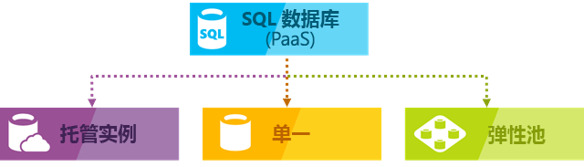

# 什么是 Azure SQL 数据库服务？

Azure SQL 数据库是一种通用的关系数据库，作为托管服务提供。 利用它，你可以为 Azure 中的应用程序和解决方案创建高度可用且高性能的数据存储层。 SQL 数据库对于各种新式云应用程序都是正确的选择，因为它使您能够处理关系数据和[非关系结构](sql-database-multi-model-features.md)，如图形、JSON、空间和 XML。

它基于[Microsoft SQL Server 数据库引擎](https://docs.microsoft.com/sql/sql-server/sql-server-technical-documentation?toc=/azure/sql-database/toc.json)的最新稳定版本。 您可以使用高级查询处理功能，如[高性能内存中技术](sql-database-in-memory.md)和[智能查询处理](https://docs.microsoft.com/sql/relational-databases/performance/intelligent-query-processing?toc=/azure/sql-database/toc.json)。 事实上，SQL Server 的最新功能首先发布到 SQL 数据库，然后 SQL Server 本身。 你可获得最新的 SQL Server 功能，无开销用于修补或升级，并可跨数百万个数据库进行测试。 

使用 SQL 数据库，您可以在两种不同的购买模型中轻松定义和缩放性能：[基于 vCore 的购买](sql-database-service-tiers-vcore.md)模型和[基于 DTU 的购买模型](sql-database-service-tiers-dtu.md)。 SQL 数据库是一项完全托管的服务，它具有内置的高可用性、备份和其他常见维护操作。 Microsoft 处理 SQL 和操作系统代码的所有修补和更新。 无需管理基础结构。

> [!NOTE]
> 有关相关术语及其定义，请参阅[SQL 数据库术语术语表](sql-database-glossary-terms.md)。

## 部署模型

Azure SQL 数据库提供下述适用于 Azure SQL 数据库的部署选项：

- [单个数据库](sql-database-single-database.md)表示完全托管的独立数据库。 如果需要使用单个可靠数据源的新式云应用程序和微服务，可以使用此选项。 单个数据库与[Microsoft SQL Server 数据库引擎](https://docs.microsoft.com/sql/sql-server/sql-server-technical-documentation?toc=/azure/sql-database/toc.json)中的[包含数据库](https://docs.microsoft.com/sql/relational-databases/databases/contained-databases?toc=/azure/sql-database/toc.json)类似。
- [托管实例](sql-database-managed-instance.md)是[Microsoft SQL Server 数据库引擎](https://docs.microsoft.com/sql/sql-server/sql-server-technical-documentation?toc=/azure/sql-database/toc.json)的完全托管的实例。 它包含一组可一起使用的数据库。 使用此选项可以轻松地将本地 SQL Server 数据库迁移到 Azure 云，以及需要使用 SQL Server 数据库引擎提供的数据库功能的应用程序。
- [弹性池](sql-database-elastic-pool.md)是具有一组共享资源（如 CPU 或内存）的[单一数据库](sql-database-single-database.md)的集合。 可以将单一数据库移入或移出弹性池。

> [!IMPORTANT]
> 若要了解 SQL 数据库和 SQL Server 之间的功能差异，以及不同的 Azure SQL 数据库部署选项之间的差异，请参阅[Sql 数据库功能](sql-database-features.md)。

SQL 数据库可提供多种资源类型、服务层和计算大小的可预测性能。 它提供动态可扩展性，无停机时间、内置智能优化、全局可伸缩性和可用性，以及高级安全选项。 利用这些功能，你可以专注于快速应用程序开发，并加快面市时间，而不是管理虚拟机和基础结构。 SQL 数据库服务目前在世界各地38的数据中心，因此你可以在附近的数据中心内运行你的数据库。

## 可缩放的性能和池

你可以定义分配的资源量。 
- 对于单一数据库，每个数据库都与其他数据库隔离，并且是可移植的。 每个都有其自己的有保证的计算、内存和存储资源量。 分配给数据库的资源量专用于该数据库，不与 Azure 中的其他数据库共享。 可以动态[缩放单个数据库资源](sql-database-single-database-scale.md)。 单个数据库选项提供不同的计算、内存和存储资源来满足不同的需求。 例如，可以获得1到80的 Vcore 或 32 GB 到 4 TB。 利用单一数据库的[超大规模服务层](sql-database-service-tier-hyperscale.md)，可以通过快速备份和还原功能扩展到 100 TB。
- 使用弹性池，可以分配池中所有数据库共享的资源。 可以创建新的数据库，也可以将现有的单一数据库移到资源池中，以最大限度地利用资源和节省资金。 此选项还使你能够动态[缩放弹性池资源](sql-database-elastic-pool-scale.md)。
- 使用托管实例，每个托管实例都与其他实例隔离开来，并包含有保证的资源。 在托管实例中，实例数据库共享一组资源。 可以动态[缩放托管实例资源](sql-database-managed-instance-resource-limits.md)。

你可以在一个小型单一数据库中构建第一个应用，每月在常规用途服务层中按较低成本。 然后，你可以根据解决方案的需要，随时手动或以编程方式将其服务层更改为业务关键服务层。 可在不给应用或客户造成停机的情况下调整性能。 动态可伸缩性使得数据库能够以透明方式对不断变化的资源需求做出响应。 只需为需要的资源付费。

*动态可伸缩性*不同于*自动缩放*。 自动缩放是指服务根据条件自动缩放，而动态可伸缩性允许在无停机时间的情况下进行手动缩放。 单一数据库选项支持手动动态缩放，但不支持自动缩放。 若要获得更多的自动化体验，请考虑使用弹性池，这允许数据库根据单个数据库需求共享池中的资源。 另一种方法是使用可帮助自动执行单个数据库的可伸缩性的脚本。 有关示例，请参阅[使用 PowerShell 监视和缩放单个数据库](scripts/sql-database-monitor-and-scale-database-powershell.md)。

### 购买模型

SQL 数据库提供以下购买模型：
- [基于 vCore 的购买模型](sql-database-service-tiers-vcore.md)允许选择 vcore 数、内存量以及存储量和速度。 基于 vCore 的购买模型还允许使用[适用于 SQL Server 的 Azure 混合权益](https://azure.microsoft.com/pricing/hybrid-benefit/)来节省成本。 有关 Azure 混合权益的详细信息，请参阅本文后面的 "常见问题解答" 一节。
- [基于 DTU 的购买模型](sql-database-service-tiers-dtu.md)在三个服务层中提供计算、内存和 i/o 资源的混合，以支持轻型到重型数据库工作负荷。 每个层级中的不同计算大小提供这些资源的不同组合，你可以向其添加更多的存储资源。
- [无服务器模型](sql-database-serverless.md)根据工作负荷需求自动缩放计算，并根据每秒使用的计算量来计费。 当只对存储计费时，无服务器计算层还会在非活动期间自动暂停数据库，并在活动返回时自动恢复数据库。

### 服务层

Azure SQL 数据库提供三个为不同类型的应用程序设计的服务层：
- 为常见工作负荷设计的[常规用途/标准](sql-database-service-tier-general-purpose.md)服务层。 它提供面向预算的平衡计算和存储选项。
- 为 OLTP 应用程序设计的、具有高事务速率和最低延迟 i/o 的[业务关键/高级](sql-database-service-tier-business-critical.md)服务层。 它通过使用多个独立副本提供故障的最高复原能力。
- 为非常大的 OLTP 数据库设计的[超大规模](sql-database-service-tier-hyperscale.md)服务层，以及自动缩放存储和缩放计算流畅地的功能。 

### 弹性池可以最大化资源利用率

许多业务和应用程序只要能够创建单一数据库并按需调高或调低性能即可，尤其是当使用模式相对容易预测时。 不可预测的使用模式可能难以管理成本和业务模型。 [弹性池](sql-database-elastic-pool.md)旨在解决此问题。 您可以向池而不是单个数据库分配性能资源。 你需要为池的总体性能资源付费，而不是针对单一数据库的性能付费。

   

使用弹性池时，不需要在资源需求波动时担心如何上下调节数据库性能。 共用数据库可根据需要使用弹性池的性能资源。 共用数据库会使用该池，但不会超出其限制，因此即使单个数据库的使用情况仍不可预测，成本也仍是可预测的。

你可以在[池中添加和删除数据库](sql-database-elastic-pool-manage-portal.md)，将应用从少量数据库扩展到数千个，所有这些都在你控制的预算内。 您还可以控制池中数据库可用的最小和最大资源，以确保池中没有数据库使用所有池资源，并且每个共用数据库都有保证的最小资源量。 若要了解有关使用弹性池的软件即服务（SaaS）应用程序的设计模式的详细信息，请参阅[具有 SQL 数据库的多租户 SaaS 应用程序的设计模式](sql-database-design-patterns-multi-tenancy-saas-applications.md)。

脚本可以帮助监视和缩放弹性池。 有关示例，请参阅[使用 PowerShell 监视和缩放 AZURE Sql 数据库中的 SQL 弹性池](scripts/sql-database-monitor-and-scale-pool-powershell.md)。

> [!IMPORTANT]
> 托管实例不支持弹性池。 相反，托管实例是共用托管实例资源的实例数据库的集合。

### 混合使用单一数据库与共用数据库

你可以将单一数据库与弹性池混合，并更改单一数据库和弹性池的服务层以适应你的情况。 你还可以将其他 Azure 服务与 SQL 数据库混合使用，以满足独特的应用程序设计需求，提高成本和资源效率，实现新的业务机会。

## 集中监视和警报功能

Azure SQL 数据库提供高级监视和故障排除功能，可帮助你深入了解工作负荷特征。 这些功能和工具包括：
 - 最新版本的 SQL Server 数据库引擎提供内置监视功能。 它们允许你查找实时性能见解。 
 - 由 Azure 提供的 PaaS 监视功能，可用于监视大量数据库实例并对其进行故障排除。

[查询存储](sql-database-operate-query-store.md)是一种内置的 SQL Server 监视功能，可实时记录查询的性能，并使你能够确定潜在的性能问题和排名靠前的资源使用者。 自动优化和建议提供有关具有回归性能的查询的建议，以及缺少或重复的索引。 使用 SQL 数据库中的自动优化，可以手动应用可修复问题的脚本，或让 SQL 数据库应用此修补程序。 SQL 数据库还可以测试并验证此修补程序是否有一定的优点，并根据结果保留或恢复更改。 除了查询存储和自动优化功能，还可以使用标准[dmv 和 XEvent](sql-database-monitoring-with-dmvs.md)来监视工作负荷性能。

Azure 提供[内置的性能监视](sql-database-performance.md)和[警报](sql-database-insights-alerts-portal.md)工具，结合性能评级，使你能够监视上千个数据库的状态。 使用这些工具，可以根据当前的或预计的性能需求，快速评估增加或减少扩展的影响。 此外，SQL 数据库可[发出指标和诊断日志](sql-database-metrics-diag-logging.md)，以便更轻松地监视。 可配置 SQL 数据库，将资源使用情况、辅助角色和会话以及连接性存储到以下 Azure 资源之一：

- **Azure 存储**：用于低价存档大量遥测。
- **Azure 事件中心**：用于将 SQL 数据库遥测与自定义监视解决方案或热管道集成。
- **Azure Monitor 日志**：用于具有报告、警报和缓解功能的内置监视解决方案。

## 可用性功能

在传统的 SQL Server 环境中，通常会设置至少两个本地计算机。 这些计算机具有完全同步维护的数据副本，可防止单个计算机或组件发生故障。 此环境可提供高可用性，但不能防止自然灾害损坏你的数据中心。

灾难恢复假设灾难性事件的地理位置本地化足以使另一台计算机或一组计算机的副本远远离数据。 在 SQL Server 中，可以使用在异步模式下运行 Always On 可用性组来获取此功能。 在提交事务之前，人们通常不希望等待复制完成，因此在进行计划外故障转移时，可能会丢失数据。

高级和业务关键服务层中的数据库已经[执行了类似](sql-database-high-availability.md#premium-and-business-critical-service-tier-availability)于可用性组同步的操作。 更低的服务层中的数据库通过使用不同的[等效机制](sql-database-high-availability.md#basic-standard-and-general-purpose-service-tier-availability)，通过存储提供冗余。 内置逻辑有助于防止单个计算机出现故障。 活动异地复制功能使你能够防止在整个区域被破坏的情况下发生灾难。

Azure 可用性区域尝试防止在单个区域内生成单个数据中心的服务中断。 它有助于防止网络丢失或网络丢失。 在 SQL 数据库中，您可以将不同的副本放在不同的可用性区域（而不是不同的建筑物）中。

事实上，Azure 的服务级别协议[（SLA）](https://azure.microsoft.com/support/legal/sla/)是由 Microsoft 管理的数据中心的全球网络提供支持的，有助于保持应用程序运行24/7。 Azure 平台完全管理每个数据库，并保证数据的可用性不会丢失和数据的高百分比。 Azure 会自动处理修补、备份、复制、故障检测；基础的潜在硬件、软件或网络故障；部署 bug 修复、故障转移、数据库升级和其他维护任务。 标准可用性是通过将计算层与存储层相隔离来实现的。 通过在单个节点上集成计算和存储以提高性能，然后实现与 Always On 可用性组类似的技术，实现高级可用性。 有关 Azure SQL 数据库的高可用性功能的完整讨论，请参阅 [SQL 数据库可用性](sql-database-high-availability.md)。 

此外，SQL 数据库还提供内置[业务连续性和全局可伸缩性](sql-database-business-continuity.md)功能。 其中包括：

- [自动备份](sql-database-automated-backups.md)：

  SQL 数据库会自动执行 SQL 数据库的完整备份、差异备份和事务日志备份，使您能够还原到任何时间点。 对于单一数据库和已入池数据库，可以配置 SQL 数据库，将完整数据库备份存储到 Azure 存储，以便进行长期备份保留。 对于托管实例，还可以执行仅复制备份，以供长期备份保留。

- [时间点还原](sql-database-recovery-using-backups.md)：

  所有 SQL 数据库部署选项都支持恢复到任何 SQL 数据库的自动备份保持期内的任何时间点。
- [活动异地复制](sql-database-active-geo-replication.md)：

  "单一数据库和池数据库" 选项允许在相同或全球分布式 Azure 数据中心中配置最多四个可读辅助数据库。 例如，如果有一个 SaaS 应用程序，其中的目录数据库包含大量并发只读事务，请使用活动异地复制来启用全局读取缩放。 这会消除由于读取工作负荷导致的主要瓶颈。 对于托管实例，请使用自动故障转移组。
- [自动故障转移组](sql-database-auto-failover-group.md)：

  所有 SQL 数据库部署选项都允许你使用故障转移组来实现高可用性，并在全球范围内实现负载均衡。 这包括透明异地复制和大型数据库集、弹性池和托管实例的故障转移。 故障转移组允许创建全球分布式 SaaS 应用程序，并具有最小的管理开销。 这会将所有复杂监视、路由和故障转移业务流程留给 SQL 数据库。
- [区域冗余数据库](sql-database-high-availability.md)：

  通过 SQL 数据库，可以跨多个可用性区域预配高级或业务关键数据库或弹性池。 由于这些数据库和弹性池具有多个冗余副本以实现高可用性，因此将这些副本置于多个可用性区域可提供更高的复原能力。 这包括能够自动从数据中心规模的故障中恢复，而不会丢失数据。

## 内置智能

通过 SQL 数据库，您可以获得内置智能，帮助您大幅降低运行和管理数据库的成本，并最大程度地提高应用程序的性能和安全性。 在时钟中运行数百万个客户工作负荷，SQL 数据库收集和处理大量遥测数据，同时完全尊重客户隐私。 各种算法会持续评估遥测数据，以便服务可以了解并适应应用程序。

### 自动性能监视和优化

SQL 数据库提供针对需要监视的查询的详细见解。 SQL 数据库了解数据库模式，并使你能够将数据库架构调整为工作负荷。 SQL 数据库[提供性能优化建议](sql-database-advisor.md)，可在其中查看并应用优化操作。

然而，持续监视数据库是一种很繁琐的任务，尤其是在处理多个数据库时。 [智能见解](sql-database-intelligent-insights.md)可以通过大规模地自动监视 SQL 数据库性能来执行此作业。 它会告知性能下降问题，确定每个问题的根本原因，并在可能的情况下提供性能改进建议。

即使使用 SQL 数据库和 Azure 提供的所有可用工具和报表，也可能无法高效管理大量数据库。 您可以考虑使用[自动优化](sql-database-automatic-tuning.md)将某些监视和优化操作委派给 SQL 数据库，而不是手动监视和优化数据库。 SQL 数据库自动应用建议、测试，并验证每个优化操作，确保性能持续提高。 这样一来，SQL 数据库将以受控且安全的方式自动适应工作负荷。 自动优化是指在每次优化操作前后仔细监视和比较数据库性能。 如果性能不能提高，则会恢复优化操作。

在 SQL 数据库之上运行[SaaS 多租户应用](sql-database-design-patterns-multi-tenancy-saas-applications.md)的许多合作伙伴都依赖于自动性能优化，确保其应用程序始终具有稳定且可预测的性能。 对他们而言，此功能可大大降低午夜出现性能事故的风险。 此外，由于部分客户群也使用 SQL Server，因此他们使用 SQL 数据库提供的相同索引建议来帮助其 SQL Server 客户。

[SQL 数据库中提供](sql-database-automatic-tuning.md)了两个自动优化方面：

- **自动索引管理**：标识应在数据库中添加的索引以及应删除的索引。
- **自动计划更正**：标识有问题的计划并修复 SQL 计划性能问题。

### 自适应查询处理

您可以使用[自适应查询处理](/sql/relational-databases/performance/intelligent-query-processing)，包括多语句表值函数的交错执行、批处理模式内存授予反馈和批处理模式自适应联接。 每个自适应查询处理功能均应用类似的“学习和适应”技巧，帮助进一步解决与历史上棘手的查询优化问题相关的性能问题。

## 高级安全性和符合性

SQL 数据库提供一系列[内置安全性和符合性功能](sql-database-security-overview.md)，帮助应用程序满足各种安全性和符合性要求。

> [!IMPORTANT]
> Microsoft 已根据一系列法规标准认证了 Azure SQL 数据库（所有部署选项）。 有关详细信息，请参阅[Microsoft Azure 信任中心](https://gallery.technet.microsoft.com/Overview-of-Azure-c1be3942)，你可以在其中找到 SQL 数据库符合性认证的最新列表。

### 高级威胁防护

高级数据安全是高级 SQL 安全功能的统一包。 它包括用于发现和分类敏感数据、管理数据库漏洞以及检测可能指示数据库威胁的异常活动的功能。 它提供用于启用和管理这些功能的一个位置。

- [数据发现和分类](sql-database-data-discovery-and-classification.md)：

  此功能提供了内置于 Azure SQL 数据库中的功能，用于发现、分类、标记和保护数据库中的敏感数据。 它提供数据库分类状态的可见性，并跟踪对数据库中敏感数据的访问权限，并跟踪其边框之外的访问权限。
- [漏洞评估](sql-vulnerability-assessment.md)：

  此服务可以发现、跟踪和帮助补救潜在的数据库漏洞。 它可直观查看安全状态，包括解决安全问题的可操作步骤，并可加强数据库的防御工事。
- [威胁检测](sql-database-threat-detection.md)：

  此功能可检测异常活动，这些活动表示异常和可能有害的数据库访问或利用尝试。 它不断监视数据库的可疑活动，并针对潜在漏洞、SQL 注入攻击和异常数据库访问模式提供即时的安全警报。 威胁检测警报提供可疑活动的详细信息，并提供有关如何调查和缓解威胁的建议操作。

### 符合性和安全性审核

[审核](sql-database-auditing.md)可跟踪数据库事件，并将事件写入 Azure 存储帐户中的审核日志。 审核可帮助你遵守法规、了解数据库活动，以及深入了解可以指明业务考量因素或疑似安全违规的偏差和异常。

### 数据加密

SQL 数据库通过提供加密来帮助保护数据。 对于移动中的数据，它使用[传输层安全性](https://support.microsoft.com/kb/3135244)。 对于静态数据，使用[透明数据加密](https://docs.microsoft.com/sql/relational-databases/security/encryption/transparent-data-encryption-azure-sql)。 对于使用中的数据，它使用[always encrypted](https://docs.microsoft.com/sql/relational-databases/security/encryption/always-encrypted-database-engine)。

### Azure Active Directory 集成和多重身份验证

通过 SQL 数据库，可使用 [Azure Active Directory 集成](sql-database-aad-authentication.md)集中管理数据库用户和其他 Microsoft 服务的身份。 此功能简化了权限管理，增强了安全性。 Azure Active Directory 支持[多重身份验证](sql-database-ssms-mfa-authentication.md)以提高数据和应用程序安全性，同时支持单一登录过程。

## 易于使用的工具

SQL 数据库让应用程序的构建和维护更加轻松、高效。 SQL 数据库让你能够专注于自己的专长：生成优秀的应用。 您可以使用已有的工具和技能在 SQL 数据库中管理和开发。

- [Azure 门户](https://portal.azure.com/)：

  用于管理所有 Azure 服务的基于 web 的应用程序。
- [SQL Server Management Studio](https://docs.microsoft.com/sql/ssms/download-sql-server-management-studio-ssms)：

  用于管理任何 SQL 基础结构的免费可下载客户端应用程序，从 SQL Server 到 SQL 数据库。
- [在 Visual Studio 中 SQL Server Data Tools](https://docs.microsoft.com/sql/ssdt/download-sql-server-data-tools-ssdt)：

  用于开发 SQL Server 关系数据库、SQL 数据库、Integration Services 包、Analysis Services 数据模型和 Reporting Services 报表的免费可下载客户端应用程序。
- [Visual Studio Code](https://code.visualstudio.com/docs)：

  适用于 Windows、macOS 和 Linux 的免费可下载的开源代码编辑器。 它支持扩展，其中包括用于查询 Microsoft SQL Server、Azure SQL 数据库和 Azure SQL 数据仓库的[mssql 扩展](https://aka.ms/mssql-marketplace)。

SQL 数据库支持在 macOS、Linux 和 Windows 上通过 Python、Java、node.js、PHP、Ruby 和 .NET 生成应用程序。 SQL 数据库和 SQL Server 支持相同的[连接库](sql-database-libraries.md)。

[!INCLUDE [sql-database-create-manage-portal](includes/sql-database-create-manage-portal.md)]

## SQL 数据库常见问题

### SQL 数据库的当前版本是多少？

SQL 数据库的当前版本是 V12。 V11 版本已停用。

### 能否控制修补停机的时间？

No。 如果在应用中[使用重试逻辑](sql-database-develop-overview.md#resiliency)，则修补通常不会产生明显影响。 有关详细信息，请参阅[在 AZURE SQL 数据库中规划 azure 维护事件](sql-database-planned-maintenance.md)。

### Azure 混合权益问题

#### 面向 SQL Server 的 Azure 混合权益是否具有双倍使用权利？

我们为客户提供 180 天的许可证双倍使用权利，以确保无缝运行迁移。 超过180天后，只能在 SQL 数据库的云中使用 SQL Server 许可证。 在本地和云中，你不再拥有双重使用权限。

#### 面向 SQL Server 的 Azure 混合权益与许可证移动性有何区别？

我们提供许可移动性权益，以 SQL Server 具有软件保障的客户。 这允许将其许可证重新分配给伙伴的共享服务器。 可以在 Azure IaaS 和 AWS EC2 上使用此权益。

与许可证移动性相比，面向 SQL Server 的 Azure 混合权益的区别主要体现在两个方面：

- 提供经济权益，以便将高度虚拟化的工作负荷转移到 Azure。 对于高度虚拟化的应用程序，SQL Server Enterprise 版客户可以在 Azure 中常规用途的每个核心中获取每个核心的四个核心。 利用许可移动性，无需任何特殊的成本效益即可将虚拟化工作负载移动到云。
- 它为 Azure （SQL 数据库托管实例）上的 PaaS 目标提供与本地 SQL Server 高度兼容的 PaaS 目标。

#### 面向 SQL Server 的 Azure 混合权益的特殊权利有哪些？

SQL 数据库客户具有与 SQL Server 的 Azure 混合权益关联的以下权限：

|许可证占用|SQL Server 的 Azure 混合权益是什么？|
|---|---|
|具有 SA 的 SQL Server Enterprise Edition 核心客户|<li>可以支付常规用途或业务关键 SKU 的基础费率</li> <li>1 个本地核心 =“常规用途”SKU 中的 4 个核心</li> <li>1 个本地核心 =“业务关键”SKU 中的 1 个核心</li>|
|具有 SA 的 SQL Server Standard Edition 核心客户|<li>只能支付常规用途 SKU 的基本费率</li> <li>1 个本地核心 =“常规用途”SKU 中的 1 个核心</li>|
|||

## 与 SQL Server 工程团队合作

- [DBA 堆栈交换](https://dba.stackexchange.com/questions/tagged/sql-server)：询问数据库管理问题。
- [Stack Overflow](https://stackoverflow.com/questions/tagged/sql-server)：提出开发问题。
- [MSDN 论坛](https://social.msdn.microsoft.com/Forums/home?category=sqlserver)：询问技术问题。
- [反馈](https://aka.ms/sqlfeedback)：报告 bug 和请求功能。
- [Reddit](https://www.reddit.com/r/SQLServer/)：讨论 SQL Server。

## 后续步骤

- 有关单一数据库和弹性池的成本比较和计算器，请参阅[定价页](https://azure.microsoft.com/pricing/details/sql-database/)。
- 请参阅以下快速入门：

  - [在 Azure 门户中创建 SQL 数据库](sql-database-single-database-get-started.md)  
  - [使用 Azure CLI 创建 SQL 数据库](sql-database-get-started-cli.md)
  - [使用 PowerShell 创建 SQL 数据库](sql-database-get-started-powershell.md)

- 如需一组 Azure CLI 和 PowerShell 的示例，请参阅：
  - [适用于 SQL 数据库的 Azure CLI 示例](sql-database-cli-samples.md)
  - [适用于 SQL 数据库的 Azure PowerShell 示例](sql-database-powershell-samples.md)

- 有关公布的新功能的信息，请参阅[适用于 SQL 数据库的 Azure 路线图](https://azure.microsoft.com/roadmap/?category=databases)。
- 请参阅[AZURE Sql 数据库博客](https://azure.microsoft.com/blog/topics/database)，其中 SQL Server 产品团队成员有关 SQL 数据库新闻和功能的博客。

