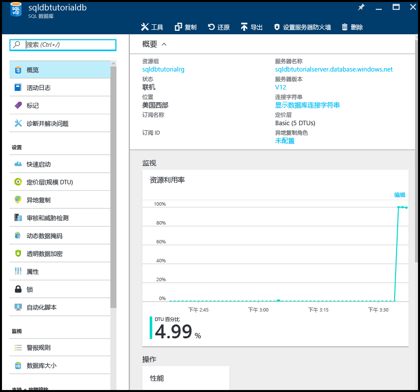

# 在长期备份保留中查看有关数据库备份的信息

在此操作说明主题中，你会了解如何在长期备份保留中查看有关数据库备份的信息。

## 使用 Azure 门户查看长期备份保留信息 

1. 打开 Azure 恢复服务保管库的边栏选项卡（转到“所有资源”并从订阅的资源列表中选择它）以查看数据库备份在保管库中使用的存储量。

   

2. 打开数据库的“SQL 数据库”边栏选项卡。

    

3. 在工具栏上，单击“还原”。

    

4. 在“还原”边栏选项卡上，单击“长期”。

5. 在 Azure 保管库备份下，单击“选择备份”以查看长期备份保留中的可用数据库备份。

    

> [!TIP]
> 有关教程，请参阅[数据保护和恢复的备份和还原入门](sql-database-get-started-backup-recovery.md)
>

## 后续步骤

- 若要在 Azure 恢复服务保管库中配置自动备份的长期保留，请参阅
- 若要从长期备份保留中的备份还原数据库，请参阅[从长期保留恢复](sql-database-restore-from-long-term-retention.md)
- 若要了解服务生成的自动备份，请参阅[自动备份](sql-database-automated-backups.md)
- 若要了解长期备份保留，请参阅[长期备份保留](sql-database-long-term-retention.md)
- 若要了解如何从备份中还原，请参阅[从备份中还原](sql-database-recovery-using-backups.md)

<!--HONumber=Dec16_HO2-->

